# ISO27001


**metamodel version:** 1.11.0

**version:** 1.0.0


A comprehensive LinkML schema modeling ISMS entities, workflows, and traceability links aligned to ISO/IEC 27001:2022 clause and Annex references. Designed for open data publication, automated validation, and integration with governance, risk, and compliance (GRC) systems.
This schema captures: - ISMS lifecycle (establish, implement, maintain, improve) - Risk assessment and treatment processes (Clause 6.1) - Annex A control catalog structures organized by domain - Audit, measurement, and continual improvement artifacts


## Class Diagram

```mermaid
classDiagram
DocumentedInformation <|-- AuditProgramme
DocumentedInformation <|-- AwarenessProgram
DocumentedInformation <|-- CommunicationPlan
DocumentedInformation <|-- CompetenceRecord
DocumentedInformation <|-- InformationSecurityPolicy
DocumentedInformation <|-- InternalAudit
DocumentedInformation <|-- ManagementReview
DocumentedInformation <|-- MonitoringProgram
DocumentedInformation <|-- OperationalProcedure
DocumentedInformation <|-- RiskAssessment
DocumentedInformation <|-- RiskAssessmentProcess
DocumentedInformation <|-- RiskTreatmentPlan
DocumentedInformation <|-- RiskTreatmentProcess
DocumentedInformation <|-- StatementOfApplicability
DocumentedInformation <|-- TopicSpecificPolicy
NamedEntity <|-- Asset
NamedEntity <|-- AuditFinding
NamedEntity <|-- CorrectiveAction
NamedEntity <|-- DocumentedInformation
NamedEntity <|-- ImprovementOpportunity
NamedEntity <|-- InformationSecurityEvent
NamedEntity <|-- InformationSecurityIncident
NamedEntity <|-- InformationSecurityManagementSystem
NamedEntity <|-- InformationSecurityObjective
NamedEntity <|-- InterestedParty
NamedEntity <|-- Nonconformity
NamedEntity <|-- Organization
NamedEntity <|-- Resource
NamedEntity <|-- Risk
NamedEntity <|-- Role
NamedEntity <|-- SecurityControl
```

## ERD Diagram

```mermaid
erDiagram
Asset {
    string asset_custodian  
    string asset_owner  
    string asset_type  
    string classification  
    string criticality  
    string location  
    uriorcurie id  
    string name  
    string description  
    date created_date  
    date modified_date  
    string version  
}
AuditFinding {
    string auditee_response  
    string clause_reference  
    date closure_date  
    string closure_status  
    string finding_description  
    AuditFindingType finding_type  
    string objective_evidence  
    string recommended_action  
    string risk_implication  
    string root_cause_analysis  
    uriorcurie id  
    string name  
    string description  
    date created_date  
    date modified_date  
    string version  
}
AuditProgramme {
    string audit_frequency_rationale  
    string auditor_qualifications  
    string programme_period  
    string programme_status  
    string resource_requirements  
    uriorcurie id  
    string name  
    string description  
    string approved_by  
    date approved_date  
    string author  
    string change_control_method  
    string classification  
    date created_date  
    stringList distribution_controls  
    string document_reference  
    DocumentType document_type  
    date effective_date  
    boolean external_origin  
    string external_origin_source  
    date modified_date  
    string owner  
    duration type retention_period  
    date review_date  
    string status  
    string storage_and_preservation  
    string version  
}
AwarenessProgram {
    stringList awareness_topics  
    string completion_tracking  
    stringList delivery_methods  
    string effectiveness_measures  
    string frequency  
    string target_audience  
    uriorcurie id  
    string name  
    string description  
    string approved_by  
    date approved_date  
    string author  
    string change_control_method  
    string classification  
    date created_date  
    stringList distribution_controls  
    string document_reference  
    DocumentType document_type  
    date effective_date  
    boolean external_origin  
    string external_origin_source  
    date modified_date  
    string owner  
    duration type retention_period  
    date review_date  
    string status  
    string storage_and_preservation  
    string version  
}
CommunicationItem {
    string audience  
    string frequency  
    string method  
    string purpose  
    boolean records_required  
    string responsible_party  
    string subject  
}
CommunicationPlan {
    uriorcurie id  
    string name  
    string description  
    string approved_by  
    date approved_date  
    string author  
    string change_control_method  
    string classification  
    date created_date  
    stringList distribution_controls  
    string document_reference  
    DocumentType document_type  
    date effective_date  
    boolean external_origin  
    string external_origin_source  
    date modified_date  
    string owner  
    duration type retention_period  
    date review_date  
    string status  
    string storage_and_preservation  
    string version  
}
CompetenceRecord {
    date competency_assessment_date  
    stringList competency_gaps  
    stringList development_actions  
    stringList education_records  
    stringList experience_records  
    string person_name  
    string person_role  
    stringList required_competencies  
    stringList training_records  
    uriorcurie id  
    string name  
    string description  
    string approved_by  
    date approved_date  
    string author  
    string change_control_method  
    string classification  
    date created_date  
    stringList distribution_controls  
    string document_reference  
    DocumentType document_type  
    date effective_date  
    boolean external_origin  
    string external_origin_source  
    date modified_date  
    string owner  
    duration type retention_period  
    date review_date  
    string status  
    string storage_and_preservation  
    string version  
}
CorrectiveAction {
    string action_description  
    date actual_completion_date  
    string effectiveness_criteria  
    date effectiveness_review_date  
    boolean effectiveness_verified  
    string isms_changes_required  
    string resources_required  
    string responsible_party  
    string root_cause_addressed  
    string status  
    date target_completion_date  
    uriorcurie id  
    string name  
    string description  
    date created_date  
    date modified_date  
    string version  
}
ImprovementOpportunity {
    date actual_completion_date  
    string expected_benefit  
    date identification_date  
    string identified_by  
    string implementation_plan  
    string improvement_description  
    string improvement_source  
    string outcome_assessment  
    string priority  
    string responsible_party  
    string status  
    date target_date  
    uriorcurie id  
    string name  
    string description  
    date created_date  
    date modified_date  
    string version  
}
InformationSecurityEvent {
    boolean categorized_as_incident  
    datetime event_datetime  
    string event_description  
    string initial_assessment  
    string reporter  
    uriorcurie id  
    string name  
    string description  
    date created_date  
    date modified_date  
    string version  
}
InformationSecurityIncident {
    CIAPropertyList affected_cia  
    datetime closure_datetime  
    stringList containment_actions  
    string detection_method  
    stringList eradication_actions  
    stringList evidence_collected  
    SecurityIncidentCategory incident_category  
    datetime incident_datetime  
    string incident_description  
    stringList lessons_learned  
    boolean notification_required  
    stringList notifications_made  
    string post_incident_review  
    stringList recovery_actions  
    stringList response_actions  
    string root_cause  
    RiskLevel severity  
    uriorcurie id  
    string name  
    string description  
    date created_date  
    date modified_date  
    string version  
}
InformationSecurityManagementSystem {
    string certification_body  
    date certification_date  
    string certification_status  
    stringList context_external_issues  
    stringList context_internal_issues  
    stringList externally_provided_services  
    string governing_body  
    stringList interfaces_and_dependencies  
    stringList leadership_commitment_evidence  
    stringList planned_changes  
    string processes_and_interactions  
    date recertification_date  
    stringList risks_and_opportunities_actions  
    stringList scope_boundaries  
    stringList scope_exclusions  
    string scope_statement  
    string top_management  
    uriorcurie id  
    string name  
    string description  
    date created_date  
    date modified_date  
    string version  
}
InformationSecurityObjective {
    string achievement_status  
    string action_plan  
    string current_value  
    string measurement_frequency  
    string measurement_method  
    string metric_definition  
    string objective_resources_required  
    string objective_statement  
    date target_date  
    string target_value  
    uriorcurie id  
    string name  
    string description  
    date created_date  
    date modified_date  
    string version  
}
InformationSecurityPolicy {
    boolean acknowledgment_required  
    string applicability_statement  
    stringList commitment_statements  
    date communication_date  
    RelatedManagementSystemList integrated_management_systems  
    date last_policy_review_date  
    date next_policy_review_date  
    string policy_objectives_framework  
    string policy_statement  
    uriorcurie id  
    string name  
    string description  
    string approved_by  
    date approved_date  
    string author  
    string change_control_method  
    string classification  
    date created_date  
    stringList distribution_controls  
    string document_reference  
    DocumentType document_type  
    date effective_date  
    boolean external_origin  
    string external_origin_source  
    date modified_date  
    string owner  
    duration type retention_period  
    date review_date  
    string status  
    string storage_and_preservation  
    string version  
}
InterestedParty {
    stringList addressed_requirements  
    stringList climate_change_related_requirements  
    string communication_needs  
    string contact_information  
    string party_type  
    string relationship  
    stringList requirements  
    uriorcurie id  
    string name  
    string description  
    date created_date  
    date modified_date  
    string version  
}
InternalAudit {
    string audit_conclusion  
    stringList audit_criteria  
    stringList audit_objectives  
    date audit_period_end  
    date audit_period_start  
    string audit_plan  
    string audit_reference  
    string audit_scope  
    stringList audit_team  
    AuditType audit_type  
    stringList auditee_representatives  
    string lead_auditor  
    stringList positive_observations  
    date report_date  
    stringList report_distribution  
    uriorcurie id  
    string name  
    string description  
    string approved_by  
    date approved_date  
    string author  
    string change_control_method  
    string classification  
    date created_date  
    stringList distribution_controls  
    string document_reference  
    DocumentType document_type  
    date effective_date  
    boolean external_origin  
    string external_origin_source  
    date modified_date  
    string owner  
    duration type retention_period  
    date review_date  
    string status  
    string storage_and_preservation  
    string version  
}
ManagementReview {
    stringList action_items  
    stringList attendees  
    string audit_results_summary  
    string context_changes  
    stringList decisions  
    stringList improvement_opportunities  
    string interested_party_changes  
    string interested_party_feedback  
    date next_review_date  
    string performance_trends  
    string previous_actions_status  
    date review_date  
    string risk_assessment_results  
    string risk_treatment_status  
    string risks_and_opportunities_changes  
    uriorcurie id  
    string name  
    string description  
    string approved_by  
    date approved_date  
    string author  
    string change_control_method  
    string classification  
    date created_date  
    stringList distribution_controls  
    string document_reference  
    DocumentType document_type  
    date effective_date  
    boolean external_origin  
    string external_origin_source  
    date modified_date  
    string owner  
    duration type retention_period  
    string status  
    string storage_and_preservation  
    string version  
}
MonitoringItem {
    string alert_threshold  
    string analysis_frequency  
    string analyst  
    string current_value  
    string measurement_frequency  
    string measurement_method  
    string metric_description  
    string metric_name  
    string responsible_party  
    string target_threshold  
    string trend  
}
MonitoringProgram {
    uriorcurie id  
    string name  
    string description  
    string approved_by  
    date approved_date  
    string author  
    string change_control_method  
    string classification  
    date created_date  
    stringList distribution_controls  
    string document_reference  
    DocumentType document_type  
    date effective_date  
    boolean external_origin  
    string external_origin_source  
    date modified_date  
    string owner  
    duration type retention_period  
    date review_date  
    string status  
    string storage_and_preservation  
    string version  
}
Nonconformity {
    date closure_date  
    string closure_evidence  
    string consequences_addressed  
    string detected_by  
    date detection_date  
    stringList immediate_actions  
    string nonconformity_description  
    string nonconformity_source  
    string requirement_violated  
    string root_cause  
    string similar_nonconformities_check  
    string status  
    uriorcurie id  
    string name  
    string description  
    date created_date  
    date modified_date  
    string version  
}
OperationalProcedure {
    string change_control_requirements  
    stringList control_measures  
    string procedure_scope  
    string process_criteria  
    uriorcurie id  
    string name  
    string description  
    string approved_by  
    date approved_date  
    string author  
    string change_control_method  
    string classification  
    date created_date  
    stringList distribution_controls  
    string document_reference  
    DocumentType document_type  
    date effective_date  
    boolean external_origin  
    string external_origin_source  
    date modified_date  
    string owner  
    duration type retention_period  
    date review_date  
    string status  
    string storage_and_preservation  
    string version  
}
Organization {
    boolean climate_change_relevant  
    positive integer type employee_count  
    stringList geographic_locations  
    string industry_sector  
    string legal_name  
    string organization_type  
    string parent_organization  
    stringList regulatory_jurisdictions  
    string size_category  
    stringList subsidiaries  
    stringList trading_names  
    uriorcurie id  
    string name  
    string description  
    date created_date  
    date modified_date  
    string version  
}
Resource {
    string allocated_to  
    date allocation_date  
    string availability_status  
    string cost  
    string quantity  
    string resource_type  
    uriorcurie id  
    string name  
    string description  
    date created_date  
    date modified_date  
    string version  
}
Risk {
    CIAPropertyList affected_cia_properties  
    ImpactRating impact  
    RiskLevel inherent_risk_level  
    LikelihoodRating likelihood  
    RiskLevel residual_risk_level  
    string risk_owner  
    string risk_source  
    RiskTreatmentOption risk_treatment_option  
    string threat_description  
    string treatment_priority  
    string vulnerability_description  
    uriorcurie id  
    string name  
    string description  
    date created_date  
    date modified_date  
    string version  
}
RiskAssessment {
    date assessment_date  
    string assessment_scope  
    string assessor  
    string methodology_used  
    date next_assessment_date  
    stringList recommendations  
    string summary_findings  
    uriorcurie id  
    string name  
    string description  
    string approved_by  
    date approved_date  
    string author  
    string change_control_method  
    string classification  
    date created_date  
    stringList distribution_controls  
    string document_reference  
    DocumentType document_type  
    date effective_date  
    boolean external_origin  
    string external_origin_source  
    date modified_date  
    string owner  
    duration type retention_period  
    date review_date  
    string status  
    string storage_and_preservation  
    string version  
}
RiskAssessmentProcess {
    string assessment_criteria  
    string assessment_frequency  
    string assessment_methodology  
    string impact_scale  
    string likelihood_scale  
    string risk_acceptance_criteria  
    string risk_matrix  
    stringList trigger_events  
    uriorcurie id  
    string name  
    string description  
    string approved_by  
    date approved_date  
    string author  
    string change_control_method  
    string classification  
    date created_date  
    stringList distribution_controls  
    string document_reference  
    DocumentType document_type  
    date effective_date  
    boolean external_origin  
    string external_origin_source  
    date modified_date  
    string owner  
    duration type retention_period  
    date review_date  
    string status  
    string storage_and_preservation  
    string version  
}
RiskTreatmentPlan {
    date approved_date  
    date completion_date  
    ImplementationStatus implementation_status  
    string implementation_timeline  
    string plan_scope  
    string residual_risk_acceptance  
    string resources_required  
    stringList responsible_parties  
    string risk_owner_approval  
    stringList treatment_actions  
    uriorcurie id  
    string name  
    string description  
    string approved_by  
    string author  
    string change_control_method  
    string classification  
    date created_date  
    stringList distribution_controls  
    string document_reference  
    DocumentType document_type  
    date effective_date  
    boolean external_origin  
    string external_origin_source  
    date modified_date  
    string owner  
    duration type retention_period  
    date review_date  
    string status  
    string storage_and_preservation  
    string version  
}
RiskTreatmentProcess {
    string annex_a_omission_verification  
    string approval_workflow  
    string control_selection_criteria  
    string soa_template  
    string treatment_options_guidance  
    uriorcurie id  
    string name  
    string description  
    string approved_by  
    date approved_date  
    string author  
    string change_control_method  
    string classification  
    date created_date  
    stringList distribution_controls  
    string document_reference  
    DocumentType document_type  
    date effective_date  
    boolean external_origin  
    string external_origin_source  
    date modified_date  
    string owner  
    duration type retention_period  
    date review_date  
    string status  
    string storage_and_preservation  
    string version  
}
Role {
    string accountability  
    stringList assigned_to  
    stringList authorities  
    string delegation_rules  
    string reporting_line  
    stringList responsibilities  
    string role_type  
    uriorcurie id  
    string name  
    string description  
    date created_date  
    date modified_date  
    string version  
}
SecurityControl {
    stringList applicable_assets  
    stringList applicable_threats  
    ControlCategory control_category  
    AnnexAControlId control_id  
    string control_owner  
    string control_text  
    string control_title  
    string effectiveness_rating  
    stringList evidence_references  
    date implementation_date  
    string implementation_guidance  
    ImplementationStatus implementation_status  
    date last_test_date  
    uriorcurie id  
    string name  
    string description  
    date created_date  
    date modified_date  
    string version  
}
SoAEntry {
    string exclusion_justification  
    string implementation_evidence  
    ImplementationStatus implementation_status  
    string inclusion_justification  
    boolean is_applicable  
    date target_implementation_date  
}
StatementOfApplicability {
    unsigned short type implemented_count  
    date last_review_date  
    unsigned short type not_applicable_count  
    unsigned short type planned_count  
    unsigned short type total_controls  
    uriorcurie id  
    string name  
    string description  
    string approved_by  
    date approved_date  
    string author  
    string change_control_method  
    string classification  
    date created_date  
    stringList distribution_controls  
    string document_reference  
    DocumentType document_type  
    date effective_date  
    boolean external_origin  
    string external_origin_source  
    date modified_date  
    string owner  
    duration type retention_period  
    date review_date  
    string status  
    string storage_and_preservation  
    string version  
}
TopicSpecificPolicy {
    string target_audience  
    string topic_area  
    uriorcurie id  
    string name  
    string description  
    string approved_by  
    date approved_date  
    string author  
    string change_control_method  
    string classification  
    date created_date  
    stringList distribution_controls  
    string document_reference  
    DocumentType document_type  
    date effective_date  
    boolean external_origin  
    string external_origin_source  
    date modified_date  
    string owner  
    duration type retention_period  
    date review_date  
    string status  
    string storage_and_preservation  
    string version  
}

Asset ||--}o Risk : "related_risks"
Asset ||--}o SecurityControl : "applicable_controls"
AuditFinding ||--|o CorrectiveAction : "linked_corrective_action"
AuditFinding ||--|o SecurityControl : "control_reference"
AuditProgramme ||--}o InternalAudit : "planned_audits"
CommunicationPlan ||--}o CommunicationItem : "communication_items"
CorrectiveAction ||--|o Nonconformity : "linked_nonconformity"
InformationSecurityEvent ||--|o InformationSecurityIncident : "linked_incident"
InformationSecurityEvent ||--}o Asset : "affected_assets"
InformationSecurityIncident ||--}o Asset : "affected_assets"
InformationSecurityManagementSystem ||--|o AwarenessProgram : "awareness_program"
InformationSecurityManagementSystem ||--|o CommunicationPlan : "communication_plan"
InformationSecurityManagementSystem ||--|o InformationSecurityPolicy : "information_security_policy"
InformationSecurityManagementSystem ||--|o MonitoringProgram : "monitoring_program"
InformationSecurityManagementSystem ||--|o Organization : "organization"
InformationSecurityManagementSystem ||--|o RiskAssessmentProcess : "risk_assessment_process"
InformationSecurityManagementSystem ||--|o RiskTreatmentProcess : "risk_treatment_process"
InformationSecurityManagementSystem ||--|o StatementOfApplicability : "statement_of_applicability"
InformationSecurityManagementSystem ||--}o CompetenceRecord : "competence_records"
InformationSecurityManagementSystem ||--}o CorrectiveAction : "corrective_actions"
InformationSecurityManagementSystem ||--}o DocumentedInformation : "documented_information_register"
InformationSecurityManagementSystem ||--}o ImprovementOpportunity : "improvements"
InformationSecurityManagementSystem ||--}o InformationSecurityObjective : "objectives"
InformationSecurityManagementSystem ||--}o InterestedParty : "interested_parties"
InformationSecurityManagementSystem ||--}o InternalAudit : "internal_audits"
InformationSecurityManagementSystem ||--}o ManagementReview : "management_reviews"
InformationSecurityManagementSystem ||--}o Nonconformity : "nonconformities"
InformationSecurityManagementSystem ||--}o OperationalProcedure : "operational_procedures"
InformationSecurityManagementSystem ||--}o Resource : "resources"
InformationSecurityManagementSystem ||--}o RiskAssessment : "risk_assessments"
InformationSecurityManagementSystem ||--}o RiskTreatmentPlan : "risk_treatment_plans"
InformationSecurityManagementSystem ||--}o Role : "roles"
InformationSecurityManagementSystem ||--}o SecurityControl : "controls"
InformationSecurityObjective ||--|o Role : "responsible_role"
InformationSecurityObjective ||--}o Risk : "related_risks"
InformationSecurityObjective ||--}o SecurityControl : "related_controls"
InformationSecurityPolicy ||--}o TopicSpecificPolicy : "related_topic_policies"
InternalAudit ||--}o AuditFinding : "findings"
MonitoringProgram ||--}o MonitoringItem : "monitoring_items"
Nonconformity ||--}o CorrectiveAction : "linked_corrective_actions"
OperationalProcedure ||--}o Role : "responsible_roles"
OperationalProcedure ||--}o SecurityControl : "related_controls"
Risk ||--|o RiskTreatmentPlan : "related_treatment_plan"
Risk ||--}o Asset : "affected_assets"
Risk ||--}o SecurityControl : "existing_controls"
RiskAssessment ||--}o Risk : "risks_identified"
RiskTreatmentPlan ||--}o Risk : "risks_addressed"
RiskTreatmentPlan ||--}o SecurityControl : "controls_to_implement"
SecurityControl ||--}o SecurityControl : "related_controls"
SoAEntry ||--|o Role : "responsible_role"
SoAEntry ||--|o SecurityControl : "control_reference"
StatementOfApplicability ||--}o SoAEntry : "soa_entries"
TopicSpecificPolicy ||--|o InformationSecurityPolicy : "parent_policy"
TopicSpecificPolicy ||--}o SecurityControl : "applicable_controls"

```

## Base Classes


Foundational classes in the hierarchy (root classes and direct children of Thing):

| Class | Description |
| --- | --- |
| [NamedEntity](#NamedEntity) | Abstract base class for all entities with an identifier, name, and description. Provides common identification and documentation slots. |

## Abstract Classes


### DocumentedInformation

Abstract class for documented information per Clause 7.5. Captures metadata required for document control.

Supports identification and control metadata for managed documents

Supports lifecycle, protection, and retention tracking

```mermaid
erDiagram
AwarenessProgram {

}
InformationSecurityManagementSystem {

}

InformationSecurityManagementSystem ||--|o AwarenessProgram : "awareness_program"
InformationSecurityManagementSystem ||--|o CommunicationPlan : "communication_plan"
InformationSecurityManagementSystem ||--|o InformationSecurityPolicy : "information_security_policy"
InformationSecurityManagementSystem ||--|o MonitoringProgram : "monitoring_program"
InformationSecurityManagementSystem ||--|o Organization : "organization"
InformationSecurityManagementSystem ||--|o RiskAssessmentProcess : "risk_assessment_process"
InformationSecurityManagementSystem ||--|o RiskTreatmentProcess : "risk_treatment_process"
InformationSecurityManagementSystem ||--|o StatementOfApplicability : "statement_of_applicability"
InformationSecurityManagementSystem ||--}o CompetenceRecord : "competence_records"
InformationSecurityManagementSystem ||--}o CorrectiveAction : "corrective_actions"
InformationSecurityManagementSystem ||--}o DocumentedInformation : "documented_information_register"
InformationSecurityManagementSystem ||--}o ImprovementOpportunity : "improvements"
InformationSecurityManagementSystem ||--}o InformationSecurityObjective : "objectives"
InformationSecurityManagementSystem ||--}o InterestedParty : "interested_parties"
InformationSecurityManagementSystem ||--}o InternalAudit : "internal_audits"
InformationSecurityManagementSystem ||--}o ManagementReview : "management_reviews"
InformationSecurityManagementSystem ||--}o Nonconformity : "nonconformities"
InformationSecurityManagementSystem ||--}o OperationalProcedure : "operational_procedures"
InformationSecurityManagementSystem ||--}o Resource : "resources"
InformationSecurityManagementSystem ||--}o RiskAssessment : "risk_assessments"
InformationSecurityManagementSystem ||--}o RiskTreatmentPlan : "risk_treatment_plans"
InformationSecurityManagementSystem ||--}o Role : "roles"
InformationSecurityManagementSystem ||--}o SecurityControl : "controls"

```

#### Attributes

| Name | Cardinality: | Type | Description |
| --- | --- | --- | --- |
| **[id](#Id)** | <sub>1..1</sub> | uriorcurie | Unique identifier for this entity instance. |
| **[name](#Name)** | <sub>1..1</sub> | string | Human-readable name or title. |
| **[description](#Description)** | <sub>0..1</sub> | string | Detailed description of the entity. |
| **[created_date](#CreatedDate)** | <sub>0..1</sub> | date | Date when the entity was created. |
| **[modified_date](#ModifiedDate)** | <sub>0..1</sub> | date | Date when the entity was last modified. |
| **[version](#Version)** | <sub>0..1</sub> | string | Version identifier for the entity. |
| **[approved_by](#ApprovedBy)** | <sub>0..1</sub> | string | Person who approved the document. |
| **[approved_date](#ApprovedDate)** | <sub>0..1</sub> | date | Date when the document was approved. |
| **[author](#Author)** | <sub>0..1</sub> | string | Person who created the document. |
| **[change_control_method](#ChangeControlMethod)** | <sub>0..1</sub> | string | Method used for control of changes (e.g., version control) of the documented information, per Clause 7.5.3 e). |
| **[classification](#Classification)** | <sub>0..1</sub> | string | Information classification level. |
| **[distribution_controls](#DistributionControls)** | <sub>0..\*</sub> | string | Controls governing distribution, access, retrieval and use of the documented information, per Clause 7.5.3 c). |
| **[document_reference](#DocumentReference)** | <sub>0..1</sub> | string | Unique reference number for document control. |
| **[document_type](#DocumentType)** | <sub>0..1</sub> | [DocumentType](#DocumentType) | Classification of the documented information. |
| **[effective_date](#EffectiveDate)** | <sub>0..1</sub> | date | Date when the document becomes effective. |
| **[external_origin](#ExternalOrigin)** | <sub>0..1</sub> | boolean | Whether the documented information is of external origin and has been identified as necessary for the planning and operation of the ISMS, per Clause 7.5.3. |
| **[external_origin_source](#ExternalOriginSource)** | <sub>0..1</sub> | string | Source or provider of the externally originated documented information, per Clause 7.5.3. |
| **[owner](#Owner)** | <sub>0..1</sub> | string | Person accountable for the document content and maintenance. |
| **[retention_period](#RetentionPeriod)** | <sub>0..1</sub> | duration type | Duration for which the document is retained. |
| **[review_date](#ReviewDate)** | <sub>0..1</sub> | date | Date when the document is due for review. |
| **[status](#Status)** | <sub>0..1</sub> | string | Current status of the document or entity. |
| **[storage_and_preservation](#StorageAndPreservation)** | <sub>0..1</sub> | string | Arrangements for storage and preservation (including preservation of legibility) of the documented information, per Clause 7.5.3 d). |

#### Parents

 * [NamedEntity](#NamedEntity) - Abstract base class for all entities with an identifier, name, and description. Provides common identification and documentation slots.

#### Children

 * [AuditProgramme](#AuditProgramme) - The internal audit programme per 9.2.2, planning audit activities over a defined period.
 * [AwarenessProgram](#AwarenessProgram) - The awareness program ensuring personnel understand their information security responsibilities per Clause 7.3.
 * [CommunicationPlan](#CommunicationPlan) - Plan for internal and external communications relevant to the ISMS per Clause 7.4.
 * [CompetenceRecord](#CompetenceRecord) - Evidence of competence for personnel affecting information security performance per Clause 7.2 d).
 * [InformationSecurityPolicy](#InformationSecurityPolicy) - The information security policy established by top management per Clause 5.2. Provides framework for setting objectives and demonstrates commitment.
 * [InternalAudit](#InternalAudit) - An internal audit instance per Clause 9.2, assessing ISMS conformance and effectiveness.
 * [ManagementReview](#ManagementReview) - A management review per Clause 9.3, conducted by top management to evaluate ongoing ISMS performance and fitness for purpose.
 * [MonitoringProgram](#MonitoringProgram) - The program for monitoring, measurement, analysis, and evaluation per Clause 9.1.
 * [OperationalProcedure](#OperationalProcedure) - A documented procedure for operational planning and control per Clause 8.1.
 * [RiskAssessment](#RiskAssessment) - An instance of risk assessment performed per Clause 8.2, identifying and evaluating information security risks.
 * [RiskAssessmentProcess](#RiskAssessmentProcess) - The documented risk assessment process per Clause 6.1.2, defining criteria and methodology for identifying, analyzing, and evaluating risks.
 * [RiskTreatmentPlan](#RiskTreatmentPlan) - A risk treatment plan documenting planned actions to address identified risks through selected controls.
 * [RiskTreatmentProcess](#RiskTreatmentProcess) - The documented risk treatment process per Clause 6.1.3, defining how treatment options are selected and controls determined.
 * [StatementOfApplicability](#StatementOfApplicability) - The Statement of Applicability (SoA) recording which controls apply, their rationale, and current implementation state.
 * [TopicSpecificPolicy](#TopicSpecificPolicy) - A policy addressing a specific information security topic, supporting the overarching information security policy.

#### Referenced by:

 *  **[InformationSecurityManagementSystem](#InformationSecurityManagementSystem)** : documented_information_register  <sub>0..\*</sub> 


### NamedEntity

Abstract base class for all entities with an identifier, name, and description. Provides common identification and documentation slots.

All concrete classes should inherit from this or a subclass

Ensures consistent identification across the schema


#### Local class diagram

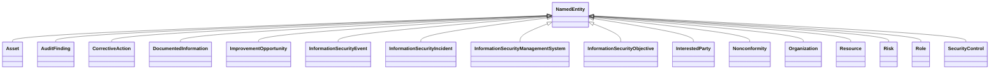

#### Attributes

| Name | Cardinality: | Type | Description |
| --- | --- | --- | --- |
| **[id](#Id)** | <sub>1..1</sub> | uriorcurie | Unique identifier for this entity instance. |
| **[name](#Name)** | <sub>1..1</sub> | string | Human-readable name or title. |
| **[description](#Description)** | <sub>0..1</sub> | string | Detailed description of the entity. |
| **[created_date](#CreatedDate)** | <sub>0..1</sub> | date | Date when the entity was created. |
| **[modified_date](#ModifiedDate)** | <sub>0..1</sub> | date | Date when the entity was last modified. |
| **[version](#Version)** | <sub>0..1</sub> | string | Version identifier for the entity. |

#### Children

 * [Asset](#Asset) - An information asset or associated asset requiring protection, per Annex A control 5.9.
 * [AuditFinding](#AuditFinding) - A finding from an internal audit, including nonconformities, observations, and positive findings.
 * [CorrectiveAction](#CorrectiveAction) - A corrective action per Clause 10.2 to address the root cause of a nonconformity and reduce the likelihood of recurrence.
 * [DocumentedInformation](#DocumentedInformation) - Abstract class for documented information per Clause 7.5. Captures metadata required for document control.
 * [ImprovementOpportunity](#ImprovementOpportunity) - An opportunity for continual improvement per Clause 10.1, enhancing overall ISMS performance.
 * [InformationSecurityEvent](#InformationSecurityEvent) - An information security event per A.5.25, which may or may not be categorized as an incident.
 * [InformationSecurityIncident](#InformationSecurityIncident) - An information security incident per A.5.26, requiring response per documented procedures.
 * [InformationSecurityManagementSystem](#InformationSecurityManagementSystem) - Top-level container representing an organization's complete ISMS per ISO 27001. Aggregates all components required to support the full ISMS lifecycle.
 * [InformationSecurityObjective](#InformationSecurityObjective) - A measurable information security objective per Clause 6.2, established at relevant functions and levels of the organization.
 * [InterestedParty](#InterestedParty) - A stakeholder whose needs and expectations are relevant to the ISMS per 4.2. Includes internal parties (employees, management) and external parties (customers, regulators, suppliers).
 * [Nonconformity](#Nonconformity) - A nonconformity identified per Clause 10.2, representing failure to fulfill a requirement.
 * [Organization](#Organization) - The organization establishing and operating the ISMS. Captures context needed for Clause 4.1 (understanding the organization).
 * [Resource](#Resource) - A resource provided for the ISMS per Clause 7.1, including personnel, infrastructure, technology, and budget.
 * [Risk](#Risk) - An identified information security risk that may affect information security properties within the ISMS scope.
 * [Role](#Role) - An information security role with defined responsibilities and authorities per Clause 5.3.
 * [SecurityControl](#SecurityControl) - A security control from Annex A of ISO/IEC 27001:2022, derived from ISO/IEC 27002:2022. Represents a measure that modifies risk.


## Classes


### Asset

An information asset or associated asset requiring protection, per Annex A control 5.9.

Supports asset inventory, ownership, classification, and related controls

Reference: ISO/IEC 27001:2022 Annex A control 5.9; ISO/IEC 27002:2022 Clause 5.9. ISO/IEC standards text is copyright ISO - not reproduced here.

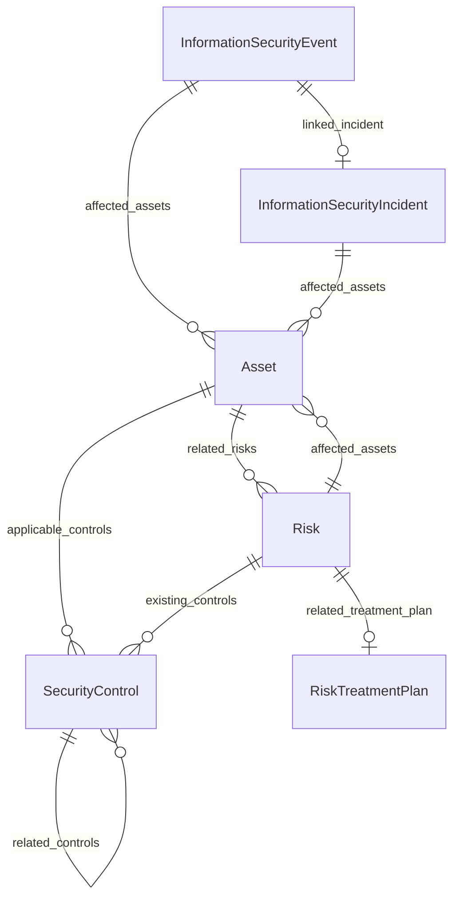

#### Attributes

| Name | Cardinality: | Type | Description |
| --- | --- | --- | --- |
| **[id](#Id)** | <sub>1..1</sub> | uriorcurie | Unique identifier for this entity instance. |
| **[name](#Name)** | <sub>1..1</sub> | string | Human-readable name or title. |
| **[description](#Description)** | <sub>0..1</sub> | string | Detailed description of the entity. |
| **[created_date](#CreatedDate)** | <sub>0..1</sub> | date | Date when the entity was created. |
| **[modified_date](#ModifiedDate)** | <sub>0..1</sub> | date | Date when the entity was last modified. |
| **[version](#Version)** | <sub>0..1</sub> | string | Version identifier for the entity. |
| **[applicable_controls](#ApplicableControls)** | <sub>0..\*</sub> | [SecurityControl](#SecurityControl) | Controls related to this policy. |
| **[asset_custodian](#AssetCustodian)** | <sub>0..1</sub> | string | Custodian responsible for day-to-day protection. |
| **[asset_owner](#AssetOwner)** | <sub>0..1</sub> | string | Owner of the asset. |
| **[asset_type](#AssetType)** | <sub>0..1</sub> | string | Type of asset. |
| **[classification](#Classification)** | <sub>0..1</sub> | string | Information classification level. |
| **[criticality](#Criticality)** | <sub>0..1</sub> | string | Criticality rating of the asset. |
| **[location](#Location)** | <sub>0..1</sub> | string | Physical or logical location. |
| **[related_risks](#RelatedRisks)** | <sub>0..\*</sub> | [Risk](#Risk) | Associated risks. |

#### Parents

 * [NamedEntity](#NamedEntity) - Abstract base class for all entities with an identifier, name, and description. Provides common identification and documentation slots.

#### Referenced by:

 *  **[InformationSecurityEvent](#InformationSecurityEvent)** : affected_assets  <sub>0..\*</sub> 
 *  **[InformationSecurityIncident](#InformationSecurityIncident)** : affected_assets  <sub>0..\*</sub> 
 *  **[Risk](#Risk)** : affected_assets  <sub>0..\*</sub> 


### AuditFinding

A finding from an internal audit, including nonconformities, observations, and positive findings.

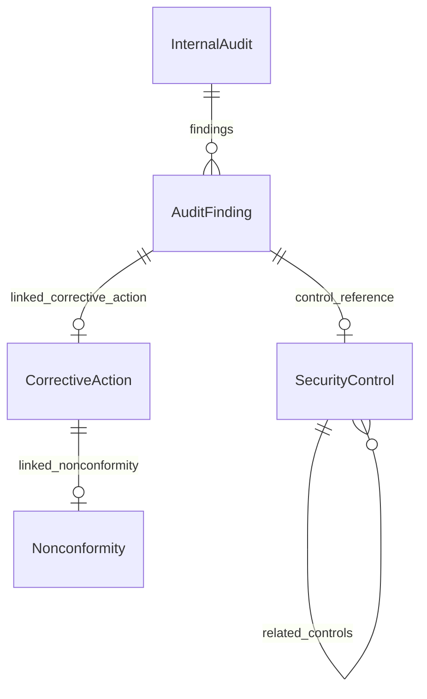

#### Attributes

| Name | Cardinality: | Type | Description |
| --- | --- | --- | --- |
| **[id](#Id)** | <sub>1..1</sub> | uriorcurie | Unique identifier for this entity instance. |
| **[name](#Name)** | <sub>1..1</sub> | string | Human-readable name or title. |
| **[description](#Description)** | <sub>0..1</sub> | string | Detailed description of the entity. |
| **[created_date](#CreatedDate)** | <sub>0..1</sub> | date | Date when the entity was created. |
| **[modified_date](#ModifiedDate)** | <sub>0..1</sub> | date | Date when the entity was last modified. |
| **[version](#Version)** | <sub>0..1</sub> | string | Version identifier for the entity. |
| **[auditee_response](#AuditeeResponse)** | <sub>0..1</sub> | string | Response from the auditee. |
| **[clause_reference](#ClauseReference)** | <sub>0..1</sub> | string | Reference to standard clause. |
| **[closure_date](#ClosureDate)** | <sub>0..1</sub> | date | Date the finding was closed. |
| **[closure_status](#ClosureStatus)** | <sub>0..1</sub> | string | Status of finding closure. |
| **[control_reference](#ControlReference)** | <sub>0..1</sub> | [SecurityControl](#SecurityControl) | Reference to the control (e.g., A.5.1). |
| **[finding_description](#FindingDescription)** | <sub>0..1</sub> | string | Description of the finding. |
| **[finding_type](#FindingType)** | <sub>0..1</sub> | [AuditFindingType](#AuditFindingType) | Type of audit finding. |
| **[linked_corrective_action](#LinkedCorrectiveAction)** | <sub>0..1</sub> | [CorrectiveAction](#CorrectiveAction) | Corrective action linked to this finding. |
| **[objective_evidence](#ObjectiveEvidence)** | <sub>0..1</sub> | string | Evidence supporting the finding. |
| **[recommended_action](#RecommendedAction)** | <sub>0..1</sub> | string | Recommended action to address finding. |
| **[risk_implication](#RiskImplication)** | <sub>0..1</sub> | string | Risk implications of the finding. |
| **[root_cause_analysis](#RootCauseAnalysis)** | <sub>0..1</sub> | string | Analysis of root cause. |

#### Parents

 * [NamedEntity](#NamedEntity) - Abstract base class for all entities with an identifier, name, and description. Provides common identification and documentation slots.

#### Referenced by:

 *  **[InternalAudit](#InternalAudit)** : findings  <sub>0..\*</sub> 


### AuditProgramme

The internal audit programme per 9.2.2, planning audit activities over a defined period.

Captures planned audit activities over a defined period

Includes cadence rationale, resources, and qualification metadata

Reference: ISO/IEC 27001:2022 Clause 9.2.2. ISO/IEC standards text is copyright ISO - not reproduced here.

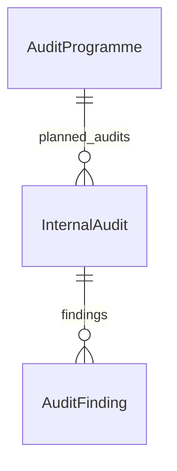

#### Attributes

| Name | Cardinality: | Type | Description |
| --- | --- | --- | --- |
| **[id](#Id)** | <sub>1..1</sub> | uriorcurie | Unique identifier for this entity instance. |
| **[name](#Name)** | <sub>1..1</sub> | string | Human-readable name or title. |
| **[description](#Description)** | <sub>0..1</sub> | string | Detailed description of the entity. |
| **[approved_by](#ApprovedBy)** | <sub>0..1</sub> | string | Person who approved the document. |
| **[approved_date](#ApprovedDate)** | <sub>0..1</sub> | date | Date when the document was approved. |
| **[author](#Author)** | <sub>0..1</sub> | string | Person who created the document. |
| **[change_control_method](#ChangeControlMethod)** | <sub>0..1</sub> | string | Method used for control of changes (e.g., version control) of the documented information, per Clause 7.5.3 e). |
| **[classification](#Classification)** | <sub>0..1</sub> | string | Information classification level. |
| **[created_date](#CreatedDate)** | <sub>0..1</sub> | date | Date when the entity was created. |
| **[distribution_controls](#DistributionControls)** | <sub>0..\*</sub> | string | Controls governing distribution, access, retrieval and use of the documented information, per Clause 7.5.3 c). |
| **[document_reference](#DocumentReference)** | <sub>0..1</sub> | string | Unique reference number for document control. |
| **[document_type](#DocumentType)** | <sub>0..1</sub> | [DocumentType](#DocumentType) | Classification of the documented information. |
| **[effective_date](#EffectiveDate)** | <sub>0..1</sub> | date | Date when the document becomes effective. |
| **[external_origin](#ExternalOrigin)** | <sub>0..1</sub> | boolean | Whether the documented information is of external origin and has been identified as necessary for the planning and operation of the ISMS, per Clause 7.5.3. |
| **[external_origin_source](#ExternalOriginSource)** | <sub>0..1</sub> | string | Source or provider of the externally originated documented information, per Clause 7.5.3. |
| **[modified_date](#ModifiedDate)** | <sub>0..1</sub> | date | Date when the entity was last modified. |
| **[owner](#Owner)** | <sub>0..1</sub> | string | Person accountable for the document content and maintenance. |
| **[retention_period](#RetentionPeriod)** | <sub>0..1</sub> | duration type | Duration for which the document is retained. |
| **[review_date](#ReviewDate)** | <sub>0..1</sub> | date | Date when the document is due for review. |
| **[status](#Status)** | <sub>0..1</sub> | string | Current status of the document or entity. |
| **[storage_and_preservation](#StorageAndPreservation)** | <sub>0..1</sub> | string | Arrangements for storage and preservation (including preservation of legibility) of the documented information, per Clause 7.5.3 d). |
| **[version](#Version)** | <sub>0..1</sub> | string | Version identifier for the entity. |
| **[audit_frequency_rationale](#AuditFrequencyRationale)** | <sub>0..1</sub> | string | Rationale for audit frequency decisions. |
| **[auditor_qualifications](#AuditorQualifications)** | <sub>0..1</sub> | string | Required qualifications for auditors. |
| **[planned_audits](#PlannedAudits)** | <sub>0..\*</sub> | [InternalAudit](#InternalAudit) | Audits planned in this programme. |
| **[programme_period](#ProgrammePeriod)** | <sub>0..1</sub> | string | Period covered by the audit programme. |
| **[programme_status](#ProgrammeStatus)** | <sub>0..1</sub> | string | Current status of the programme. |
| **[resource_requirements](#ResourceRequirements)** | <sub>0..1</sub> | string | Resource requirements for the programme. |

#### Parents

 * [DocumentedInformation](#DocumentedInformation) - Abstract class for documented information per Clause 7.5. Captures metadata required for document control.


### AwarenessProgram

The awareness program ensuring personnel understand their information security responsibilities per Clause 7.3.

Tracks security awareness coverage, delivery, and personnel completion records

Reference: ISO/IEC 27001:2022 Clause 7.3. ISO/IEC standards text is copyright ISO - not reproduced here.


#### Attributes

| Name | Cardinality: | Type | Description |
| --- | --- | --- | --- |
| **[id](#Id)** | <sub>1..1</sub> | uriorcurie | Unique identifier for this entity instance. |
| **[name](#Name)** | <sub>1..1</sub> | string | Human-readable name or title. |
| **[description](#Description)** | <sub>0..1</sub> | string | Detailed description of the entity. |
| **[approved_by](#ApprovedBy)** | <sub>0..1</sub> | string | Person who approved the document. |
| **[approved_date](#ApprovedDate)** | <sub>0..1</sub> | date | Date when the document was approved. |
| **[author](#Author)** | <sub>0..1</sub> | string | Person who created the document. |
| **[change_control_method](#ChangeControlMethod)** | <sub>0..1</sub> | string | Method used for control of changes (e.g., version control) of the documented information, per Clause 7.5.3 e). |
| **[classification](#Classification)** | <sub>0..1</sub> | string | Information classification level. |
| **[created_date](#CreatedDate)** | <sub>0..1</sub> | date | Date when the entity was created. |
| **[distribution_controls](#DistributionControls)** | <sub>0..\*</sub> | string | Controls governing distribution, access, retrieval and use of the documented information, per Clause 7.5.3 c). |
| **[document_reference](#DocumentReference)** | <sub>0..1</sub> | string | Unique reference number for document control. |
| **[document_type](#DocumentType)** | <sub>0..1</sub> | [DocumentType](#DocumentType) | Classification of the documented information. |
| **[effective_date](#EffectiveDate)** | <sub>0..1</sub> | date | Date when the document becomes effective. |
| **[external_origin](#ExternalOrigin)** | <sub>0..1</sub> | boolean | Whether the documented information is of external origin and has been identified as necessary for the planning and operation of the ISMS, per Clause 7.5.3. |
| **[external_origin_source](#ExternalOriginSource)** | <sub>0..1</sub> | string | Source or provider of the externally originated documented information, per Clause 7.5.3. |
| **[modified_date](#ModifiedDate)** | <sub>0..1</sub> | date | Date when the entity was last modified. |
| **[owner](#Owner)** | <sub>0..1</sub> | string | Person accountable for the document content and maintenance. |
| **[retention_period](#RetentionPeriod)** | <sub>0..1</sub> | duration type | Duration for which the document is retained. |
| **[review_date](#ReviewDate)** | <sub>0..1</sub> | date | Date when the document is due for review. |
| **[status](#Status)** | <sub>0..1</sub> | string | Current status of the document or entity. |
| **[storage_and_preservation](#StorageAndPreservation)** | <sub>0..1</sub> | string | Arrangements for storage and preservation (including preservation of legibility) of the documented information, per Clause 7.5.3 d). |
| **[version](#Version)** | <sub>0..1</sub> | string | Version identifier for the entity. |
| **[awareness_topics](#AwarenessTopics)** | <sub>0..\*</sub> | string | Topics covered in awareness program. |
| **[completion_tracking](#CompletionTracking)** | <sub>0..1</sub> | string | How completion is tracked. |
| **[delivery_methods](#DeliveryMethods)** | <sub>0..\*</sub> | string | Methods used to deliver awareness content. |
| **[effectiveness_measures](#EffectivenessMeasures)** | <sub>0..1</sub> | string | How effectiveness is measured. |
| **[frequency](#Frequency)** | <sub>0..1</sub> | string | Frequency of the activity. |
| **[target_audience](#TargetAudience)** | <sub>0..1</sub> | string | Intended audience for the policy or document. |

#### Parents

 * [DocumentedInformation](#DocumentedInformation) - Abstract class for documented information per Clause 7.5. Captures metadata required for document control.

#### Referenced by:

 *  **[InformationSecurityManagementSystem](#InformationSecurityManagementSystem)** : awareness_program  <sub>0..1</sub> 


### CommunicationItem

A single communication requirement within the communication plan.

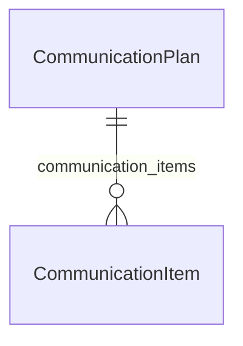

#### Attributes

| Name | Cardinality: | Type | Description |
| --- | --- | --- | --- |
| **[audience](#Audience)** | <sub>0..1</sub> | string | Target audience. |
| **[frequency](#Frequency)** | <sub>0..1</sub> | string | Frequency of the activity. |
| **[method](#Method)** | <sub>0..1</sub> | string | Method of communication. |
| **[purpose](#Purpose)** | <sub>0..1</sub> | string | Purpose of the communication. |
| **[records_required](#RecordsRequired)** | <sub>0..1</sub> | boolean | Whether records are required. |
| **[responsible_party](#ResponsibleParty)** | <sub>0..1</sub> | string | Party responsible for the activity. |
| **[subject](#Subject)** | <sub>0..1</sub> | string | Subject of the communication. |

#### Referenced by:

 *  **[CommunicationPlan](#CommunicationPlan)** : communication_items  <sub>0..\*</sub> 


### CommunicationPlan

Plan for internal and external communications relevant to the ISMS per Clause 7.4.

Captures communication scope, timing, audience, and channels

Reference: ISO/IEC 27001:2022 Clause 7.4. ISO/IEC standards text is copyright ISO - not reproduced here.

```mermaid
erDiagram
CommunicationItem {

}
CommunicationPlan {

}
InformationSecurityManagementSystem {

}

CommunicationPlan ||--}o CommunicationItem : "communication_items"
InformationSecurityManagementSystem ||--|o AwarenessProgram : "awareness_program"
InformationSecurityManagementSystem ||--|o CommunicationPlan : "communication_plan"
InformationSecurityManagementSystem ||--|o InformationSecurityPolicy : "information_security_policy"
InformationSecurityManagementSystem ||--|o MonitoringProgram : "monitoring_program"
InformationSecurityManagementSystem ||--|o Organization : "organization"
InformationSecurityManagementSystem ||--|o RiskAssessmentProcess : "risk_assessment_process"
InformationSecurityManagementSystem ||--|o RiskTreatmentProcess : "risk_treatment_process"
InformationSecurityManagementSystem ||--|o StatementOfApplicability : "statement_of_applicability"
InformationSecurityManagementSystem ||--}o CompetenceRecord : "competence_records"
InformationSecurityManagementSystem ||--}o CorrectiveAction : "corrective_actions"
InformationSecurityManagementSystem ||--}o DocumentedInformation : "documented_information_register"
InformationSecurityManagementSystem ||--}o ImprovementOpportunity : "improvements"
InformationSecurityManagementSystem ||--}o InformationSecurityObjective : "objectives"
InformationSecurityManagementSystem ||--}o InterestedParty : "interested_parties"
InformationSecurityManagementSystem ||--}o InternalAudit : "internal_audits"
InformationSecurityManagementSystem ||--}o ManagementReview : "management_reviews"
InformationSecurityManagementSystem ||--}o Nonconformity : "nonconformities"
InformationSecurityManagementSystem ||--}o OperationalProcedure : "operational_procedures"
InformationSecurityManagementSystem ||--}o Resource : "resources"
InformationSecurityManagementSystem ||--}o RiskAssessment : "risk_assessments"
InformationSecurityManagementSystem ||--}o RiskTreatmentPlan : "risk_treatment_plans"
InformationSecurityManagementSystem ||--}o Role : "roles"
InformationSecurityManagementSystem ||--}o SecurityControl : "controls"

```

#### Attributes

| Name | Cardinality: | Type | Description |
| --- | --- | --- | --- |
| **[id](#Id)** | <sub>1..1</sub> | uriorcurie | Unique identifier for this entity instance. |
| **[name](#Name)** | <sub>1..1</sub> | string | Human-readable name or title. |
| **[description](#Description)** | <sub>0..1</sub> | string | Detailed description of the entity. |
| **[approved_by](#ApprovedBy)** | <sub>0..1</sub> | string | Person who approved the document. |
| **[approved_date](#ApprovedDate)** | <sub>0..1</sub> | date | Date when the document was approved. |
| **[author](#Author)** | <sub>0..1</sub> | string | Person who created the document. |
| **[change_control_method](#ChangeControlMethod)** | <sub>0..1</sub> | string | Method used for control of changes (e.g., version control) of the documented information, per Clause 7.5.3 e). |
| **[classification](#Classification)** | <sub>0..1</sub> | string | Information classification level. |
| **[created_date](#CreatedDate)** | <sub>0..1</sub> | date | Date when the entity was created. |
| **[distribution_controls](#DistributionControls)** | <sub>0..\*</sub> | string | Controls governing distribution, access, retrieval and use of the documented information, per Clause 7.5.3 c). |
| **[document_reference](#DocumentReference)** | <sub>0..1</sub> | string | Unique reference number for document control. |
| **[document_type](#DocumentType)** | <sub>0..1</sub> | [DocumentType](#DocumentType) | Classification of the documented information. |
| **[effective_date](#EffectiveDate)** | <sub>0..1</sub> | date | Date when the document becomes effective. |
| **[external_origin](#ExternalOrigin)** | <sub>0..1</sub> | boolean | Whether the documented information is of external origin and has been identified as necessary for the planning and operation of the ISMS, per Clause 7.5.3. |
| **[external_origin_source](#ExternalOriginSource)** | <sub>0..1</sub> | string | Source or provider of the externally originated documented information, per Clause 7.5.3. |
| **[modified_date](#ModifiedDate)** | <sub>0..1</sub> | date | Date when the entity was last modified. |
| **[owner](#Owner)** | <sub>0..1</sub> | string | Person accountable for the document content and maintenance. |
| **[retention_period](#RetentionPeriod)** | <sub>0..1</sub> | duration type | Duration for which the document is retained. |
| **[review_date](#ReviewDate)** | <sub>0..1</sub> | date | Date when the document is due for review. |
| **[status](#Status)** | <sub>0..1</sub> | string | Current status of the document or entity. |
| **[storage_and_preservation](#StorageAndPreservation)** | <sub>0..1</sub> | string | Arrangements for storage and preservation (including preservation of legibility) of the documented information, per Clause 7.5.3 d). |
| **[version](#Version)** | <sub>0..1</sub> | string | Version identifier for the entity. |
| **[communication_items](#CommunicationItems)** | <sub>0..\*</sub> | [CommunicationItem](#CommunicationItem) | Communication items in the plan. |

#### Parents

 * [DocumentedInformation](#DocumentedInformation) - Abstract class for documented information per Clause 7.5. Captures metadata required for document control.

#### Referenced by:

 *  **[InformationSecurityManagementSystem](#InformationSecurityManagementSystem)** : communication_plan  <sub>0..1</sub> 


### CompetenceRecord

Evidence of competence for personnel affecting information security performance per Clause 7.2 d).

Documents personnel qualifications and development activities

Actions to acquire competence are evaluated for effectiveness

Reference: ISO/IEC 27001:2022 Clause 7.2. ISO/IEC standards text is copyright ISO - not reproduced here.


#### Attributes

| Name | Cardinality: | Type | Description |
| --- | --- | --- | --- |
| **[id](#Id)** | <sub>1..1</sub> | uriorcurie | Unique identifier for this entity instance. |
| **[name](#Name)** | <sub>1..1</sub> | string | Human-readable name or title. |
| **[description](#Description)** | <sub>0..1</sub> | string | Detailed description of the entity. |
| **[approved_by](#ApprovedBy)** | <sub>0..1</sub> | string | Person who approved the document. |
| **[approved_date](#ApprovedDate)** | <sub>0..1</sub> | date | Date when the document was approved. |
| **[author](#Author)** | <sub>0..1</sub> | string | Person who created the document. |
| **[change_control_method](#ChangeControlMethod)** | <sub>0..1</sub> | string | Method used for control of changes (e.g., version control) of the documented information, per Clause 7.5.3 e). |
| **[classification](#Classification)** | <sub>0..1</sub> | string | Information classification level. |
| **[created_date](#CreatedDate)** | <sub>0..1</sub> | date | Date when the entity was created. |
| **[distribution_controls](#DistributionControls)** | <sub>0..\*</sub> | string | Controls governing distribution, access, retrieval and use of the documented information, per Clause 7.5.3 c). |
| **[document_reference](#DocumentReference)** | <sub>0..1</sub> | string | Unique reference number for document control. |
| **[document_type](#DocumentType)** | <sub>0..1</sub> | [DocumentType](#DocumentType) | Classification of the documented information. |
| **[effective_date](#EffectiveDate)** | <sub>0..1</sub> | date | Date when the document becomes effective. |
| **[external_origin](#ExternalOrigin)** | <sub>0..1</sub> | boolean | Whether the documented information is of external origin and has been identified as necessary for the planning and operation of the ISMS, per Clause 7.5.3. |
| **[external_origin_source](#ExternalOriginSource)** | <sub>0..1</sub> | string | Source or provider of the externally originated documented information, per Clause 7.5.3. |
| **[modified_date](#ModifiedDate)** | <sub>0..1</sub> | date | Date when the entity was last modified. |
| **[owner](#Owner)** | <sub>0..1</sub> | string | Person accountable for the document content and maintenance. |
| **[retention_period](#RetentionPeriod)** | <sub>0..1</sub> | duration type | Duration for which the document is retained. |
| **[review_date](#ReviewDate)** | <sub>0..1</sub> | date | Date when the document is due for review. |
| **[status](#Status)** | <sub>0..1</sub> | string | Current status of the document or entity. |
| **[storage_and_preservation](#StorageAndPreservation)** | <sub>0..1</sub> | string | Arrangements for storage and preservation (including preservation of legibility) of the documented information, per Clause 7.5.3 d). |
| **[version](#Version)** | <sub>0..1</sub> | string | Version identifier for the entity. |
| **[competency_assessment_date](#CompetencyAssessmentDate)** | <sub>0..1</sub> | date | Date of last competency assessment. |
| **[competency_gaps](#CompetencyGaps)** | <sub>0..\*</sub> | string | Identified competency gaps. |
| **[development_actions](#DevelopmentActions)** | <sub>0..\*</sub> | string | Actions to address competency gaps. |
| **[education_records](#EducationRecords)** | <sub>0..\*</sub> | string | Education qualifications. |
| **[experience_records](#ExperienceRecords)** | <sub>0..\*</sub> | string | Relevant experience. |
| **[person_name](#PersonName)** | <sub>0..1</sub> | string | Name of the person. |
| **[person_role](#PersonRole)** | <sub>0..1</sub> | string | Role of the person. |
| **[required_competencies](#RequiredCompetencies)** | <sub>0..\*</sub> | string | Competencies required for the role. |
| **[training_records](#TrainingRecords)** | <sub>0..\*</sub> | string | Training completed. |

#### Parents

 * [DocumentedInformation](#DocumentedInformation) - Abstract class for documented information per Clause 7.5. Captures metadata required for document control.

#### Referenced by:

 *  **[InformationSecurityManagementSystem](#InformationSecurityManagementSystem)** : competence_records  <sub>0..\*</sub> 


### CorrectiveAction

A corrective action per Clause 10.2 to address the root cause of a nonconformity and reduce the likelihood of recurrence.

Tracks actions intended to prevent recurrence of nonconformities

Supports effectiveness review and related ISMS change tracking

Reference: ISO/IEC 27001:2022 Clause 10.2. ISO/IEC standards text is copyright ISO - not reproduced here.

```mermaid
erDiagram
AuditFinding {

}
CorrectiveAction {

}
InformationSecurityManagementSystem {

}
Nonconformity {

}

AuditFinding ||--|o CorrectiveAction : "linked_corrective_action"
AuditFinding ||--|o SecurityControl : "control_reference"
CorrectiveAction ||--|o Nonconformity : "linked_nonconformity"
InformationSecurityManagementSystem ||--|o AwarenessProgram : "awareness_program"
InformationSecurityManagementSystem ||--|o CommunicationPlan : "communication_plan"
InformationSecurityManagementSystem ||--|o InformationSecurityPolicy : "information_security_policy"
InformationSecurityManagementSystem ||--|o MonitoringProgram : "monitoring_program"
InformationSecurityManagementSystem ||--|o Organization : "organization"
InformationSecurityManagementSystem ||--|o RiskAssessmentProcess : "risk_assessment_process"
InformationSecurityManagementSystem ||--|o RiskTreatmentProcess : "risk_treatment_process"
InformationSecurityManagementSystem ||--|o StatementOfApplicability : "statement_of_applicability"
InformationSecurityManagementSystem ||--}o CompetenceRecord : "competence_records"
InformationSecurityManagementSystem ||--}o CorrectiveAction : "corrective_actions"
InformationSecurityManagementSystem ||--}o DocumentedInformation : "documented_information_register"
InformationSecurityManagementSystem ||--}o ImprovementOpportunity : "improvements"
InformationSecurityManagementSystem ||--}o InformationSecurityObjective : "objectives"
InformationSecurityManagementSystem ||--}o InterestedParty : "interested_parties"
InformationSecurityManagementSystem ||--}o InternalAudit : "internal_audits"
InformationSecurityManagementSystem ||--}o ManagementReview : "management_reviews"
InformationSecurityManagementSystem ||--}o Nonconformity : "nonconformities"
InformationSecurityManagementSystem ||--}o OperationalProcedure : "operational_procedures"
InformationSecurityManagementSystem ||--}o Resource : "resources"
InformationSecurityManagementSystem ||--}o RiskAssessment : "risk_assessments"
InformationSecurityManagementSystem ||--}o RiskTreatmentPlan : "risk_treatment_plans"
InformationSecurityManagementSystem ||--}o Role : "roles"
InformationSecurityManagementSystem ||--}o SecurityControl : "controls"
Nonconformity ||--}o CorrectiveAction : "linked_corrective_actions"

```

#### Attributes

| Name | Cardinality: | Type | Description |
| --- | --- | --- | --- |
| **[id](#Id)** | <sub>1..1</sub> | uriorcurie | Unique identifier for this entity instance. |
| **[name](#Name)** | <sub>1..1</sub> | string | Human-readable name or title. |
| **[description](#Description)** | <sub>0..1</sub> | string | Detailed description of the entity. |
| **[created_date](#CreatedDate)** | <sub>0..1</sub> | date | Date when the entity was created. |
| **[modified_date](#ModifiedDate)** | <sub>0..1</sub> | date | Date when the entity was last modified. |
| **[version](#Version)** | <sub>0..1</sub> | string | Version identifier for the entity. |
| **[action_description](#ActionDescription)** | <sub>0..1</sub> | string | Description of the action. |
| **[actual_completion_date](#ActualCompletionDate)** | <sub>0..1</sub> | date | Actual date the action was completed. |
| **[effectiveness_criteria](#EffectivenessCriteria)** | <sub>0..1</sub> | string | Criteria for evaluating effectiveness. |
| **[effectiveness_review_date](#EffectivenessReviewDate)** | <sub>0..1</sub> | date | Date effectiveness was reviewed. |
| **[effectiveness_verified](#EffectivenessVerified)** | <sub>0..1</sub> | boolean | Whether effectiveness was verified. |
| **[isms_changes_required](#IsmsChangesRequired)** | <sub>0..1</sub> | string | Changes to ISMS required as a result. |
| **[linked_nonconformity](#LinkedNonconformity)** | <sub>0..1</sub> | [Nonconformity](#Nonconformity) | Nonconformity this action addresses. |
| **[resources_required](#ResourcesRequired)** | <sub>0..1</sub> | string | Resources required for implementation. |
| **[responsible_party](#ResponsibleParty)** | <sub>0..1</sub> | string | Party responsible for the activity. |
| **[root_cause_addressed](#RootCauseAddressed)** | <sub>0..1</sub> | string | Root cause this action addresses. |
| **[status](#Status)** | <sub>0..1</sub> | string | Current status of the document or entity. |
| **[target_completion_date](#TargetCompletionDate)** | <sub>0..1</sub> | date | Target date for completing the action. |

#### Parents

 * [NamedEntity](#NamedEntity) - Abstract base class for all entities with an identifier, name, and description. Provides common identification and documentation slots.

#### Referenced by:

 *  **[InformationSecurityManagementSystem](#InformationSecurityManagementSystem)** : corrective_actions  <sub>0..\*</sub> 
 *  **[AuditFinding](#AuditFinding)** : linked_corrective_action  <sub>0..1</sub> 
 *  **[Nonconformity](#Nonconformity)** : linked_corrective_actions  <sub>0..\*</sub> 


### ImprovementOpportunity

An opportunity for continual improvement per Clause 10.1, enhancing overall ISMS performance.

May arise from management reviews, audits, or operational experience

Distinct from corrective actions (proactive vs. reactive)

Reference: ISO/IEC 27001:2022 Clause 10.1. ISO/IEC standards text is copyright ISO - not reproduced here.


#### Attributes

| Name | Cardinality: | Type | Description |
| --- | --- | --- | --- |
| **[id](#Id)** | <sub>1..1</sub> | uriorcurie | Unique identifier for this entity instance. |
| **[name](#Name)** | <sub>1..1</sub> | string | Human-readable name or title. |
| **[description](#Description)** | <sub>0..1</sub> | string | Detailed description of the entity. |
| **[created_date](#CreatedDate)** | <sub>0..1</sub> | date | Date when the entity was created. |
| **[modified_date](#ModifiedDate)** | <sub>0..1</sub> | date | Date when the entity was last modified. |
| **[version](#Version)** | <sub>0..1</sub> | string | Version identifier for the entity. |
| **[actual_completion_date](#ActualCompletionDate)** | <sub>0..1</sub> | date | Actual date the action was completed. |
| **[expected_benefit](#ExpectedBenefit)** | <sub>0..1</sub> | string | Expected benefit from implementation. |
| **[identification_date](#IdentificationDate)** | <sub>0..1</sub> | date | Date identified. |
| **[identified_by](#IdentifiedBy)** | <sub>0..1</sub> | string | Person who identified it. |
| **[implementation_plan](#ImplementationPlan)** | <sub>0..1</sub> | string | Plan for implementing the improvement. |
| **[improvement_description](#ImprovementDescription)** | <sub>0..1</sub> | string | Description of the improvement. |
| **[improvement_source](#ImprovementSource)** | <sub>0..1</sub> | string | Source of the improvement opportunity. |
| **[outcome_assessment](#OutcomeAssessment)** | <sub>0..1</sub> | string | Assessment of actual outcomes. |
| **[priority](#Priority)** | <sub>0..1</sub> | string | Priority level. |
| **[responsible_party](#ResponsibleParty)** | <sub>0..1</sub> | string | Party responsible for the activity. |
| **[status](#Status)** | <sub>0..1</sub> | string | Current status of the document or entity. |
| **[target_date](#TargetDate)** | <sub>0..1</sub> | date | Target date for achieving the objective. |

#### Parents

 * [NamedEntity](#NamedEntity) - Abstract base class for all entities with an identifier, name, and description. Provides common identification and documentation slots.

#### Referenced by:

 *  **[InformationSecurityManagementSystem](#InformationSecurityManagementSystem)** : improvements  <sub>0..\*</sub> 


### InformationSecurityEvent

An information security event per A.5.25, which may or may not be categorized as an incident.

Reference: ISO/IEC 27001:2022 Annex A control 5.25; ISO/IEC 27002:2022 Clause 5.25. ISO/IEC standards text is copyright ISO - not reproduced here.

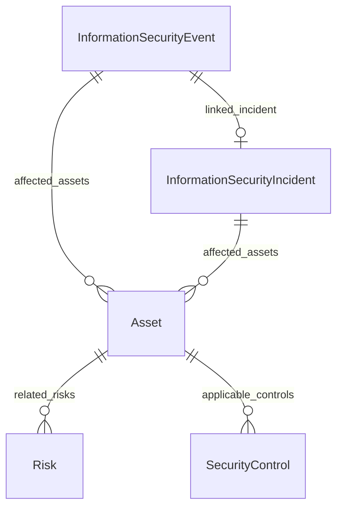

#### Attributes

| Name | Cardinality: | Type | Description |
| --- | --- | --- | --- |
| **[id](#Id)** | <sub>1..1</sub> | uriorcurie | Unique identifier for this entity instance. |
| **[name](#Name)** | <sub>1..1</sub> | string | Human-readable name or title. |
| **[description](#Description)** | <sub>0..1</sub> | string | Detailed description of the entity. |
| **[created_date](#CreatedDate)** | <sub>0..1</sub> | date | Date when the entity was created. |
| **[modified_date](#ModifiedDate)** | <sub>0..1</sub> | date | Date when the entity was last modified. |
| **[version](#Version)** | <sub>0..1</sub> | string | Version identifier for the entity. |
| **[affected_assets](#AffectedAssets)** | <sub>0..\*</sub> | [Asset](#Asset) | Assets affected by this risk or incident. |
| **[categorized_as_incident](#CategorizedAsIncident)** | <sub>0..1</sub> | boolean | Whether the event was categorized as an incident. |
| **[event_datetime](#EventDatetime)** | <sub>0..1</sub> | datetime | Date and time of the event. |
| **[event_description](#EventDescription)** | <sub>0..1</sub> | string | Description of the event. |
| **[initial_assessment](#InitialAssessment)** | <sub>0..1</sub> | string | Initial assessment of the event. |
| **[linked_incident](#LinkedIncident)** | <sub>0..1</sub> | [InformationSecurityIncident](#InformationSecurityIncident) | Linked incident if categorized. |
| **[reporter](#Reporter)** | <sub>0..1</sub> | string | Person who reported the event. |

#### Parents

 * [NamedEntity](#NamedEntity) - Abstract base class for all entities with an identifier, name, and description. Provides common identification and documentation slots.


### InformationSecurityIncident

An information security incident per A.5.26, requiring response per documented procedures.

Captures response lifecycle, evidence references, and lessons learned

Reference: ISO/IEC 27001:2022 Annex A control 5.26; ISO/IEC 27002:2022 Clause 5.26. ISO/IEC standards text is copyright ISO - not reproduced here.


#### Attributes

| Name | Cardinality: | Type | Description |
| --- | --- | --- | --- |
| **[id](#Id)** | <sub>1..1</sub> | uriorcurie | Unique identifier for this entity instance. |
| **[name](#Name)** | <sub>1..1</sub> | string | Human-readable name or title. |
| **[description](#Description)** | <sub>0..1</sub> | string | Detailed description of the entity. |
| **[created_date](#CreatedDate)** | <sub>0..1</sub> | date | Date when the entity was created. |
| **[modified_date](#ModifiedDate)** | <sub>0..1</sub> | date | Date when the entity was last modified. |
| **[version](#Version)** | <sub>0..1</sub> | string | Version identifier for the entity. |
| **[affected_assets](#AffectedAssets)** | <sub>0..\*</sub> | [Asset](#Asset) | Assets affected by this risk or incident. |
| **[affected_cia](#AffectedCia)** | <sub>0..\*</sub> | [CIAProperty](#CIAProperty) | CIA properties affected by the incident. |
| **[closure_datetime](#ClosureDatetime)** | <sub>0..1</sub> | datetime | Date and time of incident closure. |
| **[containment_actions](#ContainmentActions)** | <sub>0..\*</sub> | string | Actions to contain the incident. |
| **[detection_method](#DetectionMethod)** | <sub>0..1</sub> | string | How the incident was detected. |
| **[eradication_actions](#EradicationActions)** | <sub>0..\*</sub> | string | Actions to eradicate the cause. |
| **[evidence_collected](#EvidenceCollected)** | <sub>0..\*</sub> | string | Evidence collected. |
| **[incident_category](#IncidentCategory)** | <sub>0..1</sub> | [SecurityIncidentCategory](#SecurityIncidentCategory) | Category of incident. |
| **[incident_datetime](#IncidentDatetime)** | <sub>0..1</sub> | datetime | Date and time the incident occurred or was detected. |
| **[incident_description](#IncidentDescription)** | <sub>0..1</sub> | string | Description of the incident. |
| **[lessons_learned](#LessonsLearned)** | <sub>0..\*</sub> | string | Lessons learned from the incident. |
| **[notification_required](#NotificationRequired)** | <sub>0..1</sub> | boolean | Whether notification to authorities/parties was required. |
| **[notifications_made](#NotificationsMade)** | <sub>0..\*</sub> | string | Notifications that were made. |
| **[post_incident_review](#PostIncidentReview)** | <sub>0..1</sub> | string | Post-incident review findings. |
| **[recovery_actions](#RecoveryActions)** | <sub>0..\*</sub> | string | Actions to recover normal operations. |
| **[response_actions](#ResponseActions)** | <sub>0..\*</sub> | string | Actions taken in response. |
| **[root_cause](#RootCause)** | <sub>0..1</sub> | string | Root cause of the nonconformity. |
| **[severity](#Severity)** | <sub>0..1</sub> | [RiskLevel](#RiskLevel) | Severity rating of the incident. |

#### Parents

 * [NamedEntity](#NamedEntity) - Abstract base class for all entities with an identifier, name, and description. Provides common identification and documentation slots.

#### Referenced by:

 *  **[InformationSecurityEvent](#InformationSecurityEvent)** : linked_incident  <sub>0..1</sub> 


### InformationSecurityManagementSystem

Top-level container representing an organization's complete ISMS per ISO 27001. Aggregates all components required to support the full ISMS lifecycle.

This is the root entity for any ISMS conformance dataset

Aggregates ISMS processes and their relationships

Includes explicit scope metadata and related governance artifacts

Reference: ISO/IEC 27001:2022 Clause 4.4. ISO/IEC standards text is copyright ISO - not reproduced here.

```mermaid
erDiagram
AwarenessProgram {

}
CommunicationPlan {

}
CompetenceRecord {

}
CorrectiveAction {

}
DocumentedInformation {

}
ImprovementOpportunity {

}
InformationSecurityManagementSystem {

}
InformationSecurityObjective {

}
InformationSecurityPolicy {

}
InterestedParty {

}
InternalAudit {

}
ManagementReview {

}
MonitoringProgram {

}
Nonconformity {

}
OperationalProcedure {

}
Organization {

}
Resource {

}
RiskAssessment {

}
RiskAssessmentProcess {

}
RiskTreatmentPlan {

}
RiskTreatmentProcess {

}
Role {

}
SecurityControl {

}
StatementOfApplicability {

}

CommunicationPlan ||--}o CommunicationItem : "communication_items"
CorrectiveAction ||--|o Nonconformity : "linked_nonconformity"
InformationSecurityManagementSystem ||--|o AwarenessProgram : "awareness_program"
InformationSecurityManagementSystem ||--|o CommunicationPlan : "communication_plan"
InformationSecurityManagementSystem ||--|o InformationSecurityPolicy : "information_security_policy"
InformationSecurityManagementSystem ||--|o MonitoringProgram : "monitoring_program"
InformationSecurityManagementSystem ||--|o Organization : "organization"
InformationSecurityManagementSystem ||--|o RiskAssessmentProcess : "risk_assessment_process"
InformationSecurityManagementSystem ||--|o RiskTreatmentProcess : "risk_treatment_process"
InformationSecurityManagementSystem ||--|o StatementOfApplicability : "statement_of_applicability"
InformationSecurityManagementSystem ||--}o CompetenceRecord : "competence_records"
InformationSecurityManagementSystem ||--}o CorrectiveAction : "corrective_actions"
InformationSecurityManagementSystem ||--}o DocumentedInformation : "documented_information_register"
InformationSecurityManagementSystem ||--}o ImprovementOpportunity : "improvements"
InformationSecurityManagementSystem ||--}o InformationSecurityObjective : "objectives"
InformationSecurityManagementSystem ||--}o InterestedParty : "interested_parties"
InformationSecurityManagementSystem ||--}o InternalAudit : "internal_audits"
InformationSecurityManagementSystem ||--}o ManagementReview : "management_reviews"
InformationSecurityManagementSystem ||--}o Nonconformity : "nonconformities"
InformationSecurityManagementSystem ||--}o OperationalProcedure : "operational_procedures"
InformationSecurityManagementSystem ||--}o Resource : "resources"
InformationSecurityManagementSystem ||--}o RiskAssessment : "risk_assessments"
InformationSecurityManagementSystem ||--}o RiskTreatmentPlan : "risk_treatment_plans"
InformationSecurityManagementSystem ||--}o Role : "roles"
InformationSecurityManagementSystem ||--}o SecurityControl : "controls"
InformationSecurityObjective ||--|o Role : "responsible_role"
InformationSecurityObjective ||--}o Risk : "related_risks"
InformationSecurityObjective ||--}o SecurityControl : "related_controls"
InformationSecurityPolicy ||--}o TopicSpecificPolicy : "related_topic_policies"
InternalAudit ||--}o AuditFinding : "findings"
MonitoringProgram ||--}o MonitoringItem : "monitoring_items"
Nonconformity ||--}o CorrectiveAction : "linked_corrective_actions"
OperationalProcedure ||--}o Role : "responsible_roles"
OperationalProcedure ||--}o SecurityControl : "related_controls"
RiskAssessment ||--}o Risk : "risks_identified"
RiskTreatmentPlan ||--}o Risk : "risks_addressed"
RiskTreatmentPlan ||--}o SecurityControl : "controls_to_implement"
SecurityControl ||--}o SecurityControl : "related_controls"
StatementOfApplicability ||--}o SoAEntry : "soa_entries"

```

#### Attributes

| Name | Cardinality: | Type | Description |
| --- | --- | --- | --- |
| **[id](#Id)** | <sub>1..1</sub> | uriorcurie | Unique identifier for this entity instance. |
| **[name](#Name)** | <sub>1..1</sub> | string | Human-readable name or title. |
| **[description](#Description)** | <sub>0..1</sub> | string | Detailed description of the entity. |
| **[created_date](#CreatedDate)** | <sub>0..1</sub> | date | Date when the entity was created. |
| **[modified_date](#ModifiedDate)** | <sub>0..1</sub> | date | Date when the entity was last modified. |
| **[version](#Version)** | <sub>0..1</sub> | string | Version identifier for the entity. |
| **[awareness_program](#AwarenessProgram)** | <sub>0..1</sub> | [AwarenessProgram](#AwarenessProgram) | Reference to the awareness program. |
| **[certification_body](#CertificationBody)** | <sub>0..1</sub> | string | Accredited certification body. |
| **[certification_date](#CertificationDate)** | <sub>0..1</sub> | date | Date certification was achieved. |
| **[certification_status](#CertificationStatus)** | <sub>0..1</sub> | string | Current certification status. |
| **[communication_plan](#CommunicationPlan)** | <sub>0..1</sub> | [CommunicationPlan](#CommunicationPlan) | Reference to the communication plan. |
| **[competence_records](#CompetenceRecords)** | <sub>0..\*</sub> | [CompetenceRecord](#CompetenceRecord) | Competence records for personnel. |
| **[context_external_issues](#ContextExternalIssues)** | <sub>0..\*</sub> | string | External issues relevant to ISMS per 4.1. |
| **[context_internal_issues](#ContextInternalIssues)** | <sub>0..\*</sub> | string | Internal issues relevant to ISMS per 4.1. |
| **[controls](#Controls)** | <sub>0..\*</sub> | [SecurityControl](#SecurityControl) | Security controls applied in the ISMS. |
| **[corrective_actions](#CorrectiveActions)** | <sub>0..\*</sub> | [CorrectiveAction](#CorrectiveAction) | Corrective actions. |
| **[documented_information_register](#DocumentedInformationRegister)** | <sub>0..\*</sub> | [DocumentedInformation](#DocumentedInformation) | Register of documented information. |
| **[externally_provided_services](#ExternallyProvidedServices)** | <sub>0..\*</sub> | string | Externally provided processes, products or services relevant to the ISMS that are controlled per Clause 8.1. |
| **[governing_body](#GoverningBody)** | <sub>0..1</sub> | string | The governing body to which top management reports, where applicable (e.g., board of directors). Referenced in ISO/IEC 27001:2022 Clause 5.1 NOTE. |
| **[improvements](#Improvements)** | <sub>0..\*</sub> | [ImprovementOpportunity](#ImprovementOpportunity) | Improvement opportunities tracked. |
| **[information_security_policy](#InformationSecurityPolicy)** | <sub>0..1</sub> | [InformationSecurityPolicy](#InformationSecurityPolicy) | Reference to the information security policy. |
| **[interested_parties](#InterestedParties)** | <sub>0..\*</sub> | [InterestedParty](#InterestedParty) | Stakeholders relevant to the ISMS. |
| **[interfaces_and_dependencies](#InterfacesAndDependencies)** | <sub>0..\*</sub> | string | Interfaces and dependencies between activities performed by the organization and those performed by other organizations, considered when determining the ISMS scope per Clause 4.3 c). |
| **[internal_audits](#InternalAudits)** | <sub>0..\*</sub> | [InternalAudit](#InternalAudit) | Internal audit instances. |
| **[leadership_commitment_evidence](#LeadershipCommitmentEvidence)** | <sub>0..\*</sub> | string | Evidence of leadership and commitment with respect to the ISMS as required by Clause 5.1 a-h). |
| **[management_reviews](#ManagementReviews)** | <sub>0..\*</sub> | [ManagementReview](#ManagementReview) | Management review instances. |
| **[monitoring_program](#MonitoringProgram)** | <sub>0..1</sub> | [MonitoringProgram](#MonitoringProgram) | Reference to the monitoring program. |
| **[nonconformities](#Nonconformities)** | <sub>0..\*</sub> | [Nonconformity](#Nonconformity) | Nonconformities identified. |
| **[objectives](#Objectives)** | <sub>0..\*</sub> | [InformationSecurityObjective](#InformationSecurityObjective) | Information security objectives. |
| **[operational_procedures](#OperationalProcedures)** | <sub>0..\*</sub> | [OperationalProcedure](#OperationalProcedure) | Operational procedures. |
| **[organization](#Organization)** | <sub>0..1</sub> | [Organization](#Organization) | Reference to the organization operating the ISMS. |
| **[planned_changes](#PlannedChanges)** | <sub>0..\*</sub> | string | Changes to the ISMS planned and controlled per Clause 6.3 and 8.1 (planning of changes; control of planned changes). |
| **[processes_and_interactions](#ProcessesAndInteractions)** | <sub>0..1</sub> | string | Description of the processes needed for the ISMS and their interactions, per Clause 4.4. |
| **[recertification_date](#RecertificationDate)** | <sub>0..1</sub> | date | Date recertification is due. |
| **[resources](#Resources)** | <sub>0..\*</sub> | [Resource](#Resource) | Resources provided for the ISMS. |
| **[risk_assessment_process](#RiskAssessmentProcess)** | <sub>0..1</sub> | [RiskAssessmentProcess](#RiskAssessmentProcess) | Reference to the risk assessment process. |
| **[risk_assessments](#RiskAssessments)** | <sub>0..\*</sub> | [RiskAssessment](#RiskAssessment) | Risk assessment instances. |
| **[risk_treatment_plans](#RiskTreatmentPlans)** | <sub>0..\*</sub> | [RiskTreatmentPlan](#RiskTreatmentPlan) | Risk treatment plans. |
| **[risk_treatment_process](#RiskTreatmentProcess)** | <sub>0..1</sub> | [RiskTreatmentProcess](#RiskTreatmentProcess) | Reference to the risk treatment process. |
| **[risks_and_opportunities_actions](#RisksAndOpportunitiesActions)** | <sub>0..\*</sub> | string | Actions to address risks and opportunities determined per Clause 6.1.1, including how they are integrated into ISMS processes and how their effectiveness is evaluated. |
| **[roles](#Roles)** | <sub>0..\*</sub> | [Role](#Role) | Information security roles defined in the ISMS. |
| **[scope_boundaries](#ScopeBoundaries)** | <sub>0..\*</sub> | string | Defined boundaries of the ISMS scope. |
| **[scope_exclusions](#ScopeExclusions)** | <sub>0..\*</sub> | string | Any exclusions from scope with justification. |
| **[scope_statement](#ScopeStatement)** | <sub>0..1</sub> | string | Documented statement of ISMS scope per 4.3. |
| **[statement_of_applicability](#StatementOfApplicability)** | <sub>0..1</sub> | [StatementOfApplicability](#StatementOfApplicability) | Reference to the Statement of Applicability. |
| **[top_management](#TopManagement)** | <sub>0..1</sub> | string | The person or group of people who direct and control the organization at the highest level, accountable for the ISMS per Clause 5.1. |

#### Parents

 * [NamedEntity](#NamedEntity) - Abstract base class for all entities with an identifier, name, and description. Provides common identification and documentation slots.


### InformationSecurityObjective

A measurable information security objective per Clause 6.2, established at relevant functions and levels of the organization.

Designed for measurable objective tracking and periodic review

Links objectives to related risks, controls, and action plans

Reference: ISO/IEC 27001:2022 Clause 6.2. ISO/IEC standards text is copyright ISO - not reproduced here.

```mermaid
erDiagram
InformationSecurityManagementSystem {

}
InformationSecurityObjective {

}
Risk {

}
Role {

}
SecurityControl {

}

InformationSecurityManagementSystem ||--|o AwarenessProgram : "awareness_program"
InformationSecurityManagementSystem ||--|o CommunicationPlan : "communication_plan"
InformationSecurityManagementSystem ||--|o InformationSecurityPolicy : "information_security_policy"
InformationSecurityManagementSystem ||--|o MonitoringProgram : "monitoring_program"
InformationSecurityManagementSystem ||--|o Organization : "organization"
InformationSecurityManagementSystem ||--|o RiskAssessmentProcess : "risk_assessment_process"
InformationSecurityManagementSystem ||--|o RiskTreatmentProcess : "risk_treatment_process"
InformationSecurityManagementSystem ||--|o StatementOfApplicability : "statement_of_applicability"
InformationSecurityManagementSystem ||--}o CompetenceRecord : "competence_records"
InformationSecurityManagementSystem ||--}o CorrectiveAction : "corrective_actions"
InformationSecurityManagementSystem ||--}o DocumentedInformation : "documented_information_register"
InformationSecurityManagementSystem ||--}o ImprovementOpportunity : "improvements"
InformationSecurityManagementSystem ||--}o InformationSecurityObjective : "objectives"
InformationSecurityManagementSystem ||--}o InterestedParty : "interested_parties"
InformationSecurityManagementSystem ||--}o InternalAudit : "internal_audits"
InformationSecurityManagementSystem ||--}o ManagementReview : "management_reviews"
InformationSecurityManagementSystem ||--}o Nonconformity : "nonconformities"
InformationSecurityManagementSystem ||--}o OperationalProcedure : "operational_procedures"
InformationSecurityManagementSystem ||--}o Resource : "resources"
InformationSecurityManagementSystem ||--}o RiskAssessment : "risk_assessments"
InformationSecurityManagementSystem ||--}o RiskTreatmentPlan : "risk_treatment_plans"
InformationSecurityManagementSystem ||--}o Role : "roles"
InformationSecurityManagementSystem ||--}o SecurityControl : "controls"
InformationSecurityObjective ||--|o Role : "responsible_role"
InformationSecurityObjective ||--}o Risk : "related_risks"
InformationSecurityObjective ||--}o SecurityControl : "related_controls"
Risk ||--|o RiskTreatmentPlan : "related_treatment_plan"
Risk ||--}o Asset : "affected_assets"
Risk ||--}o SecurityControl : "existing_controls"
SecurityControl ||--}o SecurityControl : "related_controls"

```

#### Attributes

| Name | Cardinality: | Type | Description |
| --- | --- | --- | --- |
| **[id](#Id)** | <sub>1..1</sub> | uriorcurie | Unique identifier for this entity instance. |
| **[name](#Name)** | <sub>1..1</sub> | string | Human-readable name or title. |
| **[description](#Description)** | <sub>0..1</sub> | string | Detailed description of the entity. |
| **[created_date](#CreatedDate)** | <sub>0..1</sub> | date | Date when the entity was created. |
| **[modified_date](#ModifiedDate)** | <sub>0..1</sub> | date | Date when the entity was last modified. |
| **[version](#Version)** | <sub>0..1</sub> | string | Version identifier for the entity. |
| **[achievement_status](#AchievementStatus)** | <sub>0..1</sub> | string | Current status of objective achievement. |
| **[action_plan](#ActionPlan)** | <sub>0..1</sub> | string | Plan for achieving the objective. |
| **[current_value](#CurrentValue)** | <sub>0..1</sub> | string | Current measured value. |
| **[measurement_frequency](#MeasurementFrequency)** | <sub>0..1</sub> | string | How often measurement is performed. |
| **[measurement_method](#MeasurementMethod)** | <sub>0..1</sub> | string | Method used to measure the metric. |
| **[metric_definition](#MetricDefinition)** | <sub>0..1</sub> | string | Definition of how the objective is measured. |
| **[objective_resources_required](#ObjectiveResourcesRequired)** | <sub>0..1</sub> | string | Resources required to achieve the information security objective. |
| **[objective_statement](#ObjectiveStatement)** | <sub>0..1</sub> | string | Clear statement of the objective. |
| **[related_controls](#RelatedControls)** | <sub>0..\*</sub> | [SecurityControl](#SecurityControl) | Other controls related to this one. |
| **[related_risks](#RelatedRisks)** | <sub>0..\*</sub> | [Risk](#Risk) | Associated risks. |
| **[responsible_role](#ResponsibleRole)** | <sub>0..1</sub> | [Role](#Role) | Role responsible for the objective or control. |
| **[target_date](#TargetDate)** | <sub>0..1</sub> | date | Target date for achieving the objective. |
| **[target_value](#TargetValue)** | <sub>0..1</sub> | string | Target value for the objective metric. |

#### Parents

 * [NamedEntity](#NamedEntity) - Abstract base class for all entities with an identifier, name, and description. Provides common identification and documentation slots.

#### Referenced by:

 *  **[InformationSecurityManagementSystem](#InformationSecurityManagementSystem)** : objectives  <sub>0..\*</sub> 


### InformationSecurityPolicy

The information security policy established by top management per Clause 5.2. Provides framework for setting objectives and demonstrates commitment.

Captures policy intent and governance commitments

Supports communication and acknowledgement tracking

Reference: ISO/IEC 27001:2022 Clause 5.2. ISO/IEC standards text is copyright ISO - not reproduced here.

```mermaid
erDiagram
InformationSecurityManagementSystem {

}
InformationSecurityPolicy {

}
TopicSpecificPolicy {

}

InformationSecurityManagementSystem ||--|o AwarenessProgram : "awareness_program"
InformationSecurityManagementSystem ||--|o CommunicationPlan : "communication_plan"
InformationSecurityManagementSystem ||--|o InformationSecurityPolicy : "information_security_policy"
InformationSecurityManagementSystem ||--|o MonitoringProgram : "monitoring_program"
InformationSecurityManagementSystem ||--|o Organization : "organization"
InformationSecurityManagementSystem ||--|o RiskAssessmentProcess : "risk_assessment_process"
InformationSecurityManagementSystem ||--|o RiskTreatmentProcess : "risk_treatment_process"
InformationSecurityManagementSystem ||--|o StatementOfApplicability : "statement_of_applicability"
InformationSecurityManagementSystem ||--}o CompetenceRecord : "competence_records"
InformationSecurityManagementSystem ||--}o CorrectiveAction : "corrective_actions"
InformationSecurityManagementSystem ||--}o DocumentedInformation : "documented_information_register"
InformationSecurityManagementSystem ||--}o ImprovementOpportunity : "improvements"
InformationSecurityManagementSystem ||--}o InformationSecurityObjective : "objectives"
InformationSecurityManagementSystem ||--}o InterestedParty : "interested_parties"
InformationSecurityManagementSystem ||--}o InternalAudit : "internal_audits"
InformationSecurityManagementSystem ||--}o ManagementReview : "management_reviews"
InformationSecurityManagementSystem ||--}o Nonconformity : "nonconformities"
InformationSecurityManagementSystem ||--}o OperationalProcedure : "operational_procedures"
InformationSecurityManagementSystem ||--}o Resource : "resources"
InformationSecurityManagementSystem ||--}o RiskAssessment : "risk_assessments"
InformationSecurityManagementSystem ||--}o RiskTreatmentPlan : "risk_treatment_plans"
InformationSecurityManagementSystem ||--}o Role : "roles"
InformationSecurityManagementSystem ||--}o SecurityControl : "controls"
InformationSecurityPolicy ||--}o TopicSpecificPolicy : "related_topic_policies"
TopicSpecificPolicy ||--|o InformationSecurityPolicy : "parent_policy"
TopicSpecificPolicy ||--}o SecurityControl : "applicable_controls"

```

#### Attributes

| Name | Cardinality: | Type | Description |
| --- | --- | --- | --- |
| **[id](#Id)** | <sub>1..1</sub> | uriorcurie | Unique identifier for this entity instance. |
| **[name](#Name)** | <sub>1..1</sub> | string | Human-readable name or title. |
| **[description](#Description)** | <sub>0..1</sub> | string | Detailed description of the entity. |
| **[approved_by](#ApprovedBy)** | <sub>0..1</sub> | string | Person who approved the document. |
| **[approved_date](#ApprovedDate)** | <sub>0..1</sub> | date | Date when the document was approved. |
| **[author](#Author)** | <sub>0..1</sub> | string | Person who created the document. |
| **[change_control_method](#ChangeControlMethod)** | <sub>0..1</sub> | string | Method used for control of changes (e.g., version control) of the documented information, per Clause 7.5.3 e). |
| **[classification](#Classification)** | <sub>0..1</sub> | string | Information classification level. |
| **[created_date](#CreatedDate)** | <sub>0..1</sub> | date | Date when the entity was created. |
| **[distribution_controls](#DistributionControls)** | <sub>0..\*</sub> | string | Controls governing distribution, access, retrieval and use of the documented information, per Clause 7.5.3 c). |
| **[document_reference](#DocumentReference)** | <sub>0..1</sub> | string | Unique reference number for document control. |
| **[document_type](#DocumentType)** | <sub>0..1</sub> | [DocumentType](#DocumentType) | Classification of the documented information. |
| **[effective_date](#EffectiveDate)** | <sub>0..1</sub> | date | Date when the document becomes effective. |
| **[external_origin](#ExternalOrigin)** | <sub>0..1</sub> | boolean | Whether the documented information is of external origin and has been identified as necessary for the planning and operation of the ISMS, per Clause 7.5.3. |
| **[external_origin_source](#ExternalOriginSource)** | <sub>0..1</sub> | string | Source or provider of the externally originated documented information, per Clause 7.5.3. |
| **[modified_date](#ModifiedDate)** | <sub>0..1</sub> | date | Date when the entity was last modified. |
| **[owner](#Owner)** | <sub>0..1</sub> | string | Person accountable for the document content and maintenance. |
| **[retention_period](#RetentionPeriod)** | <sub>0..1</sub> | duration type | Duration for which the document is retained. |
| **[review_date](#ReviewDate)** | <sub>0..1</sub> | date | Date when the document is due for review. |
| **[status](#Status)** | <sub>0..1</sub> | string | Current status of the document or entity. |
| **[storage_and_preservation](#StorageAndPreservation)** | <sub>0..1</sub> | string | Arrangements for storage and preservation (including preservation of legibility) of the documented information, per Clause 7.5.3 d). |
| **[version](#Version)** | <sub>0..1</sub> | string | Version identifier for the entity. |
| **[acknowledgment_required](#AcknowledgmentRequired)** | <sub>0..1</sub> | boolean | Whether acknowledgment is required from personnel. |
| **[applicability_statement](#ApplicabilityStatement)** | <sub>0..1</sub> | string | Statement of policy applicability. |
| **[commitment_statements](#CommitmentStatements)** | <sub>0..\*</sub> | string | Statements of commitment included in the policy. |
| **[communication_date](#CommunicationDate)** | <sub>0..1</sub> | date | Date when the policy was communicated. |
| **[integrated_management_systems](#IntegratedManagementSystems)** | <sub>0..\*</sub> | [RelatedManagementSystem](#RelatedManagementSystem) | Other ISO/IEC management system standards with which the ISMS is integrated or aligned (per the harmonized structure of Annex SL). |
| **[last_policy_review_date](#LastPolicyReviewDate)** | <sub>0..1</sub> | date | Date of the most recent information security policy review. |
| **[next_policy_review_date](#NextPolicyReviewDate)** | <sub>0..1</sub> | date | Planned date of the next information security policy review. |
| **[policy_objectives_framework](#PolicyObjectivesFramework)** | <sub>0..1</sub> | string | Framework for setting information security objectives. |
| **[policy_statement](#PolicyStatement)** | <sub>0..1</sub> | string | The core policy statement text. |
| **[related_topic_policies](#RelatedTopicPolicies)** | <sub>0..\*</sub> | [TopicSpecificPolicy](#TopicSpecificPolicy) | Topic-specific policies supporting this policy. |

#### Parents

 * [DocumentedInformation](#DocumentedInformation) - Abstract class for documented information per Clause 7.5. Captures metadata required for document control.

#### Referenced by:

 *  **[InformationSecurityManagementSystem](#InformationSecurityManagementSystem)** : information_security_policy  <sub>0..1</sub> 
 *  **[TopicSpecificPolicy](#TopicSpecificPolicy)** : parent_policy  <sub>0..1</sub> 


### InterestedParty

A stakeholder whose needs and expectations are relevant to the ISMS per 4.2. Includes internal parties (employees, management) and external parties (customers, regulators, suppliers).

Captures stakeholder needs and expectations relevant to ISMS scope

Requirements may include legal, regulatory, and contractual obligations

Relevant interested parties can have requirements related to climate change (Amd. 1:2024 Clause 4.2 Note 2)

Reference: ISO/IEC 27001:2022 Clause 4.2 and Amd. 1:2024. ISO/IEC standards text is copyright ISO - not reproduced here.


#### Attributes

| Name | Cardinality: | Type | Description |
| --- | --- | --- | --- |
| **[id](#Id)** | <sub>1..1</sub> | uriorcurie | Unique identifier for this entity instance. |
| **[name](#Name)** | <sub>1..1</sub> | string | Human-readable name or title. |
| **[description](#Description)** | <sub>0..1</sub> | string | Detailed description of the entity. |
| **[created_date](#CreatedDate)** | <sub>0..1</sub> | date | Date when the entity was created. |
| **[modified_date](#ModifiedDate)** | <sub>0..1</sub> | date | Date when the entity was last modified. |
| **[version](#Version)** | <sub>0..1</sub> | string | Version identifier for the entity. |
| **[addressed_requirements](#AddressedRequirements)** | <sub>0..\*</sub> | string | Requirements of the interested party that the organization has determined will be addressed through the ISMS, per Clause 4.2 c). |
| **[climate_change_related_requirements](#ClimateChangeRelatedRequirements)** | <sub>0..\*</sub> | string | Climate-change-related requirements of the interested party, per ISO/IEC 27001:2022 Clause 4.2 NOTE 2 as added by Amd. 1:2024. |
| **[communication_needs](#CommunicationNeeds)** | <sub>0..1</sub> | string | Communication requirements for this party. |
| **[contact_information](#ContactInformation)** | <sub>0..1</sub> | string | Contact details for the party. |
| **[party_type](#PartyType)** | <sub>0..1</sub> | string | Category of interested party. |
| **[relationship](#Relationship)** | <sub>0..1</sub> | string | Nature of the relationship with the organization. |
| **[requirements](#Requirements)** | <sub>0..\*</sub> | string | Requirements of the interested party. |

#### Parents

 * [NamedEntity](#NamedEntity) - Abstract base class for all entities with an identifier, name, and description. Provides common identification and documentation slots.

#### Referenced by:

 *  **[InformationSecurityManagementSystem](#InformationSecurityManagementSystem)** : interested_parties  <sub>0..\*</sub> 


### InternalAudit

An internal audit instance per Clause 9.2, assessing ISMS conformance and effectiveness.

Captures audit scope, criteria, findings, and conclusions

Supports periodic conformance and effectiveness assessment records

Reference: ISO/IEC 27001:2022 Clause 9.2. ISO/IEC standards text is copyright ISO - not reproduced here.

```mermaid
erDiagram
AuditFinding {

}
AuditProgramme {

}
InformationSecurityManagementSystem {

}
InternalAudit {

}

AuditFinding ||--|o CorrectiveAction : "linked_corrective_action"
AuditFinding ||--|o SecurityControl : "control_reference"
AuditProgramme ||--}o InternalAudit : "planned_audits"
InformationSecurityManagementSystem ||--|o AwarenessProgram : "awareness_program"
InformationSecurityManagementSystem ||--|o CommunicationPlan : "communication_plan"
InformationSecurityManagementSystem ||--|o InformationSecurityPolicy : "information_security_policy"
InformationSecurityManagementSystem ||--|o MonitoringProgram : "monitoring_program"
InformationSecurityManagementSystem ||--|o Organization : "organization"
InformationSecurityManagementSystem ||--|o RiskAssessmentProcess : "risk_assessment_process"
InformationSecurityManagementSystem ||--|o RiskTreatmentProcess : "risk_treatment_process"
InformationSecurityManagementSystem ||--|o StatementOfApplicability : "statement_of_applicability"
InformationSecurityManagementSystem ||--}o CompetenceRecord : "competence_records"
InformationSecurityManagementSystem ||--}o CorrectiveAction : "corrective_actions"
InformationSecurityManagementSystem ||--}o DocumentedInformation : "documented_information_register"
InformationSecurityManagementSystem ||--}o ImprovementOpportunity : "improvements"
InformationSecurityManagementSystem ||--}o InformationSecurityObjective : "objectives"
InformationSecurityManagementSystem ||--}o InterestedParty : "interested_parties"
InformationSecurityManagementSystem ||--}o InternalAudit : "internal_audits"
InformationSecurityManagementSystem ||--}o ManagementReview : "management_reviews"
InformationSecurityManagementSystem ||--}o Nonconformity : "nonconformities"
InformationSecurityManagementSystem ||--}o OperationalProcedure : "operational_procedures"
InformationSecurityManagementSystem ||--}o Resource : "resources"
InformationSecurityManagementSystem ||--}o RiskAssessment : "risk_assessments"
InformationSecurityManagementSystem ||--}o RiskTreatmentPlan : "risk_treatment_plans"
InformationSecurityManagementSystem ||--}o Role : "roles"
InformationSecurityManagementSystem ||--}o SecurityControl : "controls"
InternalAudit ||--}o AuditFinding : "findings"

```

#### Attributes

| Name | Cardinality: | Type | Description |
| --- | --- | --- | --- |
| **[id](#Id)** | <sub>1..1</sub> | uriorcurie | Unique identifier for this entity instance. |
| **[name](#Name)** | <sub>1..1</sub> | string | Human-readable name or title. |
| **[description](#Description)** | <sub>0..1</sub> | string | Detailed description of the entity. |
| **[approved_by](#ApprovedBy)** | <sub>0..1</sub> | string | Person who approved the document. |
| **[approved_date](#ApprovedDate)** | <sub>0..1</sub> | date | Date when the document was approved. |
| **[author](#Author)** | <sub>0..1</sub> | string | Person who created the document. |
| **[change_control_method](#ChangeControlMethod)** | <sub>0..1</sub> | string | Method used for control of changes (e.g., version control) of the documented information, per Clause 7.5.3 e). |
| **[classification](#Classification)** | <sub>0..1</sub> | string | Information classification level. |
| **[created_date](#CreatedDate)** | <sub>0..1</sub> | date | Date when the entity was created. |
| **[distribution_controls](#DistributionControls)** | <sub>0..\*</sub> | string | Controls governing distribution, access, retrieval and use of the documented information, per Clause 7.5.3 c). |
| **[document_reference](#DocumentReference)** | <sub>0..1</sub> | string | Unique reference number for document control. |
| **[document_type](#DocumentType)** | <sub>0..1</sub> | [DocumentType](#DocumentType) | Classification of the documented information. |
| **[effective_date](#EffectiveDate)** | <sub>0..1</sub> | date | Date when the document becomes effective. |
| **[external_origin](#ExternalOrigin)** | <sub>0..1</sub> | boolean | Whether the documented information is of external origin and has been identified as necessary for the planning and operation of the ISMS, per Clause 7.5.3. |
| **[external_origin_source](#ExternalOriginSource)** | <sub>0..1</sub> | string | Source or provider of the externally originated documented information, per Clause 7.5.3. |
| **[modified_date](#ModifiedDate)** | <sub>0..1</sub> | date | Date when the entity was last modified. |
| **[owner](#Owner)** | <sub>0..1</sub> | string | Person accountable for the document content and maintenance. |
| **[retention_period](#RetentionPeriod)** | <sub>0..1</sub> | duration type | Duration for which the document is retained. |
| **[review_date](#ReviewDate)** | <sub>0..1</sub> | date | Date when the document is due for review. |
| **[status](#Status)** | <sub>0..1</sub> | string | Current status of the document or entity. |
| **[storage_and_preservation](#StorageAndPreservation)** | <sub>0..1</sub> | string | Arrangements for storage and preservation (including preservation of legibility) of the documented information, per Clause 7.5.3 d). |
| **[version](#Version)** | <sub>0..1</sub> | string | Version identifier for the entity. |
| **[audit_conclusion](#AuditConclusion)** | <sub>0..1</sub> | string | Overall audit conclusion. |
| **[audit_criteria](#AuditCriteria)** | <sub>0..\*</sub> | string | Criteria against which audit is conducted. |
| **[audit_objectives](#AuditObjectives)** | <sub>0..\*</sub> | string | Objectives of the audit. |
| **[audit_period_end](#AuditPeriodEnd)** | <sub>0..1</sub> | date | End date of audit period. |
| **[audit_period_start](#AuditPeriodStart)** | <sub>0..1</sub> | date | Start date of audit period. |
| **[audit_plan](#AuditPlan)** | <sub>0..1</sub> | string | Audit plan document reference. |
| **[audit_reference](#AuditReference)** | <sub>0..1</sub> | string | Reference identifier for the audit. |
| **[audit_scope](#AuditScope)** | <sub>0..1</sub> | string | Scope of the audit. |
| **[audit_team](#AuditTeam)** | <sub>0..\*</sub> | string | Audit team members. |
| **[audit_type](#AuditType)** | <sub>0..1</sub> | [AuditType](#AuditType) | Type of audit per ISO/IEC 27001:2022 Clause 9.2 and ISO/IEC 17021-1. |
| **[auditee_representatives](#AuditeeRepresentatives)** | <sub>0..\*</sub> | string | Representatives from audited areas. |
| **[findings](#Findings)** | <sub>0..\*</sub> | [AuditFinding](#AuditFinding) | Audit findings. |
| **[lead_auditor](#LeadAuditor)** | <sub>0..1</sub> | string | Lead auditor for the audit. |
| **[positive_observations](#PositiveObservations)** | <sub>0..\*</sub> | string | Positive observations noted. |
| **[report_date](#ReportDate)** | <sub>0..1</sub> | date | Date the report was issued. |
| **[report_distribution](#ReportDistribution)** | <sub>0..\*</sub> | string | Distribution list for the report. |

#### Parents

 * [DocumentedInformation](#DocumentedInformation) - Abstract class for documented information per Clause 7.5. Captures metadata required for document control.

#### Referenced by:

 *  **[InformationSecurityManagementSystem](#InformationSecurityManagementSystem)** : internal_audits  <sub>0..\*</sub> 
 *  **[AuditProgramme](#AuditProgramme)** : planned_audits  <sub>0..\*</sub> 


### ManagementReview

A management review per Clause 9.3, conducted by top management to evaluate ongoing ISMS performance and fitness for purpose.

Captures periodic management review inputs, outputs, and follow-up actions

Reference: ISO/IEC 27001:2022 Clause 9.3. ISO/IEC standards text is copyright ISO - not reproduced here.


#### Attributes

| Name | Cardinality: | Type | Description |
| --- | --- | --- | --- |
| **[id](#Id)** | <sub>1..1</sub> | uriorcurie | Unique identifier for this entity instance. |
| **[name](#Name)** | <sub>1..1</sub> | string | Human-readable name or title. |
| **[description](#Description)** | <sub>0..1</sub> | string | Detailed description of the entity. |
| **[approved_by](#ApprovedBy)** | <sub>0..1</sub> | string | Person who approved the document. |
| **[approved_date](#ApprovedDate)** | <sub>0..1</sub> | date | Date when the document was approved. |
| **[author](#Author)** | <sub>0..1</sub> | string | Person who created the document. |
| **[change_control_method](#ChangeControlMethod)** | <sub>0..1</sub> | string | Method used for control of changes (e.g., version control) of the documented information, per Clause 7.5.3 e). |
| **[classification](#Classification)** | <sub>0..1</sub> | string | Information classification level. |
| **[created_date](#CreatedDate)** | <sub>0..1</sub> | date | Date when the entity was created. |
| **[distribution_controls](#DistributionControls)** | <sub>0..\*</sub> | string | Controls governing distribution, access, retrieval and use of the documented information, per Clause 7.5.3 c). |
| **[document_reference](#DocumentReference)** | <sub>0..1</sub> | string | Unique reference number for document control. |
| **[document_type](#DocumentType)** | <sub>0..1</sub> | [DocumentType](#DocumentType) | Classification of the documented information. |
| **[effective_date](#EffectiveDate)** | <sub>0..1</sub> | date | Date when the document becomes effective. |
| **[external_origin](#ExternalOrigin)** | <sub>0..1</sub> | boolean | Whether the documented information is of external origin and has been identified as necessary for the planning and operation of the ISMS, per Clause 7.5.3. |
| **[external_origin_source](#ExternalOriginSource)** | <sub>0..1</sub> | string | Source or provider of the externally originated documented information, per Clause 7.5.3. |
| **[modified_date](#ModifiedDate)** | <sub>0..1</sub> | date | Date when the entity was last modified. |
| **[owner](#Owner)** | <sub>0..1</sub> | string | Person accountable for the document content and maintenance. |
| **[retention_period](#RetentionPeriod)** | <sub>0..1</sub> | duration type | Duration for which the document is retained. |
| **[status](#Status)** | <sub>0..1</sub> | string | Current status of the document or entity. |
| **[storage_and_preservation](#StorageAndPreservation)** | <sub>0..1</sub> | string | Arrangements for storage and preservation (including preservation of legibility) of the documented information, per Clause 7.5.3 d). |
| **[version](#Version)** | <sub>0..1</sub> | string | Version identifier for the entity. |
| **[action_items](#ActionItems)** | <sub>0..\*</sub> | string | Action items from the review. |
| **[attendees](#Attendees)** | <sub>0..\*</sub> | string | Attendees of the review. |
| **[audit_results_summary](#AuditResultsSummary)** | <sub>0..1</sub> | string | Summary of audit results. |
| **[context_changes](#ContextChanges)** | <sub>0..1</sub> | string | Changes in context since last review. |
| **[decisions](#Decisions)** | <sub>0..\*</sub> | string | Decisions made in the review. |
| **[improvement_opportunities](#ImprovementOpportunities)** | <sub>0..\*</sub> | string | Opportunities for improvement identified. |
| **[interested_party_changes](#InterestedPartyChanges)** | <sub>0..1</sub> | string | Changes in interested party requirements. |
| **[interested_party_feedback](#InterestedPartyFeedback)** | <sub>0..1</sub> | string | Feedback from interested parties considered in the management review. |
| **[next_review_date](#NextReviewDate)** | <sub>0..1</sub> | date | Planned date for next review. |
| **[performance_trends](#PerformanceTrends)** | <sub>0..1</sub> | string | Trends in information security performance. |
| **[previous_actions_status](#PreviousActionsStatus)** | <sub>0..1</sub> | string | Status of actions from previous reviews. |
| **[review_date](#ReviewDate)** | <sub>0..1</sub> | date | Date when the management review was conducted. |
| **[risk_assessment_results](#RiskAssessmentResults)** | <sub>0..1</sub> | string | Results of risk assessment. |
| **[risk_treatment_status](#RiskTreatmentStatus)** | <sub>0..1</sub> | string | Status of the risk treatment plan considered in the management review. |
| **[risks_and_opportunities_changes](#RisksAndOpportunitiesChanges)** | <sub>0..1</sub> | string | Changes in risks and opportunities considered in the management review, per Clause 9.3.2 f). |

#### Parents

 * [DocumentedInformation](#DocumentedInformation) - Abstract class for documented information per Clause 7.5. Captures metadata required for document control.

#### Referenced by:

 *  **[InformationSecurityManagementSystem](#InformationSecurityManagementSystem)** : management_reviews  <sub>0..\*</sub> 


### MonitoringItem

A single item to be monitored and measured per 9.1.

```mermaid
erDiagram
MonitoringItem {

}
MonitoringProgram {

}

MonitoringProgram ||--}o MonitoringItem : "monitoring_items"

```

#### Attributes

| Name | Cardinality: | Type | Description |
| --- | --- | --- | --- |
| **[alert_threshold](#AlertThreshold)** | <sub>0..1</sub> | string | Threshold triggering alerts. |
| **[analysis_frequency](#AnalysisFrequency)** | <sub>0..1</sub> | string | How often analysis is performed. |
| **[analyst](#Analyst)** | <sub>0..1</sub> | string | Person performing analysis. |
| **[current_value](#CurrentValue)** | <sub>0..1</sub> | string | Current measured value. |
| **[measurement_frequency](#MeasurementFrequency)** | <sub>0..1</sub> | string | How often measurement is performed. |
| **[measurement_method](#MeasurementMethod)** | <sub>0..1</sub> | string | Method used to measure the metric. |
| **[metric_description](#MetricDescription)** | <sub>0..1</sub> | string | Description of what is measured. |
| **[metric_name](#MetricName)** | <sub>0..1</sub> | string | Name of the metric. |
| **[responsible_party](#ResponsibleParty)** | <sub>0..1</sub> | string | Party responsible for the activity. |
| **[target_threshold](#TargetThreshold)** | <sub>0..1</sub> | string | Target threshold value. |
| **[trend](#Trend)** | <sub>0..1</sub> | string | Current trend direction. |

#### Referenced by:

 *  **[MonitoringProgram](#MonitoringProgram)** : monitoring_items  <sub>0..\*</sub> 


### MonitoringProgram

The program for monitoring, measurement, analysis, and evaluation per Clause 9.1.

Captures metrics, methods, and analysis cadence

Supports reproducible monitoring and evaluation records

Reference: ISO/IEC 27001:2022 Clause 9.1. ISO/IEC standards text is copyright ISO - not reproduced here.

```mermaid
erDiagram
InformationSecurityManagementSystem {

}
MonitoringItem {

}
MonitoringProgram {

}

InformationSecurityManagementSystem ||--|o AwarenessProgram : "awareness_program"
InformationSecurityManagementSystem ||--|o CommunicationPlan : "communication_plan"
InformationSecurityManagementSystem ||--|o InformationSecurityPolicy : "information_security_policy"
InformationSecurityManagementSystem ||--|o MonitoringProgram : "monitoring_program"
InformationSecurityManagementSystem ||--|o Organization : "organization"
InformationSecurityManagementSystem ||--|o RiskAssessmentProcess : "risk_assessment_process"
InformationSecurityManagementSystem ||--|o RiskTreatmentProcess : "risk_treatment_process"
InformationSecurityManagementSystem ||--|o StatementOfApplicability : "statement_of_applicability"
InformationSecurityManagementSystem ||--}o CompetenceRecord : "competence_records"
InformationSecurityManagementSystem ||--}o CorrectiveAction : "corrective_actions"
InformationSecurityManagementSystem ||--}o DocumentedInformation : "documented_information_register"
InformationSecurityManagementSystem ||--}o ImprovementOpportunity : "improvements"
InformationSecurityManagementSystem ||--}o InformationSecurityObjective : "objectives"
InformationSecurityManagementSystem ||--}o InterestedParty : "interested_parties"
InformationSecurityManagementSystem ||--}o InternalAudit : "internal_audits"
InformationSecurityManagementSystem ||--}o ManagementReview : "management_reviews"
InformationSecurityManagementSystem ||--}o Nonconformity : "nonconformities"
InformationSecurityManagementSystem ||--}o OperationalProcedure : "operational_procedures"
InformationSecurityManagementSystem ||--}o Resource : "resources"
InformationSecurityManagementSystem ||--}o RiskAssessment : "risk_assessments"
InformationSecurityManagementSystem ||--}o RiskTreatmentPlan : "risk_treatment_plans"
InformationSecurityManagementSystem ||--}o Role : "roles"
InformationSecurityManagementSystem ||--}o SecurityControl : "controls"
MonitoringProgram ||--}o MonitoringItem : "monitoring_items"

```

#### Attributes

| Name | Cardinality: | Type | Description |
| --- | --- | --- | --- |
| **[id](#Id)** | <sub>1..1</sub> | uriorcurie | Unique identifier for this entity instance. |
| **[name](#Name)** | <sub>1..1</sub> | string | Human-readable name or title. |
| **[description](#Description)** | <sub>0..1</sub> | string | Detailed description of the entity. |
| **[approved_by](#ApprovedBy)** | <sub>0..1</sub> | string | Person who approved the document. |
| **[approved_date](#ApprovedDate)** | <sub>0..1</sub> | date | Date when the document was approved. |
| **[author](#Author)** | <sub>0..1</sub> | string | Person who created the document. |
| **[change_control_method](#ChangeControlMethod)** | <sub>0..1</sub> | string | Method used for control of changes (e.g., version control) of the documented information, per Clause 7.5.3 e). |
| **[classification](#Classification)** | <sub>0..1</sub> | string | Information classification level. |
| **[created_date](#CreatedDate)** | <sub>0..1</sub> | date | Date when the entity was created. |
| **[distribution_controls](#DistributionControls)** | <sub>0..\*</sub> | string | Controls governing distribution, access, retrieval and use of the documented information, per Clause 7.5.3 c). |
| **[document_reference](#DocumentReference)** | <sub>0..1</sub> | string | Unique reference number for document control. |
| **[document_type](#DocumentType)** | <sub>0..1</sub> | [DocumentType](#DocumentType) | Classification of the documented information. |
| **[effective_date](#EffectiveDate)** | <sub>0..1</sub> | date | Date when the document becomes effective. |
| **[external_origin](#ExternalOrigin)** | <sub>0..1</sub> | boolean | Whether the documented information is of external origin and has been identified as necessary for the planning and operation of the ISMS, per Clause 7.5.3. |
| **[external_origin_source](#ExternalOriginSource)** | <sub>0..1</sub> | string | Source or provider of the externally originated documented information, per Clause 7.5.3. |
| **[modified_date](#ModifiedDate)** | <sub>0..1</sub> | date | Date when the entity was last modified. |
| **[owner](#Owner)** | <sub>0..1</sub> | string | Person accountable for the document content and maintenance. |
| **[retention_period](#RetentionPeriod)** | <sub>0..1</sub> | duration type | Duration for which the document is retained. |
| **[review_date](#ReviewDate)** | <sub>0..1</sub> | date | Date when the document is due for review. |
| **[status](#Status)** | <sub>0..1</sub> | string | Current status of the document or entity. |
| **[storage_and_preservation](#StorageAndPreservation)** | <sub>0..1</sub> | string | Arrangements for storage and preservation (including preservation of legibility) of the documented information, per Clause 7.5.3 d). |
| **[version](#Version)** | <sub>0..1</sub> | string | Version identifier for the entity. |
| **[monitoring_items](#MonitoringItems)** | <sub>0..\*</sub> | [MonitoringItem](#MonitoringItem) | Items to be monitored. |

#### Parents

 * [DocumentedInformation](#DocumentedInformation) - Abstract class for documented information per Clause 7.5. Captures metadata required for document control.

#### Referenced by:

 *  **[InformationSecurityManagementSystem](#InformationSecurityManagementSystem)** : monitoring_program  <sub>0..1</sub> 


### Nonconformity

A nonconformity identified per Clause 10.2, representing failure to fulfill a requirement.

Captures detection, correction, consequence handling, and root-cause data

Reference: ISO/IEC 27001:2022 Clause 10.2. ISO/IEC standards text is copyright ISO - not reproduced here.

```mermaid
erDiagram
CorrectiveAction {

}
InformationSecurityManagementSystem {

}
Nonconformity {

}

CorrectiveAction ||--|o Nonconformity : "linked_nonconformity"
InformationSecurityManagementSystem ||--|o AwarenessProgram : "awareness_program"
InformationSecurityManagementSystem ||--|o CommunicationPlan : "communication_plan"
InformationSecurityManagementSystem ||--|o InformationSecurityPolicy : "information_security_policy"
InformationSecurityManagementSystem ||--|o MonitoringProgram : "monitoring_program"
InformationSecurityManagementSystem ||--|o Organization : "organization"
InformationSecurityManagementSystem ||--|o RiskAssessmentProcess : "risk_assessment_process"
InformationSecurityManagementSystem ||--|o RiskTreatmentProcess : "risk_treatment_process"
InformationSecurityManagementSystem ||--|o StatementOfApplicability : "statement_of_applicability"
InformationSecurityManagementSystem ||--}o CompetenceRecord : "competence_records"
InformationSecurityManagementSystem ||--}o CorrectiveAction : "corrective_actions"
InformationSecurityManagementSystem ||--}o DocumentedInformation : "documented_information_register"
InformationSecurityManagementSystem ||--}o ImprovementOpportunity : "improvements"
InformationSecurityManagementSystem ||--}o InformationSecurityObjective : "objectives"
InformationSecurityManagementSystem ||--}o InterestedParty : "interested_parties"
InformationSecurityManagementSystem ||--}o InternalAudit : "internal_audits"
InformationSecurityManagementSystem ||--}o ManagementReview : "management_reviews"
InformationSecurityManagementSystem ||--}o Nonconformity : "nonconformities"
InformationSecurityManagementSystem ||--}o OperationalProcedure : "operational_procedures"
InformationSecurityManagementSystem ||--}o Resource : "resources"
InformationSecurityManagementSystem ||--}o RiskAssessment : "risk_assessments"
InformationSecurityManagementSystem ||--}o RiskTreatmentPlan : "risk_treatment_plans"
InformationSecurityManagementSystem ||--}o Role : "roles"
InformationSecurityManagementSystem ||--}o SecurityControl : "controls"
Nonconformity ||--}o CorrectiveAction : "linked_corrective_actions"

```

#### Attributes

| Name | Cardinality: | Type | Description |
| --- | --- | --- | --- |
| **[id](#Id)** | <sub>1..1</sub> | uriorcurie | Unique identifier for this entity instance. |
| **[name](#Name)** | <sub>1..1</sub> | string | Human-readable name or title. |
| **[description](#Description)** | <sub>0..1</sub> | string | Detailed description of the entity. |
| **[created_date](#CreatedDate)** | <sub>0..1</sub> | date | Date when the entity was created. |
| **[modified_date](#ModifiedDate)** | <sub>0..1</sub> | date | Date when the entity was last modified. |
| **[version](#Version)** | <sub>0..1</sub> | string | Version identifier for the entity. |
| **[closure_date](#ClosureDate)** | <sub>0..1</sub> | date | Date the finding was closed. |
| **[closure_evidence](#ClosureEvidence)** | <sub>0..1</sub> | string | Evidence supporting closure. |
| **[consequences_addressed](#ConsequencesAddressed)** | <sub>0..1</sub> | string | How consequences were dealt with. |
| **[detected_by](#DetectedBy)** | <sub>0..1</sub> | string | Person or process that detected the nonconformity. |
| **[detection_date](#DetectionDate)** | <sub>0..1</sub> | date | Date the nonconformity was detected. |
| **[immediate_actions](#ImmediateActions)** | <sub>0..\*</sub> | string | Immediate actions taken to control/correct. |
| **[linked_corrective_actions](#LinkedCorrectiveActions)** | <sub>0..\*</sub> | [CorrectiveAction](#CorrectiveAction) | Corrective actions addressing this nonconformity. |
| **[nonconformity_description](#NonconformityDescription)** | <sub>0..1</sub> | string | Description of the nonconformity. |
| **[nonconformity_source](#NonconformitySource)** | <sub>0..1</sub> | string | Source of nonconformity detection. |
| **[requirement_violated](#RequirementViolated)** | <sub>0..1</sub> | string | Requirement that was not fulfilled. |
| **[root_cause](#RootCause)** | <sub>0..1</sub> | string | Root cause of the nonconformity. |
| **[similar_nonconformities_check](#SimilarNonconformitiesCheck)** | <sub>0..1</sub> | string | Check for similar nonconformities elsewhere. |
| **[status](#Status)** | <sub>0..1</sub> | string | Current status of the document or entity. |

#### Parents

 * [NamedEntity](#NamedEntity) - Abstract base class for all entities with an identifier, name, and description. Provides common identification and documentation slots.

#### Referenced by:

 *  **[CorrectiveAction](#CorrectiveAction)** : linked_nonconformity  <sub>0..1</sub> 
 *  **[InformationSecurityManagementSystem](#InformationSecurityManagementSystem)** : nonconformities  <sub>0..\*</sub> 


### OperationalProcedure

A documented procedure for operational planning and control per Clause 8.1.

Captures process criteria, controls, and accountable roles

Reference: ISO/IEC 27001:2022 Clause 8.1. ISO/IEC standards text is copyright ISO - not reproduced here.

```mermaid
erDiagram
InformationSecurityManagementSystem {

}
OperationalProcedure {

}
Role {

}
SecurityControl {

}

InformationSecurityManagementSystem ||--|o AwarenessProgram : "awareness_program"
InformationSecurityManagementSystem ||--|o CommunicationPlan : "communication_plan"
InformationSecurityManagementSystem ||--|o InformationSecurityPolicy : "information_security_policy"
InformationSecurityManagementSystem ||--|o MonitoringProgram : "monitoring_program"
InformationSecurityManagementSystem ||--|o Organization : "organization"
InformationSecurityManagementSystem ||--|o RiskAssessmentProcess : "risk_assessment_process"
InformationSecurityManagementSystem ||--|o RiskTreatmentProcess : "risk_treatment_process"
InformationSecurityManagementSystem ||--|o StatementOfApplicability : "statement_of_applicability"
InformationSecurityManagementSystem ||--}o CompetenceRecord : "competence_records"
InformationSecurityManagementSystem ||--}o CorrectiveAction : "corrective_actions"
InformationSecurityManagementSystem ||--}o DocumentedInformation : "documented_information_register"
InformationSecurityManagementSystem ||--}o ImprovementOpportunity : "improvements"
InformationSecurityManagementSystem ||--}o InformationSecurityObjective : "objectives"
InformationSecurityManagementSystem ||--}o InterestedParty : "interested_parties"
InformationSecurityManagementSystem ||--}o InternalAudit : "internal_audits"
InformationSecurityManagementSystem ||--}o ManagementReview : "management_reviews"
InformationSecurityManagementSystem ||--}o Nonconformity : "nonconformities"
InformationSecurityManagementSystem ||--}o OperationalProcedure : "operational_procedures"
InformationSecurityManagementSystem ||--}o Resource : "resources"
InformationSecurityManagementSystem ||--}o RiskAssessment : "risk_assessments"
InformationSecurityManagementSystem ||--}o RiskTreatmentPlan : "risk_treatment_plans"
InformationSecurityManagementSystem ||--}o Role : "roles"
InformationSecurityManagementSystem ||--}o SecurityControl : "controls"
OperationalProcedure ||--}o Role : "responsible_roles"
OperationalProcedure ||--}o SecurityControl : "related_controls"
SecurityControl ||--}o SecurityControl : "related_controls"

```

#### Attributes

| Name | Cardinality: | Type | Description |
| --- | --- | --- | --- |
| **[id](#Id)** | <sub>1..1</sub> | uriorcurie | Unique identifier for this entity instance. |
| **[name](#Name)** | <sub>1..1</sub> | string | Human-readable name or title. |
| **[description](#Description)** | <sub>0..1</sub> | string | Detailed description of the entity. |
| **[approved_by](#ApprovedBy)** | <sub>0..1</sub> | string | Person who approved the document. |
| **[approved_date](#ApprovedDate)** | <sub>0..1</sub> | date | Date when the document was approved. |
| **[author](#Author)** | <sub>0..1</sub> | string | Person who created the document. |
| **[change_control_method](#ChangeControlMethod)** | <sub>0..1</sub> | string | Method used for control of changes (e.g., version control) of the documented information, per Clause 7.5.3 e). |
| **[classification](#Classification)** | <sub>0..1</sub> | string | Information classification level. |
| **[created_date](#CreatedDate)** | <sub>0..1</sub> | date | Date when the entity was created. |
| **[distribution_controls](#DistributionControls)** | <sub>0..\*</sub> | string | Controls governing distribution, access, retrieval and use of the documented information, per Clause 7.5.3 c). |
| **[document_reference](#DocumentReference)** | <sub>0..1</sub> | string | Unique reference number for document control. |
| **[document_type](#DocumentType)** | <sub>0..1</sub> | [DocumentType](#DocumentType) | Classification of the documented information. |
| **[effective_date](#EffectiveDate)** | <sub>0..1</sub> | date | Date when the document becomes effective. |
| **[external_origin](#ExternalOrigin)** | <sub>0..1</sub> | boolean | Whether the documented information is of external origin and has been identified as necessary for the planning and operation of the ISMS, per Clause 7.5.3. |
| **[external_origin_source](#ExternalOriginSource)** | <sub>0..1</sub> | string | Source or provider of the externally originated documented information, per Clause 7.5.3. |
| **[modified_date](#ModifiedDate)** | <sub>0..1</sub> | date | Date when the entity was last modified. |
| **[owner](#Owner)** | <sub>0..1</sub> | string | Person accountable for the document content and maintenance. |
| **[retention_period](#RetentionPeriod)** | <sub>0..1</sub> | duration type | Duration for which the document is retained. |
| **[review_date](#ReviewDate)** | <sub>0..1</sub> | date | Date when the document is due for review. |
| **[status](#Status)** | <sub>0..1</sub> | string | Current status of the document or entity. |
| **[storage_and_preservation](#StorageAndPreservation)** | <sub>0..1</sub> | string | Arrangements for storage and preservation (including preservation of legibility) of the documented information, per Clause 7.5.3 d). |
| **[version](#Version)** | <sub>0..1</sub> | string | Version identifier for the entity. |
| **[change_control_requirements](#ChangeControlRequirements)** | <sub>0..1</sub> | string | Requirements for controlling changes. |
| **[control_measures](#ControlMeasures)** | <sub>0..\*</sub> | string | Control measures implemented. |
| **[procedure_scope](#ProcedureScope)** | <sub>0..1</sub> | string | Scope of the procedure. |
| **[process_criteria](#ProcessCriteria)** | <sub>0..1</sub> | string | Criteria established for the process. |
| **[related_controls](#RelatedControls)** | <sub>0..\*</sub> | [SecurityControl](#SecurityControl) | Other controls related to this one. |
| **[responsible_roles](#ResponsibleRoles)** | <sub>0..\*</sub> | [Role](#Role) | Roles responsible for the procedure. |

#### Parents

 * [DocumentedInformation](#DocumentedInformation) - Abstract class for documented information per Clause 7.5. Captures metadata required for document control.

#### Referenced by:

 *  **[InformationSecurityManagementSystem](#InformationSecurityManagementSystem)** : operational_procedures  <sub>0..\*</sub> 


### Organization

The organization establishing and operating the ISMS. Captures context needed for Clause 4.1 (understanding the organization).

Context determination per 4.1 feeds into ISMS planning

Climate change relevance determination added by Amd. 1:2024 to Clause 4.1

Reference: ISO/IEC 27001:2022 Clause 4.1 and Amd. 1:2024. ISO/IEC standards text is copyright ISO - not reproduced here.

```mermaid
erDiagram
InformationSecurityManagementSystem {

}
Organization {

}

InformationSecurityManagementSystem ||--|o AwarenessProgram : "awareness_program"
InformationSecurityManagementSystem ||--|o CommunicationPlan : "communication_plan"
InformationSecurityManagementSystem ||--|o InformationSecurityPolicy : "information_security_policy"
InformationSecurityManagementSystem ||--|o MonitoringProgram : "monitoring_program"
InformationSecurityManagementSystem ||--|o Organization : "organization"
InformationSecurityManagementSystem ||--|o RiskAssessmentProcess : "risk_assessment_process"
InformationSecurityManagementSystem ||--|o RiskTreatmentProcess : "risk_treatment_process"
InformationSecurityManagementSystem ||--|o StatementOfApplicability : "statement_of_applicability"
InformationSecurityManagementSystem ||--}o CompetenceRecord : "competence_records"
InformationSecurityManagementSystem ||--}o CorrectiveAction : "corrective_actions"
InformationSecurityManagementSystem ||--}o DocumentedInformation : "documented_information_register"
InformationSecurityManagementSystem ||--}o ImprovementOpportunity : "improvements"
InformationSecurityManagementSystem ||--}o InformationSecurityObjective : "objectives"
InformationSecurityManagementSystem ||--}o InterestedParty : "interested_parties"
InformationSecurityManagementSystem ||--}o InternalAudit : "internal_audits"
InformationSecurityManagementSystem ||--}o ManagementReview : "management_reviews"
InformationSecurityManagementSystem ||--}o Nonconformity : "nonconformities"
InformationSecurityManagementSystem ||--}o OperationalProcedure : "operational_procedures"
InformationSecurityManagementSystem ||--}o Resource : "resources"
InformationSecurityManagementSystem ||--}o RiskAssessment : "risk_assessments"
InformationSecurityManagementSystem ||--}o RiskTreatmentPlan : "risk_treatment_plans"
InformationSecurityManagementSystem ||--}o Role : "roles"
InformationSecurityManagementSystem ||--}o SecurityControl : "controls"

```

#### Attributes

| Name | Cardinality: | Type | Description |
| --- | --- | --- | --- |
| **[id](#Id)** | <sub>1..1</sub> | uriorcurie | Unique identifier for this entity instance. |
| **[name](#Name)** | <sub>1..1</sub> | string | Human-readable name or title. |
| **[description](#Description)** | <sub>0..1</sub> | string | Detailed description of the entity. |
| **[created_date](#CreatedDate)** | <sub>0..1</sub> | date | Date when the entity was created. |
| **[modified_date](#ModifiedDate)** | <sub>0..1</sub> | date | Date when the entity was last modified. |
| **[version](#Version)** | <sub>0..1</sub> | string | Version identifier for the entity. |
| **[climate_change_relevant](#ClimateChangeRelevant)** | <sub>0..1</sub> | boolean | Whether climate change has been determined to be a relevant issue for the organization's context, per Clause 4.1 as amended by Amd. 1:2024. |
| **[employee_count](#EmployeeCount)** | <sub>0..1</sub> | positive integer type | Approximate number of employees. |
| **[geographic_locations](#GeographicLocations)** | <sub>0..\*</sub> | string | Countries or regions where the organization operates. |
| **[industry_sector](#IndustrySector)** | <sub>0..1</sub> | string | Primary industry sector of the organization. |
| **[legal_name](#LegalName)** | <sub>0..1</sub> | string | Legal registered name of the organization. |
| **[organization_type](#OrganizationType)** | <sub>0..1</sub> | string | Type of organization (e.g., corporation, government, nonprofit). |
| **[parent_organization](#ParentOrganization)** | <sub>0..1</sub> | string | Parent organization if applicable. |
| **[regulatory_jurisdictions](#RegulatoryJurisdictions)** | <sub>0..\*</sub> | string | Jurisdictions whose regulations apply to the organization. |
| **[size_category](#SizeCategory)** | <sub>0..1</sub> | string | Organization size classification. |
| **[subsidiaries](#Subsidiaries)** | <sub>0..\*</sub> | string | Subsidiary organizations if applicable. |
| **[trading_names](#TradingNames)** | <sub>0..\*</sub> | string | Names under which the organization conducts business. |

#### Parents

 * [NamedEntity](#NamedEntity) - Abstract base class for all entities with an identifier, name, and description. Provides common identification and documentation slots.

#### Referenced by:

 *  **[InformationSecurityManagementSystem](#InformationSecurityManagementSystem)** : organization  <sub>0..1</sub> 


### Resource

A resource provided for the ISMS per Clause 7.1, including personnel, infrastructure, technology, and budget.

Reference: ISO/IEC 27001:2022 Clause 7.1. ISO/IEC standards text is copyright ISO - not reproduced here.

```mermaid
erDiagram
InformationSecurityManagementSystem {

}
Resource {

}

InformationSecurityManagementSystem ||--|o AwarenessProgram : "awareness_program"
InformationSecurityManagementSystem ||--|o CommunicationPlan : "communication_plan"
InformationSecurityManagementSystem ||--|o InformationSecurityPolicy : "information_security_policy"
InformationSecurityManagementSystem ||--|o MonitoringProgram : "monitoring_program"
InformationSecurityManagementSystem ||--|o Organization : "organization"
InformationSecurityManagementSystem ||--|o RiskAssessmentProcess : "risk_assessment_process"
InformationSecurityManagementSystem ||--|o RiskTreatmentProcess : "risk_treatment_process"
InformationSecurityManagementSystem ||--|o StatementOfApplicability : "statement_of_applicability"
InformationSecurityManagementSystem ||--}o CompetenceRecord : "competence_records"
InformationSecurityManagementSystem ||--}o CorrectiveAction : "corrective_actions"
InformationSecurityManagementSystem ||--}o DocumentedInformation : "documented_information_register"
InformationSecurityManagementSystem ||--}o ImprovementOpportunity : "improvements"
InformationSecurityManagementSystem ||--}o InformationSecurityObjective : "objectives"
InformationSecurityManagementSystem ||--}o InterestedParty : "interested_parties"
InformationSecurityManagementSystem ||--}o InternalAudit : "internal_audits"
InformationSecurityManagementSystem ||--}o ManagementReview : "management_reviews"
InformationSecurityManagementSystem ||--}o Nonconformity : "nonconformities"
InformationSecurityManagementSystem ||--}o OperationalProcedure : "operational_procedures"
InformationSecurityManagementSystem ||--}o Resource : "resources"
InformationSecurityManagementSystem ||--}o RiskAssessment : "risk_assessments"
InformationSecurityManagementSystem ||--}o RiskTreatmentPlan : "risk_treatment_plans"
InformationSecurityManagementSystem ||--}o Role : "roles"
InformationSecurityManagementSystem ||--}o SecurityControl : "controls"

```

#### Attributes

| Name | Cardinality: | Type | Description |
| --- | --- | --- | --- |
| **[id](#Id)** | <sub>1..1</sub> | uriorcurie | Unique identifier for this entity instance. |
| **[name](#Name)** | <sub>1..1</sub> | string | Human-readable name or title. |
| **[description](#Description)** | <sub>0..1</sub> | string | Detailed description of the entity. |
| **[created_date](#CreatedDate)** | <sub>0..1</sub> | date | Date when the entity was created. |
| **[modified_date](#ModifiedDate)** | <sub>0..1</sub> | date | Date when the entity was last modified. |
| **[version](#Version)** | <sub>0..1</sub> | string | Version identifier for the entity. |
| **[allocated_to](#AllocatedTo)** | <sub>0..1</sub> | string | What the resource is allocated to. |
| **[allocation_date](#AllocationDate)** | <sub>0..1</sub> | date | Date the resource was allocated. |
| **[availability_status](#AvailabilityStatus)** | <sub>0..1</sub> | string | Current availability of the resource. |
| **[cost](#Cost)** | <sub>0..1</sub> | string | Cost of the resource. |
| **[quantity](#Quantity)** | <sub>0..1</sub> | string | Quantity of the resource. |
| **[resource_type](#ResourceType)** | <sub>0..1</sub> | string | Type of resource. |

#### Parents

 * [NamedEntity](#NamedEntity) - Abstract base class for all entities with an identifier, name, and description. Provides common identification and documentation slots.

#### Referenced by:

 *  **[InformationSecurityManagementSystem](#InformationSecurityManagementSystem)** : resources  <sub>0..\*</sub> 


### Risk

An identified information security risk that may affect information security properties within the ISMS scope.

Links threat, vulnerability, and affected assets to risk ownership

Supports likelihood, impact, treatment, and residual risk tracking

Reference: ISO/IEC 27001:2022 Clause 6.1.2. ISO/IEC standards text is copyright ISO - not reproduced here.

```mermaid
erDiagram
Asset {

}
InformationSecurityObjective {

}
Risk {

}
RiskAssessment {

}
RiskTreatmentPlan {

}
SecurityControl {

}

Asset ||--}o Risk : "related_risks"
Asset ||--}o SecurityControl : "applicable_controls"
InformationSecurityObjective ||--|o Role : "responsible_role"
InformationSecurityObjective ||--}o Risk : "related_risks"
InformationSecurityObjective ||--}o SecurityControl : "related_controls"
Risk ||--|o RiskTreatmentPlan : "related_treatment_plan"
Risk ||--}o Asset : "affected_assets"
Risk ||--}o SecurityControl : "existing_controls"
RiskAssessment ||--}o Risk : "risks_identified"
RiskTreatmentPlan ||--}o Risk : "risks_addressed"
RiskTreatmentPlan ||--}o SecurityControl : "controls_to_implement"
SecurityControl ||--}o SecurityControl : "related_controls"

```

#### Attributes

| Name | Cardinality: | Type | Description |
| --- | --- | --- | --- |
| **[id](#Id)** | <sub>1..1</sub> | uriorcurie | Unique identifier for this entity instance. |
| **[name](#Name)** | <sub>1..1</sub> | string | Human-readable name or title. |
| **[description](#Description)** | <sub>0..1</sub> | string | Detailed description of the entity. |
| **[created_date](#CreatedDate)** | <sub>0..1</sub> | date | Date when the entity was created. |
| **[modified_date](#ModifiedDate)** | <sub>0..1</sub> | date | Date when the entity was last modified. |
| **[version](#Version)** | <sub>0..1</sub> | string | Version identifier for the entity. |
| **[affected_assets](#AffectedAssets)** | <sub>0..\*</sub> | [Asset](#Asset) | Assets affected by this risk or incident. |
| **[affected_cia_properties](#AffectedCiaProperties)** | <sub>0..\*</sub> | [CIAProperty](#CIAProperty) | Which CIA properties are affected (confidentiality, integrity, availability). |
| **[existing_controls](#ExistingControls)** | <sub>0..\*</sub> | [SecurityControl](#SecurityControl) | Controls currently in place affecting this risk. |
| **[impact](#Impact)** | <sub>0..1</sub> | [ImpactRating](#ImpactRating) | Assessed impact if risk materializes. |
| **[inherent_risk_level](#InherentRiskLevel)** | <sub>0..1</sub> | [RiskLevel](#RiskLevel) | Risk level before controls are applied. |
| **[likelihood](#Likelihood)** | <sub>0..1</sub> | [LikelihoodRating](#LikelihoodRating) | Assessed likelihood of risk occurrence. |
| **[related_treatment_plan](#RelatedTreatmentPlan)** | <sub>0..1</sub> | [RiskTreatmentPlan](#RiskTreatmentPlan) | Risk treatment plan addressing this risk. |
| **[residual_risk_level](#ResidualRiskLevel)** | <sub>0..1</sub> | [RiskLevel](#RiskLevel) | Risk level after controls are applied. |
| **[risk_owner](#RiskOwner)** | <sub>0..1</sub> | string | Person accountable for managing the risk. |
| **[risk_source](#RiskSource)** | <sub>0..1</sub> | string | Source or origin of the risk. |
| **[risk_treatment_option](#RiskTreatmentOption)** | <sub>0..1</sub> | [RiskTreatmentOption](#RiskTreatmentOption) | Selected treatment option for the risk. |
| **[threat_description](#ThreatDescription)** | <sub>0..1</sub> | string | Description of the threat exploiting the vulnerability. |
| **[treatment_priority](#TreatmentPriority)** | <sub>0..1</sub> | string | Priority for treating this risk. |
| **[vulnerability_description](#VulnerabilityDescription)** | <sub>0..1</sub> | string | Description of the vulnerability that could be exploited. |

#### Parents

 * [NamedEntity](#NamedEntity) - Abstract base class for all entities with an identifier, name, and description. Provides common identification and documentation slots.

#### Referenced by:

 *  **[Asset](#Asset)** : related_risks  <sub>0..\*</sub> 
 *  **[InformationSecurityObjective](#InformationSecurityObjective)** : related_risks  <sub>0..\*</sub> 
 *  **[RiskTreatmentPlan](#RiskTreatmentPlan)** : risks_addressed  <sub>0..\*</sub> 
 *  **[RiskAssessment](#RiskAssessment)** : risks_identified  <sub>0..\*</sub> 


### RiskAssessment

An instance of risk assessment performed per Clause 8.2, identifying and evaluating information security risks.

Performed at planned intervals or when significant changes occur

Results are retained as documented information

Reference: ISO/IEC 27001:2022 Clause 8.2. ISO/IEC standards text is copyright ISO - not reproduced here.

```mermaid
erDiagram
InformationSecurityManagementSystem {

}
Risk {

}
RiskAssessment {

}

InformationSecurityManagementSystem ||--|o AwarenessProgram : "awareness_program"
InformationSecurityManagementSystem ||--|o CommunicationPlan : "communication_plan"
InformationSecurityManagementSystem ||--|o InformationSecurityPolicy : "information_security_policy"
InformationSecurityManagementSystem ||--|o MonitoringProgram : "monitoring_program"
InformationSecurityManagementSystem ||--|o Organization : "organization"
InformationSecurityManagementSystem ||--|o RiskAssessmentProcess : "risk_assessment_process"
InformationSecurityManagementSystem ||--|o RiskTreatmentProcess : "risk_treatment_process"
InformationSecurityManagementSystem ||--|o StatementOfApplicability : "statement_of_applicability"
InformationSecurityManagementSystem ||--}o CompetenceRecord : "competence_records"
InformationSecurityManagementSystem ||--}o CorrectiveAction : "corrective_actions"
InformationSecurityManagementSystem ||--}o DocumentedInformation : "documented_information_register"
InformationSecurityManagementSystem ||--}o ImprovementOpportunity : "improvements"
InformationSecurityManagementSystem ||--}o InformationSecurityObjective : "objectives"
InformationSecurityManagementSystem ||--}o InterestedParty : "interested_parties"
InformationSecurityManagementSystem ||--}o InternalAudit : "internal_audits"
InformationSecurityManagementSystem ||--}o ManagementReview : "management_reviews"
InformationSecurityManagementSystem ||--}o Nonconformity : "nonconformities"
InformationSecurityManagementSystem ||--}o OperationalProcedure : "operational_procedures"
InformationSecurityManagementSystem ||--}o Resource : "resources"
InformationSecurityManagementSystem ||--}o RiskAssessment : "risk_assessments"
InformationSecurityManagementSystem ||--}o RiskTreatmentPlan : "risk_treatment_plans"
InformationSecurityManagementSystem ||--}o Role : "roles"
InformationSecurityManagementSystem ||--}o SecurityControl : "controls"
Risk ||--|o RiskTreatmentPlan : "related_treatment_plan"
Risk ||--}o Asset : "affected_assets"
Risk ||--}o SecurityControl : "existing_controls"
RiskAssessment ||--}o Risk : "risks_identified"

```

#### Attributes

| Name | Cardinality: | Type | Description |
| --- | --- | --- | --- |
| **[id](#Id)** | <sub>1..1</sub> | uriorcurie | Unique identifier for this entity instance. |
| **[name](#Name)** | <sub>1..1</sub> | string | Human-readable name or title. |
| **[description](#Description)** | <sub>0..1</sub> | string | Detailed description of the entity. |
| **[approved_by](#ApprovedBy)** | <sub>0..1</sub> | string | Person who approved the document. |
| **[approved_date](#ApprovedDate)** | <sub>0..1</sub> | date | Date when the document was approved. |
| **[author](#Author)** | <sub>0..1</sub> | string | Person who created the document. |
| **[change_control_method](#ChangeControlMethod)** | <sub>0..1</sub> | string | Method used for control of changes (e.g., version control) of the documented information, per Clause 7.5.3 e). |
| **[classification](#Classification)** | <sub>0..1</sub> | string | Information classification level. |
| **[created_date](#CreatedDate)** | <sub>0..1</sub> | date | Date when the entity was created. |
| **[distribution_controls](#DistributionControls)** | <sub>0..\*</sub> | string | Controls governing distribution, access, retrieval and use of the documented information, per Clause 7.5.3 c). |
| **[document_reference](#DocumentReference)** | <sub>0..1</sub> | string | Unique reference number for document control. |
| **[document_type](#DocumentType)** | <sub>0..1</sub> | [DocumentType](#DocumentType) | Classification of the documented information. |
| **[effective_date](#EffectiveDate)** | <sub>0..1</sub> | date | Date when the document becomes effective. |
| **[external_origin](#ExternalOrigin)** | <sub>0..1</sub> | boolean | Whether the documented information is of external origin and has been identified as necessary for the planning and operation of the ISMS, per Clause 7.5.3. |
| **[external_origin_source](#ExternalOriginSource)** | <sub>0..1</sub> | string | Source or provider of the externally originated documented information, per Clause 7.5.3. |
| **[modified_date](#ModifiedDate)** | <sub>0..1</sub> | date | Date when the entity was last modified. |
| **[owner](#Owner)** | <sub>0..1</sub> | string | Person accountable for the document content and maintenance. |
| **[retention_period](#RetentionPeriod)** | <sub>0..1</sub> | duration type | Duration for which the document is retained. |
| **[review_date](#ReviewDate)** | <sub>0..1</sub> | date | Date when the document is due for review. |
| **[status](#Status)** | <sub>0..1</sub> | string | Current status of the document or entity. |
| **[storage_and_preservation](#StorageAndPreservation)** | <sub>0..1</sub> | string | Arrangements for storage and preservation (including preservation of legibility) of the documented information, per Clause 7.5.3 d). |
| **[version](#Version)** | <sub>0..1</sub> | string | Version identifier for the entity. |
| **[assessment_date](#AssessmentDate)** | <sub>0..1</sub> | date | Date the assessment was conducted. |
| **[assessment_scope](#AssessmentScope)** | <sub>0..1</sub> | string | Scope of the assessment. |
| **[assessor](#Assessor)** | <sub>0..1</sub> | string | Person or team who conducted the assessment. |
| **[methodology_used](#MethodologyUsed)** | <sub>0..1</sub> | string | Specific methodology applied in this assessment. |
| **[next_assessment_date](#NextAssessmentDate)** | <sub>0..1</sub> | date | Planned date for next assessment. |
| **[recommendations](#Recommendations)** | <sub>0..\*</sub> | string | Recommendations from the assessment. |
| **[risks_identified](#RisksIdentified)** | <sub>0..\*</sub> | [Risk](#Risk) | Risks identified in this assessment. |
| **[summary_findings](#SummaryFindings)** | <sub>0..1</sub> | string | Summary of assessment findings. |

#### Parents

 * [DocumentedInformation](#DocumentedInformation) - Abstract class for documented information per Clause 7.5. Captures metadata required for document control.

#### Referenced by:

 *  **[InformationSecurityManagementSystem](#InformationSecurityManagementSystem)** : risk_assessments  <sub>0..\*</sub> 


### RiskAssessmentProcess

The documented risk assessment process per Clause 6.1.2, defining criteria and methodology for identifying, analyzing, and evaluating risks.

Defines reusable criteria, scales, and methods for risk assessments

Supports repeatable assessment execution over time

Reference: ISO/IEC 27001:2022 Clause 6.1.2. ISO/IEC standards text is copyright ISO - not reproduced here.

```mermaid
erDiagram
InformationSecurityManagementSystem {

}
RiskAssessmentProcess {

}

InformationSecurityManagementSystem ||--|o AwarenessProgram : "awareness_program"
InformationSecurityManagementSystem ||--|o CommunicationPlan : "communication_plan"
InformationSecurityManagementSystem ||--|o InformationSecurityPolicy : "information_security_policy"
InformationSecurityManagementSystem ||--|o MonitoringProgram : "monitoring_program"
InformationSecurityManagementSystem ||--|o Organization : "organization"
InformationSecurityManagementSystem ||--|o RiskAssessmentProcess : "risk_assessment_process"
InformationSecurityManagementSystem ||--|o RiskTreatmentProcess : "risk_treatment_process"
InformationSecurityManagementSystem ||--|o StatementOfApplicability : "statement_of_applicability"
InformationSecurityManagementSystem ||--}o CompetenceRecord : "competence_records"
InformationSecurityManagementSystem ||--}o CorrectiveAction : "corrective_actions"
InformationSecurityManagementSystem ||--}o DocumentedInformation : "documented_information_register"
InformationSecurityManagementSystem ||--}o ImprovementOpportunity : "improvements"
InformationSecurityManagementSystem ||--}o InformationSecurityObjective : "objectives"
InformationSecurityManagementSystem ||--}o InterestedParty : "interested_parties"
InformationSecurityManagementSystem ||--}o InternalAudit : "internal_audits"
InformationSecurityManagementSystem ||--}o ManagementReview : "management_reviews"
InformationSecurityManagementSystem ||--}o Nonconformity : "nonconformities"
InformationSecurityManagementSystem ||--}o OperationalProcedure : "operational_procedures"
InformationSecurityManagementSystem ||--}o Resource : "resources"
InformationSecurityManagementSystem ||--}o RiskAssessment : "risk_assessments"
InformationSecurityManagementSystem ||--}o RiskTreatmentPlan : "risk_treatment_plans"
InformationSecurityManagementSystem ||--}o Role : "roles"
InformationSecurityManagementSystem ||--}o SecurityControl : "controls"

```

#### Attributes

| Name | Cardinality: | Type | Description |
| --- | --- | --- | --- |
| **[id](#Id)** | <sub>1..1</sub> | uriorcurie | Unique identifier for this entity instance. |
| **[name](#Name)** | <sub>1..1</sub> | string | Human-readable name or title. |
| **[description](#Description)** | <sub>0..1</sub> | string | Detailed description of the entity. |
| **[approved_by](#ApprovedBy)** | <sub>0..1</sub> | string | Person who approved the document. |
| **[approved_date](#ApprovedDate)** | <sub>0..1</sub> | date | Date when the document was approved. |
| **[author](#Author)** | <sub>0..1</sub> | string | Person who created the document. |
| **[change_control_method](#ChangeControlMethod)** | <sub>0..1</sub> | string | Method used for control of changes (e.g., version control) of the documented information, per Clause 7.5.3 e). |
| **[classification](#Classification)** | <sub>0..1</sub> | string | Information classification level. |
| **[created_date](#CreatedDate)** | <sub>0..1</sub> | date | Date when the entity was created. |
| **[distribution_controls](#DistributionControls)** | <sub>0..\*</sub> | string | Controls governing distribution, access, retrieval and use of the documented information, per Clause 7.5.3 c). |
| **[document_reference](#DocumentReference)** | <sub>0..1</sub> | string | Unique reference number for document control. |
| **[document_type](#DocumentType)** | <sub>0..1</sub> | [DocumentType](#DocumentType) | Classification of the documented information. |
| **[effective_date](#EffectiveDate)** | <sub>0..1</sub> | date | Date when the document becomes effective. |
| **[external_origin](#ExternalOrigin)** | <sub>0..1</sub> | boolean | Whether the documented information is of external origin and has been identified as necessary for the planning and operation of the ISMS, per Clause 7.5.3. |
| **[external_origin_source](#ExternalOriginSource)** | <sub>0..1</sub> | string | Source or provider of the externally originated documented information, per Clause 7.5.3. |
| **[modified_date](#ModifiedDate)** | <sub>0..1</sub> | date | Date when the entity was last modified. |
| **[owner](#Owner)** | <sub>0..1</sub> | string | Person accountable for the document content and maintenance. |
| **[retention_period](#RetentionPeriod)** | <sub>0..1</sub> | duration type | Duration for which the document is retained. |
| **[review_date](#ReviewDate)** | <sub>0..1</sub> | date | Date when the document is due for review. |
| **[status](#Status)** | <sub>0..1</sub> | string | Current status of the document or entity. |
| **[storage_and_preservation](#StorageAndPreservation)** | <sub>0..1</sub> | string | Arrangements for storage and preservation (including preservation of legibility) of the documented information, per Clause 7.5.3 d). |
| **[version](#Version)** | <sub>0..1</sub> | string | Version identifier for the entity. |
| **[assessment_criteria](#AssessmentCriteria)** | <sub>0..1</sub> | string | Criteria for performing risk assessments. |
| **[assessment_frequency](#AssessmentFrequency)** | <sub>0..1</sub> | string | Planned frequency of risk assessments. |
| **[assessment_methodology](#AssessmentMethodology)** | <sub>0..1</sub> | string | Methodology used for risk assessment. |
| **[impact_scale](#ImpactScale)** | <sub>0..1</sub> | string | Scale used for impact rating. |
| **[likelihood_scale](#LikelihoodScale)** | <sub>0..1</sub> | string | Scale used for likelihood rating. |
| **[risk_acceptance_criteria](#RiskAcceptanceCriteria)** | <sub>0..1</sub> | string | Criteria for accepting risks. |
| **[risk_matrix](#RiskMatrix)** | <sub>0..1</sub> | string | Risk matrix or calculation method. |
| **[trigger_events](#TriggerEvents)** | <sub>0..\*</sub> | string | Events that trigger risk assessment outside planned schedule. |

#### Parents

 * [DocumentedInformation](#DocumentedInformation) - Abstract class for documented information per Clause 7.5. Captures metadata required for document control.

#### Referenced by:

 *  **[InformationSecurityManagementSystem](#InformationSecurityManagementSystem)** : risk_assessment_process  <sub>0..1</sub> 


### RiskTreatmentPlan

A risk treatment plan documenting planned actions to address identified risks through selected controls.

Captures treatment execution plans with approval and acceptance metadata

Supports implementation status and completion tracking

Reference: ISO/IEC 27001:2022 Clause 6.1.3. ISO/IEC standards text is copyright ISO - not reproduced here.

```mermaid
erDiagram
InformationSecurityManagementSystem {

}
Risk {

}
RiskTreatmentPlan {

}
SecurityControl {

}

InformationSecurityManagementSystem ||--|o AwarenessProgram : "awareness_program"
InformationSecurityManagementSystem ||--|o CommunicationPlan : "communication_plan"
InformationSecurityManagementSystem ||--|o InformationSecurityPolicy : "information_security_policy"
InformationSecurityManagementSystem ||--|o MonitoringProgram : "monitoring_program"
InformationSecurityManagementSystem ||--|o Organization : "organization"
InformationSecurityManagementSystem ||--|o RiskAssessmentProcess : "risk_assessment_process"
InformationSecurityManagementSystem ||--|o RiskTreatmentProcess : "risk_treatment_process"
InformationSecurityManagementSystem ||--|o StatementOfApplicability : "statement_of_applicability"
InformationSecurityManagementSystem ||--}o CompetenceRecord : "competence_records"
InformationSecurityManagementSystem ||--}o CorrectiveAction : "corrective_actions"
InformationSecurityManagementSystem ||--}o DocumentedInformation : "documented_information_register"
InformationSecurityManagementSystem ||--}o ImprovementOpportunity : "improvements"
InformationSecurityManagementSystem ||--}o InformationSecurityObjective : "objectives"
InformationSecurityManagementSystem ||--}o InterestedParty : "interested_parties"
InformationSecurityManagementSystem ||--}o InternalAudit : "internal_audits"
InformationSecurityManagementSystem ||--}o ManagementReview : "management_reviews"
InformationSecurityManagementSystem ||--}o Nonconformity : "nonconformities"
InformationSecurityManagementSystem ||--}o OperationalProcedure : "operational_procedures"
InformationSecurityManagementSystem ||--}o Resource : "resources"
InformationSecurityManagementSystem ||--}o RiskAssessment : "risk_assessments"
InformationSecurityManagementSystem ||--}o RiskTreatmentPlan : "risk_treatment_plans"
InformationSecurityManagementSystem ||--}o Role : "roles"
InformationSecurityManagementSystem ||--}o SecurityControl : "controls"
Risk ||--|o RiskTreatmentPlan : "related_treatment_plan"
Risk ||--}o Asset : "affected_assets"
Risk ||--}o SecurityControl : "existing_controls"
RiskTreatmentPlan ||--}o Risk : "risks_addressed"
RiskTreatmentPlan ||--}o SecurityControl : "controls_to_implement"
SecurityControl ||--}o SecurityControl : "related_controls"

```

#### Attributes

| Name | Cardinality: | Type | Description |
| --- | --- | --- | --- |
| **[id](#Id)** | <sub>1..1</sub> | uriorcurie | Unique identifier for this entity instance. |
| **[name](#Name)** | <sub>1..1</sub> | string | Human-readable name or title. |
| **[description](#Description)** | <sub>0..1</sub> | string | Detailed description of the entity. |
| **[approved_by](#ApprovedBy)** | <sub>0..1</sub> | string | Person who approved the document. |
| **[author](#Author)** | <sub>0..1</sub> | string | Person who created the document. |
| **[change_control_method](#ChangeControlMethod)** | <sub>0..1</sub> | string | Method used for control of changes (e.g., version control) of the documented information, per Clause 7.5.3 e). |
| **[classification](#Classification)** | <sub>0..1</sub> | string | Information classification level. |
| **[created_date](#CreatedDate)** | <sub>0..1</sub> | date | Date when the entity was created. |
| **[distribution_controls](#DistributionControls)** | <sub>0..\*</sub> | string | Controls governing distribution, access, retrieval and use of the documented information, per Clause 7.5.3 c). |
| **[document_reference](#DocumentReference)** | <sub>0..1</sub> | string | Unique reference number for document control. |
| **[document_type](#DocumentType)** | <sub>0..1</sub> | [DocumentType](#DocumentType) | Classification of the documented information. |
| **[effective_date](#EffectiveDate)** | <sub>0..1</sub> | date | Date when the document becomes effective. |
| **[external_origin](#ExternalOrigin)** | <sub>0..1</sub> | boolean | Whether the documented information is of external origin and has been identified as necessary for the planning and operation of the ISMS, per Clause 7.5.3. |
| **[external_origin_source](#ExternalOriginSource)** | <sub>0..1</sub> | string | Source or provider of the externally originated documented information, per Clause 7.5.3. |
| **[modified_date](#ModifiedDate)** | <sub>0..1</sub> | date | Date when the entity was last modified. |
| **[owner](#Owner)** | <sub>0..1</sub> | string | Person accountable for the document content and maintenance. |
| **[retention_period](#RetentionPeriod)** | <sub>0..1</sub> | duration type | Duration for which the document is retained. |
| **[review_date](#ReviewDate)** | <sub>0..1</sub> | date | Date when the document is due for review. |
| **[status](#Status)** | <sub>0..1</sub> | string | Current status of the document or entity. |
| **[storage_and_preservation](#StorageAndPreservation)** | <sub>0..1</sub> | string | Arrangements for storage and preservation (including preservation of legibility) of the documented information, per Clause 7.5.3 d). |
| **[version](#Version)** | <sub>0..1</sub> | string | Version identifier for the entity. |
| **[approved_date](#ApprovedDate)** | <sub>0..1</sub> | date | Date when the risk treatment plan was approved. |
| **[completion_date](#CompletionDate)** | <sub>0..1</sub> | date | Date when implementation was completed. |
| **[controls_to_implement](#ControlsToImplement)** | <sub>0..\*</sub> | [SecurityControl](#SecurityControl) | Controls to be implemented as part of treatment. |
| **[implementation_status](#ImplementationStatus)** | <sub>0..1</sub> | [ImplementationStatus](#ImplementationStatus) | Current implementation status. |
| **[implementation_timeline](#ImplementationTimeline)** | <sub>0..1</sub> | string | Timeline for implementation. |
| **[plan_scope](#PlanScope)** | <sub>0..1</sub> | string | Scope of the plan. |
| **[residual_risk_acceptance](#ResidualRiskAcceptance)** | <sub>0..1</sub> | string | Documentation of residual risk acceptance. |
| **[resources_required](#ResourcesRequired)** | <sub>0..1</sub> | string | Resources required for implementation. |
| **[responsible_parties](#ResponsibleParties)** | <sub>0..\*</sub> | string | Parties responsible for implementation. |
| **[risk_owner_approval](#RiskOwnerApproval)** | <sub>0..1</sub> | string | Risk owner who approved the plan. |
| **[risks_addressed](#RisksAddressed)** | <sub>0..\*</sub> | [Risk](#Risk) | Risks addressed by this plan. |
| **[treatment_actions](#TreatmentActions)** | <sub>0..\*</sub> | string | Actions to be taken for treatment. |

#### Parents

 * [DocumentedInformation](#DocumentedInformation) - Abstract class for documented information per Clause 7.5. Captures metadata required for document control.

#### Referenced by:

 *  **[Risk](#Risk)** : related_treatment_plan  <sub>0..1</sub> 
 *  **[InformationSecurityManagementSystem](#InformationSecurityManagementSystem)** : risk_treatment_plans  <sub>0..\*</sub> 


### RiskTreatmentProcess

The documented risk treatment process per Clause 6.1.3, defining how treatment options are selected and controls determined.

Defines how treatment options and controls are selected

Supports Statement of Applicability generation workflows

Reference: ISO/IEC 27001:2022 Clause 6.1.3. ISO/IEC standards text is copyright ISO - not reproduced here.

```mermaid
erDiagram
InformationSecurityManagementSystem {

}
RiskTreatmentProcess {

}

InformationSecurityManagementSystem ||--|o AwarenessProgram : "awareness_program"
InformationSecurityManagementSystem ||--|o CommunicationPlan : "communication_plan"
InformationSecurityManagementSystem ||--|o InformationSecurityPolicy : "information_security_policy"
InformationSecurityManagementSystem ||--|o MonitoringProgram : "monitoring_program"
InformationSecurityManagementSystem ||--|o Organization : "organization"
InformationSecurityManagementSystem ||--|o RiskAssessmentProcess : "risk_assessment_process"
InformationSecurityManagementSystem ||--|o RiskTreatmentProcess : "risk_treatment_process"
InformationSecurityManagementSystem ||--|o StatementOfApplicability : "statement_of_applicability"
InformationSecurityManagementSystem ||--}o CompetenceRecord : "competence_records"
InformationSecurityManagementSystem ||--}o CorrectiveAction : "corrective_actions"
InformationSecurityManagementSystem ||--}o DocumentedInformation : "documented_information_register"
InformationSecurityManagementSystem ||--}o ImprovementOpportunity : "improvements"
InformationSecurityManagementSystem ||--}o InformationSecurityObjective : "objectives"
InformationSecurityManagementSystem ||--}o InterestedParty : "interested_parties"
InformationSecurityManagementSystem ||--}o InternalAudit : "internal_audits"
InformationSecurityManagementSystem ||--}o ManagementReview : "management_reviews"
InformationSecurityManagementSystem ||--}o Nonconformity : "nonconformities"
InformationSecurityManagementSystem ||--}o OperationalProcedure : "operational_procedures"
InformationSecurityManagementSystem ||--}o Resource : "resources"
InformationSecurityManagementSystem ||--}o RiskAssessment : "risk_assessments"
InformationSecurityManagementSystem ||--}o RiskTreatmentPlan : "risk_treatment_plans"
InformationSecurityManagementSystem ||--}o Role : "roles"
InformationSecurityManagementSystem ||--}o SecurityControl : "controls"

```

#### Attributes

| Name | Cardinality: | Type | Description |
| --- | --- | --- | --- |
| **[id](#Id)** | <sub>1..1</sub> | uriorcurie | Unique identifier for this entity instance. |
| **[name](#Name)** | <sub>1..1</sub> | string | Human-readable name or title. |
| **[description](#Description)** | <sub>0..1</sub> | string | Detailed description of the entity. |
| **[approved_by](#ApprovedBy)** | <sub>0..1</sub> | string | Person who approved the document. |
| **[approved_date](#ApprovedDate)** | <sub>0..1</sub> | date | Date when the document was approved. |
| **[author](#Author)** | <sub>0..1</sub> | string | Person who created the document. |
| **[change_control_method](#ChangeControlMethod)** | <sub>0..1</sub> | string | Method used for control of changes (e.g., version control) of the documented information, per Clause 7.5.3 e). |
| **[classification](#Classification)** | <sub>0..1</sub> | string | Information classification level. |
| **[created_date](#CreatedDate)** | <sub>0..1</sub> | date | Date when the entity was created. |
| **[distribution_controls](#DistributionControls)** | <sub>0..\*</sub> | string | Controls governing distribution, access, retrieval and use of the documented information, per Clause 7.5.3 c). |
| **[document_reference](#DocumentReference)** | <sub>0..1</sub> | string | Unique reference number for document control. |
| **[document_type](#DocumentType)** | <sub>0..1</sub> | [DocumentType](#DocumentType) | Classification of the documented information. |
| **[effective_date](#EffectiveDate)** | <sub>0..1</sub> | date | Date when the document becomes effective. |
| **[external_origin](#ExternalOrigin)** | <sub>0..1</sub> | boolean | Whether the documented information is of external origin and has been identified as necessary for the planning and operation of the ISMS, per Clause 7.5.3. |
| **[external_origin_source](#ExternalOriginSource)** | <sub>0..1</sub> | string | Source or provider of the externally originated documented information, per Clause 7.5.3. |
| **[modified_date](#ModifiedDate)** | <sub>0..1</sub> | date | Date when the entity was last modified. |
| **[owner](#Owner)** | <sub>0..1</sub> | string | Person accountable for the document content and maintenance. |
| **[retention_period](#RetentionPeriod)** | <sub>0..1</sub> | duration type | Duration for which the document is retained. |
| **[review_date](#ReviewDate)** | <sub>0..1</sub> | date | Date when the document is due for review. |
| **[status](#Status)** | <sub>0..1</sub> | string | Current status of the document or entity. |
| **[storage_and_preservation](#StorageAndPreservation)** | <sub>0..1</sub> | string | Arrangements for storage and preservation (including preservation of legibility) of the documented information, per Clause 7.5.3 d). |
| **[version](#Version)** | <sub>0..1</sub> | string | Version identifier for the entity. |
| **[annex_a_omission_verification](#AnnexAOmissionVerification)** | <sub>0..1</sub> | string | Description of how controls determined as necessary are compared with those in Annex A to verify that no necessary controls have been omitted, per Clause 6.1.3 c). |
| **[approval_workflow](#ApprovalWorkflow)** | <sub>0..1</sub> | string | Workflow for approving risk treatment. |
| **[control_selection_criteria](#ControlSelectionCriteria)** | <sub>0..1</sub> | string | Criteria for selecting controls. |
| **[soa_template](#SoaTemplate)** | <sub>0..1</sub> | string | Template used for Statement of Applicability. |
| **[treatment_options_guidance](#TreatmentOptionsGuidance)** | <sub>0..1</sub> | string | Guidance on selecting treatment options. |

#### Parents

 * [DocumentedInformation](#DocumentedInformation) - Abstract class for documented information per Clause 7.5. Captures metadata required for document control.

#### Referenced by:

 *  **[InformationSecurityManagementSystem](#InformationSecurityManagementSystem)** : risk_treatment_process  <sub>0..1</sub> 


### Role

An information security role with defined responsibilities and authorities per Clause 5.3.

Used to assign ISMS responsibilities, authorities, and accountability

Supports reporting-line and delegation modeling

Reference: ISO/IEC 27001:2022 Clause 5.3. ISO/IEC standards text is copyright ISO - not reproduced here.

```mermaid
erDiagram
InformationSecurityManagementSystem {

}
InformationSecurityObjective {

}
OperationalProcedure {

}
Role {

}
SoAEntry {

}

InformationSecurityManagementSystem ||--|o AwarenessProgram : "awareness_program"
InformationSecurityManagementSystem ||--|o CommunicationPlan : "communication_plan"
InformationSecurityManagementSystem ||--|o InformationSecurityPolicy : "information_security_policy"
InformationSecurityManagementSystem ||--|o MonitoringProgram : "monitoring_program"
InformationSecurityManagementSystem ||--|o Organization : "organization"
InformationSecurityManagementSystem ||--|o RiskAssessmentProcess : "risk_assessment_process"
InformationSecurityManagementSystem ||--|o RiskTreatmentProcess : "risk_treatment_process"
InformationSecurityManagementSystem ||--|o StatementOfApplicability : "statement_of_applicability"
InformationSecurityManagementSystem ||--}o CompetenceRecord : "competence_records"
InformationSecurityManagementSystem ||--}o CorrectiveAction : "corrective_actions"
InformationSecurityManagementSystem ||--}o DocumentedInformation : "documented_information_register"
InformationSecurityManagementSystem ||--}o ImprovementOpportunity : "improvements"
InformationSecurityManagementSystem ||--}o InformationSecurityObjective : "objectives"
InformationSecurityManagementSystem ||--}o InterestedParty : "interested_parties"
InformationSecurityManagementSystem ||--}o InternalAudit : "internal_audits"
InformationSecurityManagementSystem ||--}o ManagementReview : "management_reviews"
InformationSecurityManagementSystem ||--}o Nonconformity : "nonconformities"
InformationSecurityManagementSystem ||--}o OperationalProcedure : "operational_procedures"
InformationSecurityManagementSystem ||--}o Resource : "resources"
InformationSecurityManagementSystem ||--}o RiskAssessment : "risk_assessments"
InformationSecurityManagementSystem ||--}o RiskTreatmentPlan : "risk_treatment_plans"
InformationSecurityManagementSystem ||--}o Role : "roles"
InformationSecurityManagementSystem ||--}o SecurityControl : "controls"
InformationSecurityObjective ||--|o Role : "responsible_role"
InformationSecurityObjective ||--}o Risk : "related_risks"
InformationSecurityObjective ||--}o SecurityControl : "related_controls"
OperationalProcedure ||--}o Role : "responsible_roles"
OperationalProcedure ||--}o SecurityControl : "related_controls"
SoAEntry ||--|o Role : "responsible_role"
SoAEntry ||--|o SecurityControl : "control_reference"

```

#### Attributes

| Name | Cardinality: | Type | Description |
| --- | --- | --- | --- |
| **[id](#Id)** | <sub>1..1</sub> | uriorcurie | Unique identifier for this entity instance. |
| **[name](#Name)** | <sub>1..1</sub> | string | Human-readable name or title. |
| **[description](#Description)** | <sub>0..1</sub> | string | Detailed description of the entity. |
| **[created_date](#CreatedDate)** | <sub>0..1</sub> | date | Date when the entity was created. |
| **[modified_date](#ModifiedDate)** | <sub>0..1</sub> | date | Date when the entity was last modified. |
| **[version](#Version)** | <sub>0..1</sub> | string | Version identifier for the entity. |
| **[accountability](#Accountability)** | <sub>0..1</sub> | string | What the role is accountable for. |
| **[assigned_to](#AssignedTo)** | <sub>0..\*</sub> | string | Person(s) assigned to this role. |
| **[authorities](#Authorities)** | <sub>0..\*</sub> | string | Authorities granted to the role. |
| **[delegation_rules](#DelegationRules)** | <sub>0..1</sub> | string | Rules for delegating responsibilities. |
| **[reporting_line](#ReportingLine)** | <sub>0..1</sub> | string | To whom this role reports. |
| **[responsibilities](#Responsibilities)** | <sub>0..\*</sub> | string | Responsibilities assigned to the role. |
| **[role_type](#RoleType)** | <sub>0..1</sub> | string | Category of the role. |

#### Parents

 * [NamedEntity](#NamedEntity) - Abstract base class for all entities with an identifier, name, and description. Provides common identification and documentation slots.

#### Referenced by:

 *  **[InformationSecurityObjective](#InformationSecurityObjective)** : responsible_role  <sub>0..1</sub> 
 *  **[SoAEntry](#SoAEntry)** : responsible_role  <sub>0..1</sub> 
 *  **[OperationalProcedure](#OperationalProcedure)** : responsible_roles  <sub>0..\*</sub> 
 *  **[InformationSecurityManagementSystem](#InformationSecurityManagementSystem)** : roles  <sub>0..\*</sub> 


### SecurityControl

A security control from Annex A of ISO/IEC 27001:2022, derived from ISO/IEC 27002:2022. Represents a measure that modifies risk.

93 controls organized in four domains (organizational, people, physical, technological)

Controls are referenced in risk treatment and SoA

Supports organization-authored control statements and evidence links

Reference: ISO/IEC 27001:2022 Annex A; ISO/IEC 27002:2022 Clauses 5-8. ISO/IEC standards text is copyright ISO - not reproduced here.

The control_text slot must contain organization-authored content only, not ISO standards text.

```mermaid
erDiagram
Asset {

}
AuditFinding {

}
InformationSecurityManagementSystem {

}
InformationSecurityObjective {

}
OperationalProcedure {

}
Risk {

}
RiskTreatmentPlan {

}
SecurityControl {

}
SoAEntry {

}
TopicSpecificPolicy {

}

Asset ||--}o Risk : "related_risks"
Asset ||--}o SecurityControl : "applicable_controls"
AuditFinding ||--|o CorrectiveAction : "linked_corrective_action"
AuditFinding ||--|o SecurityControl : "control_reference"
InformationSecurityManagementSystem ||--|o AwarenessProgram : "awareness_program"
InformationSecurityManagementSystem ||--|o CommunicationPlan : "communication_plan"
InformationSecurityManagementSystem ||--|o InformationSecurityPolicy : "information_security_policy"
InformationSecurityManagementSystem ||--|o MonitoringProgram : "monitoring_program"
InformationSecurityManagementSystem ||--|o Organization : "organization"
InformationSecurityManagementSystem ||--|o RiskAssessmentProcess : "risk_assessment_process"
InformationSecurityManagementSystem ||--|o RiskTreatmentProcess : "risk_treatment_process"
InformationSecurityManagementSystem ||--|o StatementOfApplicability : "statement_of_applicability"
InformationSecurityManagementSystem ||--}o CompetenceRecord : "competence_records"
InformationSecurityManagementSystem ||--}o CorrectiveAction : "corrective_actions"
InformationSecurityManagementSystem ||--}o DocumentedInformation : "documented_information_register"
InformationSecurityManagementSystem ||--}o ImprovementOpportunity : "improvements"
InformationSecurityManagementSystem ||--}o InformationSecurityObjective : "objectives"
InformationSecurityManagementSystem ||--}o InterestedParty : "interested_parties"
InformationSecurityManagementSystem ||--}o InternalAudit : "internal_audits"
InformationSecurityManagementSystem ||--}o ManagementReview : "management_reviews"
InformationSecurityManagementSystem ||--}o Nonconformity : "nonconformities"
InformationSecurityManagementSystem ||--}o OperationalProcedure : "operational_procedures"
InformationSecurityManagementSystem ||--}o Resource : "resources"
InformationSecurityManagementSystem ||--}o RiskAssessment : "risk_assessments"
InformationSecurityManagementSystem ||--}o RiskTreatmentPlan : "risk_treatment_plans"
InformationSecurityManagementSystem ||--}o Role : "roles"
InformationSecurityManagementSystem ||--}o SecurityControl : "controls"
InformationSecurityObjective ||--|o Role : "responsible_role"
InformationSecurityObjective ||--}o Risk : "related_risks"
InformationSecurityObjective ||--}o SecurityControl : "related_controls"
OperationalProcedure ||--}o Role : "responsible_roles"
OperationalProcedure ||--}o SecurityControl : "related_controls"
Risk ||--|o RiskTreatmentPlan : "related_treatment_plan"
Risk ||--}o Asset : "affected_assets"
Risk ||--}o SecurityControl : "existing_controls"
RiskTreatmentPlan ||--}o Risk : "risks_addressed"
RiskTreatmentPlan ||--}o SecurityControl : "controls_to_implement"
SecurityControl ||--}o SecurityControl : "related_controls"
SoAEntry ||--|o Role : "responsible_role"
SoAEntry ||--|o SecurityControl : "control_reference"
TopicSpecificPolicy ||--|o InformationSecurityPolicy : "parent_policy"
TopicSpecificPolicy ||--}o SecurityControl : "applicable_controls"

```

#### Attributes

| Name | Cardinality: | Type | Description |
| --- | --- | --- | --- |
| **[id](#Id)** | <sub>1..1</sub> | uriorcurie | Unique identifier for this entity instance. |
| **[name](#Name)** | <sub>1..1</sub> | string | Human-readable name or title. |
| **[description](#Description)** | <sub>0..1</sub> | string | Detailed description of the entity. |
| **[created_date](#CreatedDate)** | <sub>0..1</sub> | date | Date when the entity was created. |
| **[modified_date](#ModifiedDate)** | <sub>0..1</sub> | date | Date when the entity was last modified. |
| **[version](#Version)** | <sub>0..1</sub> | string | Version identifier for the entity. |
| **[applicable_assets](#ApplicableAssets)** | <sub>0..\*</sub> | string | Asset types this control applies to. |
| **[applicable_threats](#ApplicableThreats)** | <sub>0..\*</sub> | string | Threats this control addresses. |
| **[control_category](#ControlCategory)** | <sub>0..1</sub> | [ControlCategory](#ControlCategory) | Domain category of the control. |
| **[control_id](#ControlId)** | <sub>0..1</sub> | [AnnexAControlId](#AnnexAControlId) | Control identifier from Annex A (e.g., a_5_1, a_8_24). |
| **[control_owner](#ControlOwner)** | <sub>0..1</sub> | string | Person responsible for the control. |
| **[control_text](#ControlText)** | <sub>0..1</sub> | string | Organization-authored control statement or external control summary. |
| **[control_title](#ControlTitle)** | <sub>0..1</sub> | string | Title of the control. |
| **[effectiveness_rating](#EffectivenessRating)** | <sub>0..1</sub> | string | Rating of control effectiveness. |
| **[evidence_references](#EvidenceReferences)** | <sub>0..\*</sub> | string | References to evidence of implementation. |
| **[implementation_date](#ImplementationDate)** | <sub>0..1</sub> | date | Date the control was implemented. |
| **[implementation_guidance](#ImplementationGuidance)** | <sub>0..1</sub> | string | Organization-authored implementation notes for the control. |
| **[implementation_status](#ImplementationStatus)** | <sub>0..1</sub> | [ImplementationStatus](#ImplementationStatus) | Current implementation status. |
| **[last_test_date](#LastTestDate)** | <sub>0..1</sub> | date | Date the control was last tested. |
| **[related_controls](#RelatedControls)** | <sub>0..\*</sub> | [SecurityControl](#SecurityControl) | Other controls related to this one. |

#### Parents

 * [NamedEntity](#NamedEntity) - Abstract base class for all entities with an identifier, name, and description. Provides common identification and documentation slots.

#### Referenced by:

 *  **[Asset](#Asset)** : applicable_controls  <sub>0..\*</sub> 
 *  **[TopicSpecificPolicy](#TopicSpecificPolicy)** : applicable_controls  <sub>0..\*</sub> 
 *  **[AuditFinding](#AuditFinding)** : control_reference  <sub>0..1</sub> 
 *  **[SoAEntry](#SoAEntry)** : control_reference  <sub>0..1</sub> 
 *  **[InformationSecurityManagementSystem](#InformationSecurityManagementSystem)** : controls  <sub>0..\*</sub> 
 *  **[RiskTreatmentPlan](#RiskTreatmentPlan)** : controls_to_implement  <sub>0..\*</sub> 
 *  **[Risk](#Risk)** : existing_controls  <sub>0..\*</sub> 
 *  **[InformationSecurityObjective](#InformationSecurityObjective)** : related_controls  <sub>0..\*</sub> 
 *  **[OperationalProcedure](#OperationalProcedure)** : related_controls  <sub>0..\*</sub> 
 *  **[SecurityControl](#SecurityControl)** : related_controls  <sub>0..\*</sub> 


### SoAEntry

A single entry in the Statement of Applicability, documenting the applicability and implementation status of one control.

Each Annex A control should have a corresponding SoA entry

Exclusions require documented justification

```mermaid
erDiagram
Role {

}
SecurityControl {

}
SoAEntry {

}
StatementOfApplicability {

}

SecurityControl ||--}o SecurityControl : "related_controls"
SoAEntry ||--|o Role : "responsible_role"
SoAEntry ||--|o SecurityControl : "control_reference"
StatementOfApplicability ||--}o SoAEntry : "soa_entries"

```

#### Attributes

| Name | Cardinality: | Type | Description |
| --- | --- | --- | --- |
| **[control_reference](#ControlReference)** | <sub>0..1</sub> | [SecurityControl](#SecurityControl) | Reference to the control (e.g., A.5.1). |
| **[exclusion_justification](#ExclusionJustification)** | <sub>0..1</sub> | string | Justification for excluding the control. |
| **[implementation_evidence](#ImplementationEvidence)** | <sub>0..1</sub> | string | Evidence of control implementation. |
| **[implementation_status](#ImplementationStatus)** | <sub>0..1</sub> | [ImplementationStatus](#ImplementationStatus) | Current implementation status. |
| **[inclusion_justification](#InclusionJustification)** | <sub>0..1</sub> | string | Justification for including the control. |
| **[is_applicable](#IsApplicable)** | <sub>0..1</sub> | boolean | Whether the control is applicable. |
| **[responsible_role](#ResponsibleRole)** | <sub>0..1</sub> | [Role](#Role) | Role responsible for the objective or control. |
| **[target_implementation_date](#TargetImplementationDate)** | <sub>0..1</sub> | date | Target date for implementing the control. |

#### Referenced by:

 *  **[StatementOfApplicability](#StatementOfApplicability)** : soa_entries  <sub>0..\*</sub> 


### StatementOfApplicability

The Statement of Applicability (SoA) recording which controls apply, their rationale, and current implementation state.

Records control applicability and implementation state

Captures inclusion or exclusion rationale for each control entry

Reference: ISO/IEC 27001:2022 Clause 6.1.3 d). ISO/IEC standards text is copyright ISO - not reproduced here.

```mermaid
erDiagram
InformationSecurityManagementSystem {

}
SoAEntry {

}
StatementOfApplicability {

}

InformationSecurityManagementSystem ||--|o AwarenessProgram : "awareness_program"
InformationSecurityManagementSystem ||--|o CommunicationPlan : "communication_plan"
InformationSecurityManagementSystem ||--|o InformationSecurityPolicy : "information_security_policy"
InformationSecurityManagementSystem ||--|o MonitoringProgram : "monitoring_program"
InformationSecurityManagementSystem ||--|o Organization : "organization"
InformationSecurityManagementSystem ||--|o RiskAssessmentProcess : "risk_assessment_process"
InformationSecurityManagementSystem ||--|o RiskTreatmentProcess : "risk_treatment_process"
InformationSecurityManagementSystem ||--|o StatementOfApplicability : "statement_of_applicability"
InformationSecurityManagementSystem ||--}o CompetenceRecord : "competence_records"
InformationSecurityManagementSystem ||--}o CorrectiveAction : "corrective_actions"
InformationSecurityManagementSystem ||--}o DocumentedInformation : "documented_information_register"
InformationSecurityManagementSystem ||--}o ImprovementOpportunity : "improvements"
InformationSecurityManagementSystem ||--}o InformationSecurityObjective : "objectives"
InformationSecurityManagementSystem ||--}o InterestedParty : "interested_parties"
InformationSecurityManagementSystem ||--}o InternalAudit : "internal_audits"
InformationSecurityManagementSystem ||--}o ManagementReview : "management_reviews"
InformationSecurityManagementSystem ||--}o Nonconformity : "nonconformities"
InformationSecurityManagementSystem ||--}o OperationalProcedure : "operational_procedures"
InformationSecurityManagementSystem ||--}o Resource : "resources"
InformationSecurityManagementSystem ||--}o RiskAssessment : "risk_assessments"
InformationSecurityManagementSystem ||--}o RiskTreatmentPlan : "risk_treatment_plans"
InformationSecurityManagementSystem ||--}o Role : "roles"
InformationSecurityManagementSystem ||--}o SecurityControl : "controls"
SoAEntry ||--|o Role : "responsible_role"
SoAEntry ||--|o SecurityControl : "control_reference"
StatementOfApplicability ||--}o SoAEntry : "soa_entries"

```

#### Attributes

| Name | Cardinality: | Type | Description |
| --- | --- | --- | --- |
| **[id](#Id)** | <sub>1..1</sub> | uriorcurie | Unique identifier for this entity instance. |
| **[name](#Name)** | <sub>1..1</sub> | string | Human-readable name or title. |
| **[description](#Description)** | <sub>0..1</sub> | string | Detailed description of the entity. |
| **[approved_date](#ApprovedDate)** | <sub>0..1</sub> | date | Date when the document was approved. |
| **[author](#Author)** | <sub>0..1</sub> | string | Person who created the document. |
| **[change_control_method](#ChangeControlMethod)** | <sub>0..1</sub> | string | Method used for control of changes (e.g., version control) of the documented information, per Clause 7.5.3 e). |
| **[classification](#Classification)** | <sub>0..1</sub> | string | Information classification level. |
| **[created_date](#CreatedDate)** | <sub>0..1</sub> | date | Date when the entity was created. |
| **[distribution_controls](#DistributionControls)** | <sub>0..\*</sub> | string | Controls governing distribution, access, retrieval and use of the documented information, per Clause 7.5.3 c). |
| **[document_reference](#DocumentReference)** | <sub>0..1</sub> | string | Unique reference number for document control. |
| **[document_type](#DocumentType)** | <sub>0..1</sub> | [DocumentType](#DocumentType) | Classification of the documented information. |
| **[effective_date](#EffectiveDate)** | <sub>0..1</sub> | date | Date when the document becomes effective. |
| **[external_origin](#ExternalOrigin)** | <sub>0..1</sub> | boolean | Whether the documented information is of external origin and has been identified as necessary for the planning and operation of the ISMS, per Clause 7.5.3. |
| **[external_origin_source](#ExternalOriginSource)** | <sub>0..1</sub> | string | Source or provider of the externally originated documented information, per Clause 7.5.3. |
| **[modified_date](#ModifiedDate)** | <sub>0..1</sub> | date | Date when the entity was last modified. |
| **[owner](#Owner)** | <sub>0..1</sub> | string | Person accountable for the document content and maintenance. |
| **[retention_period](#RetentionPeriod)** | <sub>0..1</sub> | duration type | Duration for which the document is retained. |
| **[review_date](#ReviewDate)** | <sub>0..1</sub> | date | Date when the document is due for review. |
| **[status](#Status)** | <sub>0..1</sub> | string | Current status of the document or entity. |
| **[storage_and_preservation](#StorageAndPreservation)** | <sub>0..1</sub> | string | Arrangements for storage and preservation (including preservation of legibility) of the documented information, per Clause 7.5.3 d). |
| **[version](#Version)** | <sub>0..1</sub> | string | Version identifier for the entity. |
| **[approved_by](#ApprovedBy)** | <sub>0..1</sub> | string | Person who approved the document. |
| **[implemented_count](#ImplementedCount)** | <sub>0..1</sub> | unsigned short type | Number of implemented controls. |
| **[last_review_date](#LastReviewDate)** | <sub>0..1</sub> | date | Date of last review. |
| **[not_applicable_count](#NotApplicableCount)** | <sub>0..1</sub> | unsigned short type | Number of controls marked not applicable. |
| **[planned_count](#PlannedCount)** | <sub>0..1</sub> | unsigned short type | Number of controls planned for implementation. |
| **[soa_entries](#SoaEntries)** | <sub>0..\*</sub> | [SoAEntry](#SoAEntry) | Individual control entries in the SoA. |
| **[total_controls](#TotalControls)** | <sub>0..1</sub> | unsigned short type | Total number of controls in scope. |

#### Parents

 * [DocumentedInformation](#DocumentedInformation) - Abstract class for documented information per Clause 7.5. Captures metadata required for document control.

#### Referenced by:

 *  **[InformationSecurityManagementSystem](#InformationSecurityManagementSystem)** : statement_of_applicability  <sub>0..1</sub> 


### TopicSpecificPolicy

A policy addressing a specific information security topic, supporting the overarching information security policy.

Examples include access control policy, cryptography policy, backup policy

Referenced throughout Annex A controls

```mermaid
erDiagram
InformationSecurityPolicy {

}
SecurityControl {

}
TopicSpecificPolicy {

}

InformationSecurityPolicy ||--}o TopicSpecificPolicy : "related_topic_policies"
SecurityControl ||--}o SecurityControl : "related_controls"
TopicSpecificPolicy ||--|o InformationSecurityPolicy : "parent_policy"
TopicSpecificPolicy ||--}o SecurityControl : "applicable_controls"

```

#### Attributes

| Name | Cardinality: | Type | Description |
| --- | --- | --- | --- |
| **[id](#Id)** | <sub>1..1</sub> | uriorcurie | Unique identifier for this entity instance. |
| **[name](#Name)** | <sub>1..1</sub> | string | Human-readable name or title. |
| **[description](#Description)** | <sub>0..1</sub> | string | Detailed description of the entity. |
| **[approved_by](#ApprovedBy)** | <sub>0..1</sub> | string | Person who approved the document. |
| **[approved_date](#ApprovedDate)** | <sub>0..1</sub> | date | Date when the document was approved. |
| **[author](#Author)** | <sub>0..1</sub> | string | Person who created the document. |
| **[change_control_method](#ChangeControlMethod)** | <sub>0..1</sub> | string | Method used for control of changes (e.g., version control) of the documented information, per Clause 7.5.3 e). |
| **[classification](#Classification)** | <sub>0..1</sub> | string | Information classification level. |
| **[created_date](#CreatedDate)** | <sub>0..1</sub> | date | Date when the entity was created. |
| **[distribution_controls](#DistributionControls)** | <sub>0..\*</sub> | string | Controls governing distribution, access, retrieval and use of the documented information, per Clause 7.5.3 c). |
| **[document_reference](#DocumentReference)** | <sub>0..1</sub> | string | Unique reference number for document control. |
| **[document_type](#DocumentType)** | <sub>0..1</sub> | [DocumentType](#DocumentType) | Classification of the documented information. |
| **[effective_date](#EffectiveDate)** | <sub>0..1</sub> | date | Date when the document becomes effective. |
| **[external_origin](#ExternalOrigin)** | <sub>0..1</sub> | boolean | Whether the documented information is of external origin and has been identified as necessary for the planning and operation of the ISMS, per Clause 7.5.3. |
| **[external_origin_source](#ExternalOriginSource)** | <sub>0..1</sub> | string | Source or provider of the externally originated documented information, per Clause 7.5.3. |
| **[modified_date](#ModifiedDate)** | <sub>0..1</sub> | date | Date when the entity was last modified. |
| **[owner](#Owner)** | <sub>0..1</sub> | string | Person accountable for the document content and maintenance. |
| **[retention_period](#RetentionPeriod)** | <sub>0..1</sub> | duration type | Duration for which the document is retained. |
| **[review_date](#ReviewDate)** | <sub>0..1</sub> | date | Date when the document is due for review. |
| **[status](#Status)** | <sub>0..1</sub> | string | Current status of the document or entity. |
| **[storage_and_preservation](#StorageAndPreservation)** | <sub>0..1</sub> | string | Arrangements for storage and preservation (including preservation of legibility) of the documented information, per Clause 7.5.3 d). |
| **[version](#Version)** | <sub>0..1</sub> | string | Version identifier for the entity. |
| **[applicable_controls](#ApplicableControls)** | <sub>0..\*</sub> | [SecurityControl](#SecurityControl) | Controls related to this policy. |
| **[parent_policy](#ParentPolicy)** | <sub>0..1</sub> | [InformationSecurityPolicy](#InformationSecurityPolicy) | The parent policy this topic-specific policy supports. |
| **[target_audience](#TargetAudience)** | <sub>0..1</sub> | string | Intended audience for the policy or document. |
| **[topic_area](#TopicArea)** | <sub>0..1</sub> | string | The specific topic addressed by the policy. |

#### Parents

 * [DocumentedInformation](#DocumentedInformation) - Abstract class for documented information per Clause 7.5. Captures metadata required for document control.

#### Referenced by:

 *  **[InformationSecurityPolicy](#InformationSecurityPolicy)** : related_topic_policies  <sub>0..\*</sub> 


## Slots

| Name | Cardinality/Range | Used By |
| --- | --- | --- |
| <a id="Id"></a>**id**<br/>Unique identifier for the entity. | <sub>1..1</sub><br/>uriorcurie | [Asset](#Asset), [AuditFinding](#AuditFinding), [AuditProgramme](#AuditProgramme), [AwarenessProgram](#AwarenessProgram), [CommunicationPlan](#CommunicationPlan), [CompetenceRecord](#CompetenceRecord), [CorrectiveAction](#CorrectiveAction), [DocumentedInformation](#DocumentedInformation), [ImprovementOpportunity](#ImprovementOpportunity), [InformationSecurityEvent](#InformationSecurityEvent), [InformationSecurityIncident](#InformationSecurityIncident), [InformationSecurityManagementSystem](#InformationSecurityManagementSystem), [InformationSecurityObjective](#InformationSecurityObjective), [InformationSecurityPolicy](#InformationSecurityPolicy), [InterestedParty](#InterestedParty), [InternalAudit](#InternalAudit), [ManagementReview](#ManagementReview), [MonitoringProgram](#MonitoringProgram), [NamedEntity](#NamedEntity), [Nonconformity](#Nonconformity), [OperationalProcedure](#OperationalProcedure), [Organization](#Organization), [Resource](#Resource), [Risk](#Risk), [RiskAssessment](#RiskAssessment), [RiskAssessmentProcess](#RiskAssessmentProcess), [RiskTreatmentPlan](#RiskTreatmentPlan), [RiskTreatmentProcess](#RiskTreatmentProcess), [Role](#Role), [SecurityControl](#SecurityControl), [StatementOfApplicability](#StatementOfApplicability), [TopicSpecificPolicy](#TopicSpecificPolicy) |
| <a id="Name"></a>**name**<br/>Human-readable name or title. | <sub>1..1</sub><br/>string | [Asset](#Asset), [AuditFinding](#AuditFinding), [AuditProgramme](#AuditProgramme), [AwarenessProgram](#AwarenessProgram), [CommunicationPlan](#CommunicationPlan), [CompetenceRecord](#CompetenceRecord), [CorrectiveAction](#CorrectiveAction), [DocumentedInformation](#DocumentedInformation), [ImprovementOpportunity](#ImprovementOpportunity), [InformationSecurityEvent](#InformationSecurityEvent), [InformationSecurityIncident](#InformationSecurityIncident), [InformationSecurityManagementSystem](#InformationSecurityManagementSystem), [InformationSecurityObjective](#InformationSecurityObjective), [InformationSecurityPolicy](#InformationSecurityPolicy), [InterestedParty](#InterestedParty), [InternalAudit](#InternalAudit), [ManagementReview](#ManagementReview), [MonitoringProgram](#MonitoringProgram), [NamedEntity](#NamedEntity), [Nonconformity](#Nonconformity), [OperationalProcedure](#OperationalProcedure), [Organization](#Organization), [Resource](#Resource), [Risk](#Risk), [RiskAssessment](#RiskAssessment), [RiskAssessmentProcess](#RiskAssessmentProcess), [RiskTreatmentPlan](#RiskTreatmentPlan), [RiskTreatmentProcess](#RiskTreatmentProcess), [Role](#Role), [SecurityControl](#SecurityControl), [StatementOfApplicability](#StatementOfApplicability), [TopicSpecificPolicy](#TopicSpecificPolicy) |
| <a id="Description"></a>**description**<br/>Detailed description of the entity. | <sub>0..1</sub><br/>string | [Asset](#Asset), [AuditFinding](#AuditFinding), [AuditProgramme](#AuditProgramme), [AwarenessProgram](#AwarenessProgram), [CommunicationPlan](#CommunicationPlan), [CompetenceRecord](#CompetenceRecord), [CorrectiveAction](#CorrectiveAction), [DocumentedInformation](#DocumentedInformation), [ImprovementOpportunity](#ImprovementOpportunity), [InformationSecurityEvent](#InformationSecurityEvent), [InformationSecurityIncident](#InformationSecurityIncident), [InformationSecurityManagementSystem](#InformationSecurityManagementSystem), [InformationSecurityObjective](#InformationSecurityObjective), [InformationSecurityPolicy](#InformationSecurityPolicy), [InterestedParty](#InterestedParty), [InternalAudit](#InternalAudit), [ManagementReview](#ManagementReview), [MonitoringProgram](#MonitoringProgram), [NamedEntity](#NamedEntity), [Nonconformity](#Nonconformity), [OperationalProcedure](#OperationalProcedure), [Organization](#Organization), [Resource](#Resource), [Risk](#Risk), [RiskAssessment](#RiskAssessment), [RiskAssessmentProcess](#RiskAssessmentProcess), [RiskTreatmentPlan](#RiskTreatmentPlan), [RiskTreatmentProcess](#RiskTreatmentProcess), [Role](#Role), [SecurityControl](#SecurityControl), [StatementOfApplicability](#StatementOfApplicability), [TopicSpecificPolicy](#TopicSpecificPolicy) |
| <a id="ManagementReviewReviewDate"></a>**ManagementReview_review_date**<br/>Date when the management review was conducted. | <sub>0..1</sub><br/>date |  |
| <a id="NamedEntityId"></a>**NamedEntity_id**<br/>Unique identifier for this entity instance. | <sub>1..1</sub><br/>uriorcurie |  |
| <a id="RiskTreatmentPlanApprovedDate"></a>**RiskTreatmentPlan_approved_date**<br/>Date when the risk treatment plan was approved. | <sub>0..1</sub><br/>date |  |
| <a id="Accountability"></a>**accountability**<br/>What the role is accountable for. | <sub>0..1</sub><br/>string | [Role](#Role) |
| <a id="AchievementStatus"></a>**achievement_status**<br/>Current status of objective achievement. | <sub>0..1</sub><br/>string | [InformationSecurityObjective](#InformationSecurityObjective) |
| <a id="AcknowledgmentRequired"></a>**acknowledgment_required**<br/>Whether acknowledgment is required from personnel. | <sub>0..1</sub><br/>boolean | [InformationSecurityPolicy](#InformationSecurityPolicy) |
| <a id="ActionDescription"></a>**action_description**<br/>Description of the action. | <sub>0..1</sub><br/>string | [CorrectiveAction](#CorrectiveAction) |
| <a id="ActionItems"></a>**action_items**<br/>Action items from the review. | <sub>0..\*</sub><br/>string | [ManagementReview](#ManagementReview) |
| <a id="ActionPlan"></a>**action_plan**<br/>Plan for achieving the objective. | <sub>0..1</sub><br/>string | [InformationSecurityObjective](#InformationSecurityObjective) |
| <a id="ActualCompletionDate"></a>**actual_completion_date**<br/>Actual date the action was completed. | <sub>0..1</sub><br/>date | [CorrectiveAction](#CorrectiveAction), [ImprovementOpportunity](#ImprovementOpportunity) |
| <a id="AddressedRequirements"></a>**addressed_requirements**<br/>Requirements of the interested party that the organization has determined will be addressed through the ISMS, per Clause 4.2 c). | <sub>0..\*</sub><br/>string | [InterestedParty](#InterestedParty) |
| <a id="AffectedAssets"></a>**affected_assets**<br/>Assets affected by this risk or incident. | <sub>0..\*</sub><br/>[Asset](#Asset) | [InformationSecurityEvent](#InformationSecurityEvent), [InformationSecurityIncident](#InformationSecurityIncident), [Risk](#Risk) |
| <a id="AffectedCia"></a>**affected_cia**<br/>CIA properties affected by the incident. | <sub>0..\*</sub><br/>[CIAProperty](#CIAProperty) | [InformationSecurityIncident](#InformationSecurityIncident) |
| <a id="AffectedCiaProperties"></a>**affected_cia_properties**<br/>Which CIA properties are affected (confidentiality, integrity, availability). | <sub>0..\*</sub><br/>[CIAProperty](#CIAProperty) | [Risk](#Risk) |
| <a id="AlertThreshold"></a>**alert_threshold**<br/>Threshold triggering alerts. | <sub>0..1</sub><br/>string | [MonitoringItem](#MonitoringItem) |
| <a id="AllocatedTo"></a>**allocated_to**<br/>What the resource is allocated to. | <sub>0..1</sub><br/>string | [Resource](#Resource) |
| <a id="AllocationDate"></a>**allocation_date**<br/>Date the resource was allocated. | <sub>0..1</sub><br/>date | [Resource](#Resource) |
| <a id="AnalysisFrequency"></a>**analysis_frequency**<br/>How often analysis is performed. | <sub>0..1</sub><br/>string | [MonitoringItem](#MonitoringItem) |
| <a id="Analyst"></a>**analyst**<br/>Person performing analysis. | <sub>0..1</sub><br/>string | [MonitoringItem](#MonitoringItem) |
| <a id="AnnexAOmissionVerification"></a>**annex_a_omission_verification**<br/>Description of how controls determined as necessary are compared with those in Annex A to verify that no necessary controls have been omitted, per Clause 6.1.3 c). | <sub>0..1</sub><br/>string | [RiskTreatmentProcess](#RiskTreatmentProcess) |
| <a id="ApplicabilityStatement"></a>**applicability_statement**<br/>Statement of policy applicability. | <sub>0..1</sub><br/>string | [InformationSecurityPolicy](#InformationSecurityPolicy) |
| <a id="ApplicableAssets"></a>**applicable_assets**<br/>Asset types this control applies to. | <sub>0..\*</sub><br/>string | [SecurityControl](#SecurityControl) |
| <a id="ApplicableControls"></a>**applicable_controls**<br/>Controls related to this policy. | <sub>0..\*</sub><br/>[SecurityControl](#SecurityControl) | [Asset](#Asset), [TopicSpecificPolicy](#TopicSpecificPolicy) |
| <a id="ApplicableThreats"></a>**applicable_threats**<br/>Threats this control addresses. | <sub>0..\*</sub><br/>string | [SecurityControl](#SecurityControl) |
| <a id="ApprovalWorkflow"></a>**approval_workflow**<br/>Workflow for approving risk treatment. | <sub>0..1</sub><br/>string | [RiskTreatmentProcess](#RiskTreatmentProcess) |
| <a id="ApprovedBy"></a>**approved_by**<br/>Person who approved the document. | <sub>0..1</sub><br/>string | [AuditProgramme](#AuditProgramme), [AwarenessProgram](#AwarenessProgram), [CommunicationPlan](#CommunicationPlan), [CompetenceRecord](#CompetenceRecord), [DocumentedInformation](#DocumentedInformation), [InformationSecurityPolicy](#InformationSecurityPolicy), [InternalAudit](#InternalAudit), [ManagementReview](#ManagementReview), [MonitoringProgram](#MonitoringProgram), [OperationalProcedure](#OperationalProcedure), [RiskAssessment](#RiskAssessment), [RiskAssessmentProcess](#RiskAssessmentProcess), [RiskTreatmentPlan](#RiskTreatmentPlan), [RiskTreatmentProcess](#RiskTreatmentProcess), [StatementOfApplicability](#StatementOfApplicability), [TopicSpecificPolicy](#TopicSpecificPolicy) |
| <a id="ApprovedDate"></a>**approved_date**<br/>Date when the document was approved. | <sub>0..1</sub><br/>date | [AuditProgramme](#AuditProgramme), [AwarenessProgram](#AwarenessProgram), [CommunicationPlan](#CommunicationPlan), [CompetenceRecord](#CompetenceRecord), [DocumentedInformation](#DocumentedInformation), [InformationSecurityPolicy](#InformationSecurityPolicy), [InternalAudit](#InternalAudit), [ManagementReview](#ManagementReview), [MonitoringProgram](#MonitoringProgram), [OperationalProcedure](#OperationalProcedure), [RiskAssessment](#RiskAssessment), [RiskAssessmentProcess](#RiskAssessmentProcess), [RiskTreatmentPlan](#RiskTreatmentPlan), [RiskTreatmentProcess](#RiskTreatmentProcess), [StatementOfApplicability](#StatementOfApplicability), [TopicSpecificPolicy](#TopicSpecificPolicy) |
| <a id="AssessmentCriteria"></a>**assessment_criteria**<br/>Criteria for performing risk assessments. | <sub>0..1</sub><br/>string | [RiskAssessmentProcess](#RiskAssessmentProcess) |
| <a id="AssessmentDate"></a>**assessment_date**<br/>Date the assessment was conducted. | <sub>0..1</sub><br/>date | [RiskAssessment](#RiskAssessment) |
| <a id="AssessmentFrequency"></a>**assessment_frequency**<br/>Planned frequency of risk assessments. | <sub>0..1</sub><br/>string | [RiskAssessmentProcess](#RiskAssessmentProcess) |
| <a id="AssessmentMethodology"></a>**assessment_methodology**<br/>Methodology used for risk assessment. | <sub>0..1</sub><br/>string | [RiskAssessmentProcess](#RiskAssessmentProcess) |
| <a id="AssessmentScope"></a>**assessment_scope**<br/>Scope of the assessment. | <sub>0..1</sub><br/>string | [RiskAssessment](#RiskAssessment) |
| <a id="Assessor"></a>**assessor**<br/>Person or team who conducted the assessment. | <sub>0..1</sub><br/>string | [RiskAssessment](#RiskAssessment) |
| <a id="AssetCustodian"></a>**asset_custodian**<br/>Custodian responsible for day-to-day protection. | <sub>0..1</sub><br/>string | [Asset](#Asset) |
| <a id="AssetOwner"></a>**asset_owner**<br/>Owner of the asset. | <sub>0..1</sub><br/>string | [Asset](#Asset) |
| <a id="AssetType"></a>**asset_type**<br/>Type of asset. | <sub>0..1</sub><br/>string | [Asset](#Asset) |
| <a id="AssignedTo"></a>**assigned_to**<br/>Person(s) assigned to this role. | <sub>0..\*</sub><br/>string | [Role](#Role) |
| <a id="Attendees"></a>**attendees**<br/>Attendees of the review. | <sub>0..\*</sub><br/>string | [ManagementReview](#ManagementReview) |
| <a id="Audience"></a>**audience**<br/>Target audience. | <sub>0..1</sub><br/>string | [CommunicationItem](#CommunicationItem) |
| <a id="AuditConclusion"></a>**audit_conclusion**<br/>Overall audit conclusion. | <sub>0..1</sub><br/>string | [InternalAudit](#InternalAudit) |
| <a id="AuditCriteria"></a>**audit_criteria**<br/>Criteria against which audit is conducted. | <sub>0..\*</sub><br/>string | [InternalAudit](#InternalAudit) |
| <a id="AuditFrequencyRationale"></a>**audit_frequency_rationale**<br/>Rationale for audit frequency decisions. | <sub>0..1</sub><br/>string | [AuditProgramme](#AuditProgramme) |
| <a id="AuditObjectives"></a>**audit_objectives**<br/>Objectives of the audit. | <sub>0..\*</sub><br/>string | [InternalAudit](#InternalAudit) |
| <a id="AuditPeriodEnd"></a>**audit_period_end**<br/>End date of audit period. | <sub>0..1</sub><br/>date | [InternalAudit](#InternalAudit) |
| <a id="AuditPeriodStart"></a>**audit_period_start**<br/>Start date of audit period. | <sub>0..1</sub><br/>date | [InternalAudit](#InternalAudit) |
| <a id="AuditPlan"></a>**audit_plan**<br/>Audit plan document reference. | <sub>0..1</sub><br/>string | [InternalAudit](#InternalAudit) |
| <a id="AuditReference"></a>**audit_reference**<br/>Reference identifier for the audit. | <sub>0..1</sub><br/>string | [InternalAudit](#InternalAudit) |
| <a id="AuditResultsSummary"></a>**audit_results_summary**<br/>Summary of audit results. | <sub>0..1</sub><br/>string | [ManagementReview](#ManagementReview) |
| <a id="AuditScope"></a>**audit_scope**<br/>Scope of the audit. | <sub>0..1</sub><br/>string | [InternalAudit](#InternalAudit) |
| <a id="AuditTeam"></a>**audit_team**<br/>Audit team members. | <sub>0..\*</sub><br/>string | [InternalAudit](#InternalAudit) |
| <a id="AuditType"></a>**audit_type**<br/>Type of audit per ISO/IEC 27001:2022 Clause 9.2 and ISO/IEC 17021-1. | <sub>0..1</sub><br/>[AuditType](#AuditType) | [InternalAudit](#InternalAudit) |
| <a id="AuditeeRepresentatives"></a>**auditee_representatives**<br/>Representatives from audited areas. | <sub>0..\*</sub><br/>string | [InternalAudit](#InternalAudit) |
| <a id="AuditeeResponse"></a>**auditee_response**<br/>Response from the auditee. | <sub>0..1</sub><br/>string | [AuditFinding](#AuditFinding) |
| <a id="AuditorQualifications"></a>**auditor_qualifications**<br/>Required qualifications for auditors. | <sub>0..1</sub><br/>string | [AuditProgramme](#AuditProgramme) |
| <a id="Author"></a>**author**<br/>Person who created the document. | <sub>0..1</sub><br/>string | [AuditProgramme](#AuditProgramme), [AwarenessProgram](#AwarenessProgram), [CommunicationPlan](#CommunicationPlan), [CompetenceRecord](#CompetenceRecord), [DocumentedInformation](#DocumentedInformation), [InformationSecurityPolicy](#InformationSecurityPolicy), [InternalAudit](#InternalAudit), [ManagementReview](#ManagementReview), [MonitoringProgram](#MonitoringProgram), [OperationalProcedure](#OperationalProcedure), [RiskAssessment](#RiskAssessment), [RiskAssessmentProcess](#RiskAssessmentProcess), [RiskTreatmentPlan](#RiskTreatmentPlan), [RiskTreatmentProcess](#RiskTreatmentProcess), [StatementOfApplicability](#StatementOfApplicability), [TopicSpecificPolicy](#TopicSpecificPolicy) |
| <a id="Authorities"></a>**authorities**<br/>Authorities granted to the role. | <sub>0..\*</sub><br/>string | [Role](#Role) |
| <a id="AvailabilityStatus"></a>**availability_status**<br/>Current availability of the resource. | <sub>0..1</sub><br/>string | [Resource](#Resource) |
| <a id="AwarenessProgram"></a>**awareness_program**<br/>Reference to the awareness program. | <sub>0..1</sub><br/>[AwarenessProgram](#AwarenessProgram) | [InformationSecurityManagementSystem](#InformationSecurityManagementSystem) |
| <a id="AwarenessTopics"></a>**awareness_topics**<br/>Topics covered in awareness program. | <sub>0..\*</sub><br/>string | [AwarenessProgram](#AwarenessProgram) |
| <a id="CategorizedAsIncident"></a>**categorized_as_incident**<br/>Whether the event was categorized as an incident. | <sub>0..1</sub><br/>boolean | [InformationSecurityEvent](#InformationSecurityEvent) |
| <a id="CertificationBody"></a>**certification_body**<br/>Accredited certification body. | <sub>0..1</sub><br/>string | [InformationSecurityManagementSystem](#InformationSecurityManagementSystem) |
| <a id="CertificationDate"></a>**certification_date**<br/>Date certification was achieved. | <sub>0..1</sub><br/>date | [InformationSecurityManagementSystem](#InformationSecurityManagementSystem) |
| <a id="CertificationStatus"></a>**certification_status**<br/>Current certification status. | <sub>0..1</sub><br/>string | [InformationSecurityManagementSystem](#InformationSecurityManagementSystem) |
| <a id="ChangeControlMethod"></a>**change_control_method**<br/>Method used for control of changes (e.g., version control) of the documented information, per Clause 7.5.3 e). | <sub>0..1</sub><br/>string | [AuditProgramme](#AuditProgramme), [AwarenessProgram](#AwarenessProgram), [CommunicationPlan](#CommunicationPlan), [CompetenceRecord](#CompetenceRecord), [DocumentedInformation](#DocumentedInformation), [InformationSecurityPolicy](#InformationSecurityPolicy), [InternalAudit](#InternalAudit), [ManagementReview](#ManagementReview), [MonitoringProgram](#MonitoringProgram), [OperationalProcedure](#OperationalProcedure), [RiskAssessment](#RiskAssessment), [RiskAssessmentProcess](#RiskAssessmentProcess), [RiskTreatmentPlan](#RiskTreatmentPlan), [RiskTreatmentProcess](#RiskTreatmentProcess), [StatementOfApplicability](#StatementOfApplicability), [TopicSpecificPolicy](#TopicSpecificPolicy) |
| <a id="ChangeControlRequirements"></a>**change_control_requirements**<br/>Requirements for controlling changes. | <sub>0..1</sub><br/>string | [OperationalProcedure](#OperationalProcedure) |
| <a id="Classification"></a>**classification**<br/>Information classification level. | <sub>0..1</sub><br/>string | [Asset](#Asset), [AuditProgramme](#AuditProgramme), [AwarenessProgram](#AwarenessProgram), [CommunicationPlan](#CommunicationPlan), [CompetenceRecord](#CompetenceRecord), [DocumentedInformation](#DocumentedInformation), [InformationSecurityPolicy](#InformationSecurityPolicy), [InternalAudit](#InternalAudit), [ManagementReview](#ManagementReview), [MonitoringProgram](#MonitoringProgram), [OperationalProcedure](#OperationalProcedure), [RiskAssessment](#RiskAssessment), [RiskAssessmentProcess](#RiskAssessmentProcess), [RiskTreatmentPlan](#RiskTreatmentPlan), [RiskTreatmentProcess](#RiskTreatmentProcess), [StatementOfApplicability](#StatementOfApplicability), [TopicSpecificPolicy](#TopicSpecificPolicy) |
| <a id="ClauseReference"></a>**clause_reference**<br/>Reference to standard clause. | <sub>0..1</sub><br/>string | [AuditFinding](#AuditFinding) |
| <a id="ClimateChangeRelatedRequirements"></a>**climate_change_related_requirements**<br/>Climate-change-related requirements of the interested party, per ISO/IEC 27001:2022 Clause 4.2 NOTE 2 as added by Amd. 1:2024. | <sub>0..\*</sub><br/>string | [InterestedParty](#InterestedParty) |
| <a id="ClimateChangeRelevant"></a>**climate_change_relevant**<br/>Whether climate change has been determined to be a relevant issue for the organization's context, per Clause 4.1 as amended by Amd. 1:2024. | <sub>0..1</sub><br/>boolean | [Organization](#Organization) |
| <a id="ClosureDate"></a>**closure_date**<br/>Date the finding was closed. | <sub>0..1</sub><br/>date | [AuditFinding](#AuditFinding), [Nonconformity](#Nonconformity) |
| <a id="ClosureDatetime"></a>**closure_datetime**<br/>Date and time of incident closure. | <sub>0..1</sub><br/>datetime | [InformationSecurityIncident](#InformationSecurityIncident) |
| <a id="ClosureEvidence"></a>**closure_evidence**<br/>Evidence supporting closure. | <sub>0..1</sub><br/>string | [Nonconformity](#Nonconformity) |
| <a id="ClosureStatus"></a>**closure_status**<br/>Status of finding closure. | <sub>0..1</sub><br/>string | [AuditFinding](#AuditFinding) |
| <a id="CommitmentStatements"></a>**commitment_statements**<br/>Statements of commitment included in the policy. | <sub>0..\*</sub><br/>string | [InformationSecurityPolicy](#InformationSecurityPolicy) |
| <a id="CommunicationDate"></a>**communication_date**<br/>Date when the policy was communicated. | <sub>0..1</sub><br/>date | [InformationSecurityPolicy](#InformationSecurityPolicy) |
| <a id="CommunicationItems"></a>**communication_items**<br/>Communication items in the plan. | <sub>0..\*</sub><br/>[CommunicationItem](#CommunicationItem) | [CommunicationPlan](#CommunicationPlan) |
| <a id="CommunicationNeeds"></a>**communication_needs**<br/>Communication requirements for this party. | <sub>0..1</sub><br/>string | [InterestedParty](#InterestedParty) |
| <a id="CommunicationPlan"></a>**communication_plan**<br/>Reference to the communication plan. | <sub>0..1</sub><br/>[CommunicationPlan](#CommunicationPlan) | [InformationSecurityManagementSystem](#InformationSecurityManagementSystem) |
| <a id="CompetenceRecords"></a>**competence_records**<br/>Competence records for personnel. | <sub>0..\*</sub><br/>[CompetenceRecord](#CompetenceRecord) | [InformationSecurityManagementSystem](#InformationSecurityManagementSystem) |
| <a id="CompetencyAssessmentDate"></a>**competency_assessment_date**<br/>Date of last competency assessment. | <sub>0..1</sub><br/>date | [CompetenceRecord](#CompetenceRecord) |
| <a id="CompetencyGaps"></a>**competency_gaps**<br/>Identified competency gaps. | <sub>0..\*</sub><br/>string | [CompetenceRecord](#CompetenceRecord) |
| <a id="CompletionDate"></a>**completion_date**<br/>Date when implementation was completed. | <sub>0..1</sub><br/>date | [RiskTreatmentPlan](#RiskTreatmentPlan) |
| <a id="CompletionTracking"></a>**completion_tracking**<br/>How completion is tracked. | <sub>0..1</sub><br/>string | [AwarenessProgram](#AwarenessProgram) |
| <a id="ConsequencesAddressed"></a>**consequences_addressed**<br/>How consequences were dealt with. | <sub>0..1</sub><br/>string | [Nonconformity](#Nonconformity) |
| <a id="ContactInformation"></a>**contact_information**<br/>Contact details for the party. | <sub>0..1</sub><br/>string | [InterestedParty](#InterestedParty) |
| <a id="ContainmentActions"></a>**containment_actions**<br/>Actions to contain the incident. | <sub>0..\*</sub><br/>string | [InformationSecurityIncident](#InformationSecurityIncident) |
| <a id="ContextChanges"></a>**context_changes**<br/>Changes in context since last review. | <sub>0..1</sub><br/>string | [ManagementReview](#ManagementReview) |
| <a id="ContextExternalIssues"></a>**context_external_issues**<br/>External issues relevant to ISMS per 4.1. | <sub>0..\*</sub><br/>string | [InformationSecurityManagementSystem](#InformationSecurityManagementSystem) |
| <a id="ContextInternalIssues"></a>**context_internal_issues**<br/>Internal issues relevant to ISMS per 4.1. | <sub>0..\*</sub><br/>string | [InformationSecurityManagementSystem](#InformationSecurityManagementSystem) |
| <a id="ControlCategory"></a>**control_category**<br/>Domain category of the control. | <sub>0..1</sub><br/>[ControlCategory](#ControlCategory) | [SecurityControl](#SecurityControl) |
| <a id="ControlId"></a>**control_id**<br/>Control identifier from Annex A (e.g., a_5_1, a_8_24). | <sub>0..1</sub><br/>[AnnexAControlId](#AnnexAControlId) | [SecurityControl](#SecurityControl) |
| <a id="ControlMeasures"></a>**control_measures**<br/>Control measures implemented. | <sub>0..\*</sub><br/>string | [OperationalProcedure](#OperationalProcedure) |
| <a id="ControlOwner"></a>**control_owner**<br/>Person responsible for the control. | <sub>0..1</sub><br/>string | [SecurityControl](#SecurityControl) |
| <a id="ControlReference"></a>**control_reference**<br/>Reference to the control (e.g., A.5.1). | <sub>0..1</sub><br/>[SecurityControl](#SecurityControl) | [AuditFinding](#AuditFinding), [SoAEntry](#SoAEntry) |
| <a id="ControlSelectionCriteria"></a>**control_selection_criteria**<br/>Criteria for selecting controls. | <sub>0..1</sub><br/>string | [RiskTreatmentProcess](#RiskTreatmentProcess) |
| <a id="ControlText"></a>**control_text**<br/>Organization-authored control statement or external control summary. | <sub>0..1</sub><br/>string | [SecurityControl](#SecurityControl) |
| <a id="ControlTitle"></a>**control_title**<br/>Title of the control. | <sub>0..1</sub><br/>string | [SecurityControl](#SecurityControl) |
| <a id="Controls"></a>**controls**<br/>Security controls applied in the ISMS. | <sub>0..\*</sub><br/>[SecurityControl](#SecurityControl) | [InformationSecurityManagementSystem](#InformationSecurityManagementSystem) |
| <a id="ControlsToImplement"></a>**controls_to_implement**<br/>Controls to be implemented as part of treatment. | <sub>0..\*</sub><br/>[SecurityControl](#SecurityControl) | [RiskTreatmentPlan](#RiskTreatmentPlan) |
| <a id="CorrectiveActions"></a>**corrective_actions**<br/>Corrective actions. | <sub>0..\*</sub><br/>[CorrectiveAction](#CorrectiveAction) | [InformationSecurityManagementSystem](#InformationSecurityManagementSystem) |
| <a id="Cost"></a>**cost**<br/>Cost of the resource. | <sub>0..1</sub><br/>string | [Resource](#Resource) |
| <a id="CreatedDate"></a>**created_date**<br/>Date when the entity was created. | <sub>0..1</sub><br/>date | [Asset](#Asset), [AuditFinding](#AuditFinding), [AuditProgramme](#AuditProgramme), [AwarenessProgram](#AwarenessProgram), [CommunicationPlan](#CommunicationPlan), [CompetenceRecord](#CompetenceRecord), [CorrectiveAction](#CorrectiveAction), [DocumentedInformation](#DocumentedInformation), [ImprovementOpportunity](#ImprovementOpportunity), [InformationSecurityEvent](#InformationSecurityEvent), [InformationSecurityIncident](#InformationSecurityIncident), [InformationSecurityManagementSystem](#InformationSecurityManagementSystem), [InformationSecurityObjective](#InformationSecurityObjective), [InformationSecurityPolicy](#InformationSecurityPolicy), [InterestedParty](#InterestedParty), [InternalAudit](#InternalAudit), [ManagementReview](#ManagementReview), [MonitoringProgram](#MonitoringProgram), [NamedEntity](#NamedEntity), [Nonconformity](#Nonconformity), [OperationalProcedure](#OperationalProcedure), [Organization](#Organization), [Resource](#Resource), [Risk](#Risk), [RiskAssessment](#RiskAssessment), [RiskAssessmentProcess](#RiskAssessmentProcess), [RiskTreatmentPlan](#RiskTreatmentPlan), [RiskTreatmentProcess](#RiskTreatmentProcess), [Role](#Role), [SecurityControl](#SecurityControl), [StatementOfApplicability](#StatementOfApplicability), [TopicSpecificPolicy](#TopicSpecificPolicy) |
| <a id="Criticality"></a>**criticality**<br/>Criticality rating of the asset. | <sub>0..1</sub><br/>string | [Asset](#Asset) |
| <a id="CurrentValue"></a>**current_value**<br/>Current measured value. | <sub>0..1</sub><br/>string | [InformationSecurityObjective](#InformationSecurityObjective), [MonitoringItem](#MonitoringItem) |
| <a id="Decisions"></a>**decisions**<br/>Decisions made in the review. | <sub>0..\*</sub><br/>string | [ManagementReview](#ManagementReview) |
| <a id="DelegationRules"></a>**delegation_rules**<br/>Rules for delegating responsibilities. | <sub>0..1</sub><br/>string | [Role](#Role) |
| <a id="DeliveryMethods"></a>**delivery_methods**<br/>Methods used to deliver awareness content. | <sub>0..\*</sub><br/>string | [AwarenessProgram](#AwarenessProgram) |
| <a id="DetectedBy"></a>**detected_by**<br/>Person or process that detected the nonconformity. | <sub>0..1</sub><br/>string | [Nonconformity](#Nonconformity) |
| <a id="DetectionDate"></a>**detection_date**<br/>Date the nonconformity was detected. | <sub>0..1</sub><br/>date | [Nonconformity](#Nonconformity) |
| <a id="DetectionMethod"></a>**detection_method**<br/>How the incident was detected. | <sub>0..1</sub><br/>string | [InformationSecurityIncident](#InformationSecurityIncident) |
| <a id="DevelopmentActions"></a>**development_actions**<br/>Actions to address competency gaps. | <sub>0..\*</sub><br/>string | [CompetenceRecord](#CompetenceRecord) |
| <a id="DistributionControls"></a>**distribution_controls**<br/>Controls governing distribution, access, retrieval and use of the documented information, per Clause 7.5.3 c). | <sub>0..\*</sub><br/>string | [AuditProgramme](#AuditProgramme), [AwarenessProgram](#AwarenessProgram), [CommunicationPlan](#CommunicationPlan), [CompetenceRecord](#CompetenceRecord), [DocumentedInformation](#DocumentedInformation), [InformationSecurityPolicy](#InformationSecurityPolicy), [InternalAudit](#InternalAudit), [ManagementReview](#ManagementReview), [MonitoringProgram](#MonitoringProgram), [OperationalProcedure](#OperationalProcedure), [RiskAssessment](#RiskAssessment), [RiskAssessmentProcess](#RiskAssessmentProcess), [RiskTreatmentPlan](#RiskTreatmentPlan), [RiskTreatmentProcess](#RiskTreatmentProcess), [StatementOfApplicability](#StatementOfApplicability), [TopicSpecificPolicy](#TopicSpecificPolicy) |
| <a id="DocumentReference"></a>**document_reference**<br/>Unique reference number for document control. | <sub>0..1</sub><br/>string | [AuditProgramme](#AuditProgramme), [AwarenessProgram](#AwarenessProgram), [CommunicationPlan](#CommunicationPlan), [CompetenceRecord](#CompetenceRecord), [DocumentedInformation](#DocumentedInformation), [InformationSecurityPolicy](#InformationSecurityPolicy), [InternalAudit](#InternalAudit), [ManagementReview](#ManagementReview), [MonitoringProgram](#MonitoringProgram), [OperationalProcedure](#OperationalProcedure), [RiskAssessment](#RiskAssessment), [RiskAssessmentProcess](#RiskAssessmentProcess), [RiskTreatmentPlan](#RiskTreatmentPlan), [RiskTreatmentProcess](#RiskTreatmentProcess), [StatementOfApplicability](#StatementOfApplicability), [TopicSpecificPolicy](#TopicSpecificPolicy) |
| <a id="DocumentType"></a>**document_type**<br/>Classification of the documented information. | <sub>0..1</sub><br/>[DocumentType](#DocumentType) | [AuditProgramme](#AuditProgramme), [AwarenessProgram](#AwarenessProgram), [CommunicationPlan](#CommunicationPlan), [CompetenceRecord](#CompetenceRecord), [DocumentedInformation](#DocumentedInformation), [InformationSecurityPolicy](#InformationSecurityPolicy), [InternalAudit](#InternalAudit), [ManagementReview](#ManagementReview), [MonitoringProgram](#MonitoringProgram), [OperationalProcedure](#OperationalProcedure), [RiskAssessment](#RiskAssessment), [RiskAssessmentProcess](#RiskAssessmentProcess), [RiskTreatmentPlan](#RiskTreatmentPlan), [RiskTreatmentProcess](#RiskTreatmentProcess), [StatementOfApplicability](#StatementOfApplicability), [TopicSpecificPolicy](#TopicSpecificPolicy) |
| <a id="DocumentedInformationRegister"></a>**documented_information_register**<br/>Register of documented information. | <sub>0..\*</sub><br/>[DocumentedInformation](#DocumentedInformation) | [InformationSecurityManagementSystem](#InformationSecurityManagementSystem) |
| <a id="EducationRecords"></a>**education_records**<br/>Education qualifications. | <sub>0..\*</sub><br/>string | [CompetenceRecord](#CompetenceRecord) |
| <a id="EffectiveDate"></a>**effective_date**<br/>Date when the document becomes effective. | <sub>0..1</sub><br/>date | [AuditProgramme](#AuditProgramme), [AwarenessProgram](#AwarenessProgram), [CommunicationPlan](#CommunicationPlan), [CompetenceRecord](#CompetenceRecord), [DocumentedInformation](#DocumentedInformation), [InformationSecurityPolicy](#InformationSecurityPolicy), [InternalAudit](#InternalAudit), [ManagementReview](#ManagementReview), [MonitoringProgram](#MonitoringProgram), [OperationalProcedure](#OperationalProcedure), [RiskAssessment](#RiskAssessment), [RiskAssessmentProcess](#RiskAssessmentProcess), [RiskTreatmentPlan](#RiskTreatmentPlan), [RiskTreatmentProcess](#RiskTreatmentProcess), [StatementOfApplicability](#StatementOfApplicability), [TopicSpecificPolicy](#TopicSpecificPolicy) |
| <a id="EffectivenessCriteria"></a>**effectiveness_criteria**<br/>Criteria for evaluating effectiveness. | <sub>0..1</sub><br/>string | [CorrectiveAction](#CorrectiveAction) |
| <a id="EffectivenessMeasures"></a>**effectiveness_measures**<br/>How effectiveness is measured. | <sub>0..1</sub><br/>string | [AwarenessProgram](#AwarenessProgram) |
| <a id="EffectivenessRating"></a>**effectiveness_rating**<br/>Rating of control effectiveness. | <sub>0..1</sub><br/>string | [SecurityControl](#SecurityControl) |
| <a id="EffectivenessReviewDate"></a>**effectiveness_review_date**<br/>Date effectiveness was reviewed. | <sub>0..1</sub><br/>date | [CorrectiveAction](#CorrectiveAction) |
| <a id="EffectivenessVerified"></a>**effectiveness_verified**<br/>Whether effectiveness was verified. | <sub>0..1</sub><br/>boolean | [CorrectiveAction](#CorrectiveAction) |
| <a id="EmployeeCount"></a>**employee_count**<br/>Approximate number of employees. | <sub>0..1</sub><br/>positive integer type | [Organization](#Organization) |
| <a id="EradicationActions"></a>**eradication_actions**<br/>Actions to eradicate the cause. | <sub>0..\*</sub><br/>string | [InformationSecurityIncident](#InformationSecurityIncident) |
| <a id="EventDatetime"></a>**event_datetime**<br/>Date and time of the event. | <sub>0..1</sub><br/>datetime | [InformationSecurityEvent](#InformationSecurityEvent) |
| <a id="EventDescription"></a>**event_description**<br/>Description of the event. | <sub>0..1</sub><br/>string | [InformationSecurityEvent](#InformationSecurityEvent) |
| <a id="EvidenceCollected"></a>**evidence_collected**<br/>Evidence collected. | <sub>0..\*</sub><br/>string | [InformationSecurityIncident](#InformationSecurityIncident) |
| <a id="EvidenceReferences"></a>**evidence_references**<br/>References to evidence of implementation. | <sub>0..\*</sub><br/>string | [SecurityControl](#SecurityControl) |
| <a id="ExclusionJustification"></a>**exclusion_justification**<br/>Justification for excluding the control. | <sub>0..1</sub><br/>string | [SoAEntry](#SoAEntry) |
| <a id="ExistingControls"></a>**existing_controls**<br/>Controls currently in place affecting this risk. | <sub>0..\*</sub><br/>[SecurityControl](#SecurityControl) | [Risk](#Risk) |
| <a id="ExpectedBenefit"></a>**expected_benefit**<br/>Expected benefit from implementation. | <sub>0..1</sub><br/>string | [ImprovementOpportunity](#ImprovementOpportunity) |
| <a id="ExperienceRecords"></a>**experience_records**<br/>Relevant experience. | <sub>0..\*</sub><br/>string | [CompetenceRecord](#CompetenceRecord) |
| <a id="ExternalOrigin"></a>**external_origin**<br/>Whether the documented information is of external origin and has been identified as necessary for the planning and operation of the ISMS, per Clause 7.5.3. | <sub>0..1</sub><br/>boolean | [AuditProgramme](#AuditProgramme), [AwarenessProgram](#AwarenessProgram), [CommunicationPlan](#CommunicationPlan), [CompetenceRecord](#CompetenceRecord), [DocumentedInformation](#DocumentedInformation), [InformationSecurityPolicy](#InformationSecurityPolicy), [InternalAudit](#InternalAudit), [ManagementReview](#ManagementReview), [MonitoringProgram](#MonitoringProgram), [OperationalProcedure](#OperationalProcedure), [RiskAssessment](#RiskAssessment), [RiskAssessmentProcess](#RiskAssessmentProcess), [RiskTreatmentPlan](#RiskTreatmentPlan), [RiskTreatmentProcess](#RiskTreatmentProcess), [StatementOfApplicability](#StatementOfApplicability), [TopicSpecificPolicy](#TopicSpecificPolicy) |
| <a id="ExternalOriginSource"></a>**external_origin_source**<br/>Source or provider of the externally originated documented information, per Clause 7.5.3. | <sub>0..1</sub><br/>string | [AuditProgramme](#AuditProgramme), [AwarenessProgram](#AwarenessProgram), [CommunicationPlan](#CommunicationPlan), [CompetenceRecord](#CompetenceRecord), [DocumentedInformation](#DocumentedInformation), [InformationSecurityPolicy](#InformationSecurityPolicy), [InternalAudit](#InternalAudit), [ManagementReview](#ManagementReview), [MonitoringProgram](#MonitoringProgram), [OperationalProcedure](#OperationalProcedure), [RiskAssessment](#RiskAssessment), [RiskAssessmentProcess](#RiskAssessmentProcess), [RiskTreatmentPlan](#RiskTreatmentPlan), [RiskTreatmentProcess](#RiskTreatmentProcess), [StatementOfApplicability](#StatementOfApplicability), [TopicSpecificPolicy](#TopicSpecificPolicy) |
| <a id="ExternallyProvidedServices"></a>**externally_provided_services**<br/>Externally provided processes, products or services relevant to the ISMS that are controlled per Clause 8.1. | <sub>0..\*</sub><br/>string | [InformationSecurityManagementSystem](#InformationSecurityManagementSystem) |
| <a id="FindingDescription"></a>**finding_description**<br/>Description of the finding. | <sub>0..1</sub><br/>string | [AuditFinding](#AuditFinding) |
| <a id="FindingType"></a>**finding_type**<br/>Type of audit finding. | <sub>0..1</sub><br/>[AuditFindingType](#AuditFindingType) | [AuditFinding](#AuditFinding) |
| <a id="Findings"></a>**findings**<br/>Audit findings. | <sub>0..\*</sub><br/>[AuditFinding](#AuditFinding) | [InternalAudit](#InternalAudit) |
| <a id="Frequency"></a>**frequency**<br/>Frequency of the activity. | <sub>0..1</sub><br/>string | [AwarenessProgram](#AwarenessProgram), [CommunicationItem](#CommunicationItem) |
| <a id="GeographicLocations"></a>**geographic_locations**<br/>Countries or regions where the organization operates. | <sub>0..\*</sub><br/>string | [Organization](#Organization) |
| <a id="GoverningBody"></a>**governing_body**<br/>The governing body to which top management reports, where applicable (e.g., board of directors). Referenced in ISO/IEC 27001:2022 Clause 5.1 NOTE. | <sub>0..1</sub><br/>string | [InformationSecurityManagementSystem](#InformationSecurityManagementSystem) |
| <a id="IdentificationDate"></a>**identification_date**<br/>Date identified. | <sub>0..1</sub><br/>date | [ImprovementOpportunity](#ImprovementOpportunity) |
| <a id="IdentifiedBy"></a>**identified_by**<br/>Person who identified it. | <sub>0..1</sub><br/>string | [ImprovementOpportunity](#ImprovementOpportunity) |
| <a id="ImmediateActions"></a>**immediate_actions**<br/>Immediate actions taken to control/correct. | <sub>0..\*</sub><br/>string | [Nonconformity](#Nonconformity) |
| <a id="Impact"></a>**impact**<br/>Assessed impact if risk materializes. | <sub>0..1</sub><br/>[ImpactRating](#ImpactRating) | [Risk](#Risk) |
| <a id="ImpactScale"></a>**impact_scale**<br/>Scale used for impact rating. | <sub>0..1</sub><br/>string | [RiskAssessmentProcess](#RiskAssessmentProcess) |
| <a id="ImplementationDate"></a>**implementation_date**<br/>Date the control was implemented. | <sub>0..1</sub><br/>date | [SecurityControl](#SecurityControl) |
| <a id="ImplementationEvidence"></a>**implementation_evidence**<br/>Evidence of control implementation. | <sub>0..1</sub><br/>string | [SoAEntry](#SoAEntry) |
| <a id="ImplementationGuidance"></a>**implementation_guidance**<br/>Organization-authored implementation notes for the control. | <sub>0..1</sub><br/>string | [SecurityControl](#SecurityControl) |
| <a id="ImplementationPlan"></a>**implementation_plan**<br/>Plan for implementing the improvement. | <sub>0..1</sub><br/>string | [ImprovementOpportunity](#ImprovementOpportunity) |
| <a id="ImplementationStatus"></a>**implementation_status**<br/>Current implementation status. | <sub>0..1</sub><br/>[ImplementationStatus](#ImplementationStatus) | [RiskTreatmentPlan](#RiskTreatmentPlan), [SecurityControl](#SecurityControl), [SoAEntry](#SoAEntry) |
| <a id="ImplementationTimeline"></a>**implementation_timeline**<br/>Timeline for implementation. | <sub>0..1</sub><br/>string | [RiskTreatmentPlan](#RiskTreatmentPlan) |
| <a id="ImplementedCount"></a>**implemented_count**<br/>Number of implemented controls. | <sub>0..1</sub><br/>unsigned short type | [StatementOfApplicability](#StatementOfApplicability) |
| <a id="ImprovementDescription"></a>**improvement_description**<br/>Description of the improvement. | <sub>0..1</sub><br/>string | [ImprovementOpportunity](#ImprovementOpportunity) |
| <a id="ImprovementOpportunities"></a>**improvement_opportunities**<br/>Opportunities for improvement identified. | <sub>0..\*</sub><br/>string | [ManagementReview](#ManagementReview) |
| <a id="ImprovementSource"></a>**improvement_source**<br/>Source of the improvement opportunity. | <sub>0..1</sub><br/>string | [ImprovementOpportunity](#ImprovementOpportunity) |
| <a id="Improvements"></a>**improvements**<br/>Improvement opportunities tracked. | <sub>0..\*</sub><br/>[ImprovementOpportunity](#ImprovementOpportunity) | [InformationSecurityManagementSystem](#InformationSecurityManagementSystem) |
| <a id="IncidentCategory"></a>**incident_category**<br/>Category of incident. | <sub>0..1</sub><br/>[SecurityIncidentCategory](#SecurityIncidentCategory) | [InformationSecurityIncident](#InformationSecurityIncident) |
| <a id="IncidentDatetime"></a>**incident_datetime**<br/>Date and time the incident occurred or was detected. | <sub>0..1</sub><br/>datetime | [InformationSecurityIncident](#InformationSecurityIncident) |
| <a id="IncidentDescription"></a>**incident_description**<br/>Description of the incident. | <sub>0..1</sub><br/>string | [InformationSecurityIncident](#InformationSecurityIncident) |
| <a id="InclusionJustification"></a>**inclusion_justification**<br/>Justification for including the control. | <sub>0..1</sub><br/>string | [SoAEntry](#SoAEntry) |
| <a id="IndustrySector"></a>**industry_sector**<br/>Primary industry sector of the organization. | <sub>0..1</sub><br/>string | [Organization](#Organization) |
| <a id="InformationSecurityPolicy"></a>**information_security_policy**<br/>Reference to the information security policy. | <sub>0..1</sub><br/>[InformationSecurityPolicy](#InformationSecurityPolicy) | [InformationSecurityManagementSystem](#InformationSecurityManagementSystem) |
| <a id="InherentRiskLevel"></a>**inherent_risk_level**<br/>Risk level before controls are applied. | <sub>0..1</sub><br/>[RiskLevel](#RiskLevel) | [Risk](#Risk) |
| <a id="InitialAssessment"></a>**initial_assessment**<br/>Initial assessment of the event. | <sub>0..1</sub><br/>string | [InformationSecurityEvent](#InformationSecurityEvent) |
| <a id="IntegratedManagementSystems"></a>**integrated_management_systems**<br/>Other ISO/IEC management system standards with which the ISMS is integrated or aligned (per the harmonized structure of Annex SL). | <sub>0..\*</sub><br/>[RelatedManagementSystem](#RelatedManagementSystem) | [InformationSecurityPolicy](#InformationSecurityPolicy) |
| <a id="InterestedParties"></a>**interested_parties**<br/>Stakeholders relevant to the ISMS. | <sub>0..\*</sub><br/>[InterestedParty](#InterestedParty) | [InformationSecurityManagementSystem](#InformationSecurityManagementSystem) |
| <a id="InterestedPartyChanges"></a>**interested_party_changes**<br/>Changes in interested party requirements. | <sub>0..1</sub><br/>string | [ManagementReview](#ManagementReview) |
| <a id="InterestedPartyFeedback"></a>**interested_party_feedback**<br/>Feedback from interested parties considered in the management review. | <sub>0..1</sub><br/>string | [ManagementReview](#ManagementReview) |
| <a id="InterfacesAndDependencies"></a>**interfaces_and_dependencies**<br/>Interfaces and dependencies between activities performed by the organization and those performed by other organizations, considered when determining the ISMS scope per Clause 4.3 c). | <sub>0..\*</sub><br/>string | [InformationSecurityManagementSystem](#InformationSecurityManagementSystem) |
| <a id="InternalAudits"></a>**internal_audits**<br/>Internal audit instances. | <sub>0..\*</sub><br/>[InternalAudit](#InternalAudit) | [InformationSecurityManagementSystem](#InformationSecurityManagementSystem) |
| <a id="IsApplicable"></a>**is_applicable**<br/>Whether the control is applicable. | <sub>0..1</sub><br/>boolean | [SoAEntry](#SoAEntry) |
| <a id="IsmsChangesRequired"></a>**isms_changes_required**<br/>Changes to ISMS required as a result. | <sub>0..1</sub><br/>string | [CorrectiveAction](#CorrectiveAction) |
| <a id="LastPolicyReviewDate"></a>**last_policy_review_date**<br/>Date of the most recent information security policy review. | <sub>0..1</sub><br/>date | [InformationSecurityPolicy](#InformationSecurityPolicy) |
| <a id="LastReviewDate"></a>**last_review_date**<br/>Date of last review. | <sub>0..1</sub><br/>date | [StatementOfApplicability](#StatementOfApplicability) |
| <a id="LastTestDate"></a>**last_test_date**<br/>Date the control was last tested. | <sub>0..1</sub><br/>date | [SecurityControl](#SecurityControl) |
| <a id="LeadAuditor"></a>**lead_auditor**<br/>Lead auditor for the audit. | <sub>0..1</sub><br/>string | [InternalAudit](#InternalAudit) |
| <a id="LeadershipCommitmentEvidence"></a>**leadership_commitment_evidence**<br/>Evidence of leadership and commitment with respect to the ISMS as required by Clause 5.1 a-h). | <sub>0..\*</sub><br/>string | [InformationSecurityManagementSystem](#InformationSecurityManagementSystem) |
| <a id="LegalName"></a>**legal_name**<br/>Legal registered name of the organization. | <sub>0..1</sub><br/>string | [Organization](#Organization) |
| <a id="LessonsLearned"></a>**lessons_learned**<br/>Lessons learned from the incident. | <sub>0..\*</sub><br/>string | [InformationSecurityIncident](#InformationSecurityIncident) |
| <a id="Likelihood"></a>**likelihood**<br/>Assessed likelihood of risk occurrence. | <sub>0..1</sub><br/>[LikelihoodRating](#LikelihoodRating) | [Risk](#Risk) |
| <a id="LikelihoodScale"></a>**likelihood_scale**<br/>Scale used for likelihood rating. | <sub>0..1</sub><br/>string | [RiskAssessmentProcess](#RiskAssessmentProcess) |
| <a id="LinkedCorrectiveAction"></a>**linked_corrective_action**<br/>Corrective action linked to this finding. | <sub>0..1</sub><br/>[CorrectiveAction](#CorrectiveAction) | [AuditFinding](#AuditFinding) |
| <a id="LinkedCorrectiveActions"></a>**linked_corrective_actions**<br/>Corrective actions addressing this nonconformity. | <sub>0..\*</sub><br/>[CorrectiveAction](#CorrectiveAction) | [Nonconformity](#Nonconformity) |
| <a id="LinkedIncident"></a>**linked_incident**<br/>Linked incident if categorized. | <sub>0..1</sub><br/>[InformationSecurityIncident](#InformationSecurityIncident) | [InformationSecurityEvent](#InformationSecurityEvent) |
| <a id="LinkedNonconformity"></a>**linked_nonconformity**<br/>Nonconformity this action addresses. | <sub>0..1</sub><br/>[Nonconformity](#Nonconformity) | [CorrectiveAction](#CorrectiveAction) |
| <a id="Location"></a>**location**<br/>Physical or logical location. | <sub>0..1</sub><br/>string | [Asset](#Asset) |
| <a id="ManagementReviews"></a>**management_reviews**<br/>Management review instances. | <sub>0..\*</sub><br/>[ManagementReview](#ManagementReview) | [InformationSecurityManagementSystem](#InformationSecurityManagementSystem) |
| <a id="MeasurementFrequency"></a>**measurement_frequency**<br/>How often measurement is performed. | <sub>0..1</sub><br/>string | [InformationSecurityObjective](#InformationSecurityObjective), [MonitoringItem](#MonitoringItem) |
| <a id="MeasurementMethod"></a>**measurement_method**<br/>Method used to measure the metric. | <sub>0..1</sub><br/>string | [InformationSecurityObjective](#InformationSecurityObjective), [MonitoringItem](#MonitoringItem) |
| <a id="Method"></a>**method**<br/>Method of communication. | <sub>0..1</sub><br/>string | [CommunicationItem](#CommunicationItem) |
| <a id="MethodologyUsed"></a>**methodology_used**<br/>Specific methodology applied in this assessment. | <sub>0..1</sub><br/>string | [RiskAssessment](#RiskAssessment) |
| <a id="MetricDefinition"></a>**metric_definition**<br/>Definition of how the objective is measured. | <sub>0..1</sub><br/>string | [InformationSecurityObjective](#InformationSecurityObjective) |
| <a id="MetricDescription"></a>**metric_description**<br/>Description of what is measured. | <sub>0..1</sub><br/>string | [MonitoringItem](#MonitoringItem) |
| <a id="MetricName"></a>**metric_name**<br/>Name of the metric. | <sub>0..1</sub><br/>string | [MonitoringItem](#MonitoringItem) |
| <a id="ModifiedDate"></a>**modified_date**<br/>Date when the entity was last modified. | <sub>0..1</sub><br/>date | [Asset](#Asset), [AuditFinding](#AuditFinding), [AuditProgramme](#AuditProgramme), [AwarenessProgram](#AwarenessProgram), [CommunicationPlan](#CommunicationPlan), [CompetenceRecord](#CompetenceRecord), [CorrectiveAction](#CorrectiveAction), [DocumentedInformation](#DocumentedInformation), [ImprovementOpportunity](#ImprovementOpportunity), [InformationSecurityEvent](#InformationSecurityEvent), [InformationSecurityIncident](#InformationSecurityIncident), [InformationSecurityManagementSystem](#InformationSecurityManagementSystem), [InformationSecurityObjective](#InformationSecurityObjective), [InformationSecurityPolicy](#InformationSecurityPolicy), [InterestedParty](#InterestedParty), [InternalAudit](#InternalAudit), [ManagementReview](#ManagementReview), [MonitoringProgram](#MonitoringProgram), [NamedEntity](#NamedEntity), [Nonconformity](#Nonconformity), [OperationalProcedure](#OperationalProcedure), [Organization](#Organization), [Resource](#Resource), [Risk](#Risk), [RiskAssessment](#RiskAssessment), [RiskAssessmentProcess](#RiskAssessmentProcess), [RiskTreatmentPlan](#RiskTreatmentPlan), [RiskTreatmentProcess](#RiskTreatmentProcess), [Role](#Role), [SecurityControl](#SecurityControl), [StatementOfApplicability](#StatementOfApplicability), [TopicSpecificPolicy](#TopicSpecificPolicy) |
| <a id="MonitoringItems"></a>**monitoring_items**<br/>Items to be monitored. | <sub>0..\*</sub><br/>[MonitoringItem](#MonitoringItem) | [MonitoringProgram](#MonitoringProgram) |
| <a id="MonitoringProgram"></a>**monitoring_program**<br/>Reference to the monitoring program. | <sub>0..1</sub><br/>[MonitoringProgram](#MonitoringProgram) | [InformationSecurityManagementSystem](#InformationSecurityManagementSystem) |
| <a id="NextAssessmentDate"></a>**next_assessment_date**<br/>Planned date for next assessment. | <sub>0..1</sub><br/>date | [RiskAssessment](#RiskAssessment) |
| <a id="NextPolicyReviewDate"></a>**next_policy_review_date**<br/>Planned date of the next information security policy review. | <sub>0..1</sub><br/>date | [InformationSecurityPolicy](#InformationSecurityPolicy) |
| <a id="NextReviewDate"></a>**next_review_date**<br/>Planned date for next review. | <sub>0..1</sub><br/>date | [ManagementReview](#ManagementReview) |
| <a id="Nonconformities"></a>**nonconformities**<br/>Nonconformities identified. | <sub>0..\*</sub><br/>[Nonconformity](#Nonconformity) | [InformationSecurityManagementSystem](#InformationSecurityManagementSystem) |
| <a id="NonconformityDescription"></a>**nonconformity_description**<br/>Description of the nonconformity. | <sub>0..1</sub><br/>string | [Nonconformity](#Nonconformity) |
| <a id="NonconformitySource"></a>**nonconformity_source**<br/>Source of nonconformity detection. | <sub>0..1</sub><br/>string | [Nonconformity](#Nonconformity) |
| <a id="NotApplicableCount"></a>**not_applicable_count**<br/>Number of controls marked not applicable. | <sub>0..1</sub><br/>unsigned short type | [StatementOfApplicability](#StatementOfApplicability) |
| <a id="NotificationRequired"></a>**notification_required**<br/>Whether notification to authorities/parties was required. | <sub>0..1</sub><br/>boolean | [InformationSecurityIncident](#InformationSecurityIncident) |
| <a id="NotificationsMade"></a>**notifications_made**<br/>Notifications that were made. | <sub>0..\*</sub><br/>string | [InformationSecurityIncident](#InformationSecurityIncident) |
| <a id="ObjectiveEvidence"></a>**objective_evidence**<br/>Evidence supporting the finding. | <sub>0..1</sub><br/>string | [AuditFinding](#AuditFinding) |
| <a id="ObjectiveResourcesRequired"></a>**objective_resources_required**<br/>Resources required to achieve the information security objective. | <sub>0..1</sub><br/>string | [InformationSecurityObjective](#InformationSecurityObjective) |
| <a id="ObjectiveStatement"></a>**objective_statement**<br/>Clear statement of the objective. | <sub>0..1</sub><br/>string | [InformationSecurityObjective](#InformationSecurityObjective) |
| <a id="Objectives"></a>**objectives**<br/>Information security objectives. | <sub>0..\*</sub><br/>[InformationSecurityObjective](#InformationSecurityObjective) | [InformationSecurityManagementSystem](#InformationSecurityManagementSystem) |
| <a id="OperationalProcedures"></a>**operational_procedures**<br/>Operational procedures. | <sub>0..\*</sub><br/>[OperationalProcedure](#OperationalProcedure) | [InformationSecurityManagementSystem](#InformationSecurityManagementSystem) |
| <a id="Organization"></a>**organization**<br/>Reference to the organization operating the ISMS. | <sub>0..1</sub><br/>[Organization](#Organization) | [InformationSecurityManagementSystem](#InformationSecurityManagementSystem) |
| <a id="OrganizationType"></a>**organization_type**<br/>Type of organization (e.g., corporation, government, nonprofit). | <sub>0..1</sub><br/>string | [Organization](#Organization) |
| <a id="OutcomeAssessment"></a>**outcome_assessment**<br/>Assessment of actual outcomes. | <sub>0..1</sub><br/>string | [ImprovementOpportunity](#ImprovementOpportunity) |
| <a id="Owner"></a>**owner**<br/>Person accountable for the document content and maintenance. | <sub>0..1</sub><br/>string | [AuditProgramme](#AuditProgramme), [AwarenessProgram](#AwarenessProgram), [CommunicationPlan](#CommunicationPlan), [CompetenceRecord](#CompetenceRecord), [DocumentedInformation](#DocumentedInformation), [InformationSecurityPolicy](#InformationSecurityPolicy), [InternalAudit](#InternalAudit), [ManagementReview](#ManagementReview), [MonitoringProgram](#MonitoringProgram), [OperationalProcedure](#OperationalProcedure), [RiskAssessment](#RiskAssessment), [RiskAssessmentProcess](#RiskAssessmentProcess), [RiskTreatmentPlan](#RiskTreatmentPlan), [RiskTreatmentProcess](#RiskTreatmentProcess), [StatementOfApplicability](#StatementOfApplicability), [TopicSpecificPolicy](#TopicSpecificPolicy) |
| <a id="ParentOrganization"></a>**parent_organization**<br/>Parent organization if applicable. | <sub>0..1</sub><br/>string | [Organization](#Organization) |
| <a id="ParentPolicy"></a>**parent_policy**<br/>The parent policy this topic-specific policy supports. | <sub>0..1</sub><br/>[InformationSecurityPolicy](#InformationSecurityPolicy) | [TopicSpecificPolicy](#TopicSpecificPolicy) |
| <a id="PartyType"></a>**party_type**<br/>Category of interested party. | <sub>0..1</sub><br/>string | [InterestedParty](#InterestedParty) |
| <a id="PerformanceTrends"></a>**performance_trends**<br/>Trends in information security performance. | <sub>0..1</sub><br/>string | [ManagementReview](#ManagementReview) |
| <a id="PersonName"></a>**person_name**<br/>Name of the person. | <sub>0..1</sub><br/>string | [CompetenceRecord](#CompetenceRecord) |
| <a id="PersonRole"></a>**person_role**<br/>Role of the person. | <sub>0..1</sub><br/>string | [CompetenceRecord](#CompetenceRecord) |
| <a id="PlanScope"></a>**plan_scope**<br/>Scope of the plan. | <sub>0..1</sub><br/>string | [RiskTreatmentPlan](#RiskTreatmentPlan) |
| <a id="PlannedAudits"></a>**planned_audits**<br/>Audits planned in this programme. | <sub>0..\*</sub><br/>[InternalAudit](#InternalAudit) | [AuditProgramme](#AuditProgramme) |
| <a id="PlannedChanges"></a>**planned_changes**<br/>Changes to the ISMS planned and controlled per Clause 6.3 and 8.1 (planning of changes; control of planned changes). | <sub>0..\*</sub><br/>string | [InformationSecurityManagementSystem](#InformationSecurityManagementSystem) |
| <a id="PlannedCount"></a>**planned_count**<br/>Number of controls planned for implementation. | <sub>0..1</sub><br/>unsigned short type | [StatementOfApplicability](#StatementOfApplicability) |
| <a id="PolicyObjectivesFramework"></a>**policy_objectives_framework**<br/>Framework for setting information security objectives. | <sub>0..1</sub><br/>string | [InformationSecurityPolicy](#InformationSecurityPolicy) |
| <a id="PolicyStatement"></a>**policy_statement**<br/>The core policy statement text. | <sub>0..1</sub><br/>string | [InformationSecurityPolicy](#InformationSecurityPolicy) |
| <a id="PositiveObservations"></a>**positive_observations**<br/>Positive observations noted. | <sub>0..\*</sub><br/>string | [InternalAudit](#InternalAudit) |
| <a id="PostIncidentReview"></a>**post_incident_review**<br/>Post-incident review findings. | <sub>0..1</sub><br/>string | [InformationSecurityIncident](#InformationSecurityIncident) |
| <a id="PreviousActionsStatus"></a>**previous_actions_status**<br/>Status of actions from previous reviews. | <sub>0..1</sub><br/>string | [ManagementReview](#ManagementReview) |
| <a id="Priority"></a>**priority**<br/>Priority level. | <sub>0..1</sub><br/>string | [ImprovementOpportunity](#ImprovementOpportunity) |
| <a id="ProcedureScope"></a>**procedure_scope**<br/>Scope of the procedure. | <sub>0..1</sub><br/>string | [OperationalProcedure](#OperationalProcedure) |
| <a id="ProcessCriteria"></a>**process_criteria**<br/>Criteria established for the process. | <sub>0..1</sub><br/>string | [OperationalProcedure](#OperationalProcedure) |
| <a id="ProcessesAndInteractions"></a>**processes_and_interactions**<br/>Description of the processes needed for the ISMS and their interactions, per Clause 4.4. | <sub>0..1</sub><br/>string | [InformationSecurityManagementSystem](#InformationSecurityManagementSystem) |
| <a id="ProgrammePeriod"></a>**programme_period**<br/>Period covered by the audit programme. | <sub>0..1</sub><br/>string | [AuditProgramme](#AuditProgramme) |
| <a id="ProgrammeStatus"></a>**programme_status**<br/>Current status of the programme. | <sub>0..1</sub><br/>string | [AuditProgramme](#AuditProgramme) |
| <a id="Purpose"></a>**purpose**<br/>Purpose of the communication. | <sub>0..1</sub><br/>string | [CommunicationItem](#CommunicationItem) |
| <a id="Quantity"></a>**quantity**<br/>Quantity of the resource. | <sub>0..1</sub><br/>string | [Resource](#Resource) |
| <a id="RecertificationDate"></a>**recertification_date**<br/>Date recertification is due. | <sub>0..1</sub><br/>date | [InformationSecurityManagementSystem](#InformationSecurityManagementSystem) |
| <a id="Recommendations"></a>**recommendations**<br/>Recommendations from the assessment. | <sub>0..\*</sub><br/>string | [RiskAssessment](#RiskAssessment) |
| <a id="RecommendedAction"></a>**recommended_action**<br/>Recommended action to address finding. | <sub>0..1</sub><br/>string | [AuditFinding](#AuditFinding) |
| <a id="RecordsRequired"></a>**records_required**<br/>Whether records are required. | <sub>0..1</sub><br/>boolean | [CommunicationItem](#CommunicationItem) |
| <a id="RecoveryActions"></a>**recovery_actions**<br/>Actions to recover normal operations. | <sub>0..\*</sub><br/>string | [InformationSecurityIncident](#InformationSecurityIncident) |
| <a id="RegulatoryJurisdictions"></a>**regulatory_jurisdictions**<br/>Jurisdictions whose regulations apply to the organization. | <sub>0..\*</sub><br/>string | [Organization](#Organization) |
| <a id="RelatedControls"></a>**related_controls**<br/>Other controls related to this one. | <sub>0..\*</sub><br/>[SecurityControl](#SecurityControl) | [InformationSecurityObjective](#InformationSecurityObjective), [OperationalProcedure](#OperationalProcedure), [SecurityControl](#SecurityControl) |
| <a id="RelatedRisks"></a>**related_risks**<br/>Associated risks. | <sub>0..\*</sub><br/>[Risk](#Risk) | [Asset](#Asset), [InformationSecurityObjective](#InformationSecurityObjective) |
| <a id="RelatedTopicPolicies"></a>**related_topic_policies**<br/>Topic-specific policies supporting this policy. | <sub>0..\*</sub><br/>[TopicSpecificPolicy](#TopicSpecificPolicy) | [InformationSecurityPolicy](#InformationSecurityPolicy) |
| <a id="RelatedTreatmentPlan"></a>**related_treatment_plan**<br/>Risk treatment plan addressing this risk. | <sub>0..1</sub><br/>[RiskTreatmentPlan](#RiskTreatmentPlan) | [Risk](#Risk) |
| <a id="Relationship"></a>**relationship**<br/>Nature of the relationship with the organization. | <sub>0..1</sub><br/>string | [InterestedParty](#InterestedParty) |
| <a id="ReportDate"></a>**report_date**<br/>Date the report was issued. | <sub>0..1</sub><br/>date | [InternalAudit](#InternalAudit) |
| <a id="ReportDistribution"></a>**report_distribution**<br/>Distribution list for the report. | <sub>0..\*</sub><br/>string | [InternalAudit](#InternalAudit) |
| <a id="Reporter"></a>**reporter**<br/>Person who reported the event. | <sub>0..1</sub><br/>string | [InformationSecurityEvent](#InformationSecurityEvent) |
| <a id="ReportingLine"></a>**reporting_line**<br/>To whom this role reports. | <sub>0..1</sub><br/>string | [Role](#Role) |
| <a id="RequiredCompetencies"></a>**required_competencies**<br/>Competencies required for the role. | <sub>0..\*</sub><br/>string | [CompetenceRecord](#CompetenceRecord) |
| <a id="RequirementViolated"></a>**requirement_violated**<br/>Requirement that was not fulfilled. | <sub>0..1</sub><br/>string | [Nonconformity](#Nonconformity) |
| <a id="Requirements"></a>**requirements**<br/>Requirements of the interested party. | <sub>0..\*</sub><br/>string | [InterestedParty](#InterestedParty) |
| <a id="ResidualRiskAcceptance"></a>**residual_risk_acceptance**<br/>Documentation of residual risk acceptance. | <sub>0..1</sub><br/>string | [RiskTreatmentPlan](#RiskTreatmentPlan) |
| <a id="ResidualRiskLevel"></a>**residual_risk_level**<br/>Risk level after controls are applied. | <sub>0..1</sub><br/>[RiskLevel](#RiskLevel) | [Risk](#Risk) |
| <a id="ResourceRequirements"></a>**resource_requirements**<br/>Resource requirements for the programme. | <sub>0..1</sub><br/>string | [AuditProgramme](#AuditProgramme) |
| <a id="ResourceType"></a>**resource_type**<br/>Type of resource. | <sub>0..1</sub><br/>string | [Resource](#Resource) |
| <a id="Resources"></a>**resources**<br/>Resources provided for the ISMS. | <sub>0..\*</sub><br/>[Resource](#Resource) | [InformationSecurityManagementSystem](#InformationSecurityManagementSystem) |
| <a id="ResourcesRequired"></a>**resources_required**<br/>Resources required for implementation. | <sub>0..1</sub><br/>string | [CorrectiveAction](#CorrectiveAction), [RiskTreatmentPlan](#RiskTreatmentPlan) |
| <a id="ResponseActions"></a>**response_actions**<br/>Actions taken in response. | <sub>0..\*</sub><br/>string | [InformationSecurityIncident](#InformationSecurityIncident) |
| <a id="Responsibilities"></a>**responsibilities**<br/>Responsibilities assigned to the role. | <sub>0..\*</sub><br/>string | [Role](#Role) |
| <a id="ResponsibleParties"></a>**responsible_parties**<br/>Parties responsible for implementation. | <sub>0..\*</sub><br/>string | [RiskTreatmentPlan](#RiskTreatmentPlan) |
| <a id="ResponsibleParty"></a>**responsible_party**<br/>Party responsible for the activity. | <sub>0..1</sub><br/>string | [CommunicationItem](#CommunicationItem), [CorrectiveAction](#CorrectiveAction), [ImprovementOpportunity](#ImprovementOpportunity), [MonitoringItem](#MonitoringItem) |
| <a id="ResponsibleRole"></a>**responsible_role**<br/>Role responsible for the objective or control. | <sub>0..1</sub><br/>[Role](#Role) | [InformationSecurityObjective](#InformationSecurityObjective), [SoAEntry](#SoAEntry) |
| <a id="ResponsibleRoles"></a>**responsible_roles**<br/>Roles responsible for the procedure. | <sub>0..\*</sub><br/>[Role](#Role) | [OperationalProcedure](#OperationalProcedure) |
| <a id="RetentionPeriod"></a>**retention_period**<br/>Duration for which the document is retained. | <sub>0..1</sub><br/>duration type | [AuditProgramme](#AuditProgramme), [AwarenessProgram](#AwarenessProgram), [CommunicationPlan](#CommunicationPlan), [CompetenceRecord](#CompetenceRecord), [DocumentedInformation](#DocumentedInformation), [InformationSecurityPolicy](#InformationSecurityPolicy), [InternalAudit](#InternalAudit), [ManagementReview](#ManagementReview), [MonitoringProgram](#MonitoringProgram), [OperationalProcedure](#OperationalProcedure), [RiskAssessment](#RiskAssessment), [RiskAssessmentProcess](#RiskAssessmentProcess), [RiskTreatmentPlan](#RiskTreatmentPlan), [RiskTreatmentProcess](#RiskTreatmentProcess), [StatementOfApplicability](#StatementOfApplicability), [TopicSpecificPolicy](#TopicSpecificPolicy) |
| <a id="ReviewDate"></a>**review_date**<br/>Date when the document is due for review. | <sub>0..1</sub><br/>date | [AuditProgramme](#AuditProgramme), [AwarenessProgram](#AwarenessProgram), [CommunicationPlan](#CommunicationPlan), [CompetenceRecord](#CompetenceRecord), [DocumentedInformation](#DocumentedInformation), [InformationSecurityPolicy](#InformationSecurityPolicy), [InternalAudit](#InternalAudit), [ManagementReview](#ManagementReview), [MonitoringProgram](#MonitoringProgram), [OperationalProcedure](#OperationalProcedure), [RiskAssessment](#RiskAssessment), [RiskAssessmentProcess](#RiskAssessmentProcess), [RiskTreatmentPlan](#RiskTreatmentPlan), [RiskTreatmentProcess](#RiskTreatmentProcess), [StatementOfApplicability](#StatementOfApplicability), [TopicSpecificPolicy](#TopicSpecificPolicy) |
| <a id="RiskAcceptanceCriteria"></a>**risk_acceptance_criteria**<br/>Criteria for accepting risks. | <sub>0..1</sub><br/>string | [RiskAssessmentProcess](#RiskAssessmentProcess) |
| <a id="RiskAssessmentProcess"></a>**risk_assessment_process**<br/>Reference to the risk assessment process. | <sub>0..1</sub><br/>[RiskAssessmentProcess](#RiskAssessmentProcess) | [InformationSecurityManagementSystem](#InformationSecurityManagementSystem) |
| <a id="RiskAssessmentResults"></a>**risk_assessment_results**<br/>Results of risk assessment. | <sub>0..1</sub><br/>string | [ManagementReview](#ManagementReview) |
| <a id="RiskAssessments"></a>**risk_assessments**<br/>Risk assessment instances. | <sub>0..\*</sub><br/>[RiskAssessment](#RiskAssessment) | [InformationSecurityManagementSystem](#InformationSecurityManagementSystem) |
| <a id="RiskImplication"></a>**risk_implication**<br/>Risk implications of the finding. | <sub>0..1</sub><br/>string | [AuditFinding](#AuditFinding) |
| <a id="RiskMatrix"></a>**risk_matrix**<br/>Risk matrix or calculation method. | <sub>0..1</sub><br/>string | [RiskAssessmentProcess](#RiskAssessmentProcess) |
| <a id="RiskOwner"></a>**risk_owner**<br/>Person accountable for managing the risk. | <sub>0..1</sub><br/>string | [Risk](#Risk) |
| <a id="RiskOwnerApproval"></a>**risk_owner_approval**<br/>Risk owner who approved the plan. | <sub>0..1</sub><br/>string | [RiskTreatmentPlan](#RiskTreatmentPlan) |
| <a id="RiskSource"></a>**risk_source**<br/>Source or origin of the risk. | <sub>0..1</sub><br/>string | [Risk](#Risk) |
| <a id="RiskTreatmentOption"></a>**risk_treatment_option**<br/>Selected treatment option for the risk. | <sub>0..1</sub><br/>[RiskTreatmentOption](#RiskTreatmentOption) | [Risk](#Risk) |
| <a id="RiskTreatmentPlans"></a>**risk_treatment_plans**<br/>Risk treatment plans. | <sub>0..\*</sub><br/>[RiskTreatmentPlan](#RiskTreatmentPlan) | [InformationSecurityManagementSystem](#InformationSecurityManagementSystem) |
| <a id="RiskTreatmentProcess"></a>**risk_treatment_process**<br/>Reference to the risk treatment process. | <sub>0..1</sub><br/>[RiskTreatmentProcess](#RiskTreatmentProcess) | [InformationSecurityManagementSystem](#InformationSecurityManagementSystem) |
| <a id="RiskTreatmentStatus"></a>**risk_treatment_status**<br/>Status of the risk treatment plan considered in the management review. | <sub>0..1</sub><br/>string | [ManagementReview](#ManagementReview) |
| <a id="RisksAddressed"></a>**risks_addressed**<br/>Risks addressed by this plan. | <sub>0..\*</sub><br/>[Risk](#Risk) | [RiskTreatmentPlan](#RiskTreatmentPlan) |
| <a id="RisksAndOpportunitiesActions"></a>**risks_and_opportunities_actions**<br/>Actions to address risks and opportunities determined per Clause 6.1.1, including how they are integrated into ISMS processes and how their effectiveness is evaluated. | <sub>0..\*</sub><br/>string | [InformationSecurityManagementSystem](#InformationSecurityManagementSystem) |
| <a id="RisksAndOpportunitiesChanges"></a>**risks_and_opportunities_changes**<br/>Changes in risks and opportunities considered in the management review, per Clause 9.3.2 f). | <sub>0..1</sub><br/>string | [ManagementReview](#ManagementReview) |
| <a id="RisksIdentified"></a>**risks_identified**<br/>Risks identified in this assessment. | <sub>0..\*</sub><br/>[Risk](#Risk) | [RiskAssessment](#RiskAssessment) |
| <a id="RoleType"></a>**role_type**<br/>Category of the role. | <sub>0..1</sub><br/>string | [Role](#Role) |
| <a id="Roles"></a>**roles**<br/>Information security roles defined in the ISMS. | <sub>0..\*</sub><br/>[Role](#Role) | [InformationSecurityManagementSystem](#InformationSecurityManagementSystem) |
| <a id="RootCause"></a>**root_cause**<br/>Root cause of the nonconformity. | <sub>0..1</sub><br/>string | [InformationSecurityIncident](#InformationSecurityIncident), [Nonconformity](#Nonconformity) |
| <a id="RootCauseAddressed"></a>**root_cause_addressed**<br/>Root cause this action addresses. | <sub>0..1</sub><br/>string | [CorrectiveAction](#CorrectiveAction) |
| <a id="RootCauseAnalysis"></a>**root_cause_analysis**<br/>Analysis of root cause. | <sub>0..1</sub><br/>string | [AuditFinding](#AuditFinding) |
| <a id="ScopeBoundaries"></a>**scope_boundaries**<br/>Defined boundaries of the ISMS scope. | <sub>0..\*</sub><br/>string | [InformationSecurityManagementSystem](#InformationSecurityManagementSystem) |
| <a id="ScopeExclusions"></a>**scope_exclusions**<br/>Any exclusions from scope with justification. | <sub>0..\*</sub><br/>string | [InformationSecurityManagementSystem](#InformationSecurityManagementSystem) |
| <a id="ScopeStatement"></a>**scope_statement**<br/>Documented statement of ISMS scope per 4.3. | <sub>0..1</sub><br/>string | [InformationSecurityManagementSystem](#InformationSecurityManagementSystem) |
| <a id="Severity"></a>**severity**<br/>Severity rating of the incident. | <sub>0..1</sub><br/>[RiskLevel](#RiskLevel) | [InformationSecurityIncident](#InformationSecurityIncident) |
| <a id="SimilarNonconformitiesCheck"></a>**similar_nonconformities_check**<br/>Check for similar nonconformities elsewhere. | <sub>0..1</sub><br/>string | [Nonconformity](#Nonconformity) |
| <a id="SizeCategory"></a>**size_category**<br/>Organization size classification. | <sub>0..1</sub><br/>string | [Organization](#Organization) |
| <a id="SoaEntries"></a>**soa_entries**<br/>Individual control entries in the SoA. | <sub>0..\*</sub><br/>[SoAEntry](#SoAEntry) | [StatementOfApplicability](#StatementOfApplicability) |
| <a id="SoaTemplate"></a>**soa_template**<br/>Template used for Statement of Applicability. | <sub>0..1</sub><br/>string | [RiskTreatmentProcess](#RiskTreatmentProcess) |
| <a id="StatementOfApplicability"></a>**statement_of_applicability**<br/>Reference to the Statement of Applicability. | <sub>0..1</sub><br/>[StatementOfApplicability](#StatementOfApplicability) | [InformationSecurityManagementSystem](#InformationSecurityManagementSystem) |
| <a id="Status"></a>**status**<br/>Current status of the document or entity. | <sub>0..1</sub><br/>string | [AuditProgramme](#AuditProgramme), [AwarenessProgram](#AwarenessProgram), [CommunicationPlan](#CommunicationPlan), [CompetenceRecord](#CompetenceRecord), [CorrectiveAction](#CorrectiveAction), [DocumentedInformation](#DocumentedInformation), [ImprovementOpportunity](#ImprovementOpportunity), [InformationSecurityPolicy](#InformationSecurityPolicy), [InternalAudit](#InternalAudit), [ManagementReview](#ManagementReview), [MonitoringProgram](#MonitoringProgram), [Nonconformity](#Nonconformity), [OperationalProcedure](#OperationalProcedure), [RiskAssessment](#RiskAssessment), [RiskAssessmentProcess](#RiskAssessmentProcess), [RiskTreatmentPlan](#RiskTreatmentPlan), [RiskTreatmentProcess](#RiskTreatmentProcess), [StatementOfApplicability](#StatementOfApplicability), [TopicSpecificPolicy](#TopicSpecificPolicy) |
| <a id="StorageAndPreservation"></a>**storage_and_preservation**<br/>Arrangements for storage and preservation (including preservation of legibility) of the documented information, per Clause 7.5.3 d). | <sub>0..1</sub><br/>string | [AuditProgramme](#AuditProgramme), [AwarenessProgram](#AwarenessProgram), [CommunicationPlan](#CommunicationPlan), [CompetenceRecord](#CompetenceRecord), [DocumentedInformation](#DocumentedInformation), [InformationSecurityPolicy](#InformationSecurityPolicy), [InternalAudit](#InternalAudit), [ManagementReview](#ManagementReview), [MonitoringProgram](#MonitoringProgram), [OperationalProcedure](#OperationalProcedure), [RiskAssessment](#RiskAssessment), [RiskAssessmentProcess](#RiskAssessmentProcess), [RiskTreatmentPlan](#RiskTreatmentPlan), [RiskTreatmentProcess](#RiskTreatmentProcess), [StatementOfApplicability](#StatementOfApplicability), [TopicSpecificPolicy](#TopicSpecificPolicy) |
| <a id="Subject"></a>**subject**<br/>Subject of the communication. | <sub>0..1</sub><br/>string | [CommunicationItem](#CommunicationItem) |
| <a id="Subsidiaries"></a>**subsidiaries**<br/>Subsidiary organizations if applicable. | <sub>0..\*</sub><br/>string | [Organization](#Organization) |
| <a id="SummaryFindings"></a>**summary_findings**<br/>Summary of assessment findings. | <sub>0..1</sub><br/>string | [RiskAssessment](#RiskAssessment) |
| <a id="TargetAudience"></a>**target_audience**<br/>Intended audience for the policy or document. | <sub>0..1</sub><br/>string | [AwarenessProgram](#AwarenessProgram), [TopicSpecificPolicy](#TopicSpecificPolicy) |
| <a id="TargetCompletionDate"></a>**target_completion_date**<br/>Target date for completing the action. | <sub>0..1</sub><br/>date | [CorrectiveAction](#CorrectiveAction) |
| <a id="TargetDate"></a>**target_date**<br/>Target date for achieving the objective. | <sub>0..1</sub><br/>date | [ImprovementOpportunity](#ImprovementOpportunity), [InformationSecurityObjective](#InformationSecurityObjective) |
| <a id="TargetImplementationDate"></a>**target_implementation_date**<br/>Target date for implementing the control. | <sub>0..1</sub><br/>date | [SoAEntry](#SoAEntry) |
| <a id="TargetThreshold"></a>**target_threshold**<br/>Target threshold value. | <sub>0..1</sub><br/>string | [MonitoringItem](#MonitoringItem) |
| <a id="TargetValue"></a>**target_value**<br/>Target value for the objective metric. | <sub>0..1</sub><br/>string | [InformationSecurityObjective](#InformationSecurityObjective) |
| <a id="ThreatDescription"></a>**threat_description**<br/>Description of the threat exploiting the vulnerability. | <sub>0..1</sub><br/>string | [Risk](#Risk) |
| <a id="TopManagement"></a>**top_management**<br/>The person or group of people who direct and control the organization at the highest level, accountable for the ISMS per Clause 5.1. | <sub>0..1</sub><br/>string | [InformationSecurityManagementSystem](#InformationSecurityManagementSystem) |
| <a id="TopicArea"></a>**topic_area**<br/>The specific topic addressed by the policy. | <sub>0..1</sub><br/>string | [TopicSpecificPolicy](#TopicSpecificPolicy) |
| <a id="TotalControls"></a>**total_controls**<br/>Total number of controls in scope. | <sub>0..1</sub><br/>unsigned short type | [StatementOfApplicability](#StatementOfApplicability) |
| <a id="TradingNames"></a>**trading_names**<br/>Names under which the organization conducts business. | <sub>0..\*</sub><br/>string | [Organization](#Organization) |
| <a id="TrainingRecords"></a>**training_records**<br/>Training completed. | <sub>0..\*</sub><br/>string | [CompetenceRecord](#CompetenceRecord) |
| <a id="TreatmentActions"></a>**treatment_actions**<br/>Actions to be taken for treatment. | <sub>0..\*</sub><br/>string | [RiskTreatmentPlan](#RiskTreatmentPlan) |
| <a id="TreatmentOptionsGuidance"></a>**treatment_options_guidance**<br/>Guidance on selecting treatment options. | <sub>0..1</sub><br/>string | [RiskTreatmentProcess](#RiskTreatmentProcess) |
| <a id="TreatmentPriority"></a>**treatment_priority**<br/>Priority for treating this risk. | <sub>0..1</sub><br/>string | [Risk](#Risk) |
| <a id="Trend"></a>**trend**<br/>Current trend direction. | <sub>0..1</sub><br/>string | [MonitoringItem](#MonitoringItem) |
| <a id="TriggerEvents"></a>**trigger_events**<br/>Events that trigger risk assessment outside planned schedule. | <sub>0..\*</sub><br/>string | [RiskAssessmentProcess](#RiskAssessmentProcess) |
| <a id="Version"></a>**version**<br/>Version identifier for the entity. | <sub>0..1</sub><br/>string | [Asset](#Asset), [AuditFinding](#AuditFinding), [AuditProgramme](#AuditProgramme), [AwarenessProgram](#AwarenessProgram), [CommunicationPlan](#CommunicationPlan), [CompetenceRecord](#CompetenceRecord), [CorrectiveAction](#CorrectiveAction), [DocumentedInformation](#DocumentedInformation), [ImprovementOpportunity](#ImprovementOpportunity), [InformationSecurityEvent](#InformationSecurityEvent), [InformationSecurityIncident](#InformationSecurityIncident), [InformationSecurityManagementSystem](#InformationSecurityManagementSystem), [InformationSecurityObjective](#InformationSecurityObjective), [InformationSecurityPolicy](#InformationSecurityPolicy), [InterestedParty](#InterestedParty), [InternalAudit](#InternalAudit), [ManagementReview](#ManagementReview), [MonitoringProgram](#MonitoringProgram), [NamedEntity](#NamedEntity), [Nonconformity](#Nonconformity), [OperationalProcedure](#OperationalProcedure), [Organization](#Organization), [Resource](#Resource), [Risk](#Risk), [RiskAssessment](#RiskAssessment), [RiskAssessmentProcess](#RiskAssessmentProcess), [RiskTreatmentPlan](#RiskTreatmentPlan), [RiskTreatmentProcess](#RiskTreatmentProcess), [Role](#Role), [SecurityControl](#SecurityControl), [StatementOfApplicability](#StatementOfApplicability), [TopicSpecificPolicy](#TopicSpecificPolicy) |
| <a id="VulnerabilityDescription"></a>**vulnerability_description**<br/>Description of the vulnerability that could be exploited. | <sub>0..1</sub><br/>string | [Risk](#Risk) |

## Enums


### AnnexAControlId

Identifiers of the 93 reference information security controls listed in ISO/IEC 27001:2022 Annex A (as also titled in ISO/IEC 27002:2022). Control text and titles are normative ISO content and are not reproduced here.

| Text | Meaning: | Description |
| --- | --- | --- |
| a_5_1 | None |  |
| a_5_10 | None |  |
| a_5_11 | None |  |
| a_5_12 | None |  |
| a_5_13 | None |  |
| a_5_14 | None |  |
| a_5_15 | None |  |
| a_5_16 | None |  |
| a_5_17 | None |  |
| a_5_18 | None |  |
| a_5_19 | None |  |
| a_5_2 | None |  |
| a_5_20 | None |  |
| a_5_21 | None |  |
| a_5_22 | None |  |
| a_5_23 | None |  |
| a_5_24 | None |  |
| a_5_25 | None |  |
| a_5_26 | None |  |
| a_5_27 | None |  |
| a_5_28 | None |  |
| a_5_29 | None |  |
| a_5_3 | None |  |
| a_5_30 | None |  |
| a_5_31 | None |  |
| a_5_32 | None |  |
| a_5_33 | None |  |
| a_5_34 | None |  |
| a_5_35 | None |  |
| a_5_36 | None |  |
| a_5_37 | None |  |
| a_5_4 | None |  |
| a_5_5 | None |  |
| a_5_6 | None |  |
| a_5_7 | None |  |
| a_5_8 | None |  |
| a_5_9 | None |  |
| a_6_1 | None |  |
| a_6_2 | None |  |
| a_6_3 | None |  |
| a_6_4 | None |  |
| a_6_5 | None |  |
| a_6_6 | None |  |
| a_6_7 | None |  |
| a_6_8 | None |  |
| a_7_1 | None |  |
| a_7_10 | None |  |
| a_7_11 | None |  |
| a_7_12 | None |  |
| a_7_13 | None |  |
| a_7_14 | None |  |
| a_7_2 | None |  |
| a_7_3 | None |  |
| a_7_4 | None |  |
| a_7_5 | None |  |
| a_7_6 | None |  |
| a_7_7 | None |  |
| a_7_8 | None |  |
| a_7_9 | None |  |
| a_8_1 | None |  |
| a_8_10 | None |  |
| a_8_11 | None |  |
| a_8_12 | None |  |
| a_8_13 | None |  |
| a_8_14 | None |  |
| a_8_15 | None |  |
| a_8_16 | None |  |
| a_8_17 | None |  |
| a_8_18 | None |  |
| a_8_19 | None |  |
| a_8_2 | None |  |
| a_8_20 | None |  |
| a_8_21 | None |  |
| a_8_22 | None |  |
| a_8_23 | None |  |
| a_8_24 | None |  |
| a_8_25 | None |  |
| a_8_26 | None |  |
| a_8_27 | None |  |
| a_8_28 | None |  |
| a_8_29 | None |  |
| a_8_3 | None |  |
| a_8_30 | None |  |
| a_8_31 | None |  |
| a_8_32 | None |  |
| a_8_33 | None |  |
| a_8_34 | None |  |
| a_8_4 | None |  |
| a_8_5 | None |  |
| a_8_6 | None |  |
| a_8_7 | None |  |
| a_8_8 | None |  |
| a_8_9 | None |  |

#### Used by

 *  **[SecurityControl](#SecurityControl)** *[control_id](#ControlId)*  <sub>0..1</sub> 

### AuditFindingType

Classification of internal audit findings.

| Text | Meaning: | Description |
| --- | --- | --- |
| major_nonconformity | None | Significant failure to fulfill a requirement that affects ISMS capability to achieve intended outcomes. |
| minor_nonconformity | None | Isolated lapse that does not significantly affect ISMS effectiveness. |
| observation | None | Noted condition that could lead to nonconformity if not addressed. |
| positive_finding | None | Evidence of effective implementation exceeding requirements. |

#### Used by

 *  **[AuditFinding](#AuditFinding)** *[finding_type](#FindingType)*  <sub>0..1</sub> 

### AuditType

Classification of audits referenced by ISO/IEC 27001:2022 Clause 9.2 and ISO/IEC 17021-1 (audit programmes).

| Text | Meaning: | Description |
| --- | --- | --- |
| combined | None | Audit performed jointly against two or more management system standards. |
| external_second_party | None | Audit conducted by a party with an interest in the organization (e.g., customer). |
| external_third_party | None | Independent audit by a certification body or other third party. |
| internal | None | First-party audit conducted by the organization itself per 9.2. |
| recertification | None | Third-party audit conducted to renew certification. |
| surveillance | None | Periodic third-party audit between certification and recertification. |

#### Used by

 *  **[InternalAudit](#InternalAudit)** *[audit_type](#AuditType)*  <sub>0..1</sub> 

### CIAProperty

Information security properties whose loss is considered when identifying risks per ISO/IEC 27001:2022 Clause 6.1.2 c) 1).

| Text | Meaning: | Description |
| --- | --- | --- |
| availability | None | Property of being accessible and usable on demand by an authorized entity. |
| confidentiality | None | Property of information not being made available or disclosed to unauthorized entities. |
| integrity | None | Property of accuracy and completeness of information. |

#### Used by

 *  **[InformationSecurityIncident](#InformationSecurityIncident)** *[affected_cia](#AffectedCia)*  <sub>0..\*</sub> 
 *  **[Risk](#Risk)** *[affected_cia_properties](#AffectedCiaProperties)*  <sub>0..\*</sub> 

### ControlCategory

The four control domains defined in ISO/IEC 27001:2022 Annex A, corresponding to Clauses 5-8 of ISO/IEC 27002:2022.

| Text | Meaning: | Description |
| --- | --- | --- |
| organizational | None | Organizational controls (Annex A.5) - policies, roles, asset management, access control, supplier relationships, incident management, compliance. |
| people | None | People controls (Annex A.6) - screening, employment terms, awareness, disciplinary process, termination responsibilities, remote working. |
| physical | None | Physical controls (Annex A.7) - perimeters, entry controls, equipment protection, secure areas, media handling, cabling, maintenance. |
| technological | None | Technological controls (Annex A.8) - endpoint security, access restrictions, authentication, malware protection, logging, cryptography, secure development. |

#### Used by

 *  **[SecurityControl](#SecurityControl)** *[control_category](#ControlCategory)*  <sub>0..1</sub> 

### DocumentType

Categories of documented information required or recommended by ISO 27001.

| Text | Meaning: | Description |
| --- | --- | --- |
| guideline | None | Recommended practices that support policies and procedures. |
| plan | None | Documented approach for achieving objectives (e.g., risk treatment plan). |
| policy | None | High-level statement of intent and direction (e.g., IS policy per 5.2). |
| procedure | None | Documented steps for performing activities consistently. |
| record | None | Evidence of activities performed or results achieved. |
| report | None | Formal output of assessment, audit, or review activities. |
| standard | None | Mandatory requirements for specific technologies or processes. |

#### Used by

 *  **[DocumentedInformation](#DocumentedInformation)** *[document_type](#DocumentType)*  <sub>0..1</sub> 

### ImpactRating

Qualitative impact scale for risk assessment.

| Text | Meaning: | Description |
| --- | --- | --- |
| major | None | Serious impact on objectives, reputation, or compliance. |
| minor | None | Limited impact, easily absorbed by normal operations. |
| moderate | None | Noticeable impact requiring management intervention. |
| negligible | None | No significant impact on operations or objectives. |
| severe | None | Catastrophic impact threatening organizational viability. |

#### Used by

 *  **[Risk](#Risk)** *[impact](#Impact)*  <sub>0..1</sub> 

### ImplementationStatus

Lifecycle status of a security control, used in Statement of Applicability and control tracking.

| Text | Meaning: | Description |
| --- | --- | --- |
| implemented | None | Control fully implemented and operational. |
| in_progress | None | Implementation actively underway but not yet complete. |
| not_applicable | None | Control excluded from scope with documented justification per 6.1.3 d). |
| not_started | None | Control identified but no implementation activities begun. |
| planned | None | Control scheduled for implementation with defined timeline. |

#### Used by

 *  **[RiskTreatmentPlan](#RiskTreatmentPlan)** *[implementation_status](#ImplementationStatus)*  <sub>0..1</sub> 
 *  **[SecurityControl](#SecurityControl)** *[implementation_status](#ImplementationStatus)*  <sub>0..1</sub> 
 *  **[SoAEntry](#SoAEntry)** *[implementation_status](#ImplementationStatus)*  <sub>0..1</sub> 

### LikelihoodRating

Qualitative likelihood scale for risk assessment.

| Text | Meaning: | Description |
| --- | --- | --- |
| almost_certain | None | Expected to occur in most circumstances (> 80% probability). |
| likely | None | Probably will occur (50-80% probability). |
| possible | None | May occur at some point (20-50% probability). |
| rare | None | Highly unlikely to occur (< 5% probability). |
| unlikely | None | Not expected but possible (5-20% probability). |

#### Used by

 *  **[Risk](#Risk)** *[likelihood](#Likelihood)*  <sub>0..1</sub> 

### RelatedManagementSystem

Other ISO/IEC management system standards with which the ISMS may be integrated or aligned (e.g., harmonized structure of Annex SL).

| Text | Meaning: | Description |
| --- | --- | --- |
| iso_14001 | None | Environmental management systems. |
| iso_22301 | None | Business continuity management systems. |
| iso_31000 | None | Risk management - guidelines. |
| iso_9001 | None | Quality management systems. |
| iso_iec_20000_1 | None | IT service management systems. |
| iso_iec_27001 | None | Information security management systems. |
| iso_iec_27017 | None | Information security for cloud services. |
| iso_iec_27018 | None | Protection of personally identifiable information in public clouds. |
| iso_iec_27701 | None | Privacy information management systems (PIMS). |
| iso_iec_42001 | None | Artificial intelligence management systems. |

#### Used by

 *  **[InformationSecurityPolicy](#InformationSecurityPolicy)** *[integrated_management_systems](#IntegratedManagementSystems)*  <sub>0..\*</sub> 

### RiskLevel

Qualitative risk rating derived from likelihood x impact analysis.

| Text | Meaning: | Description |
| --- | --- | --- |
| critical | None | Severe risk threatening organizational objectives; requires immediate executive action and resource allocation. |
| high | None | Significant risk requiring priority treatment and escalation. |
| low | None | Minor risk manageable through routine procedures. |
| medium | None | Moderate risk requiring management attention and planned controls. |
| very_low | None | Negligible risk requiring no immediate action. |

#### Used by

 *  **[Risk](#Risk)** *[inherent_risk_level](#InherentRiskLevel)*  <sub>0..1</sub> 
 *  **[Risk](#Risk)** *[residual_risk_level](#ResidualRiskLevel)*  <sub>0..1</sub> 
 *  **[InformationSecurityIncident](#InformationSecurityIncident)** *[severity](#Severity)*  <sub>0..1</sub> 

### RiskTreatmentOption

Standard risk treatment options per ISO 31000 and ISO 27005.

| Text | Meaning: | Description |
| --- | --- | --- |
| accept | None | Accept the risk without further treatment, within risk appetite. Requires risk owner approval. |
| avoid | None | Eliminate the risk by removing the activity or asset that creates it. |
| modify | None | Apply controls to change the risk level (reduce likelihood or impact). |
| share | None | Transfer or share risk with external parties (e.g., insurance, outsourcing). |

#### Used by

 *  **[Risk](#Risk)** *[risk_treatment_option](#RiskTreatmentOption)*  <sub>0..1</sub> 

### SecurityIncidentCategory

Categories of information security incident used to classify events and incidents per ISO/IEC 27001:2022 Annex A controls A.5.24-A.5.28 and ISO/IEC 27035 incident management guidance.

| Text | Meaning: | Description |
| --- | --- | --- |
| account_compromise | None | Unauthorized control of a legitimate user or service account. |
| configuration_error | None | Misconfiguration leading to security exposure. |
| cryptographic_failure | None | Weak, broken, or misused cryptography. |
| data_breach | None | Confirmed disclosure of confidential or personal information. |
| data_loss | None | Loss of integrity or availability of information, including accidental deletion. |
| denial_of_service | None | Disruption of availability through volumetric, protocol, or application attacks. |
| insider_threat | None | Malicious or negligent action by an internal party. |
| malware | None | Malicious software, including viruses, worms, trojans, and ransomware. |
| other | None | Other incident type not covered by the listed categories. |
| phishing | None | Social-engineering attempt to obtain credentials or trigger malicious action. |
| physical_security | None | Theft, loss, or damage of physical assets or unauthorized physical access. |
| policy_violation | None | Failure to comply with information security policies or procedures. |
| privilege_misuse | None | Authorized user exceeding or misusing their granted privileges. |
| ransomware | None | Malware encrypting or exfiltrating data for extortion. |
| social_engineering | None | Manipulation of people to disclose information or perform unsafe actions. |
| supply_chain | None | Incident originating from a supplier, partner, or third-party component. |
| unauthorized_access | None | Access to systems or data by a party without authorization. |
| web_application_attack | None | Attack targeting a web application (e.g., injection, XSS, broken auth). |

#### Used by

 *  **[InformationSecurityIncident](#InformationSecurityIncident)** *[incident_category](#IncidentCategory)*  <sub>0..1</sub>

