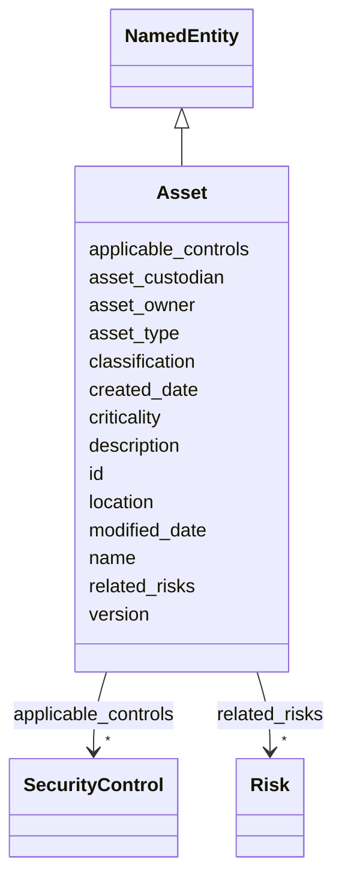

```mermaid
 classDiagram
    class Asset
    click Asset href "../Asset"
      NamedEntity <|-- Asset
        click NamedEntity href "../NamedEntity"
      
      Asset : applicable_controls
        
          
    
        
        
        Asset --> "*" SecurityControl : applicable_controls
        click SecurityControl href "../SecurityControl"
    

        
      Asset : asset_custodian
        
      Asset : asset_owner
        
      Asset : asset_type
        
      Asset : classification
        
      Asset : created_date
        
      Asset : criticality
        
      Asset : description
        
      Asset : id
        
      Asset : location
        
      Asset : modified_date
        
      Asset : name
        
      Asset : related_risks
        
          
    
        
        
        Asset --> "*" Risk : related_risks
        click Risk href "../Risk"
    

        
      Asset : version
        
      
```
