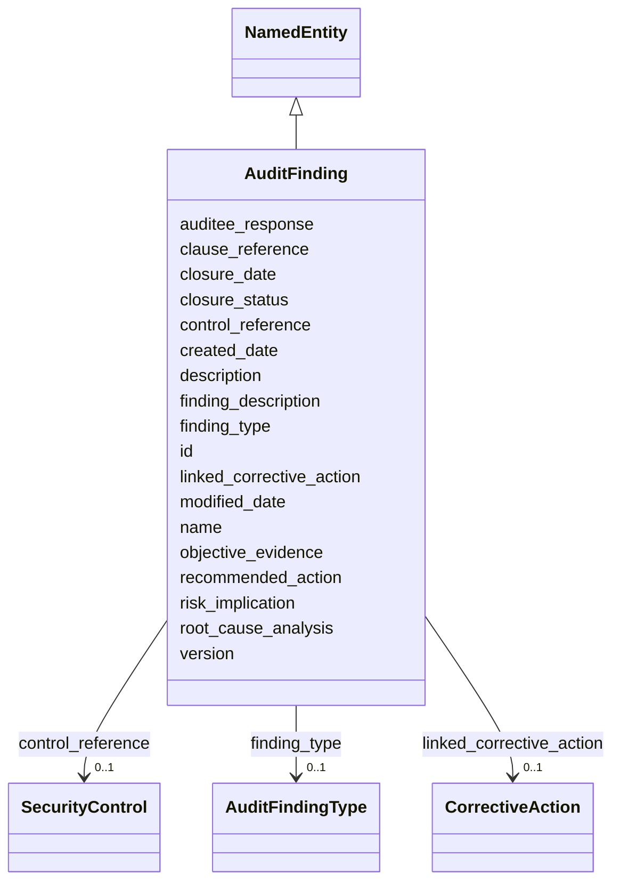

```mermaid
 classDiagram
    class AuditFinding
    click AuditFinding href "../AuditFinding"
      NamedEntity <|-- AuditFinding
        click NamedEntity href "../NamedEntity"
      
      AuditFinding : auditee_response
        
      AuditFinding : clause_reference
        
      AuditFinding : closure_date
        
      AuditFinding : closure_status
        
      AuditFinding : control_reference
        
          
    
        
        
        AuditFinding --> "0..1" SecurityControl : control_reference
        click SecurityControl href "../SecurityControl"
    

        
      AuditFinding : created_date
        
      AuditFinding : description
        
      AuditFinding : finding_description
        
      AuditFinding : finding_type
        
          
    
        
        
        AuditFinding --> "0..1" AuditFindingType : finding_type
        click AuditFindingType href "../AuditFindingType"
    

        
      AuditFinding : id
        
      AuditFinding : linked_corrective_action
        
          
    
        
        
        AuditFinding --> "0..1" CorrectiveAction : linked_corrective_action
        click CorrectiveAction href "../CorrectiveAction"
    

        
      AuditFinding : modified_date
        
      AuditFinding : name
        
      AuditFinding : objective_evidence
        
      AuditFinding : recommended_action
        
      AuditFinding : risk_implication
        
      AuditFinding : root_cause_analysis
        
      AuditFinding : version
        
      
```
