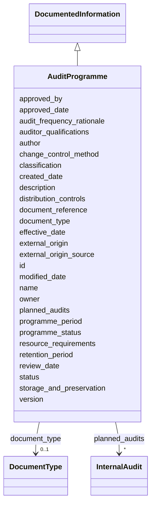

```mermaid
 classDiagram
    class AuditProgramme
    click AuditProgramme href "../AuditProgramme"
      DocumentedInformation <|-- AuditProgramme
        click DocumentedInformation href "../DocumentedInformation"
      
      AuditProgramme : approved_by
        
      AuditProgramme : approved_date
        
      AuditProgramme : audit_frequency_rationale
        
      AuditProgramme : auditor_qualifications
        
      AuditProgramme : author
        
      AuditProgramme : change_control_method
        
      AuditProgramme : classification
        
      AuditProgramme : created_date
        
      AuditProgramme : description
        
      AuditProgramme : distribution_controls
        
      AuditProgramme : document_reference
        
      AuditProgramme : document_type
        
          
    
        
        
        AuditProgramme --> "0..1" DocumentType : document_type
        click DocumentType href "../DocumentType"
    

        
      AuditProgramme : effective_date
        
      AuditProgramme : external_origin
        
      AuditProgramme : external_origin_source
        
      AuditProgramme : id
        
      AuditProgramme : modified_date
        
      AuditProgramme : name
        
      AuditProgramme : owner
        
      AuditProgramme : planned_audits
        
          
    
        
        
        AuditProgramme --> "*" InternalAudit : planned_audits
        click InternalAudit href "../InternalAudit"
    

        
      AuditProgramme : programme_period
        
      AuditProgramme : programme_status
        
      AuditProgramme : resource_requirements
        
      AuditProgramme : retention_period
        
      AuditProgramme : review_date
        
      AuditProgramme : status
        
      AuditProgramme : storage_and_preservation
        
      AuditProgramme : version
        
      
```
