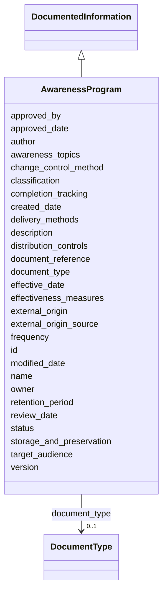

```mermaid
 classDiagram
    class AwarenessProgram
    click AwarenessProgram href "../AwarenessProgram"
      DocumentedInformation <|-- AwarenessProgram
        click DocumentedInformation href "../DocumentedInformation"
      
      AwarenessProgram : approved_by
        
      AwarenessProgram : approved_date
        
      AwarenessProgram : author
        
      AwarenessProgram : awareness_topics
        
      AwarenessProgram : change_control_method
        
      AwarenessProgram : classification
        
      AwarenessProgram : completion_tracking
        
      AwarenessProgram : created_date
        
      AwarenessProgram : delivery_methods
        
      AwarenessProgram : description
        
      AwarenessProgram : distribution_controls
        
      AwarenessProgram : document_reference
        
      AwarenessProgram : document_type
        
          
    
        
        
        AwarenessProgram --> "0..1" DocumentType : document_type
        click DocumentType href "../DocumentType"
    

        
      AwarenessProgram : effective_date
        
      AwarenessProgram : effectiveness_measures
        
      AwarenessProgram : external_origin
        
      AwarenessProgram : external_origin_source
        
      AwarenessProgram : frequency
        
      AwarenessProgram : id
        
      AwarenessProgram : modified_date
        
      AwarenessProgram : name
        
      AwarenessProgram : owner
        
      AwarenessProgram : retention_period
        
      AwarenessProgram : review_date
        
      AwarenessProgram : status
        
      AwarenessProgram : storage_and_preservation
        
      AwarenessProgram : target_audience
        
      AwarenessProgram : version
        
      
```
