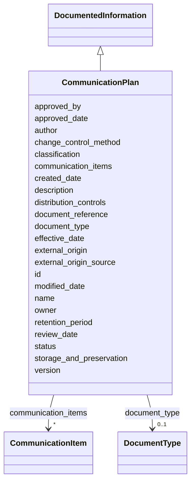

```mermaid
 classDiagram
    class CommunicationPlan
    click CommunicationPlan href "../CommunicationPlan"
      DocumentedInformation <|-- CommunicationPlan
        click DocumentedInformation href "../DocumentedInformation"
      
      CommunicationPlan : approved_by
        
      CommunicationPlan : approved_date
        
      CommunicationPlan : author
        
      CommunicationPlan : change_control_method
        
      CommunicationPlan : classification
        
      CommunicationPlan : communication_items
        
          
    
        
        
        CommunicationPlan --> "*" CommunicationItem : communication_items
        click CommunicationItem href "../CommunicationItem"
    

        
      CommunicationPlan : created_date
        
      CommunicationPlan : description
        
      CommunicationPlan : distribution_controls
        
      CommunicationPlan : document_reference
        
      CommunicationPlan : document_type
        
          
    
        
        
        CommunicationPlan --> "0..1" DocumentType : document_type
        click DocumentType href "../DocumentType"
    

        
      CommunicationPlan : effective_date
        
      CommunicationPlan : external_origin
        
      CommunicationPlan : external_origin_source
        
      CommunicationPlan : id
        
      CommunicationPlan : modified_date
        
      CommunicationPlan : name
        
      CommunicationPlan : owner
        
      CommunicationPlan : retention_period
        
      CommunicationPlan : review_date
        
      CommunicationPlan : status
        
      CommunicationPlan : storage_and_preservation
        
      CommunicationPlan : version
        
      
```
