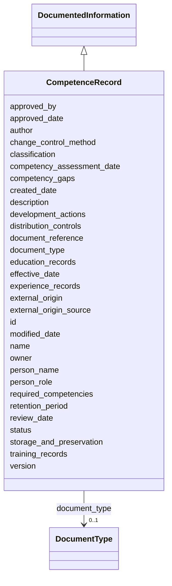

```mermaid
 classDiagram
    class CompetenceRecord
    click CompetenceRecord href "../CompetenceRecord"
      DocumentedInformation <|-- CompetenceRecord
        click DocumentedInformation href "../DocumentedInformation"
      
      CompetenceRecord : approved_by
        
      CompetenceRecord : approved_date
        
      CompetenceRecord : author
        
      CompetenceRecord : change_control_method
        
      CompetenceRecord : classification
        
      CompetenceRecord : competency_assessment_date
        
      CompetenceRecord : competency_gaps
        
      CompetenceRecord : created_date
        
      CompetenceRecord : description
        
      CompetenceRecord : development_actions
        
      CompetenceRecord : distribution_controls
        
      CompetenceRecord : document_reference
        
      CompetenceRecord : document_type
        
          
    
        
        
        CompetenceRecord --> "0..1" DocumentType : document_type
        click DocumentType href "../DocumentType"
    

        
      CompetenceRecord : education_records
        
      CompetenceRecord : effective_date
        
      CompetenceRecord : experience_records
        
      CompetenceRecord : external_origin
        
      CompetenceRecord : external_origin_source
        
      CompetenceRecord : id
        
      CompetenceRecord : modified_date
        
      CompetenceRecord : name
        
      CompetenceRecord : owner
        
      CompetenceRecord : person_name
        
      CompetenceRecord : person_role
        
      CompetenceRecord : required_competencies
        
      CompetenceRecord : retention_period
        
      CompetenceRecord : review_date
        
      CompetenceRecord : status
        
      CompetenceRecord : storage_and_preservation
        
      CompetenceRecord : training_records
        
      CompetenceRecord : version
        
      
```
