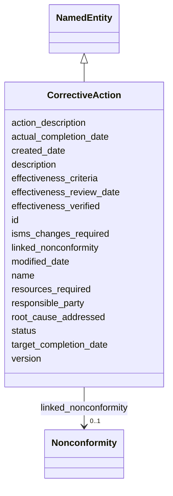

```mermaid
 classDiagram
    class CorrectiveAction
    click CorrectiveAction href "../CorrectiveAction"
      NamedEntity <|-- CorrectiveAction
        click NamedEntity href "../NamedEntity"
      
      CorrectiveAction : action_description
        
      CorrectiveAction : actual_completion_date
        
      CorrectiveAction : created_date
        
      CorrectiveAction : description
        
      CorrectiveAction : effectiveness_criteria
        
      CorrectiveAction : effectiveness_review_date
        
      CorrectiveAction : effectiveness_verified
        
      CorrectiveAction : id
        
      CorrectiveAction : isms_changes_required
        
      CorrectiveAction : linked_nonconformity
        
          
    
        
        
        CorrectiveAction --> "0..1" Nonconformity : linked_nonconformity
        click Nonconformity href "../Nonconformity"
    

        
      CorrectiveAction : modified_date
        
      CorrectiveAction : name
        
      CorrectiveAction : resources_required
        
      CorrectiveAction : responsible_party
        
      CorrectiveAction : root_cause_addressed
        
      CorrectiveAction : status
        
      CorrectiveAction : target_completion_date
        
      CorrectiveAction : version
        
      
```
