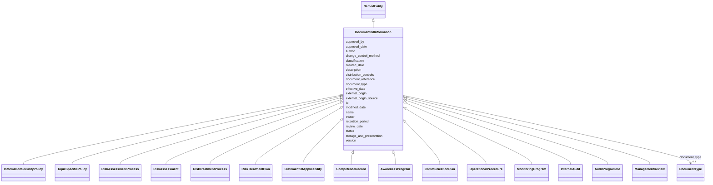

```mermaid
 classDiagram
    class DocumentedInformation
    click DocumentedInformation href "../DocumentedInformation"
      NamedEntity <|-- DocumentedInformation
        click NamedEntity href "../NamedEntity"
      

      DocumentedInformation <|-- InformationSecurityPolicy
        click InformationSecurityPolicy href "../InformationSecurityPolicy"
      DocumentedInformation <|-- TopicSpecificPolicy
        click TopicSpecificPolicy href "../TopicSpecificPolicy"
      DocumentedInformation <|-- RiskAssessmentProcess
        click RiskAssessmentProcess href "../RiskAssessmentProcess"
      DocumentedInformation <|-- RiskAssessment
        click RiskAssessment href "../RiskAssessment"
      DocumentedInformation <|-- RiskTreatmentProcess
        click RiskTreatmentProcess href "../RiskTreatmentProcess"
      DocumentedInformation <|-- RiskTreatmentPlan
        click RiskTreatmentPlan href "../RiskTreatmentPlan"
      DocumentedInformation <|-- StatementOfApplicability
        click StatementOfApplicability href "../StatementOfApplicability"
      DocumentedInformation <|-- CompetenceRecord
        click CompetenceRecord href "../CompetenceRecord"
      DocumentedInformation <|-- AwarenessProgram
        click AwarenessProgram href "../AwarenessProgram"
      DocumentedInformation <|-- CommunicationPlan
        click CommunicationPlan href "../CommunicationPlan"
      DocumentedInformation <|-- OperationalProcedure
        click OperationalProcedure href "../OperationalProcedure"
      DocumentedInformation <|-- MonitoringProgram
        click MonitoringProgram href "../MonitoringProgram"
      DocumentedInformation <|-- InternalAudit
        click InternalAudit href "../InternalAudit"
      DocumentedInformation <|-- AuditProgramme
        click AuditProgramme href "../AuditProgramme"
      DocumentedInformation <|-- ManagementReview
        click ManagementReview href "../ManagementReview"
      

      DocumentedInformation : approved_by
        
      DocumentedInformation : approved_date
        
      DocumentedInformation : author
        
      DocumentedInformation : change_control_method
        
      DocumentedInformation : classification
        
      DocumentedInformation : created_date
        
      DocumentedInformation : description
        
      DocumentedInformation : distribution_controls
        
      DocumentedInformation : document_reference
        
      DocumentedInformation : document_type
        
          
    
        
        
        DocumentedInformation --> "0..1" DocumentType : document_type
        click DocumentType href "../DocumentType"
    

        
      DocumentedInformation : effective_date
        
      DocumentedInformation : external_origin
        
      DocumentedInformation : external_origin_source
        
      DocumentedInformation : id
        
      DocumentedInformation : modified_date
        
      DocumentedInformation : name
        
      DocumentedInformation : owner
        
      DocumentedInformation : retention_period
        
      DocumentedInformation : review_date
        
      DocumentedInformation : status
        
      DocumentedInformation : storage_and_preservation
        
      DocumentedInformation : version
        
      
```
