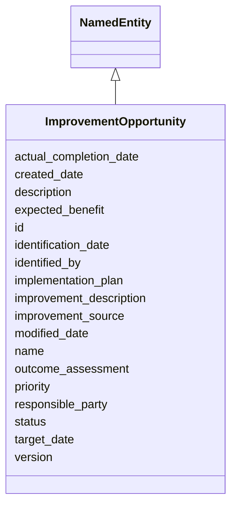

```mermaid
 classDiagram
    class ImprovementOpportunity
    click ImprovementOpportunity href "../ImprovementOpportunity"
      NamedEntity <|-- ImprovementOpportunity
        click NamedEntity href "../NamedEntity"
      
      ImprovementOpportunity : actual_completion_date
        
      ImprovementOpportunity : created_date
        
      ImprovementOpportunity : description
        
      ImprovementOpportunity : expected_benefit
        
      ImprovementOpportunity : id
        
      ImprovementOpportunity : identification_date
        
      ImprovementOpportunity : identified_by
        
      ImprovementOpportunity : implementation_plan
        
      ImprovementOpportunity : improvement_description
        
      ImprovementOpportunity : improvement_source
        
      ImprovementOpportunity : modified_date
        
      ImprovementOpportunity : name
        
      ImprovementOpportunity : outcome_assessment
        
      ImprovementOpportunity : priority
        
      ImprovementOpportunity : responsible_party
        
      ImprovementOpportunity : status
        
      ImprovementOpportunity : target_date
        
      ImprovementOpportunity : version
        
      
```
