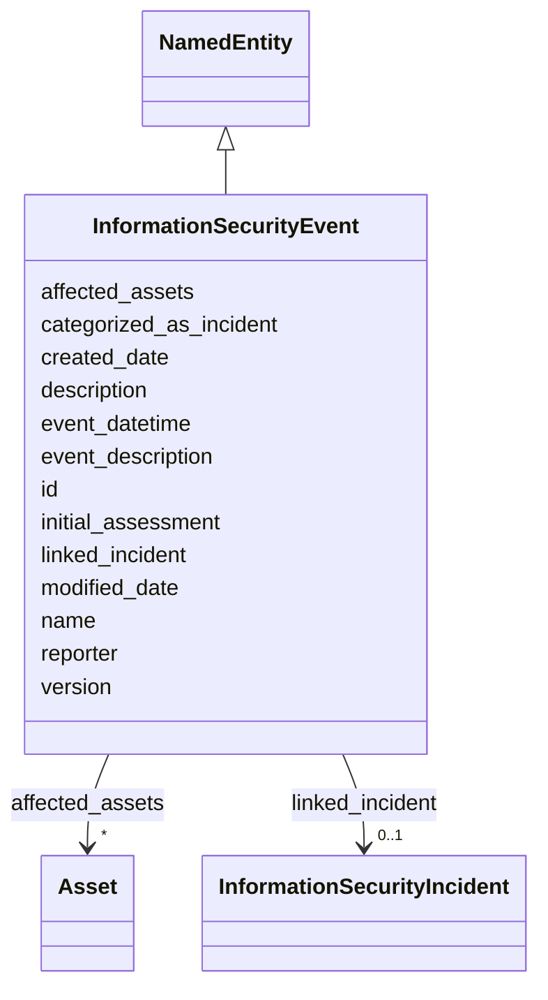

```mermaid
 classDiagram
    class InformationSecurityEvent
    click InformationSecurityEvent href "../InformationSecurityEvent"
      NamedEntity <|-- InformationSecurityEvent
        click NamedEntity href "../NamedEntity"
      
      InformationSecurityEvent : affected_assets
        
          
    
        
        
        InformationSecurityEvent --> "*" Asset : affected_assets
        click Asset href "../Asset"
    

        
      InformationSecurityEvent : categorized_as_incident
        
      InformationSecurityEvent : created_date
        
      InformationSecurityEvent : description
        
      InformationSecurityEvent : event_datetime
        
      InformationSecurityEvent : event_description
        
      InformationSecurityEvent : id
        
      InformationSecurityEvent : initial_assessment
        
      InformationSecurityEvent : linked_incident
        
          
    
        
        
        InformationSecurityEvent --> "0..1" InformationSecurityIncident : linked_incident
        click InformationSecurityIncident href "../InformationSecurityIncident"
    

        
      InformationSecurityEvent : modified_date
        
      InformationSecurityEvent : name
        
      InformationSecurityEvent : reporter
        
      InformationSecurityEvent : version
        
      
```
