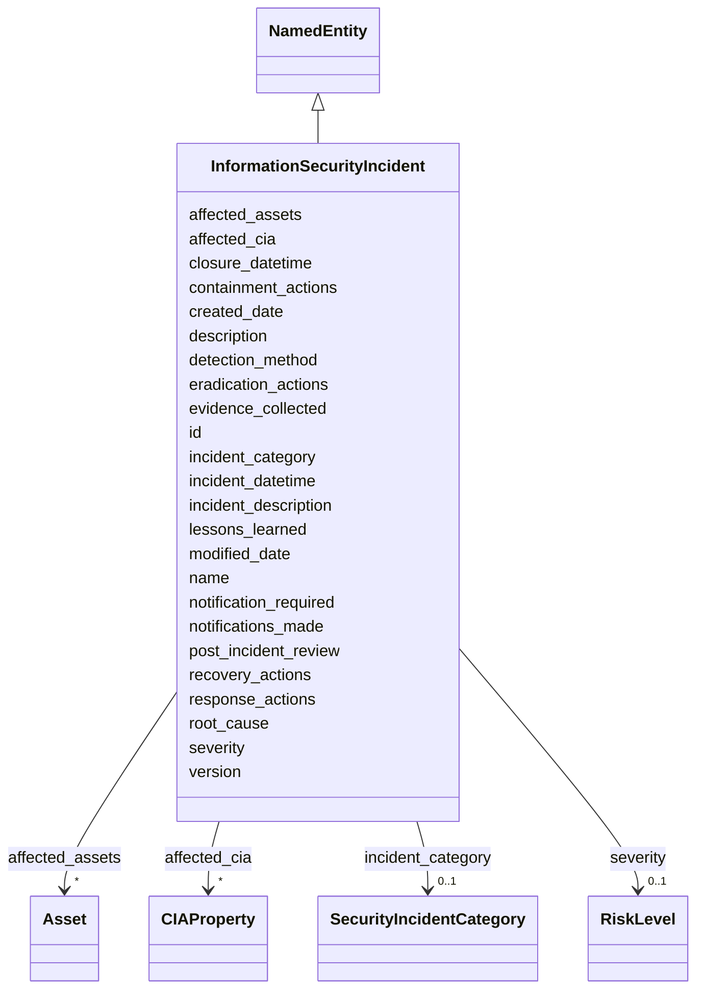

```mermaid
 classDiagram
    class InformationSecurityIncident
    click InformationSecurityIncident href "../InformationSecurityIncident"
      NamedEntity <|-- InformationSecurityIncident
        click NamedEntity href "../NamedEntity"
      
      InformationSecurityIncident : affected_assets
        
          
    
        
        
        InformationSecurityIncident --> "*" Asset : affected_assets
        click Asset href "../Asset"
    

        
      InformationSecurityIncident : affected_cia
        
          
    
        
        
        InformationSecurityIncident --> "*" CIAProperty : affected_cia
        click CIAProperty href "../CIAProperty"
    

        
      InformationSecurityIncident : closure_datetime
        
      InformationSecurityIncident : containment_actions
        
      InformationSecurityIncident : created_date
        
      InformationSecurityIncident : description
        
      InformationSecurityIncident : detection_method
        
      InformationSecurityIncident : eradication_actions
        
      InformationSecurityIncident : evidence_collected
        
      InformationSecurityIncident : id
        
      InformationSecurityIncident : incident_category
        
          
    
        
        
        InformationSecurityIncident --> "0..1" SecurityIncidentCategory : incident_category
        click SecurityIncidentCategory href "../SecurityIncidentCategory"
    

        
      InformationSecurityIncident : incident_datetime
        
      InformationSecurityIncident : incident_description
        
      InformationSecurityIncident : lessons_learned
        
      InformationSecurityIncident : modified_date
        
      InformationSecurityIncident : name
        
      InformationSecurityIncident : notification_required
        
      InformationSecurityIncident : notifications_made
        
      InformationSecurityIncident : post_incident_review
        
      InformationSecurityIncident : recovery_actions
        
      InformationSecurityIncident : response_actions
        
      InformationSecurityIncident : root_cause
        
      InformationSecurityIncident : severity
        
          
    
        
        
        InformationSecurityIncident --> "0..1" RiskLevel : severity
        click RiskLevel href "../RiskLevel"
    

        
      InformationSecurityIncident : version
        
      
```
