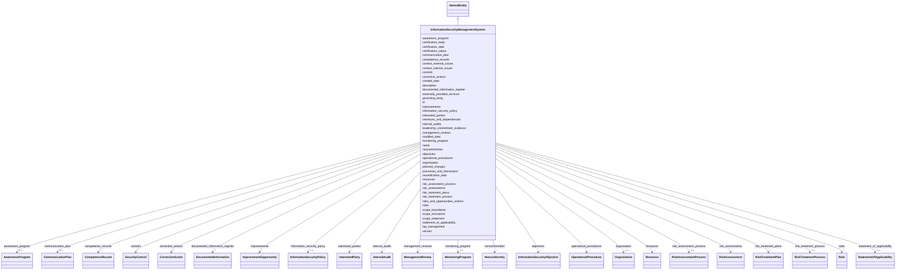

```mermaid
 classDiagram
    class InformationSecurityManagementSystem
    click InformationSecurityManagementSystem href "../InformationSecurityManagementSystem"
      NamedEntity <|-- InformationSecurityManagementSystem
        click NamedEntity href "../NamedEntity"
      
      InformationSecurityManagementSystem : awareness_program
        
          
    
        
        
        InformationSecurityManagementSystem --> "0..1" AwarenessProgram : awareness_program
        click AwarenessProgram href "../AwarenessProgram"
    

        
      InformationSecurityManagementSystem : certification_body
        
      InformationSecurityManagementSystem : certification_date
        
      InformationSecurityManagementSystem : certification_status
        
      InformationSecurityManagementSystem : communication_plan
        
          
    
        
        
        InformationSecurityManagementSystem --> "0..1" CommunicationPlan : communication_plan
        click CommunicationPlan href "../CommunicationPlan"
    

        
      InformationSecurityManagementSystem : competence_records
        
          
    
        
        
        InformationSecurityManagementSystem --> "*" CompetenceRecord : competence_records
        click CompetenceRecord href "../CompetenceRecord"
    

        
      InformationSecurityManagementSystem : context_external_issues
        
      InformationSecurityManagementSystem : context_internal_issues
        
      InformationSecurityManagementSystem : controls
        
          
    
        
        
        InformationSecurityManagementSystem --> "*" SecurityControl : controls
        click SecurityControl href "../SecurityControl"
    

        
      InformationSecurityManagementSystem : corrective_actions
        
          
    
        
        
        InformationSecurityManagementSystem --> "*" CorrectiveAction : corrective_actions
        click CorrectiveAction href "../CorrectiveAction"
    

        
      InformationSecurityManagementSystem : created_date
        
      InformationSecurityManagementSystem : description
        
      InformationSecurityManagementSystem : documented_information_register
        
          
    
        
        
        InformationSecurityManagementSystem --> "*" DocumentedInformation : documented_information_register
        click DocumentedInformation href "../DocumentedInformation"
    

        
      InformationSecurityManagementSystem : externally_provided_services
        
      InformationSecurityManagementSystem : governing_body
        
      InformationSecurityManagementSystem : id
        
      InformationSecurityManagementSystem : improvements
        
          
    
        
        
        InformationSecurityManagementSystem --> "*" ImprovementOpportunity : improvements
        click ImprovementOpportunity href "../ImprovementOpportunity"
    

        
      InformationSecurityManagementSystem : information_security_policy
        
          
    
        
        
        InformationSecurityManagementSystem --> "0..1" InformationSecurityPolicy : information_security_policy
        click InformationSecurityPolicy href "../InformationSecurityPolicy"
    

        
      InformationSecurityManagementSystem : interested_parties
        
          
    
        
        
        InformationSecurityManagementSystem --> "*" InterestedParty : interested_parties
        click InterestedParty href "../InterestedParty"
    

        
      InformationSecurityManagementSystem : interfaces_and_dependencies
        
      InformationSecurityManagementSystem : internal_audits
        
          
    
        
        
        InformationSecurityManagementSystem --> "*" InternalAudit : internal_audits
        click InternalAudit href "../InternalAudit"
    

        
      InformationSecurityManagementSystem : leadership_commitment_evidence
        
      InformationSecurityManagementSystem : management_reviews
        
          
    
        
        
        InformationSecurityManagementSystem --> "*" ManagementReview : management_reviews
        click ManagementReview href "../ManagementReview"
    

        
      InformationSecurityManagementSystem : modified_date
        
      InformationSecurityManagementSystem : monitoring_program
        
          
    
        
        
        InformationSecurityManagementSystem --> "0..1" MonitoringProgram : monitoring_program
        click MonitoringProgram href "../MonitoringProgram"
    

        
      InformationSecurityManagementSystem : name
        
      InformationSecurityManagementSystem : nonconformities
        
          
    
        
        
        InformationSecurityManagementSystem --> "*" Nonconformity : nonconformities
        click Nonconformity href "../Nonconformity"
    

        
      InformationSecurityManagementSystem : objectives
        
          
    
        
        
        InformationSecurityManagementSystem --> "*" InformationSecurityObjective : objectives
        click InformationSecurityObjective href "../InformationSecurityObjective"
    

        
      InformationSecurityManagementSystem : operational_procedures
        
          
    
        
        
        InformationSecurityManagementSystem --> "*" OperationalProcedure : operational_procedures
        click OperationalProcedure href "../OperationalProcedure"
    

        
      InformationSecurityManagementSystem : organization
        
          
    
        
        
        InformationSecurityManagementSystem --> "0..1" Organization : organization
        click Organization href "../Organization"
    

        
      InformationSecurityManagementSystem : planned_changes
        
      InformationSecurityManagementSystem : processes_and_interactions
        
      InformationSecurityManagementSystem : recertification_date
        
      InformationSecurityManagementSystem : resources
        
          
    
        
        
        InformationSecurityManagementSystem --> "*" Resource : resources
        click Resource href "../Resource"
    

        
      InformationSecurityManagementSystem : risk_assessment_process
        
          
    
        
        
        InformationSecurityManagementSystem --> "0..1" RiskAssessmentProcess : risk_assessment_process
        click RiskAssessmentProcess href "../RiskAssessmentProcess"
    

        
      InformationSecurityManagementSystem : risk_assessments
        
          
    
        
        
        InformationSecurityManagementSystem --> "*" RiskAssessment : risk_assessments
        click RiskAssessment href "../RiskAssessment"
    

        
      InformationSecurityManagementSystem : risk_treatment_plans
        
          
    
        
        
        InformationSecurityManagementSystem --> "*" RiskTreatmentPlan : risk_treatment_plans
        click RiskTreatmentPlan href "../RiskTreatmentPlan"
    

        
      InformationSecurityManagementSystem : risk_treatment_process
        
          
    
        
        
        InformationSecurityManagementSystem --> "0..1" RiskTreatmentProcess : risk_treatment_process
        click RiskTreatmentProcess href "../RiskTreatmentProcess"
    

        
      InformationSecurityManagementSystem : risks_and_opportunities_actions
        
      InformationSecurityManagementSystem : roles
        
          
    
        
        
        InformationSecurityManagementSystem --> "*" Role : roles
        click Role href "../Role"
    

        
      InformationSecurityManagementSystem : scope_boundaries
        
      InformationSecurityManagementSystem : scope_exclusions
        
      InformationSecurityManagementSystem : scope_statement
        
      InformationSecurityManagementSystem : statement_of_applicability
        
          
    
        
        
        InformationSecurityManagementSystem --> "0..1" StatementOfApplicability : statement_of_applicability
        click StatementOfApplicability href "../StatementOfApplicability"
    

        
      InformationSecurityManagementSystem : top_management
        
      InformationSecurityManagementSystem : version
        
      
```
