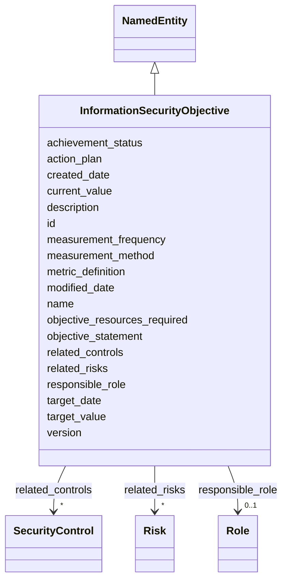

```mermaid
 classDiagram
    class InformationSecurityObjective
    click InformationSecurityObjective href "../InformationSecurityObjective"
      NamedEntity <|-- InformationSecurityObjective
        click NamedEntity href "../NamedEntity"
      
      InformationSecurityObjective : achievement_status
        
      InformationSecurityObjective : action_plan
        
      InformationSecurityObjective : created_date
        
      InformationSecurityObjective : current_value
        
      InformationSecurityObjective : description
        
      InformationSecurityObjective : id
        
      InformationSecurityObjective : measurement_frequency
        
      InformationSecurityObjective : measurement_method
        
      InformationSecurityObjective : metric_definition
        
      InformationSecurityObjective : modified_date
        
      InformationSecurityObjective : name
        
      InformationSecurityObjective : objective_resources_required
        
      InformationSecurityObjective : objective_statement
        
      InformationSecurityObjective : related_controls
        
          
    
        
        
        InformationSecurityObjective --> "*" SecurityControl : related_controls
        click SecurityControl href "../SecurityControl"
    

        
      InformationSecurityObjective : related_risks
        
          
    
        
        
        InformationSecurityObjective --> "*" Risk : related_risks
        click Risk href "../Risk"
    

        
      InformationSecurityObjective : responsible_role
        
          
    
        
        
        InformationSecurityObjective --> "0..1" Role : responsible_role
        click Role href "../Role"
    

        
      InformationSecurityObjective : target_date
        
      InformationSecurityObjective : target_value
        
      InformationSecurityObjective : version
        
      
```
