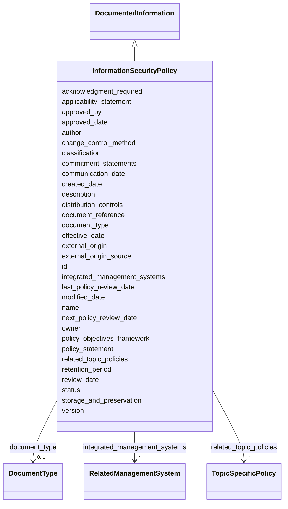

```mermaid
 classDiagram
    class InformationSecurityPolicy
    click InformationSecurityPolicy href "../InformationSecurityPolicy"
      DocumentedInformation <|-- InformationSecurityPolicy
        click DocumentedInformation href "../DocumentedInformation"
      
      InformationSecurityPolicy : acknowledgment_required
        
      InformationSecurityPolicy : applicability_statement
        
      InformationSecurityPolicy : approved_by
        
      InformationSecurityPolicy : approved_date
        
      InformationSecurityPolicy : author
        
      InformationSecurityPolicy : change_control_method
        
      InformationSecurityPolicy : classification
        
      InformationSecurityPolicy : commitment_statements
        
      InformationSecurityPolicy : communication_date
        
      InformationSecurityPolicy : created_date
        
      InformationSecurityPolicy : description
        
      InformationSecurityPolicy : distribution_controls
        
      InformationSecurityPolicy : document_reference
        
      InformationSecurityPolicy : document_type
        
          
    
        
        
        InformationSecurityPolicy --> "0..1" DocumentType : document_type
        click DocumentType href "../DocumentType"
    

        
      InformationSecurityPolicy : effective_date
        
      InformationSecurityPolicy : external_origin
        
      InformationSecurityPolicy : external_origin_source
        
      InformationSecurityPolicy : id
        
      InformationSecurityPolicy : integrated_management_systems
        
          
    
        
        
        InformationSecurityPolicy --> "*" RelatedManagementSystem : integrated_management_systems
        click RelatedManagementSystem href "../RelatedManagementSystem"
    

        
      InformationSecurityPolicy : last_policy_review_date
        
      InformationSecurityPolicy : modified_date
        
      InformationSecurityPolicy : name
        
      InformationSecurityPolicy : next_policy_review_date
        
      InformationSecurityPolicy : owner
        
      InformationSecurityPolicy : policy_objectives_framework
        
      InformationSecurityPolicy : policy_statement
        
      InformationSecurityPolicy : related_topic_policies
        
          
    
        
        
        InformationSecurityPolicy --> "*" TopicSpecificPolicy : related_topic_policies
        click TopicSpecificPolicy href "../TopicSpecificPolicy"
    

        
      InformationSecurityPolicy : retention_period
        
      InformationSecurityPolicy : review_date
        
      InformationSecurityPolicy : status
        
      InformationSecurityPolicy : storage_and_preservation
        
      InformationSecurityPolicy : version
        
      
```
