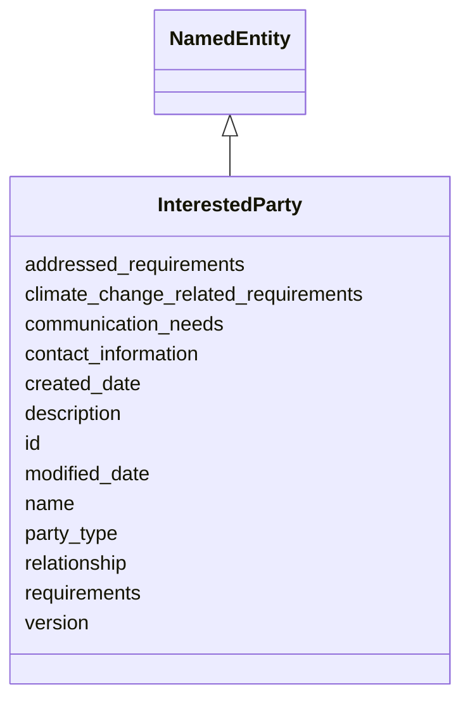

```mermaid
 classDiagram
    class InterestedParty
    click InterestedParty href "../InterestedParty"
      NamedEntity <|-- InterestedParty
        click NamedEntity href "../NamedEntity"
      
      InterestedParty : addressed_requirements
        
      InterestedParty : climate_change_related_requirements
        
      InterestedParty : communication_needs
        
      InterestedParty : contact_information
        
      InterestedParty : created_date
        
      InterestedParty : description
        
      InterestedParty : id
        
      InterestedParty : modified_date
        
      InterestedParty : name
        
      InterestedParty : party_type
        
      InterestedParty : relationship
        
      InterestedParty : requirements
        
      InterestedParty : version
        
      
```
