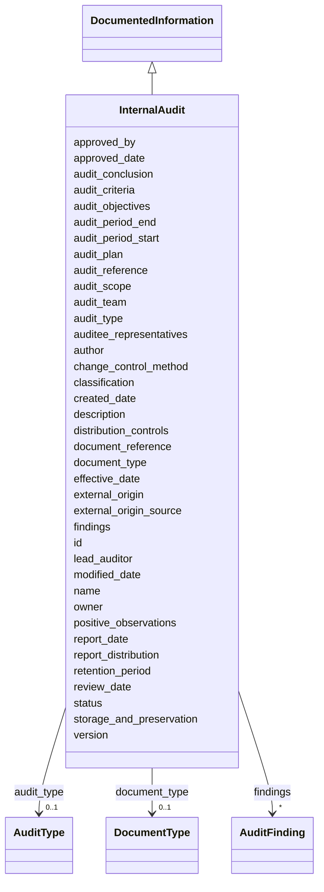

```mermaid
 classDiagram
    class InternalAudit
    click InternalAudit href "../InternalAudit"
      DocumentedInformation <|-- InternalAudit
        click DocumentedInformation href "../DocumentedInformation"
      
      InternalAudit : approved_by
        
      InternalAudit : approved_date
        
      InternalAudit : audit_conclusion
        
      InternalAudit : audit_criteria
        
      InternalAudit : audit_objectives
        
      InternalAudit : audit_period_end
        
      InternalAudit : audit_period_start
        
      InternalAudit : audit_plan
        
      InternalAudit : audit_reference
        
      InternalAudit : audit_scope
        
      InternalAudit : audit_team
        
      InternalAudit : audit_type
        
          
    
        
        
        InternalAudit --> "0..1" AuditType : audit_type
        click AuditType href "../AuditType"
    

        
      InternalAudit : auditee_representatives
        
      InternalAudit : author
        
      InternalAudit : change_control_method
        
      InternalAudit : classification
        
      InternalAudit : created_date
        
      InternalAudit : description
        
      InternalAudit : distribution_controls
        
      InternalAudit : document_reference
        
      InternalAudit : document_type
        
          
    
        
        
        InternalAudit --> "0..1" DocumentType : document_type
        click DocumentType href "../DocumentType"
    

        
      InternalAudit : effective_date
        
      InternalAudit : external_origin
        
      InternalAudit : external_origin_source
        
      InternalAudit : findings
        
          
    
        
        
        InternalAudit --> "*" AuditFinding : findings
        click AuditFinding href "../AuditFinding"
    

        
      InternalAudit : id
        
      InternalAudit : lead_auditor
        
      InternalAudit : modified_date
        
      InternalAudit : name
        
      InternalAudit : owner
        
      InternalAudit : positive_observations
        
      InternalAudit : report_date
        
      InternalAudit : report_distribution
        
      InternalAudit : retention_period
        
      InternalAudit : review_date
        
      InternalAudit : status
        
      InternalAudit : storage_and_preservation
        
      InternalAudit : version
        
      
```
