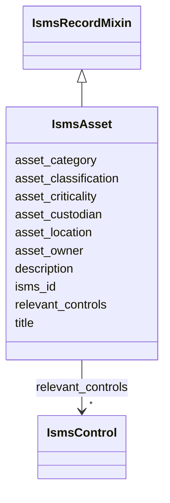

```mermaid
 classDiagram
    class IsmsAsset
    click IsmsAsset href "../IsmsAsset"
      IsmsRecordMixin <|-- IsmsAsset
        click IsmsRecordMixin href "../IsmsRecordMixin"
      
      IsmsAsset : asset_category
        
      IsmsAsset : asset_classification
        
      IsmsAsset : asset_criticality
        
      IsmsAsset : asset_custodian
        
      IsmsAsset : asset_location
        
      IsmsAsset : asset_owner
        
      IsmsAsset : description
        
      IsmsAsset : isms_id
        
      IsmsAsset : relevant_controls
        
          
    
        
        
        IsmsAsset --> "*" IsmsControl : relevant_controls
        click IsmsControl href "../IsmsControl"
    

        
      IsmsAsset : title
        
      
```
