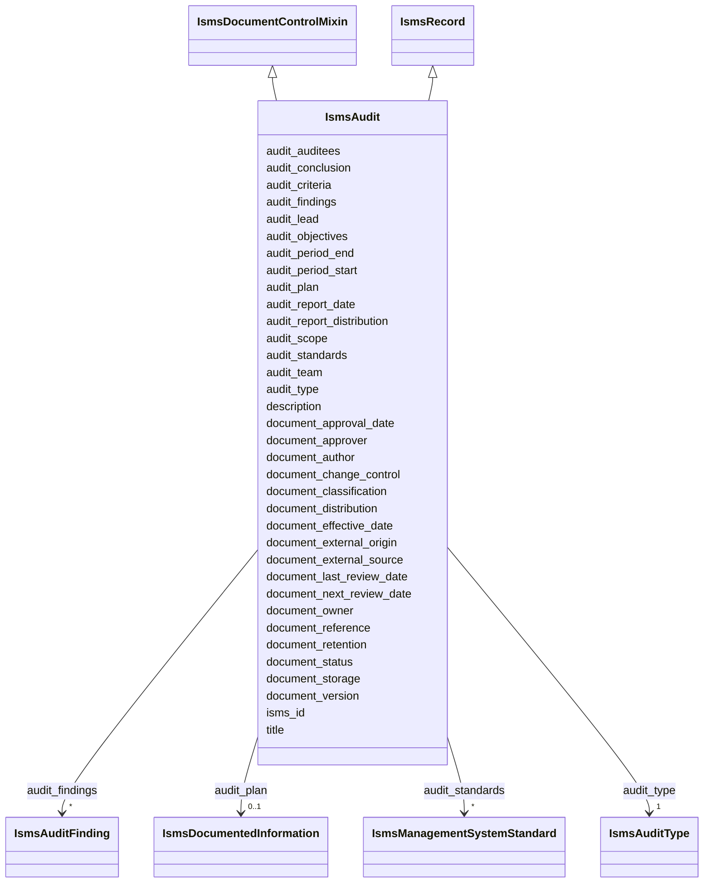

```mermaid
 classDiagram
    class IsmsAudit
    click IsmsAudit href "../IsmsAudit"
      IsmsDocumentControlMixin <|-- IsmsAudit
        click IsmsDocumentControlMixin href "../IsmsDocumentControlMixin"
      IsmsRecord <|-- IsmsAudit
        click IsmsRecord href "../IsmsRecord"
      
      IsmsAudit : audit_auditees
        
      IsmsAudit : audit_conclusion
        
      IsmsAudit : audit_criteria
        
      IsmsAudit : audit_findings
        
          
    
        
        
        IsmsAudit --> "*" IsmsAuditFinding : audit_findings
        click IsmsAuditFinding href "../IsmsAuditFinding"
    

        
      IsmsAudit : audit_lead
        
      IsmsAudit : audit_objectives
        
      IsmsAudit : audit_period_end
        
      IsmsAudit : audit_period_start
        
      IsmsAudit : audit_plan
        
          
    
        
        
        IsmsAudit --> "0..1" IsmsDocumentedInformation : audit_plan
        click IsmsDocumentedInformation href "../IsmsDocumentedInformation"
    

        
      IsmsAudit : audit_report_date
        
      IsmsAudit : audit_report_distribution
        
      IsmsAudit : audit_scope
        
      IsmsAudit : audit_standards
        
          
    
        
        
        IsmsAudit --> "*" IsmsManagementSystemStandard : audit_standards
        click IsmsManagementSystemStandard href "../IsmsManagementSystemStandard"
    

        
      IsmsAudit : audit_team
        
      IsmsAudit : audit_type
        
          
    
        
        
        IsmsAudit --> "1" IsmsAuditType : audit_type
        click IsmsAuditType href "../IsmsAuditType"
    

        
      IsmsAudit : description
        
      IsmsAudit : document_approval_date
        
      IsmsAudit : document_approver
        
      IsmsAudit : document_author
        
      IsmsAudit : document_change_control
        
      IsmsAudit : document_classification
        
      IsmsAudit : document_distribution
        
      IsmsAudit : document_effective_date
        
      IsmsAudit : document_external_origin
        
      IsmsAudit : document_external_source
        
      IsmsAudit : document_last_review_date
        
      IsmsAudit : document_next_review_date
        
      IsmsAudit : document_owner
        
      IsmsAudit : document_reference
        
      IsmsAudit : document_retention
        
      IsmsAudit : document_status
        
      IsmsAudit : document_storage
        
      IsmsAudit : document_version
        
      IsmsAudit : isms_id
        
      IsmsAudit : title
        
      
```
