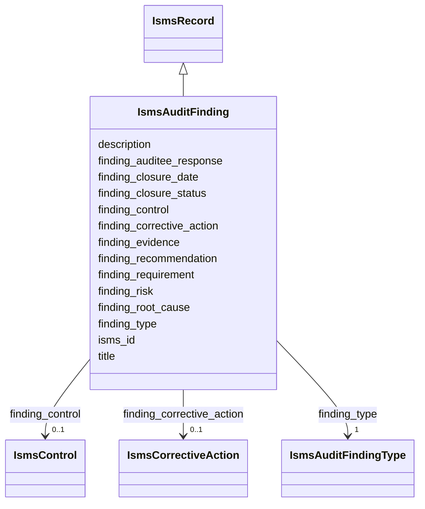

```mermaid
 classDiagram
    class IsmsAuditFinding
    click IsmsAuditFinding href "../IsmsAuditFinding"
      IsmsRecord <|-- IsmsAuditFinding
        click IsmsRecord href "../IsmsRecord"
      
      IsmsAuditFinding : description
        
      IsmsAuditFinding : finding_auditee_response
        
      IsmsAuditFinding : finding_closure_date
        
      IsmsAuditFinding : finding_closure_status
        
      IsmsAuditFinding : finding_control
        
          
    
        
        
        IsmsAuditFinding --> "0..1" IsmsControl : finding_control
        click IsmsControl href "../IsmsControl"
    

        
      IsmsAuditFinding : finding_corrective_action
        
          
    
        
        
        IsmsAuditFinding --> "0..1" IsmsCorrectiveAction : finding_corrective_action
        click IsmsCorrectiveAction href "../IsmsCorrectiveAction"
    

        
      IsmsAuditFinding : finding_evidence
        
      IsmsAuditFinding : finding_recommendation
        
      IsmsAuditFinding : finding_requirement
        
      IsmsAuditFinding : finding_risk
        
      IsmsAuditFinding : finding_root_cause
        
      IsmsAuditFinding : finding_type
        
          
    
        
        
        IsmsAuditFinding --> "1" IsmsAuditFindingType : finding_type
        click IsmsAuditFindingType href "../IsmsAuditFindingType"
    

        
      IsmsAuditFinding : isms_id
        
      IsmsAuditFinding : title
        
      
```
