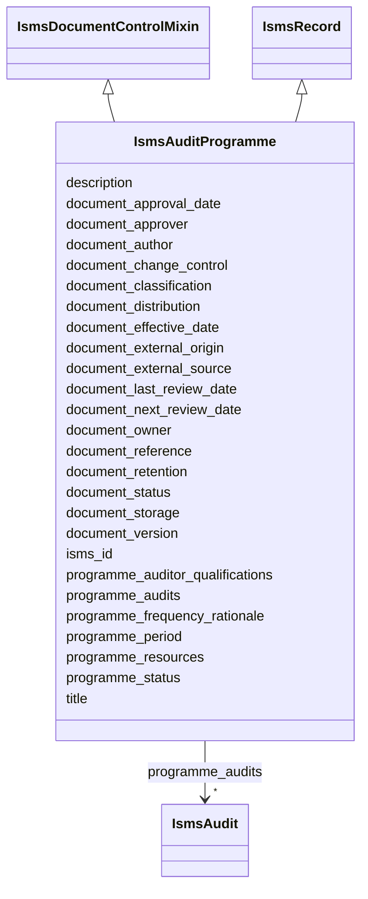

```mermaid
 classDiagram
    class IsmsAuditProgramme
    click IsmsAuditProgramme href "../IsmsAuditProgramme"
      IsmsDocumentControlMixin <|-- IsmsAuditProgramme
        click IsmsDocumentControlMixin href "../IsmsDocumentControlMixin"
      IsmsRecord <|-- IsmsAuditProgramme
        click IsmsRecord href "../IsmsRecord"
      
      IsmsAuditProgramme : description
        
      IsmsAuditProgramme : document_approval_date
        
      IsmsAuditProgramme : document_approver
        
      IsmsAuditProgramme : document_author
        
      IsmsAuditProgramme : document_change_control
        
      IsmsAuditProgramme : document_classification
        
      IsmsAuditProgramme : document_distribution
        
      IsmsAuditProgramme : document_effective_date
        
      IsmsAuditProgramme : document_external_origin
        
      IsmsAuditProgramme : document_external_source
        
      IsmsAuditProgramme : document_last_review_date
        
      IsmsAuditProgramme : document_next_review_date
        
      IsmsAuditProgramme : document_owner
        
      IsmsAuditProgramme : document_reference
        
      IsmsAuditProgramme : document_retention
        
      IsmsAuditProgramme : document_status
        
      IsmsAuditProgramme : document_storage
        
      IsmsAuditProgramme : document_version
        
      IsmsAuditProgramme : isms_id
        
      IsmsAuditProgramme : programme_auditor_qualifications
        
      IsmsAuditProgramme : programme_audits
        
          
    
        
        
        IsmsAuditProgramme --> "*" IsmsAudit : programme_audits
        click IsmsAudit href "../IsmsAudit"
    

        
      IsmsAuditProgramme : programme_frequency_rationale
        
      IsmsAuditProgramme : programme_period
        
      IsmsAuditProgramme : programme_resources
        
      IsmsAuditProgramme : programme_status
        
      IsmsAuditProgramme : title
        
      
```
