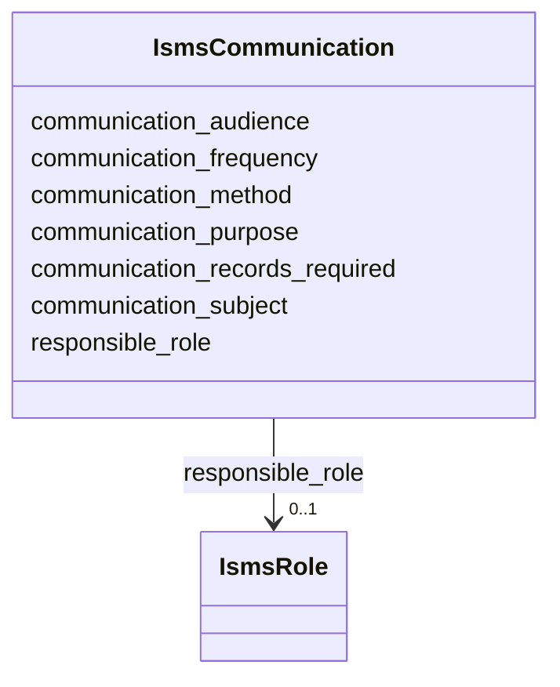

```mermaid
 classDiagram
    class IsmsCommunication
    click IsmsCommunication href "../IsmsCommunication"
      IsmsCommunication : communication_audience
        
      IsmsCommunication : communication_frequency
        
      IsmsCommunication : communication_method
        
      IsmsCommunication : communication_purpose
        
      IsmsCommunication : communication_records_required
        
      IsmsCommunication : communication_subject
        
      IsmsCommunication : responsible_role
        
          
    
        
        
        IsmsCommunication --> "0..1" IsmsRole : responsible_role
        click IsmsRole href "../IsmsRole"
    

        
      
```
