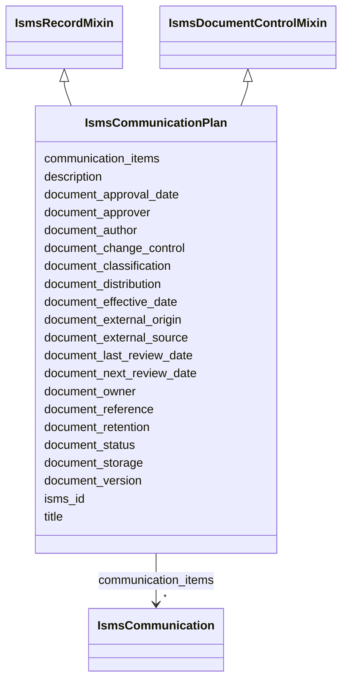

```mermaid
 classDiagram
    class IsmsCommunicationPlan
    click IsmsCommunicationPlan href "../IsmsCommunicationPlan"
      IsmsRecordMixin <|-- IsmsCommunicationPlan
        click IsmsRecordMixin href "../IsmsRecordMixin"
      IsmsDocumentControlMixin <|-- IsmsCommunicationPlan
        click IsmsDocumentControlMixin href "../IsmsDocumentControlMixin"
      
      IsmsCommunicationPlan : communication_items
        
          
    
        
        
        IsmsCommunicationPlan --> "*" IsmsCommunication : communication_items
        click IsmsCommunication href "../IsmsCommunication"
    

        
      IsmsCommunicationPlan : description
        
      IsmsCommunicationPlan : document_approval_date
        
      IsmsCommunicationPlan : document_approver
        
      IsmsCommunicationPlan : document_author
        
      IsmsCommunicationPlan : document_change_control
        
      IsmsCommunicationPlan : document_classification
        
      IsmsCommunicationPlan : document_distribution
        
      IsmsCommunicationPlan : document_effective_date
        
      IsmsCommunicationPlan : document_external_origin
        
      IsmsCommunicationPlan : document_external_source
        
      IsmsCommunicationPlan : document_last_review_date
        
      IsmsCommunicationPlan : document_next_review_date
        
      IsmsCommunicationPlan : document_owner
        
      IsmsCommunicationPlan : document_reference
        
      IsmsCommunicationPlan : document_retention
        
      IsmsCommunicationPlan : document_status
        
      IsmsCommunicationPlan : document_storage
        
      IsmsCommunicationPlan : document_version
        
      IsmsCommunicationPlan : isms_id
        
      IsmsCommunicationPlan : title
        
      
```
