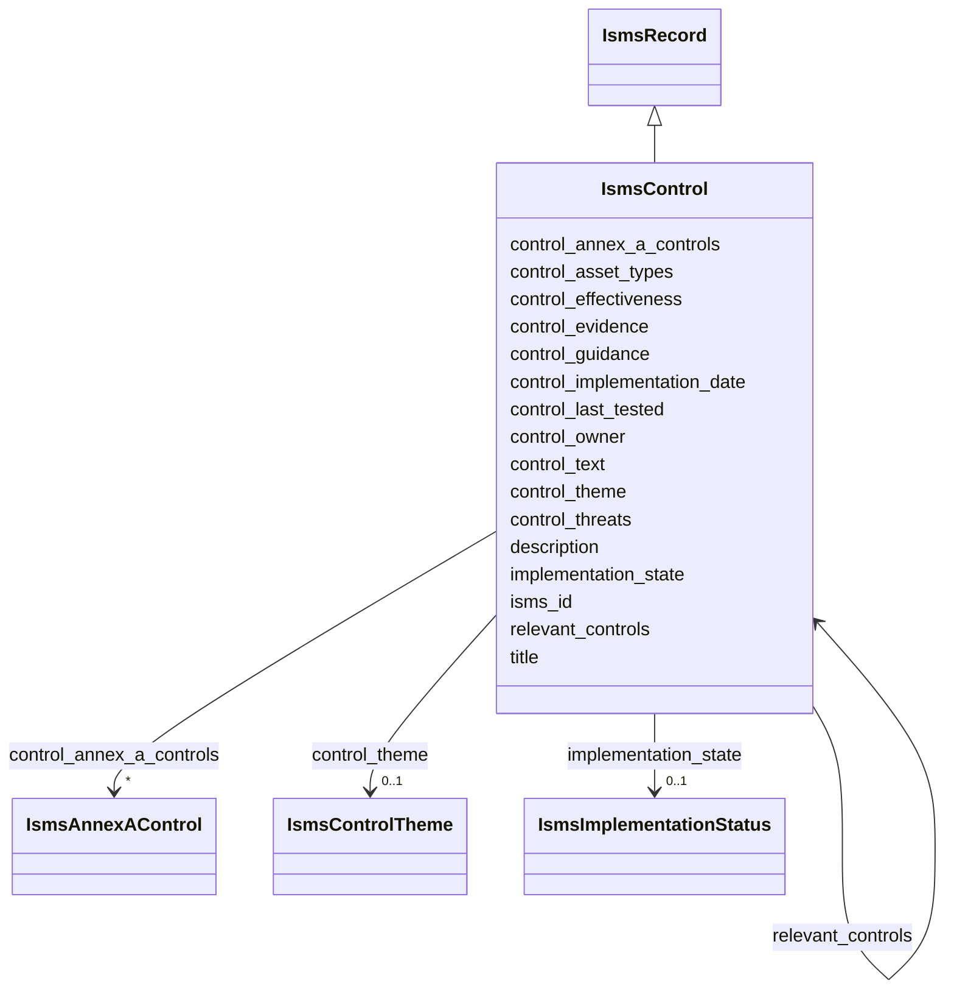

```mermaid
 classDiagram
    class IsmsControl
    click IsmsControl href "../IsmsControl"
      IsmsRecord <|-- IsmsControl
        click IsmsRecord href "../IsmsRecord"
      
      IsmsControl : control_annex_a_controls
        
          
    
        
        
        IsmsControl --> "*" IsmsAnnexAControl : control_annex_a_controls
        click IsmsAnnexAControl href "../IsmsAnnexAControl"
    

        
      IsmsControl : control_asset_types
        
      IsmsControl : control_effectiveness
        
      IsmsControl : control_evidence
        
      IsmsControl : control_guidance
        
      IsmsControl : control_implementation_date
        
      IsmsControl : control_last_tested
        
      IsmsControl : control_owner
        
      IsmsControl : control_text
        
      IsmsControl : control_theme
        
          
    
        
        
        IsmsControl --> "0..1" IsmsControlTheme : control_theme
        click IsmsControlTheme href "../IsmsControlTheme"
    

        
      IsmsControl : control_threats
        
      IsmsControl : description
        
      IsmsControl : implementation_state
        
          
    
        
        
        IsmsControl --> "0..1" IsmsImplementationStatus : implementation_state
        click IsmsImplementationStatus href "../IsmsImplementationStatus"
    

        
      IsmsControl : isms_id
        
      IsmsControl : relevant_controls
        
          
    
        
        
        IsmsControl --> "*" IsmsControl : relevant_controls
        click IsmsControl href "../IsmsControl"
    

        
      IsmsControl : title
        
      
```
