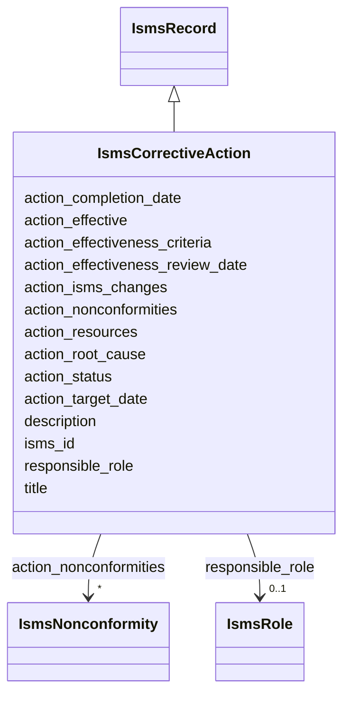

```mermaid
 classDiagram
    class IsmsCorrectiveAction
    click IsmsCorrectiveAction href "../IsmsCorrectiveAction"
      IsmsRecord <|-- IsmsCorrectiveAction
        click IsmsRecord href "../IsmsRecord"
      
      IsmsCorrectiveAction : action_completion_date
        
      IsmsCorrectiveAction : action_effective
        
      IsmsCorrectiveAction : action_effectiveness_criteria
        
      IsmsCorrectiveAction : action_effectiveness_review_date
        
      IsmsCorrectiveAction : action_isms_changes
        
      IsmsCorrectiveAction : action_nonconformities
        
          
    
        
        
        IsmsCorrectiveAction --> "*" IsmsNonconformity : action_nonconformities
        click IsmsNonconformity href "../IsmsNonconformity"
    

        
      IsmsCorrectiveAction : action_resources
        
      IsmsCorrectiveAction : action_root_cause
        
      IsmsCorrectiveAction : action_status
        
      IsmsCorrectiveAction : action_target_date
        
      IsmsCorrectiveAction : description
        
      IsmsCorrectiveAction : isms_id
        
      IsmsCorrectiveAction : responsible_role
        
          
    
        
        
        IsmsCorrectiveAction --> "0..1" IsmsRole : responsible_role
        click IsmsRole href "../IsmsRole"
    

        
      IsmsCorrectiveAction : title
        
      
```
