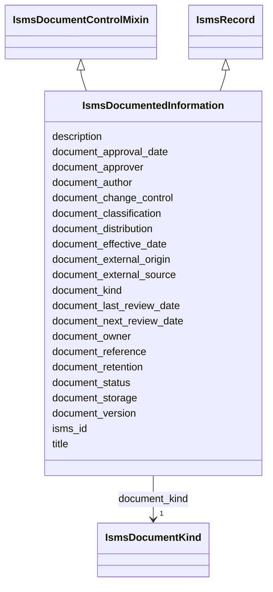

```mermaid
 classDiagram
    class IsmsDocumentedInformation
    click IsmsDocumentedInformation href "../IsmsDocumentedInformation"
      IsmsDocumentControlMixin <|-- IsmsDocumentedInformation
        click IsmsDocumentControlMixin href "../IsmsDocumentControlMixin"
      IsmsRecord <|-- IsmsDocumentedInformation
        click IsmsRecord href "../IsmsRecord"
      
      IsmsDocumentedInformation : description
        
      IsmsDocumentedInformation : document_approval_date
        
      IsmsDocumentedInformation : document_approver
        
      IsmsDocumentedInformation : document_author
        
      IsmsDocumentedInformation : document_change_control
        
      IsmsDocumentedInformation : document_classification
        
      IsmsDocumentedInformation : document_distribution
        
      IsmsDocumentedInformation : document_effective_date
        
      IsmsDocumentedInformation : document_external_origin
        
      IsmsDocumentedInformation : document_external_source
        
      IsmsDocumentedInformation : document_kind
        
          
    
        
        
        IsmsDocumentedInformation --> "1" IsmsDocumentKind : document_kind
        click IsmsDocumentKind href "../IsmsDocumentKind"
    

        
      IsmsDocumentedInformation : document_last_review_date
        
      IsmsDocumentedInformation : document_next_review_date
        
      IsmsDocumentedInformation : document_owner
        
      IsmsDocumentedInformation : document_reference
        
      IsmsDocumentedInformation : document_retention
        
      IsmsDocumentedInformation : document_status
        
      IsmsDocumentedInformation : document_storage
        
      IsmsDocumentedInformation : document_version
        
      IsmsDocumentedInformation : isms_id
        
      IsmsDocumentedInformation : title
        
      
```
