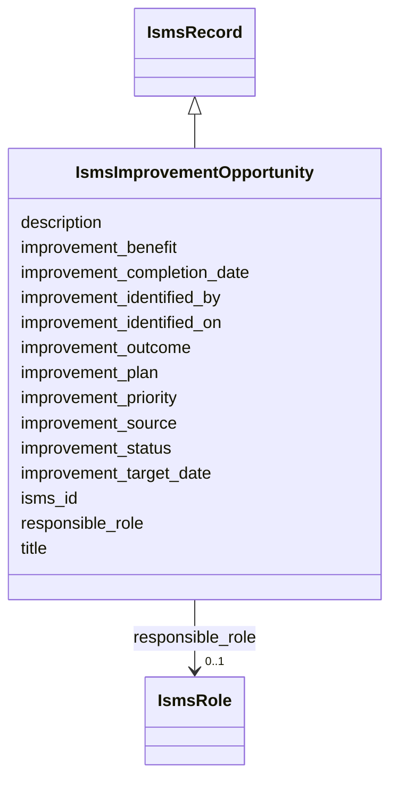

```mermaid
 classDiagram
    class IsmsImprovementOpportunity
    click IsmsImprovementOpportunity href "../IsmsImprovementOpportunity"
      IsmsRecord <|-- IsmsImprovementOpportunity
        click IsmsRecord href "../IsmsRecord"
      
      IsmsImprovementOpportunity : description
        
      IsmsImprovementOpportunity : improvement_benefit
        
      IsmsImprovementOpportunity : improvement_completion_date
        
      IsmsImprovementOpportunity : improvement_identified_by
        
      IsmsImprovementOpportunity : improvement_identified_on
        
      IsmsImprovementOpportunity : improvement_outcome
        
      IsmsImprovementOpportunity : improvement_plan
        
      IsmsImprovementOpportunity : improvement_priority
        
      IsmsImprovementOpportunity : improvement_source
        
      IsmsImprovementOpportunity : improvement_status
        
      IsmsImprovementOpportunity : improvement_target_date
        
      IsmsImprovementOpportunity : isms_id
        
      IsmsImprovementOpportunity : responsible_role
        
          
    
        
        
        IsmsImprovementOpportunity --> "0..1" IsmsRole : responsible_role
        click IsmsRole href "../IsmsRole"
    

        
      IsmsImprovementOpportunity : title
        
      
```
