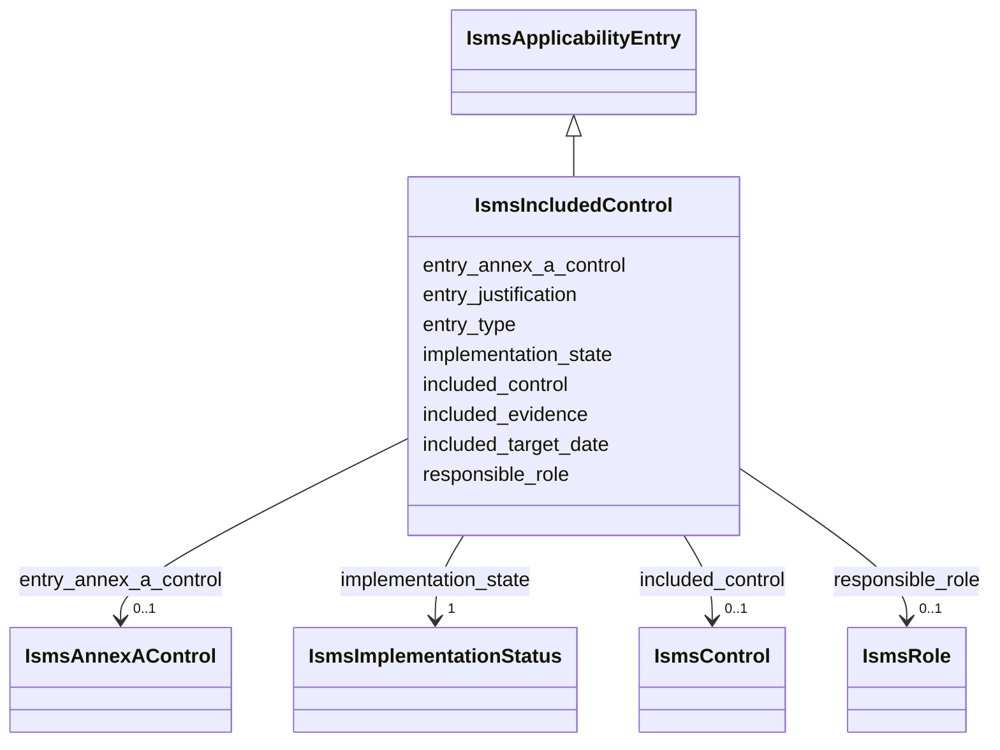

```mermaid
 classDiagram
    class IsmsIncludedControl
    click IsmsIncludedControl href "../IsmsIncludedControl"
      IsmsApplicabilityEntry <|-- IsmsIncludedControl
        click IsmsApplicabilityEntry href "../IsmsApplicabilityEntry"
      
      IsmsIncludedControl : entry_annex_a_control
        
          
    
        
        
        IsmsIncludedControl --> "0..1" IsmsAnnexAControl : entry_annex_a_control
        click IsmsAnnexAControl href "../IsmsAnnexAControl"
    

        
      IsmsIncludedControl : entry_justification
        
      IsmsIncludedControl : entry_type
        
      IsmsIncludedControl : implementation_state
        
          
    
        
        
        IsmsIncludedControl --> "1" IsmsImplementationStatus : implementation_state
        click IsmsImplementationStatus href "../IsmsImplementationStatus"
    

        
      IsmsIncludedControl : included_control
        
          
    
        
        
        IsmsIncludedControl --> "0..1" IsmsControl : included_control
        click IsmsControl href "../IsmsControl"
    

        
      IsmsIncludedControl : included_evidence
        
      IsmsIncludedControl : included_target_date
        
      IsmsIncludedControl : responsible_role
        
          
    
        
        
        IsmsIncludedControl --> "0..1" IsmsRole : responsible_role
        click IsmsRole href "../IsmsRole"
    

        
      
```
