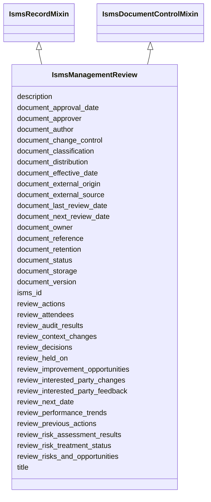

```mermaid
 classDiagram
    class IsmsManagementReview
    click IsmsManagementReview href "../IsmsManagementReview"
      IsmsRecordMixin <|-- IsmsManagementReview
        click IsmsRecordMixin href "../IsmsRecordMixin"
      IsmsDocumentControlMixin <|-- IsmsManagementReview
        click IsmsDocumentControlMixin href "../IsmsDocumentControlMixin"
      
      IsmsManagementReview : description
        
      IsmsManagementReview : document_approval_date
        
      IsmsManagementReview : document_approver
        
      IsmsManagementReview : document_author
        
      IsmsManagementReview : document_change_control
        
      IsmsManagementReview : document_classification
        
      IsmsManagementReview : document_distribution
        
      IsmsManagementReview : document_effective_date
        
      IsmsManagementReview : document_external_origin
        
      IsmsManagementReview : document_external_source
        
      IsmsManagementReview : document_last_review_date
        
      IsmsManagementReview : document_next_review_date
        
      IsmsManagementReview : document_owner
        
      IsmsManagementReview : document_reference
        
      IsmsManagementReview : document_retention
        
      IsmsManagementReview : document_status
        
      IsmsManagementReview : document_storage
        
      IsmsManagementReview : document_version
        
      IsmsManagementReview : isms_id
        
      IsmsManagementReview : review_actions
        
      IsmsManagementReview : review_attendees
        
      IsmsManagementReview : review_audit_results
        
      IsmsManagementReview : review_context_changes
        
      IsmsManagementReview : review_decisions
        
      IsmsManagementReview : review_held_on
        
      IsmsManagementReview : review_improvement_opportunities
        
      IsmsManagementReview : review_interested_party_changes
        
      IsmsManagementReview : review_interested_party_feedback
        
      IsmsManagementReview : review_next_date
        
      IsmsManagementReview : review_performance_trends
        
      IsmsManagementReview : review_previous_actions
        
      IsmsManagementReview : review_risk_assessment_results
        
      IsmsManagementReview : review_risk_treatment_status
        
      IsmsManagementReview : review_risks_and_opportunities
        
      IsmsManagementReview : title
        
      
```
