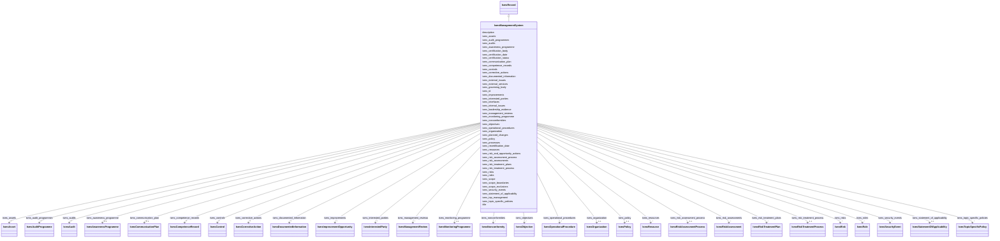

```mermaid
 classDiagram
    class IsmsManagementSystem
    click IsmsManagementSystem href "../IsmsManagementSystem"
      IsmsRecord <|-- IsmsManagementSystem
        click IsmsRecord href "../IsmsRecord"
      
      IsmsManagementSystem : description
        
      IsmsManagementSystem : isms_assets
        
          
    
        
        
        IsmsManagementSystem --> "*" IsmsAsset : isms_assets
        click IsmsAsset href "../IsmsAsset"
    

        
      IsmsManagementSystem : isms_audit_programmes
        
          
    
        
        
        IsmsManagementSystem --> "*" IsmsAuditProgramme : isms_audit_programmes
        click IsmsAuditProgramme href "../IsmsAuditProgramme"
    

        
      IsmsManagementSystem : isms_audits
        
          
    
        
        
        IsmsManagementSystem --> "*" IsmsAudit : isms_audits
        click IsmsAudit href "../IsmsAudit"
    

        
      IsmsManagementSystem : isms_awareness_programme
        
          
    
        
        
        IsmsManagementSystem --> "0..1" IsmsAwarenessProgramme : isms_awareness_programme
        click IsmsAwarenessProgramme href "../IsmsAwarenessProgramme"
    

        
      IsmsManagementSystem : isms_certification_body
        
      IsmsManagementSystem : isms_certification_date
        
      IsmsManagementSystem : isms_certification_status
        
      IsmsManagementSystem : isms_communication_plan
        
          
    
        
        
        IsmsManagementSystem --> "0..1" IsmsCommunicationPlan : isms_communication_plan
        click IsmsCommunicationPlan href "../IsmsCommunicationPlan"
    

        
      IsmsManagementSystem : isms_competence_records
        
          
    
        
        
        IsmsManagementSystem --> "*" IsmsCompetenceRecord : isms_competence_records
        click IsmsCompetenceRecord href "../IsmsCompetenceRecord"
    

        
      IsmsManagementSystem : isms_controls
        
          
    
        
        
        IsmsManagementSystem --> "*" IsmsControl : isms_controls
        click IsmsControl href "../IsmsControl"
    

        
      IsmsManagementSystem : isms_corrective_actions
        
          
    
        
        
        IsmsManagementSystem --> "*" IsmsCorrectiveAction : isms_corrective_actions
        click IsmsCorrectiveAction href "../IsmsCorrectiveAction"
    

        
      IsmsManagementSystem : isms_documented_information
        
          
    
        
        
        IsmsManagementSystem --> "*" IsmsDocumentedInformation : isms_documented_information
        click IsmsDocumentedInformation href "../IsmsDocumentedInformation"
    

        
      IsmsManagementSystem : isms_external_issues
        
      IsmsManagementSystem : isms_external_services
        
      IsmsManagementSystem : isms_governing_body
        
      IsmsManagementSystem : isms_id
        
      IsmsManagementSystem : isms_improvements
        
          
    
        
        
        IsmsManagementSystem --> "*" IsmsImprovementOpportunity : isms_improvements
        click IsmsImprovementOpportunity href "../IsmsImprovementOpportunity"
    

        
      IsmsManagementSystem : isms_interested_parties
        
          
    
        
        
        IsmsManagementSystem --> "*" IsmsInterestedParty : isms_interested_parties
        click IsmsInterestedParty href "../IsmsInterestedParty"
    

        
      IsmsManagementSystem : isms_interfaces
        
      IsmsManagementSystem : isms_internal_issues
        
      IsmsManagementSystem : isms_leadership_evidence
        
      IsmsManagementSystem : isms_management_reviews
        
          
    
        
        
        IsmsManagementSystem --> "*" IsmsManagementReview : isms_management_reviews
        click IsmsManagementReview href "../IsmsManagementReview"
    

        
      IsmsManagementSystem : isms_monitoring_programme
        
          
    
        
        
        IsmsManagementSystem --> "0..1" IsmsMonitoringProgramme : isms_monitoring_programme
        click IsmsMonitoringProgramme href "../IsmsMonitoringProgramme"
    

        
      IsmsManagementSystem : isms_nonconformities
        
          
    
        
        
        IsmsManagementSystem --> "*" IsmsNonconformity : isms_nonconformities
        click IsmsNonconformity href "../IsmsNonconformity"
    

        
      IsmsManagementSystem : isms_objectives
        
          
    
        
        
        IsmsManagementSystem --> "*" IsmsObjective : isms_objectives
        click IsmsObjective href "../IsmsObjective"
    

        
      IsmsManagementSystem : isms_operational_procedures
        
          
    
        
        
        IsmsManagementSystem --> "*" IsmsOperationalProcedure : isms_operational_procedures
        click IsmsOperationalProcedure href "../IsmsOperationalProcedure"
    

        
      IsmsManagementSystem : isms_organization
        
          
    
        
        
        IsmsManagementSystem --> "0..1" IsmsOrganization : isms_organization
        click IsmsOrganization href "../IsmsOrganization"
    

        
      IsmsManagementSystem : isms_planned_changes
        
      IsmsManagementSystem : isms_policy
        
          
    
        
        
        IsmsManagementSystem --> "0..1" IsmsPolicy : isms_policy
        click IsmsPolicy href "../IsmsPolicy"
    

        
      IsmsManagementSystem : isms_processes
        
      IsmsManagementSystem : isms_recertification_date
        
      IsmsManagementSystem : isms_resources
        
          
    
        
        
        IsmsManagementSystem --> "*" IsmsResource : isms_resources
        click IsmsResource href "../IsmsResource"
    

        
      IsmsManagementSystem : isms_risk_and_opportunity_actions
        
      IsmsManagementSystem : isms_risk_assessment_process
        
          
    
        
        
        IsmsManagementSystem --> "0..1" IsmsRiskAssessmentProcess : isms_risk_assessment_process
        click IsmsRiskAssessmentProcess href "../IsmsRiskAssessmentProcess"
    

        
      IsmsManagementSystem : isms_risk_assessments
        
          
    
        
        
        IsmsManagementSystem --> "*" IsmsRiskAssessment : isms_risk_assessments
        click IsmsRiskAssessment href "../IsmsRiskAssessment"
    

        
      IsmsManagementSystem : isms_risk_treatment_plans
        
          
    
        
        
        IsmsManagementSystem --> "*" IsmsRiskTreatmentPlan : isms_risk_treatment_plans
        click IsmsRiskTreatmentPlan href "../IsmsRiskTreatmentPlan"
    

        
      IsmsManagementSystem : isms_risk_treatment_process
        
          
    
        
        
        IsmsManagementSystem --> "0..1" IsmsRiskTreatmentProcess : isms_risk_treatment_process
        click IsmsRiskTreatmentProcess href "../IsmsRiskTreatmentProcess"
    

        
      IsmsManagementSystem : isms_risks
        
          
    
        
        
        IsmsManagementSystem --> "*" IsmsRisk : isms_risks
        click IsmsRisk href "../IsmsRisk"
    

        
      IsmsManagementSystem : isms_roles
        
          
    
        
        
        IsmsManagementSystem --> "*" IsmsRole : isms_roles
        click IsmsRole href "../IsmsRole"
    

        
      IsmsManagementSystem : isms_scope
        
      IsmsManagementSystem : isms_scope_boundaries
        
      IsmsManagementSystem : isms_scope_exclusions
        
      IsmsManagementSystem : isms_security_events
        
          
    
        
        
        IsmsManagementSystem --> "*" IsmsSecurityEvent : isms_security_events
        click IsmsSecurityEvent href "../IsmsSecurityEvent"
    

        
      IsmsManagementSystem : isms_statement_of_applicability
        
          
    
        
        
        IsmsManagementSystem --> "0..1" IsmsStatementOfApplicability : isms_statement_of_applicability
        click IsmsStatementOfApplicability href "../IsmsStatementOfApplicability"
    

        
      IsmsManagementSystem : isms_top_management
        
      IsmsManagementSystem : isms_topic_specific_policies
        
          
    
        
        
        IsmsManagementSystem --> "*" IsmsTopicSpecificPolicy : isms_topic_specific_policies
        click IsmsTopicSpecificPolicy href "../IsmsTopicSpecificPolicy"
    

        
      IsmsManagementSystem : title
        
      
```
