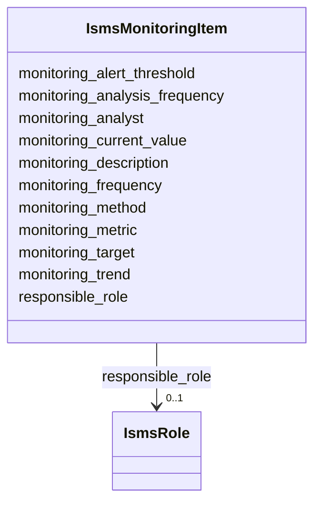

```mermaid
 classDiagram
    class IsmsMonitoringItem
    click IsmsMonitoringItem href "../IsmsMonitoringItem"
      IsmsMonitoringItem : monitoring_alert_threshold
        
      IsmsMonitoringItem : monitoring_analysis_frequency
        
      IsmsMonitoringItem : monitoring_analyst
        
      IsmsMonitoringItem : monitoring_current_value
        
      IsmsMonitoringItem : monitoring_description
        
      IsmsMonitoringItem : monitoring_frequency
        
      IsmsMonitoringItem : monitoring_method
        
      IsmsMonitoringItem : monitoring_metric
        
      IsmsMonitoringItem : monitoring_target
        
      IsmsMonitoringItem : monitoring_trend
        
      IsmsMonitoringItem : responsible_role
        
          
    
        
        
        IsmsMonitoringItem --> "0..1" IsmsRole : responsible_role
        click IsmsRole href "../IsmsRole"
    

        
      
```
