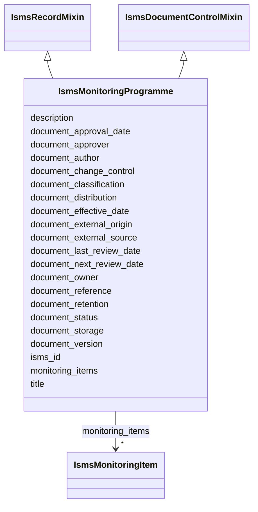

```mermaid
 classDiagram
    class IsmsMonitoringProgramme
    click IsmsMonitoringProgramme href "../IsmsMonitoringProgramme"
      IsmsRecordMixin <|-- IsmsMonitoringProgramme
        click IsmsRecordMixin href "../IsmsRecordMixin"
      IsmsDocumentControlMixin <|-- IsmsMonitoringProgramme
        click IsmsDocumentControlMixin href "../IsmsDocumentControlMixin"
      
      IsmsMonitoringProgramme : description
        
      IsmsMonitoringProgramme : document_approval_date
        
      IsmsMonitoringProgramme : document_approver
        
      IsmsMonitoringProgramme : document_author
        
      IsmsMonitoringProgramme : document_change_control
        
      IsmsMonitoringProgramme : document_classification
        
      IsmsMonitoringProgramme : document_distribution
        
      IsmsMonitoringProgramme : document_effective_date
        
      IsmsMonitoringProgramme : document_external_origin
        
      IsmsMonitoringProgramme : document_external_source
        
      IsmsMonitoringProgramme : document_last_review_date
        
      IsmsMonitoringProgramme : document_next_review_date
        
      IsmsMonitoringProgramme : document_owner
        
      IsmsMonitoringProgramme : document_reference
        
      IsmsMonitoringProgramme : document_retention
        
      IsmsMonitoringProgramme : document_status
        
      IsmsMonitoringProgramme : document_storage
        
      IsmsMonitoringProgramme : document_version
        
      IsmsMonitoringProgramme : isms_id
        
      IsmsMonitoringProgramme : monitoring_items
        
          
    
        
        
        IsmsMonitoringProgramme --> "*" IsmsMonitoringItem : monitoring_items
        click IsmsMonitoringItem href "../IsmsMonitoringItem"
    

        
      IsmsMonitoringProgramme : title
        
      
```
