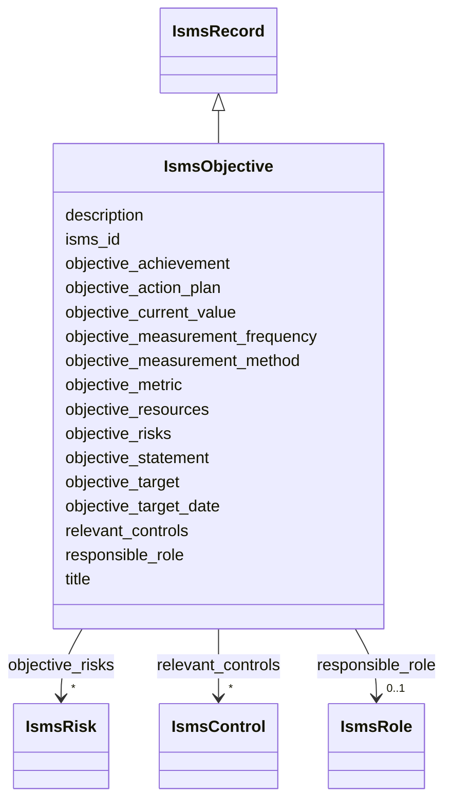

```mermaid
 classDiagram
    class IsmsObjective
    click IsmsObjective href "../IsmsObjective"
      IsmsRecord <|-- IsmsObjective
        click IsmsRecord href "../IsmsRecord"
      
      IsmsObjective : description
        
      IsmsObjective : isms_id
        
      IsmsObjective : objective_achievement
        
      IsmsObjective : objective_action_plan
        
      IsmsObjective : objective_current_value
        
      IsmsObjective : objective_measurement_frequency
        
      IsmsObjective : objective_measurement_method
        
      IsmsObjective : objective_metric
        
      IsmsObjective : objective_resources
        
      IsmsObjective : objective_risks
        
          
    
        
        
        IsmsObjective --> "*" IsmsRisk : objective_risks
        click IsmsRisk href "../IsmsRisk"
    

        
      IsmsObjective : objective_statement
        
      IsmsObjective : objective_target
        
      IsmsObjective : objective_target_date
        
      IsmsObjective : relevant_controls
        
          
    
        
        
        IsmsObjective --> "*" IsmsControl : relevant_controls
        click IsmsControl href "../IsmsControl"
    

        
      IsmsObjective : responsible_role
        
          
    
        
        
        IsmsObjective --> "0..1" IsmsRole : responsible_role
        click IsmsRole href "../IsmsRole"
    

        
      IsmsObjective : title
        
      
```
