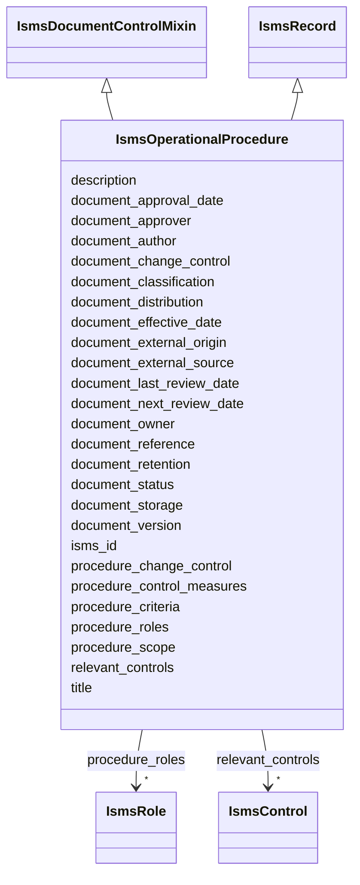

```mermaid
 classDiagram
    class IsmsOperationalProcedure
    click IsmsOperationalProcedure href "../IsmsOperationalProcedure"
      IsmsDocumentControlMixin <|-- IsmsOperationalProcedure
        click IsmsDocumentControlMixin href "../IsmsDocumentControlMixin"
      IsmsRecord <|-- IsmsOperationalProcedure
        click IsmsRecord href "../IsmsRecord"
      
      IsmsOperationalProcedure : description
        
      IsmsOperationalProcedure : document_approval_date
        
      IsmsOperationalProcedure : document_approver
        
      IsmsOperationalProcedure : document_author
        
      IsmsOperationalProcedure : document_change_control
        
      IsmsOperationalProcedure : document_classification
        
      IsmsOperationalProcedure : document_distribution
        
      IsmsOperationalProcedure : document_effective_date
        
      IsmsOperationalProcedure : document_external_origin
        
      IsmsOperationalProcedure : document_external_source
        
      IsmsOperationalProcedure : document_last_review_date
        
      IsmsOperationalProcedure : document_next_review_date
        
      IsmsOperationalProcedure : document_owner
        
      IsmsOperationalProcedure : document_reference
        
      IsmsOperationalProcedure : document_retention
        
      IsmsOperationalProcedure : document_status
        
      IsmsOperationalProcedure : document_storage
        
      IsmsOperationalProcedure : document_version
        
      IsmsOperationalProcedure : isms_id
        
      IsmsOperationalProcedure : procedure_change_control
        
      IsmsOperationalProcedure : procedure_control_measures
        
      IsmsOperationalProcedure : procedure_criteria
        
      IsmsOperationalProcedure : procedure_roles
        
          
    
        
        
        IsmsOperationalProcedure --> "*" IsmsRole : procedure_roles
        click IsmsRole href "../IsmsRole"
    

        
      IsmsOperationalProcedure : procedure_scope
        
      IsmsOperationalProcedure : relevant_controls
        
          
    
        
        
        IsmsOperationalProcedure --> "*" IsmsControl : relevant_controls
        click IsmsControl href "../IsmsControl"
    

        
      IsmsOperationalProcedure : title
        
      
```
