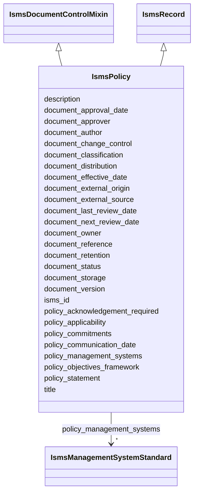

```mermaid
 classDiagram
    class IsmsPolicy
    click IsmsPolicy href "../IsmsPolicy"
      IsmsDocumentControlMixin <|-- IsmsPolicy
        click IsmsDocumentControlMixin href "../IsmsDocumentControlMixin"
      IsmsRecord <|-- IsmsPolicy
        click IsmsRecord href "../IsmsRecord"
      
      IsmsPolicy : description
        
      IsmsPolicy : document_approval_date
        
      IsmsPolicy : document_approver
        
      IsmsPolicy : document_author
        
      IsmsPolicy : document_change_control
        
      IsmsPolicy : document_classification
        
      IsmsPolicy : document_distribution
        
      IsmsPolicy : document_effective_date
        
      IsmsPolicy : document_external_origin
        
      IsmsPolicy : document_external_source
        
      IsmsPolicy : document_last_review_date
        
      IsmsPolicy : document_next_review_date
        
      IsmsPolicy : document_owner
        
      IsmsPolicy : document_reference
        
      IsmsPolicy : document_retention
        
      IsmsPolicy : document_status
        
      IsmsPolicy : document_storage
        
      IsmsPolicy : document_version
        
      IsmsPolicy : isms_id
        
      IsmsPolicy : policy_acknowledgement_required
        
      IsmsPolicy : policy_applicability
        
      IsmsPolicy : policy_commitments
        
      IsmsPolicy : policy_communication_date
        
      IsmsPolicy : policy_management_systems
        
          
    
        
        
        IsmsPolicy --> "*" IsmsManagementSystemStandard : policy_management_systems
        click IsmsManagementSystemStandard href "../IsmsManagementSystemStandard"
    

        
      IsmsPolicy : policy_objectives_framework
        
      IsmsPolicy : policy_statement
        
      IsmsPolicy : title
        
      
```
