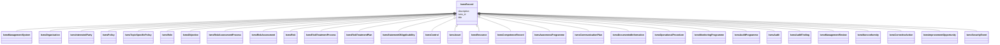

```mermaid
 classDiagram
    class IsmsRecord
    click IsmsRecord href "../IsmsRecord"
      IsmsRecord <|-- IsmsManagementSystem
        click IsmsManagementSystem href "../IsmsManagementSystem"
      IsmsRecord <|-- IsmsOrganization
        click IsmsOrganization href "../IsmsOrganization"
      IsmsRecord <|-- IsmsInterestedParty
        click IsmsInterestedParty href "../IsmsInterestedParty"
      IsmsRecord <|-- IsmsPolicy
        click IsmsPolicy href "../IsmsPolicy"
      IsmsRecord <|-- IsmsTopicSpecificPolicy
        click IsmsTopicSpecificPolicy href "../IsmsTopicSpecificPolicy"
      IsmsRecord <|-- IsmsRole
        click IsmsRole href "../IsmsRole"
      IsmsRecord <|-- IsmsObjective
        click IsmsObjective href "../IsmsObjective"
      IsmsRecord <|-- IsmsRiskAssessmentProcess
        click IsmsRiskAssessmentProcess href "../IsmsRiskAssessmentProcess"
      IsmsRecord <|-- IsmsRiskAssessment
        click IsmsRiskAssessment href "../IsmsRiskAssessment"
      IsmsRecord <|-- IsmsRisk
        click IsmsRisk href "../IsmsRisk"
      IsmsRecord <|-- IsmsRiskTreatmentProcess
        click IsmsRiskTreatmentProcess href "../IsmsRiskTreatmentProcess"
      IsmsRecord <|-- IsmsRiskTreatmentPlan
        click IsmsRiskTreatmentPlan href "../IsmsRiskTreatmentPlan"
      IsmsRecord <|-- IsmsStatementOfApplicability
        click IsmsStatementOfApplicability href "../IsmsStatementOfApplicability"
      IsmsRecord <|-- IsmsControl
        click IsmsControl href "../IsmsControl"
      IsmsRecord <|-- IsmsAsset
        click IsmsAsset href "../IsmsAsset"
      IsmsRecord <|-- IsmsResource
        click IsmsResource href "../IsmsResource"
      IsmsRecord <|-- IsmsCompetenceRecord
        click IsmsCompetenceRecord href "../IsmsCompetenceRecord"
      IsmsRecord <|-- IsmsAwarenessProgramme
        click IsmsAwarenessProgramme href "../IsmsAwarenessProgramme"
      IsmsRecord <|-- IsmsCommunicationPlan
        click IsmsCommunicationPlan href "../IsmsCommunicationPlan"
      IsmsRecord <|-- IsmsDocumentedInformation
        click IsmsDocumentedInformation href "../IsmsDocumentedInformation"
      IsmsRecord <|-- IsmsOperationalProcedure
        click IsmsOperationalProcedure href "../IsmsOperationalProcedure"
      IsmsRecord <|-- IsmsMonitoringProgramme
        click IsmsMonitoringProgramme href "../IsmsMonitoringProgramme"
      IsmsRecord <|-- IsmsAuditProgramme
        click IsmsAuditProgramme href "../IsmsAuditProgramme"
      IsmsRecord <|-- IsmsAudit
        click IsmsAudit href "../IsmsAudit"
      IsmsRecord <|-- IsmsAuditFinding
        click IsmsAuditFinding href "../IsmsAuditFinding"
      IsmsRecord <|-- IsmsManagementReview
        click IsmsManagementReview href "../IsmsManagementReview"
      IsmsRecord <|-- IsmsNonconformity
        click IsmsNonconformity href "../IsmsNonconformity"
      IsmsRecord <|-- IsmsCorrectiveAction
        click IsmsCorrectiveAction href "../IsmsCorrectiveAction"
      IsmsRecord <|-- IsmsImprovementOpportunity
        click IsmsImprovementOpportunity href "../IsmsImprovementOpportunity"
      IsmsRecord <|-- IsmsSecurityEvent
        click IsmsSecurityEvent href "../IsmsSecurityEvent"
      
      IsmsRecord : description
        
      IsmsRecord : isms_id
        
      IsmsRecord : title
        
      
```
