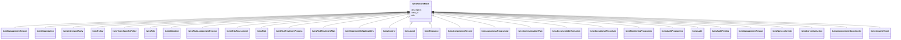

```mermaid
 classDiagram
    class IsmsRecordMixin
    click IsmsRecordMixin href "../IsmsRecordMixin"
      IsmsRecordMixin <|-- IsmsManagementSystem
        click IsmsManagementSystem href "../IsmsManagementSystem"
      IsmsRecordMixin <|-- IsmsOrganization
        click IsmsOrganization href "../IsmsOrganization"
      IsmsRecordMixin <|-- IsmsInterestedParty
        click IsmsInterestedParty href "../IsmsInterestedParty"
      IsmsRecordMixin <|-- IsmsPolicy
        click IsmsPolicy href "../IsmsPolicy"
      IsmsRecordMixin <|-- IsmsTopicSpecificPolicy
        click IsmsTopicSpecificPolicy href "../IsmsTopicSpecificPolicy"
      IsmsRecordMixin <|-- IsmsRole
        click IsmsRole href "../IsmsRole"
      IsmsRecordMixin <|-- IsmsObjective
        click IsmsObjective href "../IsmsObjective"
      IsmsRecordMixin <|-- IsmsRiskAssessmentProcess
        click IsmsRiskAssessmentProcess href "../IsmsRiskAssessmentProcess"
      IsmsRecordMixin <|-- IsmsRiskAssessment
        click IsmsRiskAssessment href "../IsmsRiskAssessment"
      IsmsRecordMixin <|-- IsmsRisk
        click IsmsRisk href "../IsmsRisk"
      IsmsRecordMixin <|-- IsmsRiskTreatmentProcess
        click IsmsRiskTreatmentProcess href "../IsmsRiskTreatmentProcess"
      IsmsRecordMixin <|-- IsmsRiskTreatmentPlan
        click IsmsRiskTreatmentPlan href "../IsmsRiskTreatmentPlan"
      IsmsRecordMixin <|-- IsmsStatementOfApplicability
        click IsmsStatementOfApplicability href "../IsmsStatementOfApplicability"
      IsmsRecordMixin <|-- IsmsControl
        click IsmsControl href "../IsmsControl"
      IsmsRecordMixin <|-- IsmsAsset
        click IsmsAsset href "../IsmsAsset"
      IsmsRecordMixin <|-- IsmsResource
        click IsmsResource href "../IsmsResource"
      IsmsRecordMixin <|-- IsmsCompetenceRecord
        click IsmsCompetenceRecord href "../IsmsCompetenceRecord"
      IsmsRecordMixin <|-- IsmsAwarenessProgramme
        click IsmsAwarenessProgramme href "../IsmsAwarenessProgramme"
      IsmsRecordMixin <|-- IsmsCommunicationPlan
        click IsmsCommunicationPlan href "../IsmsCommunicationPlan"
      IsmsRecordMixin <|-- IsmsDocumentedInformation
        click IsmsDocumentedInformation href "../IsmsDocumentedInformation"
      IsmsRecordMixin <|-- IsmsOperationalProcedure
        click IsmsOperationalProcedure href "../IsmsOperationalProcedure"
      IsmsRecordMixin <|-- IsmsMonitoringProgramme
        click IsmsMonitoringProgramme href "../IsmsMonitoringProgramme"
      IsmsRecordMixin <|-- IsmsAuditProgramme
        click IsmsAuditProgramme href "../IsmsAuditProgramme"
      IsmsRecordMixin <|-- IsmsAudit
        click IsmsAudit href "../IsmsAudit"
      IsmsRecordMixin <|-- IsmsAuditFinding
        click IsmsAuditFinding href "../IsmsAuditFinding"
      IsmsRecordMixin <|-- IsmsManagementReview
        click IsmsManagementReview href "../IsmsManagementReview"
      IsmsRecordMixin <|-- IsmsNonconformity
        click IsmsNonconformity href "../IsmsNonconformity"
      IsmsRecordMixin <|-- IsmsCorrectiveAction
        click IsmsCorrectiveAction href "../IsmsCorrectiveAction"
      IsmsRecordMixin <|-- IsmsImprovementOpportunity
        click IsmsImprovementOpportunity href "../IsmsImprovementOpportunity"
      IsmsRecordMixin <|-- IsmsSecurityEvent
        click IsmsSecurityEvent href "../IsmsSecurityEvent"
      
      IsmsRecordMixin : description
        
      IsmsRecordMixin : isms_id
        
      IsmsRecordMixin : title
        
      
```
