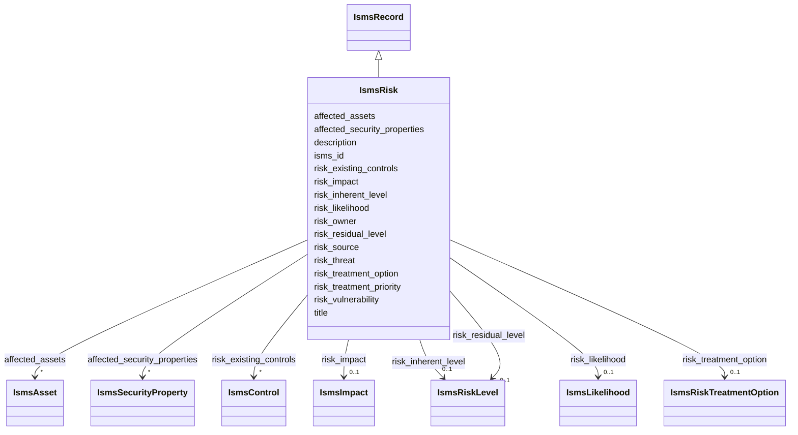

```mermaid
 classDiagram
    class IsmsRisk
    click IsmsRisk href "../IsmsRisk"
      IsmsRecord <|-- IsmsRisk
        click IsmsRecord href "../IsmsRecord"
      
      IsmsRisk : affected_assets
        
          
    
        
        
        IsmsRisk --> "*" IsmsAsset : affected_assets
        click IsmsAsset href "../IsmsAsset"
    

        
      IsmsRisk : affected_security_properties
        
          
    
        
        
        IsmsRisk --> "*" IsmsSecurityProperty : affected_security_properties
        click IsmsSecurityProperty href "../IsmsSecurityProperty"
    

        
      IsmsRisk : description
        
      IsmsRisk : isms_id
        
      IsmsRisk : risk_existing_controls
        
          
    
        
        
        IsmsRisk --> "*" IsmsControl : risk_existing_controls
        click IsmsControl href "../IsmsControl"
    

        
      IsmsRisk : risk_impact
        
          
    
        
        
        IsmsRisk --> "0..1" IsmsImpact : risk_impact
        click IsmsImpact href "../IsmsImpact"
    

        
      IsmsRisk : risk_inherent_level
        
          
    
        
        
        IsmsRisk --> "0..1" IsmsRiskLevel : risk_inherent_level
        click IsmsRiskLevel href "../IsmsRiskLevel"
    

        
      IsmsRisk : risk_likelihood
        
          
    
        
        
        IsmsRisk --> "0..1" IsmsLikelihood : risk_likelihood
        click IsmsLikelihood href "../IsmsLikelihood"
    

        
      IsmsRisk : risk_owner
        
      IsmsRisk : risk_residual_level
        
          
    
        
        
        IsmsRisk --> "0..1" IsmsRiskLevel : risk_residual_level
        click IsmsRiskLevel href "../IsmsRiskLevel"
    

        
      IsmsRisk : risk_source
        
      IsmsRisk : risk_threat
        
      IsmsRisk : risk_treatment_option
        
          
    
        
        
        IsmsRisk --> "0..1" IsmsRiskTreatmentOption : risk_treatment_option
        click IsmsRiskTreatmentOption href "../IsmsRiskTreatmentOption"
    

        
      IsmsRisk : risk_treatment_priority
        
      IsmsRisk : risk_vulnerability
        
      IsmsRisk : title
        
      
```
