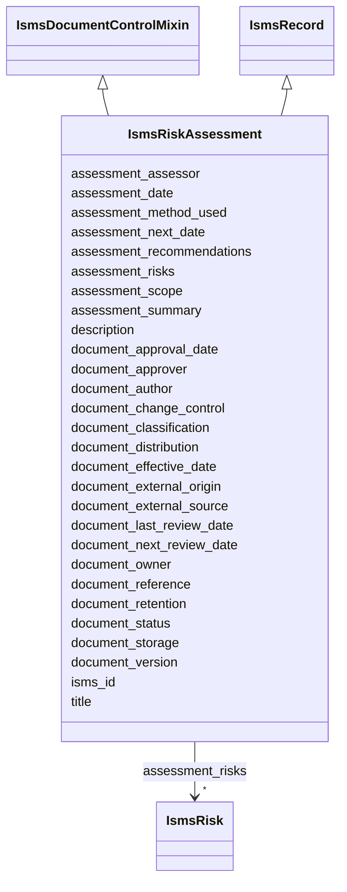

```mermaid
 classDiagram
    class IsmsRiskAssessment
    click IsmsRiskAssessment href "../IsmsRiskAssessment"
      IsmsDocumentControlMixin <|-- IsmsRiskAssessment
        click IsmsDocumentControlMixin href "../IsmsDocumentControlMixin"
      IsmsRecord <|-- IsmsRiskAssessment
        click IsmsRecord href "../IsmsRecord"
      
      IsmsRiskAssessment : assessment_assessor
        
      IsmsRiskAssessment : assessment_date
        
      IsmsRiskAssessment : assessment_method_used
        
      IsmsRiskAssessment : assessment_next_date
        
      IsmsRiskAssessment : assessment_recommendations
        
      IsmsRiskAssessment : assessment_risks
        
          
    
        
        
        IsmsRiskAssessment --> "*" IsmsRisk : assessment_risks
        click IsmsRisk href "../IsmsRisk"
    

        
      IsmsRiskAssessment : assessment_scope
        
      IsmsRiskAssessment : assessment_summary
        
      IsmsRiskAssessment : description
        
      IsmsRiskAssessment : document_approval_date
        
      IsmsRiskAssessment : document_approver
        
      IsmsRiskAssessment : document_author
        
      IsmsRiskAssessment : document_change_control
        
      IsmsRiskAssessment : document_classification
        
      IsmsRiskAssessment : document_distribution
        
      IsmsRiskAssessment : document_effective_date
        
      IsmsRiskAssessment : document_external_origin
        
      IsmsRiskAssessment : document_external_source
        
      IsmsRiskAssessment : document_last_review_date
        
      IsmsRiskAssessment : document_next_review_date
        
      IsmsRiskAssessment : document_owner
        
      IsmsRiskAssessment : document_reference
        
      IsmsRiskAssessment : document_retention
        
      IsmsRiskAssessment : document_status
        
      IsmsRiskAssessment : document_storage
        
      IsmsRiskAssessment : document_version
        
      IsmsRiskAssessment : isms_id
        
      IsmsRiskAssessment : title
        
      
```
