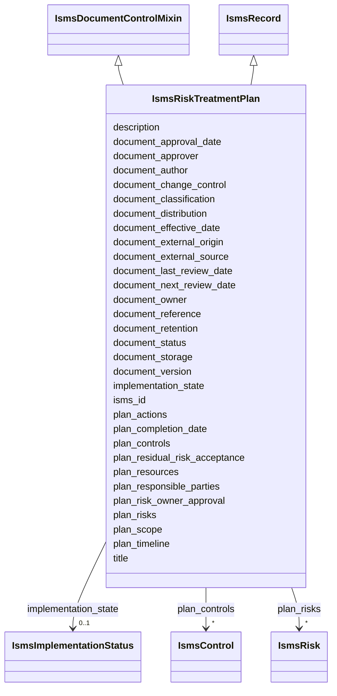

```mermaid
 classDiagram
    class IsmsRiskTreatmentPlan
    click IsmsRiskTreatmentPlan href "../IsmsRiskTreatmentPlan"
      IsmsDocumentControlMixin <|-- IsmsRiskTreatmentPlan
        click IsmsDocumentControlMixin href "../IsmsDocumentControlMixin"
      IsmsRecord <|-- IsmsRiskTreatmentPlan
        click IsmsRecord href "../IsmsRecord"
      
      IsmsRiskTreatmentPlan : description
        
      IsmsRiskTreatmentPlan : document_approval_date
        
      IsmsRiskTreatmentPlan : document_approver
        
      IsmsRiskTreatmentPlan : document_author
        
      IsmsRiskTreatmentPlan : document_change_control
        
      IsmsRiskTreatmentPlan : document_classification
        
      IsmsRiskTreatmentPlan : document_distribution
        
      IsmsRiskTreatmentPlan : document_effective_date
        
      IsmsRiskTreatmentPlan : document_external_origin
        
      IsmsRiskTreatmentPlan : document_external_source
        
      IsmsRiskTreatmentPlan : document_last_review_date
        
      IsmsRiskTreatmentPlan : document_next_review_date
        
      IsmsRiskTreatmentPlan : document_owner
        
      IsmsRiskTreatmentPlan : document_reference
        
      IsmsRiskTreatmentPlan : document_retention
        
      IsmsRiskTreatmentPlan : document_status
        
      IsmsRiskTreatmentPlan : document_storage
        
      IsmsRiskTreatmentPlan : document_version
        
      IsmsRiskTreatmentPlan : implementation_state
        
          
    
        
        
        IsmsRiskTreatmentPlan --> "0..1" IsmsImplementationStatus : implementation_state
        click IsmsImplementationStatus href "../IsmsImplementationStatus"
    

        
      IsmsRiskTreatmentPlan : isms_id
        
      IsmsRiskTreatmentPlan : plan_actions
        
      IsmsRiskTreatmentPlan : plan_completion_date
        
      IsmsRiskTreatmentPlan : plan_controls
        
          
    
        
        
        IsmsRiskTreatmentPlan --> "*" IsmsControl : plan_controls
        click IsmsControl href "../IsmsControl"
    

        
      IsmsRiskTreatmentPlan : plan_residual_risk_acceptance
        
      IsmsRiskTreatmentPlan : plan_resources
        
      IsmsRiskTreatmentPlan : plan_responsible_parties
        
      IsmsRiskTreatmentPlan : plan_risk_owner_approval
        
      IsmsRiskTreatmentPlan : plan_risks
        
          
    
        
        
        IsmsRiskTreatmentPlan --> "*" IsmsRisk : plan_risks
        click IsmsRisk href "../IsmsRisk"
    

        
      IsmsRiskTreatmentPlan : plan_scope
        
      IsmsRiskTreatmentPlan : plan_timeline
        
      IsmsRiskTreatmentPlan : title
        
      
```
