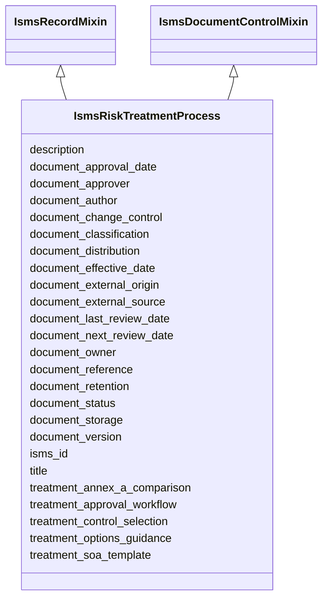

```mermaid
 classDiagram
    class IsmsRiskTreatmentProcess
    click IsmsRiskTreatmentProcess href "../IsmsRiskTreatmentProcess"
      IsmsRecordMixin <|-- IsmsRiskTreatmentProcess
        click IsmsRecordMixin href "../IsmsRecordMixin"
      IsmsDocumentControlMixin <|-- IsmsRiskTreatmentProcess
        click IsmsDocumentControlMixin href "../IsmsDocumentControlMixin"
      
      IsmsRiskTreatmentProcess : description
        
      IsmsRiskTreatmentProcess : document_approval_date
        
      IsmsRiskTreatmentProcess : document_approver
        
      IsmsRiskTreatmentProcess : document_author
        
      IsmsRiskTreatmentProcess : document_change_control
        
      IsmsRiskTreatmentProcess : document_classification
        
      IsmsRiskTreatmentProcess : document_distribution
        
      IsmsRiskTreatmentProcess : document_effective_date
        
      IsmsRiskTreatmentProcess : document_external_origin
        
      IsmsRiskTreatmentProcess : document_external_source
        
      IsmsRiskTreatmentProcess : document_last_review_date
        
      IsmsRiskTreatmentProcess : document_next_review_date
        
      IsmsRiskTreatmentProcess : document_owner
        
      IsmsRiskTreatmentProcess : document_reference
        
      IsmsRiskTreatmentProcess : document_retention
        
      IsmsRiskTreatmentProcess : document_status
        
      IsmsRiskTreatmentProcess : document_storage
        
      IsmsRiskTreatmentProcess : document_version
        
      IsmsRiskTreatmentProcess : isms_id
        
      IsmsRiskTreatmentProcess : title
        
      IsmsRiskTreatmentProcess : treatment_annex_a_comparison
        
      IsmsRiskTreatmentProcess : treatment_approval_workflow
        
      IsmsRiskTreatmentProcess : treatment_control_selection
        
      IsmsRiskTreatmentProcess : treatment_options_guidance
        
      IsmsRiskTreatmentProcess : treatment_soa_template
        
      
```
