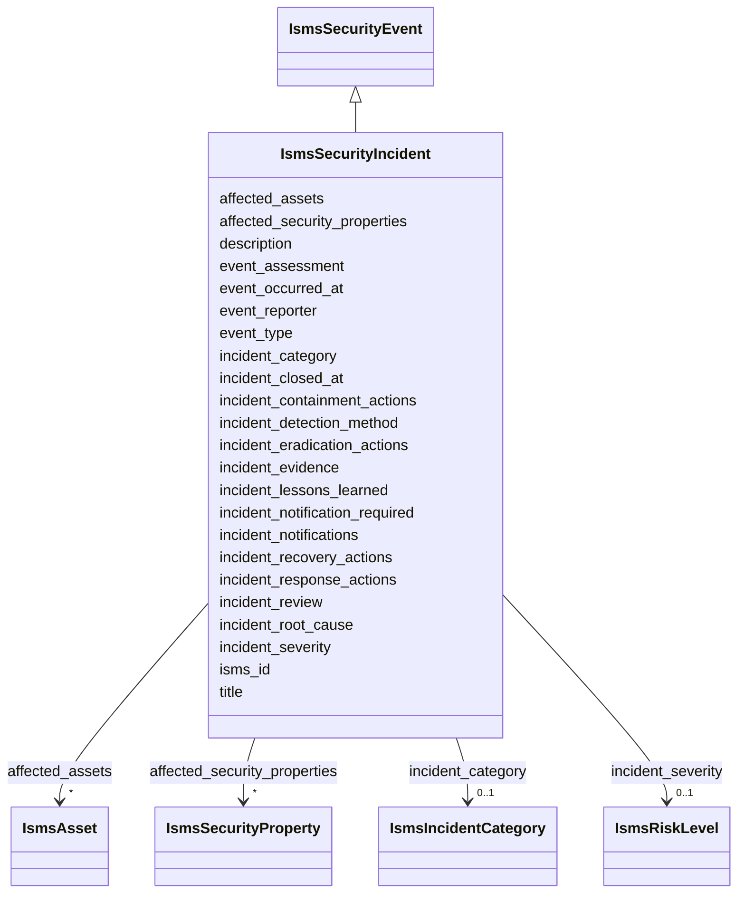

```mermaid
 classDiagram
    class IsmsSecurityIncident
    click IsmsSecurityIncident href "../IsmsSecurityIncident"
      IsmsSecurityEvent <|-- IsmsSecurityIncident
        click IsmsSecurityEvent href "../IsmsSecurityEvent"
      
      IsmsSecurityIncident : affected_assets
        
          
    
        
        
        IsmsSecurityIncident --> "*" IsmsAsset : affected_assets
        click IsmsAsset href "../IsmsAsset"
    

        
      IsmsSecurityIncident : affected_security_properties
        
          
    
        
        
        IsmsSecurityIncident --> "*" IsmsSecurityProperty : affected_security_properties
        click IsmsSecurityProperty href "../IsmsSecurityProperty"
    

        
      IsmsSecurityIncident : description
        
      IsmsSecurityIncident : event_assessment
        
      IsmsSecurityIncident : event_occurred_at
        
      IsmsSecurityIncident : event_reporter
        
      IsmsSecurityIncident : event_type
        
      IsmsSecurityIncident : incident_category
        
          
    
        
        
        IsmsSecurityIncident --> "0..1" IsmsIncidentCategory : incident_category
        click IsmsIncidentCategory href "../IsmsIncidentCategory"
    

        
      IsmsSecurityIncident : incident_closed_at
        
      IsmsSecurityIncident : incident_containment_actions
        
      IsmsSecurityIncident : incident_detection_method
        
      IsmsSecurityIncident : incident_eradication_actions
        
      IsmsSecurityIncident : incident_evidence
        
      IsmsSecurityIncident : incident_lessons_learned
        
      IsmsSecurityIncident : incident_notification_required
        
      IsmsSecurityIncident : incident_notifications
        
      IsmsSecurityIncident : incident_recovery_actions
        
      IsmsSecurityIncident : incident_response_actions
        
      IsmsSecurityIncident : incident_review
        
      IsmsSecurityIncident : incident_root_cause
        
      IsmsSecurityIncident : incident_severity
        
          
    
        
        
        IsmsSecurityIncident --> "0..1" IsmsRiskLevel : incident_severity
        click IsmsRiskLevel href "../IsmsRiskLevel"
    

        
      IsmsSecurityIncident : isms_id
        
      IsmsSecurityIncident : title
        
      
```
