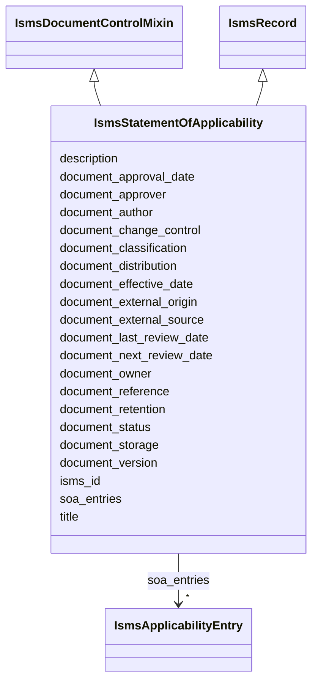

```mermaid
 classDiagram
    class IsmsStatementOfApplicability
    click IsmsStatementOfApplicability href "../IsmsStatementOfApplicability"
      IsmsDocumentControlMixin <|-- IsmsStatementOfApplicability
        click IsmsDocumentControlMixin href "../IsmsDocumentControlMixin"
      IsmsRecord <|-- IsmsStatementOfApplicability
        click IsmsRecord href "../IsmsRecord"
      
      IsmsStatementOfApplicability : description
        
      IsmsStatementOfApplicability : document_approval_date
        
      IsmsStatementOfApplicability : document_approver
        
      IsmsStatementOfApplicability : document_author
        
      IsmsStatementOfApplicability : document_change_control
        
      IsmsStatementOfApplicability : document_classification
        
      IsmsStatementOfApplicability : document_distribution
        
      IsmsStatementOfApplicability : document_effective_date
        
      IsmsStatementOfApplicability : document_external_origin
        
      IsmsStatementOfApplicability : document_external_source
        
      IsmsStatementOfApplicability : document_last_review_date
        
      IsmsStatementOfApplicability : document_next_review_date
        
      IsmsStatementOfApplicability : document_owner
        
      IsmsStatementOfApplicability : document_reference
        
      IsmsStatementOfApplicability : document_retention
        
      IsmsStatementOfApplicability : document_status
        
      IsmsStatementOfApplicability : document_storage
        
      IsmsStatementOfApplicability : document_version
        
      IsmsStatementOfApplicability : isms_id
        
      IsmsStatementOfApplicability : soa_entries
        
          
    
        
        
        IsmsStatementOfApplicability --> "*" IsmsApplicabilityEntry : soa_entries
        click IsmsApplicabilityEntry href "../IsmsApplicabilityEntry"
    

        
      IsmsStatementOfApplicability : title
        
      
```
