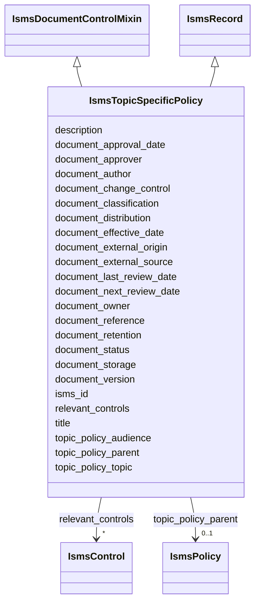

```mermaid
 classDiagram
    class IsmsTopicSpecificPolicy
    click IsmsTopicSpecificPolicy href "../IsmsTopicSpecificPolicy"
      IsmsDocumentControlMixin <|-- IsmsTopicSpecificPolicy
        click IsmsDocumentControlMixin href "../IsmsDocumentControlMixin"
      IsmsRecord <|-- IsmsTopicSpecificPolicy
        click IsmsRecord href "../IsmsRecord"
      
      IsmsTopicSpecificPolicy : description
        
      IsmsTopicSpecificPolicy : document_approval_date
        
      IsmsTopicSpecificPolicy : document_approver
        
      IsmsTopicSpecificPolicy : document_author
        
      IsmsTopicSpecificPolicy : document_change_control
        
      IsmsTopicSpecificPolicy : document_classification
        
      IsmsTopicSpecificPolicy : document_distribution
        
      IsmsTopicSpecificPolicy : document_effective_date
        
      IsmsTopicSpecificPolicy : document_external_origin
        
      IsmsTopicSpecificPolicy : document_external_source
        
      IsmsTopicSpecificPolicy : document_last_review_date
        
      IsmsTopicSpecificPolicy : document_next_review_date
        
      IsmsTopicSpecificPolicy : document_owner
        
      IsmsTopicSpecificPolicy : document_reference
        
      IsmsTopicSpecificPolicy : document_retention
        
      IsmsTopicSpecificPolicy : document_status
        
      IsmsTopicSpecificPolicy : document_storage
        
      IsmsTopicSpecificPolicy : document_version
        
      IsmsTopicSpecificPolicy : isms_id
        
      IsmsTopicSpecificPolicy : relevant_controls
        
          
    
        
        
        IsmsTopicSpecificPolicy --> "*" IsmsControl : relevant_controls
        click IsmsControl href "../IsmsControl"
    

        
      IsmsTopicSpecificPolicy : title
        
      IsmsTopicSpecificPolicy : topic_policy_audience
        
      IsmsTopicSpecificPolicy : topic_policy_parent
        
          
    
        
        
        IsmsTopicSpecificPolicy --> "0..1" IsmsPolicy : topic_policy_parent
        click IsmsPolicy href "../IsmsPolicy"
    

        
      IsmsTopicSpecificPolicy : topic_policy_topic
        
      
```
