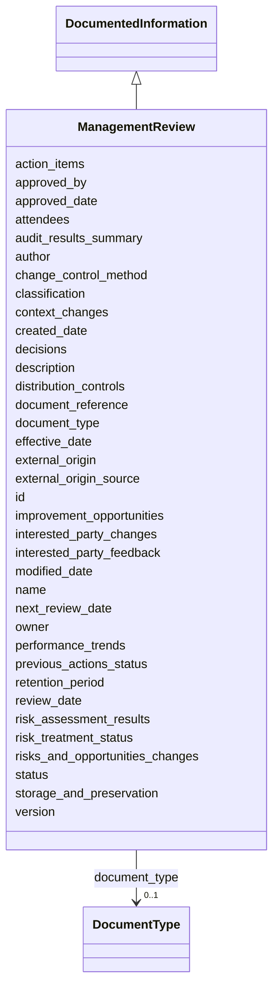

```mermaid
 classDiagram
    class ManagementReview
    click ManagementReview href "../ManagementReview"
      DocumentedInformation <|-- ManagementReview
        click DocumentedInformation href "../DocumentedInformation"
      
      ManagementReview : action_items
        
      ManagementReview : approved_by
        
      ManagementReview : approved_date
        
      ManagementReview : attendees
        
      ManagementReview : audit_results_summary
        
      ManagementReview : author
        
      ManagementReview : change_control_method
        
      ManagementReview : classification
        
      ManagementReview : context_changes
        
      ManagementReview : created_date
        
      ManagementReview : decisions
        
      ManagementReview : description
        
      ManagementReview : distribution_controls
        
      ManagementReview : document_reference
        
      ManagementReview : document_type
        
          
    
        
        
        ManagementReview --> "0..1" DocumentType : document_type
        click DocumentType href "../DocumentType"
    

        
      ManagementReview : effective_date
        
      ManagementReview : external_origin
        
      ManagementReview : external_origin_source
        
      ManagementReview : id
        
      ManagementReview : improvement_opportunities
        
      ManagementReview : interested_party_changes
        
      ManagementReview : interested_party_feedback
        
      ManagementReview : modified_date
        
      ManagementReview : name
        
      ManagementReview : next_review_date
        
      ManagementReview : owner
        
      ManagementReview : performance_trends
        
      ManagementReview : previous_actions_status
        
      ManagementReview : retention_period
        
      ManagementReview : review_date
        
      ManagementReview : risk_assessment_results
        
      ManagementReview : risk_treatment_status
        
      ManagementReview : risks_and_opportunities_changes
        
      ManagementReview : status
        
      ManagementReview : storage_and_preservation
        
      ManagementReview : version
        
      
```
