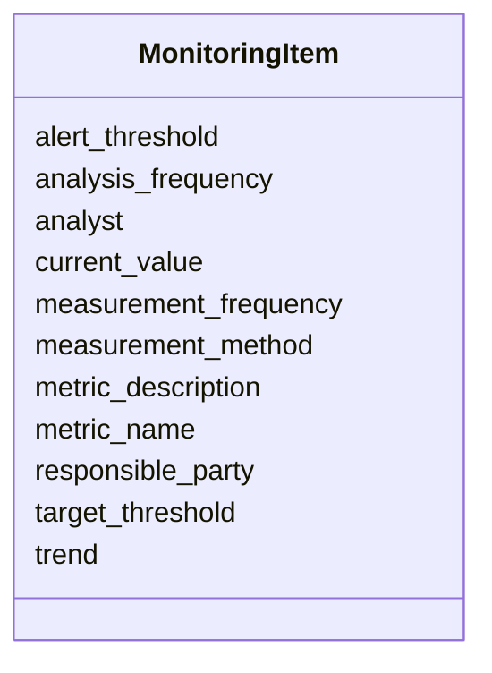

```mermaid
 classDiagram
    class MonitoringItem
    click MonitoringItem href "../MonitoringItem"
      MonitoringItem : alert_threshold
        
      MonitoringItem : analysis_frequency
        
      MonitoringItem : analyst
        
      MonitoringItem : current_value
        
      MonitoringItem : measurement_frequency
        
      MonitoringItem : measurement_method
        
      MonitoringItem : metric_description
        
      MonitoringItem : metric_name
        
      MonitoringItem : responsible_party
        
      MonitoringItem : target_threshold
        
      MonitoringItem : trend
        
      
```
