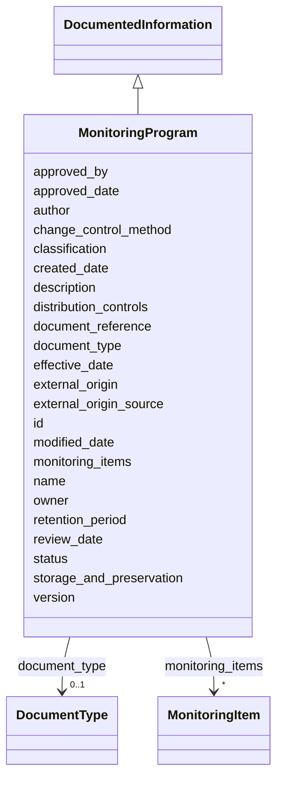

```mermaid
 classDiagram
    class MonitoringProgram
    click MonitoringProgram href "../MonitoringProgram"
      DocumentedInformation <|-- MonitoringProgram
        click DocumentedInformation href "../DocumentedInformation"
      
      MonitoringProgram : approved_by
        
      MonitoringProgram : approved_date
        
      MonitoringProgram : author
        
      MonitoringProgram : change_control_method
        
      MonitoringProgram : classification
        
      MonitoringProgram : created_date
        
      MonitoringProgram : description
        
      MonitoringProgram : distribution_controls
        
      MonitoringProgram : document_reference
        
      MonitoringProgram : document_type
        
          
    
        
        
        MonitoringProgram --> "0..1" DocumentType : document_type
        click DocumentType href "../DocumentType"
    

        
      MonitoringProgram : effective_date
        
      MonitoringProgram : external_origin
        
      MonitoringProgram : external_origin_source
        
      MonitoringProgram : id
        
      MonitoringProgram : modified_date
        
      MonitoringProgram : monitoring_items
        
          
    
        
        
        MonitoringProgram --> "*" MonitoringItem : monitoring_items
        click MonitoringItem href "../MonitoringItem"
    

        
      MonitoringProgram : name
        
      MonitoringProgram : owner
        
      MonitoringProgram : retention_period
        
      MonitoringProgram : review_date
        
      MonitoringProgram : status
        
      MonitoringProgram : storage_and_preservation
        
      MonitoringProgram : version
        
      
```
