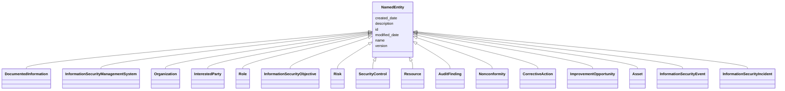

```mermaid
 classDiagram
    class NamedEntity
    click NamedEntity href "../NamedEntity"
      NamedEntity <|-- DocumentedInformation
        click DocumentedInformation href "../DocumentedInformation"
      NamedEntity <|-- InformationSecurityManagementSystem
        click InformationSecurityManagementSystem href "../InformationSecurityManagementSystem"
      NamedEntity <|-- Organization
        click Organization href "../Organization"
      NamedEntity <|-- InterestedParty
        click InterestedParty href "../InterestedParty"
      NamedEntity <|-- Role
        click Role href "../Role"
      NamedEntity <|-- InformationSecurityObjective
        click InformationSecurityObjective href "../InformationSecurityObjective"
      NamedEntity <|-- Risk
        click Risk href "../Risk"
      NamedEntity <|-- SecurityControl
        click SecurityControl href "../SecurityControl"
      NamedEntity <|-- Resource
        click Resource href "../Resource"
      NamedEntity <|-- AuditFinding
        click AuditFinding href "../AuditFinding"
      NamedEntity <|-- Nonconformity
        click Nonconformity href "../Nonconformity"
      NamedEntity <|-- CorrectiveAction
        click CorrectiveAction href "../CorrectiveAction"
      NamedEntity <|-- ImprovementOpportunity
        click ImprovementOpportunity href "../ImprovementOpportunity"
      NamedEntity <|-- Asset
        click Asset href "../Asset"
      NamedEntity <|-- InformationSecurityEvent
        click InformationSecurityEvent href "../InformationSecurityEvent"
      NamedEntity <|-- InformationSecurityIncident
        click InformationSecurityIncident href "../InformationSecurityIncident"
      
      NamedEntity : created_date
        
      NamedEntity : description
        
      NamedEntity : id
        
      NamedEntity : modified_date
        
      NamedEntity : name
        
      NamedEntity : version
        
      
```
