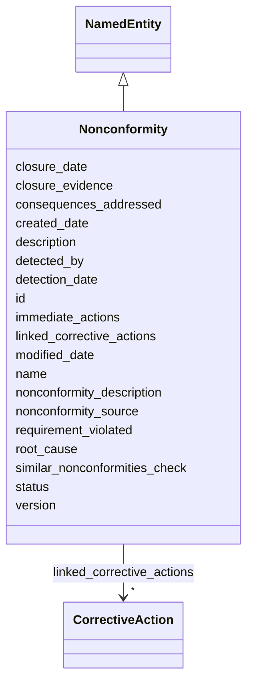

```mermaid
 classDiagram
    class Nonconformity
    click Nonconformity href "../Nonconformity"
      NamedEntity <|-- Nonconformity
        click NamedEntity href "../NamedEntity"
      
      Nonconformity : closure_date
        
      Nonconformity : closure_evidence
        
      Nonconformity : consequences_addressed
        
      Nonconformity : created_date
        
      Nonconformity : description
        
      Nonconformity : detected_by
        
      Nonconformity : detection_date
        
      Nonconformity : id
        
      Nonconformity : immediate_actions
        
      Nonconformity : linked_corrective_actions
        
          
    
        
        
        Nonconformity --> "*" CorrectiveAction : linked_corrective_actions
        click CorrectiveAction href "../CorrectiveAction"
    

        
      Nonconformity : modified_date
        
      Nonconformity : name
        
      Nonconformity : nonconformity_description
        
      Nonconformity : nonconformity_source
        
      Nonconformity : requirement_violated
        
      Nonconformity : root_cause
        
      Nonconformity : similar_nonconformities_check
        
      Nonconformity : status
        
      Nonconformity : version
        
      
```
