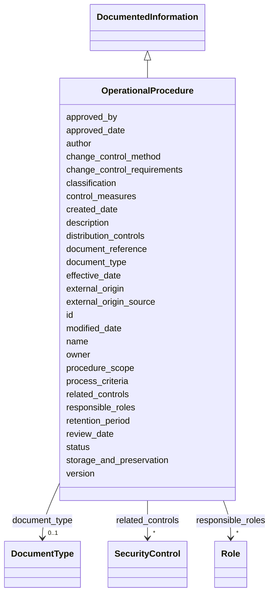

```mermaid
 classDiagram
    class OperationalProcedure
    click OperationalProcedure href "../OperationalProcedure"
      DocumentedInformation <|-- OperationalProcedure
        click DocumentedInformation href "../DocumentedInformation"
      
      OperationalProcedure : approved_by
        
      OperationalProcedure : approved_date
        
      OperationalProcedure : author
        
      OperationalProcedure : change_control_method
        
      OperationalProcedure : change_control_requirements
        
      OperationalProcedure : classification
        
      OperationalProcedure : control_measures
        
      OperationalProcedure : created_date
        
      OperationalProcedure : description
        
      OperationalProcedure : distribution_controls
        
      OperationalProcedure : document_reference
        
      OperationalProcedure : document_type
        
          
    
        
        
        OperationalProcedure --> "0..1" DocumentType : document_type
        click DocumentType href "../DocumentType"
    

        
      OperationalProcedure : effective_date
        
      OperationalProcedure : external_origin
        
      OperationalProcedure : external_origin_source
        
      OperationalProcedure : id
        
      OperationalProcedure : modified_date
        
      OperationalProcedure : name
        
      OperationalProcedure : owner
        
      OperationalProcedure : procedure_scope
        
      OperationalProcedure : process_criteria
        
      OperationalProcedure : related_controls
        
          
    
        
        
        OperationalProcedure --> "*" SecurityControl : related_controls
        click SecurityControl href "../SecurityControl"
    

        
      OperationalProcedure : responsible_roles
        
          
    
        
        
        OperationalProcedure --> "*" Role : responsible_roles
        click Role href "../Role"
    

        
      OperationalProcedure : retention_period
        
      OperationalProcedure : review_date
        
      OperationalProcedure : status
        
      OperationalProcedure : storage_and_preservation
        
      OperationalProcedure : version
        
      
```
